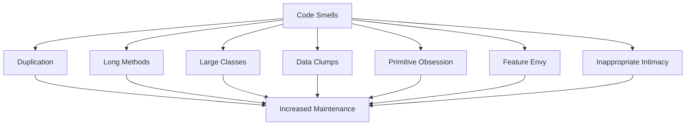

## 16.1 Identifying Code Smells

In the journey of software development, maintaining clean and efficient code is paramount. Code smells are indicators of potential problems in the codebase that can hinder maintainability and readability. In this section, we will explore what code smells are, their significance, and how to identify and address them in Ruby applications.

### What Are Code Smells?

Code smells are patterns in the code that may indicate deeper issues. They are not bugs or errors but rather symptoms of poor design or implementation choices. Identifying code smells is crucial because they often lead to increased complexity, making the code harder to understand, modify, and extend.

### Significance of Code Smells

Understanding and addressing code smells is vital for several reasons:

- **Maintainability**: Code smells can make the codebase difficult to maintain, leading to increased time and effort for future changes.
- **Readability**: Smelly code is often hard to read and understand, which can slow down development and onboarding of new team members.
- **Scalability**: Code smells can hinder the ability to scale the application efficiently.
- **Bug Introduction**: Smelly code is more prone to bugs due to its complexity and lack of clarity.

### Common Code Smells in Ruby

Let's delve into some common code smells and how they manifest in Ruby codebases.

#### 1. Duplication

**Definition**: Code duplication occurs when the same or similar code appears in multiple places.

**Impact**: Duplication increases the risk of inconsistencies and makes maintenance more challenging.

**Example**:
```ruby
# Duplication in calculating area
def calculate_rectangle_area(length, width)
  length * width
end

def calculate_square_area(side)
  side * side
end
```

**Solution**: Extract common functionality into a reusable method.

```ruby
def calculate_area(length, width = nil)
  width.nil? ? length * length : length * width
end
```

#### 2. Long Methods

**Definition**: Methods that are excessively long and perform multiple tasks.

**Impact**: Long methods are difficult to understand and test.

**Example**:
```ruby
def process_order(order)
  # Validate order
  # Calculate total
  # Apply discounts
  # Process payment
  # Send confirmation
end
```

**Solution**: Break down long methods into smaller, focused methods.

```ruby
def process_order(order)
  validate_order(order)
  total = calculate_total(order)
  total = apply_discounts(total)
  process_payment(order, total)
  send_confirmation(order)
end
```

#### 3. Large Classes

**Definition**: Classes that have too many responsibilities or methods.

**Impact**: Large classes violate the Single Responsibility Principle, making them hard to manage.

**Example**:
```ruby
class OrderProcessor
  def validate_order(order)
    # validation logic
  end

  def calculate_total(order)
    # total calculation logic
  end

  def apply_discounts(total)
    # discount logic
  end

  def process_payment(order, total)
    # payment processing logic
  end

  def send_confirmation(order)
    # confirmation logic
  end
end
```

**Solution**: Refactor large classes into smaller, cohesive classes.

```ruby
class OrderValidator
  def validate(order)
    # validation logic
  end
end

class OrderCalculator
  def calculate_total(order)
    # total calculation logic
  end

  def apply_discounts(total)
    # discount logic
  end
end

class PaymentProcessor
  def process(order, total)
    # payment processing logic
  end
end

class ConfirmationSender
  def send(order)
    # confirmation logic
  end
end
```

#### 4. Data Clumps

**Definition**: Groups of data that are often used together but are not encapsulated in a class or structure.

**Impact**: Data clumps can lead to scattered and inconsistent data handling.

**Example**:
```ruby
def print_address(street, city, state, zip)
  puts "#{street}, #{city}, #{state} #{zip}"
end

def validate_address(street, city, state, zip)
  # validation logic
end
```

**Solution**: Encapsulate data clumps into a class or structure.

```ruby
class Address
  attr_accessor :street, :city, :state, :zip

  def initialize(street, city, state, zip)
    @street = street
    @city = city
    @state = state
    @zip = zip
  end
end

def print_address(address)
  puts "#{address.street}, #{address.city}, #{address.state} #{address.zip}"
end

def validate_address(address)
  # validation logic
end
```

#### 5. Primitive Obsession

**Definition**: Over-reliance on primitive data types instead of small objects for simple tasks.

**Impact**: Leads to scattered logic and lack of encapsulation.

**Example**:
```ruby
def calculate_discount(price, discount_percentage)
  price - (price * discount_percentage / 100)
end
```

**Solution**: Use objects to encapsulate related data and behavior.

```ruby
class Discount
  attr_reader :price, :percentage

  def initialize(price, percentage)
    @price = price
    @percentage = percentage
  end

  def calculate
    price - (price * percentage / 100)
  end
end
```

#### 6. Feature Envy

**Definition**: A method that seems more interested in a class other than the one it is in.

**Impact**: Indicates misplaced functionality and can lead to tight coupling.

**Example**:
```ruby
class Order
  attr_accessor :items

  def total_price
    items.sum(&:price)
  end
end

class Invoice
  def print(order)
    puts "Total: #{order.total_price}"
  end
end
```

**Solution**: Move the method to the class it is more interested in.

```ruby
class Order
  attr_accessor :items

  def total_price
    items.sum(&:price)
  end

  def print_invoice
    puts "Total: #{total_price}"
  end
end
```

#### 7. Inappropriate Intimacy

**Definition**: Classes that are too familiar with each other's internal details.

**Impact**: Leads to tight coupling and reduced flexibility.

**Example**:
```ruby
class Order
  attr_accessor :items

  def add_item(item)
    items << item
  end
end

class OrderProcessor
  def process(order)
    order.items.each do |item|
      # process item
    end
  end
end
```

**Solution**: Reduce coupling by using interfaces or encapsulating behavior.

```ruby
class Order
  attr_accessor :items

  def add_item(item)
    items << item
  end

  def process_items
    items.each do |item|
      # process item
    end
  end
end

class OrderProcessor
  def process(order)
    order.process_items
  end
end
```

### Impact of Code Smells on Maintainability and Readability

Code smells, if left unaddressed, can significantly impact the maintainability and readability of a codebase. They can lead to:

- **Increased Complexity**: Smelly code is often more complex, making it harder to understand and modify.
- **Higher Risk of Bugs**: Complex and unclear code is more prone to errors and bugs.
- **Slower Development**: Developers spend more time understanding and fixing smelly code, slowing down the development process.
- **Reduced Collaboration**: Smelly code can be a barrier to effective collaboration, as it is harder for team members to understand and work with.

### Proactive Identification and Addressing of Code Smells

To maintain a healthy codebase, it is essential to proactively identify and address code smells. Here are some strategies:

- **Code Reviews**: Regular code reviews can help identify code smells early and provide opportunities for refactoring.
- **Automated Tools**: Use tools like RuboCop and Reek to automatically detect code smells in your Ruby codebase.
- **Refactoring**: Regularly refactor code to address identified smells and improve code quality.
- **Continuous Learning**: Stay updated with best practices and design patterns to avoid introducing code smells.

### Try It Yourself

To reinforce your understanding of code smells, try the following exercises:

1. **Identify Code Smells**: Review a piece of code from your project and identify any code smells. Consider how you might refactor the code to address these smells.

2. **Refactor Code**: Take a method or class that exhibits a code smell and refactor it to improve its design. Test the refactored code to ensure it still functions correctly.

3. **Experiment with Tools**: Use a tool like RuboCop or Reek to analyze your codebase for code smells. Experiment with the tool's configuration to tailor it to your project's needs.

### Visualizing Code Smells

To better understand the relationships between code smells and their impact, let's visualize some common code smells using Mermaid.js diagrams.



**Diagram Description**: This diagram illustrates the relationship between common code smells and their impact on maintenance. Each code smell contributes to increased maintenance challenges.

### Conclusion

Identifying and addressing code smells is a critical skill for Ruby developers aiming to build scalable and maintainable applications. By understanding common code smells and their impact, you can proactively improve your codebase's quality and ensure it remains clean and efficient.

Remember, this is just the beginning. As you progress, you'll develop a keen eye for identifying code smells and refactoring them effectively. Keep experimenting, stay curious, and enjoy the journey!

## Quiz: Identifying Code Smells



### What is a code smell?

- [x] An indicator of potential problems in the codebase
- [ ] A syntax error in the code
- [ ] A runtime exception
- [ ] A feature request

> **Explanation:** Code smells are indicators of potential problems in the codebase that may warrant refactoring.

### Which of the following is a common code smell?

- [x] Duplication
- [ ] Syntax error
- [ ] Compilation error
- [ ] Feature request

> **Explanation:** Duplication is a common code smell that indicates repeated code in the codebase.

### What is the impact of long methods on code?

- [x] They make the code difficult to understand and test
- [ ] They improve code readability
- [ ] They reduce code complexity
- [ ] They enhance code performance

> **Explanation:** Long methods are difficult to understand and test, which can hinder maintainability.

### How can you address the duplication code smell?

- [x] Extract common functionality into a reusable method
- [ ] Add more comments to the code
- [ ] Increase the method length
- [ ] Use more primitive data types

> **Explanation:** Extracting common functionality into a reusable method helps eliminate duplication.

### What is a symptom of the large class code smell?

- [x] A class with too many responsibilities
- [ ] A class with a single method
- [ ] A class with no attributes
- [ ] A class with only private methods

> **Explanation:** Large classes often have too many responsibilities, violating the Single Responsibility Principle.

### What is the solution for the data clumps code smell?

- [x] Encapsulate data clumps into a class or structure
- [ ] Use more primitive data types
- [ ] Increase the number of parameters
- [ ] Add more comments to the code

> **Explanation:** Encapsulating data clumps into a class or structure helps manage related data consistently.

### What does the feature envy code smell indicate?

- [x] A method is more interested in a class other than the one it is in
- [ ] A method is too short
- [ ] A method has too many parameters
- [ ] A method is not used

> **Explanation:** Feature envy indicates that a method is more interested in another class, suggesting misplaced functionality.

### How can inappropriate intimacy between classes be reduced?

- [x] Use interfaces or encapsulate behavior
- [ ] Increase the number of public methods
- [ ] Add more comments to the code
- [ ] Use more primitive data types

> **Explanation:** Reducing coupling by using interfaces or encapsulating behavior helps address inappropriate intimacy.

### What is the impact of code smells on maintainability?

- [x] They increase complexity and hinder maintainability
- [ ] They improve code readability
- [ ] They reduce the risk of bugs
- [ ] They enhance code performance

> **Explanation:** Code smells increase complexity, making the code harder to maintain and understand.

### True or False: Code smells are always syntax errors.

- [ ] True
- [x] False

> **Explanation:** Code smells are not syntax errors; they are indicators of potential design or implementation issues.


