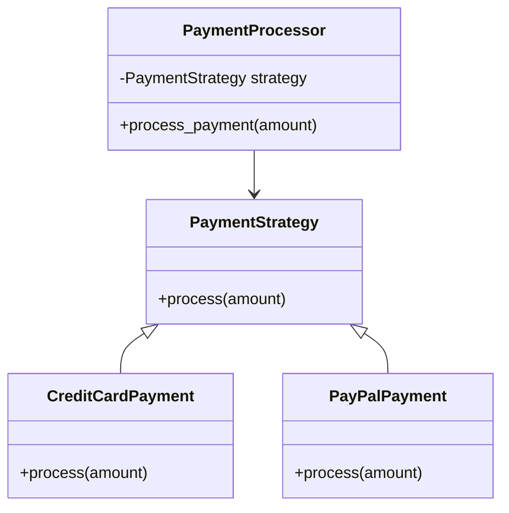

## 16.10 Refactoring to Patterns

Refactoring is a crucial process in software development that involves restructuring existing code without changing its external behavior. By refactoring to patterns, we align our code with well-known design patterns, enhancing its structure, flexibility, and maintainability. This section explores how design patterns can guide refactoring efforts in Ruby, providing practical examples and insights into the benefits of this approach.

### Understanding Refactoring to Patterns

Refactoring to patterns involves identifying areas in your code that can be improved by applying design patterns. This process is not about forcing patterns into your code but recognizing when a pattern naturally fits a problem and can improve the code's quality. By doing so, you can achieve:

- **Increased Flexibility**: Patterns often decouple components, making it easier to change or extend functionality.
- **Enhanced Reusability**: Patterns provide reusable solutions to common problems, promoting code reuse.
- **Improved Readability**: Patterns offer a common vocabulary for developers, making code easier to understand and communicate.

### When to Refactor to Patterns

Before diving into examples, it's essential to understand when to refactor to patterns. Consider refactoring when:

- **Code Smells**: You notice code smells such as duplicated code, long methods, or large classes.
- **Complex Logic**: The code contains complex conditional logic that could be simplified.
- **Frequent Changes**: Parts of the codebase require frequent changes or extensions.
- **Poor Maintainability**: The code is difficult to maintain or understand.

### Example Patterns for Refactoring

Let's explore some common design patterns and how they can be applied during refactoring.

#### Strategy Pattern

**Intent**: Define a family of algorithms, encapsulate each one, and make them interchangeable.

**Applicability**: Use the Strategy pattern when you have multiple algorithms for a specific task and want to switch between them dynamically.

**Before Refactoring**:

```ruby
class PaymentProcessor
  def process_payment(type, amount)
    if type == :credit_card
      # Process credit card payment
    elsif type == :paypal
      # Process PayPal payment
    else
      raise "Unsupported payment type"
    end
  end
end
```

**After Refactoring**:

```ruby
# Define a strategy interface
class PaymentStrategy
  def process(amount)
    raise NotImplementedError, 'This method should be overridden'
  end
end

# Implement concrete strategies
class CreditCardPayment < PaymentStrategy
  def process(amount)
    # Process credit card payment
  end
end

class PayPalPayment < PaymentStrategy
  def process(amount)
    # Process PayPal payment
  end
end

# Context class using strategy
class PaymentProcessor
  def initialize(strategy)
    @strategy = strategy
  end

  def process_payment(amount)
    @strategy.process(amount)
  end
end

# Usage
processor = PaymentProcessor.new(CreditCardPayment.new)
processor.process_payment(100)
```

**Benefits**:
- **Flexibility**: Easily switch between different payment methods.
- **Open/Closed Principle**: Add new payment methods without modifying existing code.

#### Template Method Pattern

**Intent**: Define the skeleton of an algorithm in a method, deferring some steps to subclasses.

**Applicability**: Use the Template Method pattern when you have an algorithm with invariant parts and some steps that need customization.

**Before Refactoring**:

```ruby
class ReportGenerator
  def generate_report(type)
    if type == :pdf
      # Generate PDF report
    elsif type == :html
      # Generate HTML report
    else
      raise "Unsupported report type"
    end
  end
end
```

**After Refactoring**:

```ruby
# Abstract class with template method
class ReportGenerator
  def generate_report
    prepare_data
    format_report
    export_report
  end

  def prepare_data
    # Common data preparation
  end

  def format_report
    raise NotImplementedError, 'This method should be overridden'
  end

  def export_report
    # Common export logic
  end
end

# Concrete implementations
class PDFReport < ReportGenerator
  def format_report
    # Format report as PDF
  end
end

class HTMLReport < ReportGenerator
  def format_report
    # Format report as HTML
  end
end

# Usage
report = PDFReport.new
report.generate_report
```

**Benefits**:
- **Code Reuse**: Common steps are implemented in the base class.
- **Customization**: Subclasses can customize specific steps.

#### Observer Pattern

**Intent**: Define a one-to-many dependency between objects so that when one object changes state, all its dependents are notified and updated automatically.

**Applicability**: Use the Observer pattern when an object needs to notify other objects without making assumptions about who those objects are.

**Before Refactoring**:

```ruby
class Stock
  attr_accessor :price

  def initialize(price)
    @price = price
  end

  def update_price(new_price)
    @price = new_price
    # Notify observers
  end
end

class StockDisplay
  def update(stock)
    # Update display with new stock price
  end
end
```

**After Refactoring**:

```ruby
# Subject class
class Stock
  attr_accessor :price

  def initialize(price)
    @price = price
    @observers = []
  end

  def add_observer(observer)
    @observers << observer
  end

  def remove_observer(observer)
    @observers.delete(observer)
  end

  def notify_observers
    @observers.each { |observer| observer.update(self) }
  end

  def update_price(new_price)
    @price = new_price
    notify_observers
  end
end

# Observer interface
class Observer
  def update(subject)
    raise NotImplementedError, 'This method should be overridden'
  end
end

# Concrete observer
class StockDisplay < Observer
  def update(stock)
    # Update display with new stock price
  end
end

# Usage
stock = Stock.new(100)
display = StockDisplay.new
stock.add_observer(display)
stock.update_price(120)
```

**Benefits**:
- **Decoupling**: The subject and observers are loosely coupled.
- **Scalability**: Easily add new observers without modifying the subject.

### Visualizing Refactoring to Patterns

To better understand the transformation process, let's visualize the refactoring of the Strategy pattern using a class diagram.



**Diagram Description**: The diagram illustrates the Strategy pattern, showing the `PaymentProcessor` class depending on the `PaymentStrategy` interface, which is implemented by `CreditCardPayment` and `PayPalPayment`.

### Best Practices for Refactoring to Patterns

- **Identify Code Smells**: Look for signs of poor design, such as duplicated code or large classes, as opportunities for refactoring.
- **Understand the Problem**: Ensure you fully understand the problem before applying a pattern.
- **Choose the Right Pattern**: Not every problem requires a pattern. Choose patterns that naturally fit the problem.
- **Iterate Gradually**: Refactor in small steps, testing frequently to ensure behavior remains unchanged.
- **Avoid Over-Engineering**: Don't introduce patterns unnecessarily. Keep the solution as simple as possible.

### Try It Yourself

Experiment with the provided code examples by:

- **Adding New Strategies**: Implement additional payment methods using the Strategy pattern.
- **Customizing Reports**: Create new report formats using the Template Method pattern.
- **Extending Observers**: Add more observer classes to the Stock example.

### Conclusion

Refactoring to patterns is a powerful technique for improving code quality. By aligning your code with well-known design patterns, you can enhance its structure, flexibility, and maintainability. Remember, the goal is not to force patterns into your code but to recognize when they naturally fit and can improve your design.

## Quiz: Refactoring to Patterns



### What is the primary goal of refactoring to patterns?

- [x] To improve code structure and maintainability by aligning it with well-known design patterns.
- [ ] To increase the number of design patterns used in a codebase.
- [ ] To replace all existing code with new patterns.
- [ ] To eliminate all conditional logic from the code.

> **Explanation:** The primary goal of refactoring to patterns is to improve code structure and maintainability by aligning it with well-known design patterns.

### Which pattern is suitable for defining a family of algorithms and making them interchangeable?

- [x] Strategy Pattern
- [ ] Observer Pattern
- [ ] Template Method Pattern
- [ ] Singleton Pattern

> **Explanation:** The Strategy Pattern is suitable for defining a family of algorithms and making them interchangeable.

### What is a key benefit of using the Template Method pattern?

- [x] It allows for code reuse by implementing common steps in a base class.
- [ ] It eliminates the need for subclasses.
- [ ] It makes all methods public.
- [ ] It removes the need for interfaces.

> **Explanation:** The Template Method pattern allows for code reuse by implementing common steps in a base class, while subclasses can customize specific steps.

### In the Observer pattern, what is the role of the subject?

- [x] To notify observers of changes in its state.
- [ ] To implement the observer interface.
- [ ] To manage the lifecycle of observers.
- [ ] To provide a user interface.

> **Explanation:** In the Observer pattern, the subject's role is to notify observers of changes in its state.

### When should you consider refactoring to patterns?

- [x] When you notice code smells or complex logic.
- [ ] When the code is already optimized.
- [ ] When there are no changes required.
- [ ] When the code is in production.

> **Explanation:** You should consider refactoring to patterns when you notice code smells or complex logic that can be improved.

### What is a potential pitfall of refactoring to patterns?

- [x] Over-engineering by introducing unnecessary patterns.
- [ ] Reducing code readability.
- [ ] Increasing code duplication.
- [ ] Making code less flexible.

> **Explanation:** A potential pitfall of refactoring to patterns is over-engineering by introducing unnecessary patterns.

### How does the Strategy pattern improve flexibility?

- [x] By allowing different algorithms to be used interchangeably.
- [ ] By making all methods static.
- [ ] By removing all interfaces.
- [ ] By hardcoding all logic.

> **Explanation:** The Strategy pattern improves flexibility by allowing different algorithms to be used interchangeably.

### What is a common sign that refactoring to patterns might be beneficial?

- [x] Duplicated code or large classes.
- [ ] Perfectly optimized code.
- [ ] Lack of any conditional logic.
- [ ] Absence of any design patterns.

> **Explanation:** Duplicated code or large classes are common signs that refactoring to patterns might be beneficial.

### What should you avoid when refactoring to patterns?

- [x] Forcing patterns into the code unnecessarily.
- [ ] Testing the code frequently.
- [ ] Understanding the problem fully.
- [ ] Iterating gradually.

> **Explanation:** You should avoid forcing patterns into the code unnecessarily when refactoring to patterns.

### True or False: Refactoring to patterns should change the external behavior of the code.

- [ ] True
- [x] False

> **Explanation:** Refactoring to patterns should not change the external behavior of the code; it should only improve its internal structure.



Remember, this is just the beginning. As you progress, you'll build more complex and interactive applications. Keep experimenting, stay curious, and enjoy the journey!
