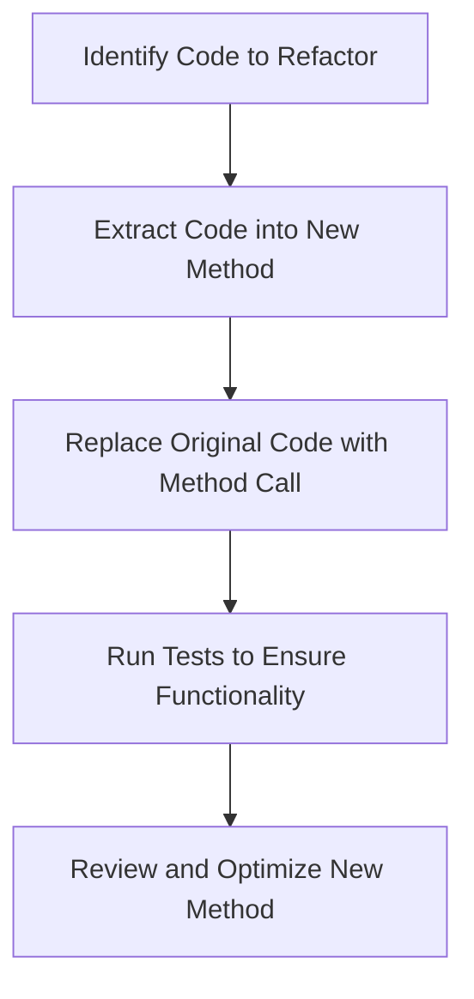

## 16.2 Refactoring Techniques in Ruby

Refactoring is a critical practice in software development that involves restructuring existing code without changing its external behavior. The primary goals of refactoring are to improve code readability, reduce complexity, enhance maintainability, and facilitate future enhancements. In this section, we'll delve into various refactoring techniques specifically tailored for Ruby, providing practical examples and insights into how these techniques can be applied effectively.

### Understanding Refactoring

Refactoring is the process of cleaning up code to make it more understandable and easier to modify. It is not about fixing bugs or adding new features; rather, it's about improving the internal structure of the code. The benefits of refactoring include:

- **Improved Code Readability**: Clearer code is easier to understand and maintain.
- **Reduced Complexity**: Simplified code structures make it easier to identify and fix bugs.
- **Enhanced Maintainability**: Well-organized code is easier to extend and modify.
- **Facilitated Testing**: Cleaner code often results in more straightforward testing processes.

### Common Refactoring Techniques

Let's explore some common refactoring techniques and how they can be applied in Ruby.

#### 1. Extract Method

**Intent**: Extract a block of code into a separate method to improve readability and reuse.

**Example**:

```ruby
# Before refactoring
def print_owing
  outstanding = 0.0

  # print banner
  puts "*************************"
  puts "***** Customer Owes *****"
  puts "*************************"

  # calculate outstanding
  @orders.each do |order|
    outstanding += order.amount
  end

  # print details
  puts "name: #{@name}"
  puts "amount: #{outstanding}"
end

# After refactoring
def print_owing
  print_banner
  outstanding = calculate_outstanding
  print_details(outstanding)
end

def print_banner
  puts "*************************"
  puts "***** Customer Owes *****"
  puts "*************************"
end

def calculate_outstanding
  @orders.reduce(0.0) { |sum, order| sum + order.amount }
end

def print_details(outstanding)
  puts "name: #{@name}"
  puts "amount: #{outstanding}"
end
```

**Explanation**: The `print_owing` method is refactored by extracting the banner printing, outstanding calculation, and details printing into separate methods. This makes the code more modular and easier to understand.

#### 2. Rename Variable

**Intent**: Change variable names to make them more descriptive and meaningful.

**Example**:

```ruby
# Before refactoring
def calculate_area(l, w)
  l * w
end

# After refactoring
def calculate_area(length, width)
  length * width
end
```

**Explanation**: The variables `l` and `w` are renamed to `length` and `width`, respectively, to improve code readability and convey the purpose of the variables more clearly.

#### 3. Simplify Conditionals

**Intent**: Refactor complex conditional logic to make it more understandable.

**Example**:

```ruby
# Before refactoring
def calculate_discount(order)
  if order.customer.vip?
    if order.total > 100
      return 20
    else
      return 10
    end
  else
    return 0
  end
end

# After refactoring
def calculate_discount(order)
  return 20 if order.customer.vip? && order.total > 100
  return 10 if order.customer.vip?
  0
end
```

**Explanation**: The nested `if` statements are refactored into a more concise and readable form using guard clauses.

### Ruby-Specific Refactoring Techniques

Ruby's dynamic nature and expressive syntax offer unique opportunities for refactoring. Let's explore some Ruby-specific techniques.

#### 4. Use of Blocks and Procs

**Intent**: Leverage Ruby's blocks and Procs to simplify code and reduce duplication.

**Example**:

```ruby
# Before refactoring
def print_even_numbers(numbers)
  numbers.each do |number|
    puts number if number.even?
  end
end

def print_odd_numbers(numbers)
  numbers.each do |number|
    puts number if number.odd?
  end
end

# After refactoring
def print_numbers(numbers, &block)
  numbers.each do |number|
    puts number if block.call(number)
  end
end

print_numbers([1, 2, 3, 4, 5]) { |number| number.even? }
print_numbers([1, 2, 3, 4, 5]) { |number| number.odd? }
```

**Explanation**: The `print_even_numbers` and `print_odd_numbers` methods are refactored into a single method `print_numbers` that accepts a block, reducing code duplication.

#### 5. Use of Modules and Mixins

**Intent**: Extract common functionality into modules to promote code reuse.

**Example**:

```ruby
# Before refactoring
class Dog
  def speak
    "Woof!"
  end
end

class Cat
  def speak
    "Meow!"
  end
end

# After refactoring
module Speakable
  def speak
    "Woof!"
  end
end

class Dog
  include Speakable
end

class Cat
  include Speakable

  def speak
    "Meow!"
  end
end
```

**Explanation**: The `speak` method is extracted into a module `Speakable`, which is then included in both `Dog` and `Cat` classes, promoting code reuse.

### Tools for Refactoring in Ruby

Refactoring can be facilitated by various tools and IDE features. Here are some popular ones:

- **Reek**: A static code analysis tool that detects code smells in Ruby. It helps identify areas of code that may need refactoring. [Reek GitHub Repository](https://github.com/troessner/reek)

- **Rubocop**: A Ruby static code analyzer and formatter, which can be used to enforce style guides and detect potential issues.

- **RubyMine**: An IDE that provides powerful refactoring tools, including renaming, extracting methods, and more.

### Importance of Testing in Refactoring

Testing is crucial when refactoring code. It ensures that the refactoring process does not introduce new bugs or alter the existing functionality. Here are some best practices:

- **Run Tests Before Refactoring**: Ensure that all tests pass before starting the refactoring process. This provides a baseline for comparison.

- **Run Tests After Refactoring**: After refactoring, run the tests again to verify that the code still behaves as expected.

- **Use Test-Driven Development (TDD)**: Write tests before implementing new features or refactoring existing code. This approach helps maintain a high level of code quality.

### Incremental and Continuous Refactoring

Refactoring should be an ongoing process rather than a one-time effort. Here are some tips for incorporating refactoring into your development workflow:

- **Refactor Regularly**: Make refactoring a regular part of your development process. This helps prevent code from becoming overly complex and difficult to maintain.

- **Refactor in Small Steps**: Break down refactoring tasks into small, manageable steps. This reduces the risk of introducing errors and makes it easier to track changes.

- **Prioritize High-Impact Areas**: Focus on refactoring areas of code that are frequently modified or have a high impact on the overall system.

### Try It Yourself

Experiment with the refactoring techniques discussed in this section. Try modifying the code examples to see how different refactoring approaches can improve code readability and maintainability. Consider using tools like Reek and Rubocop to identify areas of your code that may benefit from refactoring.

### Visualizing Refactoring Techniques

Below is a flowchart illustrating the process of refactoring a method using the Extract Method technique.



**Description**: This flowchart outlines the steps involved in refactoring a method using the Extract Method technique, from identifying the code to be refactored to running tests and reviewing the new method.

### Knowledge Check

- What is the primary goal of refactoring?
- How does the Extract Method technique improve code readability?
- Why is it important to run tests before and after refactoring?
- What are some tools that can assist with refactoring in Ruby?

### Summary

Refactoring is an essential practice for maintaining clean, efficient, and scalable Ruby code. By applying techniques such as Extract Method, Rename Variable, and Simplify Conditionals, developers can enhance code readability and maintainability. Tools like Reek and Rubocop can aid in identifying areas for improvement, while testing ensures that refactoring does not introduce new issues. Remember, refactoring is a continuous process that should be integrated into your development workflow.

## Quiz: Refactoring Techniques in Ruby



### What is the primary goal of refactoring?

- [x] To improve code readability and maintainability
- [ ] To add new features to the code
- [ ] To fix bugs in the code
- [ ] To optimize code for performance

> **Explanation:** The primary goal of refactoring is to improve code readability and maintainability without changing its external behavior.

### Which refactoring technique involves extracting a block of code into a separate method?

- [x] Extract Method
- [ ] Rename Variable
- [ ] Simplify Conditionals
- [ ] Use of Modules

> **Explanation:** The Extract Method technique involves extracting a block of code into a separate method to improve readability and reuse.

### Why is it important to run tests before and after refactoring?

- [x] To ensure that the code still behaves as expected
- [ ] To add new features to the code
- [ ] To optimize code for performance
- [ ] To fix bugs in the code

> **Explanation:** Running tests before and after refactoring ensures that the code still behaves as expected and that no new bugs are introduced.

### Which tool can be used to detect code smells in Ruby?

- [x] Reek
- [ ] Rubocop
- [ ] RubyMine
- [ ] RSpec

> **Explanation:** Reek is a static code analysis tool that detects code smells in Ruby, helping identify areas that may need refactoring.

### What is a benefit of using the Rename Variable technique?

- [x] It makes variable names more descriptive and meaningful
- [ ] It adds new features to the code
- [ ] It optimizes code for performance
- [ ] It fixes bugs in the code

> **Explanation:** The Rename Variable technique makes variable names more descriptive and meaningful, improving code readability.

### How can Ruby's blocks and Procs be used in refactoring?

- [x] To simplify code and reduce duplication
- [ ] To add new features to the code
- [ ] To optimize code for performance
- [ ] To fix bugs in the code

> **Explanation:** Ruby's blocks and Procs can be used to simplify code and reduce duplication, making the code more concise and readable.

### What is the purpose of using modules and mixins in refactoring?

- [x] To promote code reuse
- [ ] To add new features to the code
- [ ] To optimize code for performance
- [ ] To fix bugs in the code

> **Explanation:** Using modules and mixins in refactoring promotes code reuse by extracting common functionality into reusable components.

### What is the benefit of incremental and continuous refactoring?

- [x] It helps prevent code from becoming overly complex
- [ ] It adds new features to the code
- [ ] It optimizes code for performance
- [ ] It fixes bugs in the code

> **Explanation:** Incremental and continuous refactoring helps prevent code from becoming overly complex and difficult to maintain.

### What is the role of Rubocop in refactoring?

- [x] To enforce style guides and detect potential issues
- [ ] To add new features to the code
- [ ] To optimize code for performance
- [ ] To fix bugs in the code

> **Explanation:** Rubocop is a Ruby static code analyzer and formatter that enforces style guides and detects potential issues, aiding in the refactoring process.

### True or False: Refactoring should be a one-time effort.

- [ ] True
- [x] False

> **Explanation:** Refactoring should be an ongoing process rather than a one-time effort, integrated into the regular development workflow to maintain code quality.



Remember, this is just the beginning. As you progress, you'll build more complex and interactive applications. Keep experimenting, stay curious, and enjoy the journey!
