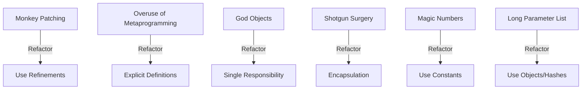

## 16.3 Common Ruby Anti-Patterns

In software development, an anti-pattern is a common response to a recurring problem that is usually ineffective and risks being counterproductive. In the Ruby programming language, certain anti-patterns can lead to code that is difficult to maintain, understand, and extend. This section will explore some of the most prevalent Ruby anti-patterns, illustrating the problems they introduce and suggesting alternative approaches to improve code quality.

### What Are Anti-Patterns?

Anti-patterns are poor solutions to recurring design problems. Unlike design patterns, which provide time-tested solutions, anti-patterns are ineffective and often lead to negative consequences such as increased complexity, reduced readability, and maintenance challenges. Recognizing and avoiding these pitfalls is crucial for writing clean, efficient, and maintainable Ruby code.

### Common Ruby Anti-Patterns

#### 1. Monkey Patching Without Necessity

**Definition:** Monkey patching refers to the practice of modifying or extending existing classes or modules at runtime. While Ruby's open classes make this possible, doing so without necessity can lead to unpredictable behavior and maintenance nightmares.

**Example:**

```ruby
# Original String class
class String
  def shout
    self.upcase + "!"
  end
end

# Usage
puts "hello".shout  # Outputs: HELLO!
```

**Problems Introduced:**

- **Unpredictability:** Modifying core classes can lead to unexpected behavior, especially if multiple libraries or parts of the codebase modify the same class.
- **Maintenance Difficulty:** Changes to core classes can make it difficult to track down bugs or understand the code's behavior.
- **Compatibility Issues:** Future updates to Ruby or third-party libraries may conflict with the monkey patches.

**Alternative Approach:**

- **Use Refinements:** Refinements provide a way to scope changes to classes, reducing the risk of conflicts.

```ruby
module StringExtensions
  refine String do
    def shout
      self.upcase + "!"
    end
  end
end

using StringExtensions
puts "hello".shout  # Outputs: HELLO!
```

#### 2. Overuse of Metaprogramming

**Definition:** Metaprogramming allows Ruby code to write code, offering powerful capabilities. However, overusing metaprogramming can lead to code that is difficult to understand and debug.

**Example:**

```ruby
class DynamicMethods
  [:foo, :bar, :baz].each do |method_name|
    define_method(method_name) do
      puts "You called #{method_name}!"
    end
  end
end

obj = DynamicMethods.new
obj.foo  # Outputs: You called foo!
```

**Problems Introduced:**

- **Readability:** Code that heavily relies on metaprogramming can be hard to read and understand.
- **Debugging Complexity:** Errors in metaprogrammed code can be difficult to trace and fix.
- **Tooling Limitations:** Many static analysis tools struggle with metaprogrammed code.

**Alternative Approach:**

- **Explicit Definitions:** Use explicit method definitions when possible to improve readability and maintainability.

```ruby
class ExplicitMethods
  def foo
    puts "You called foo!"
  end

  def bar
    puts "You called bar!"
  end

  def baz
    puts "You called baz!"
  end
end
```

#### 3. God Objects

**Definition:** A God Object is an object that knows too much or does too much. It centralizes too much functionality, leading to a lack of cohesion and increased coupling.

**Example:**

```ruby
class Application
  def initialize
    @users = []
    @products = []
    @orders = []
  end

  def add_user(user)
    @users << user
  end

  def add_product(product)
    @products << product
  end

  def place_order(order)
    @orders << order
  end

  # Many more methods handling different responsibilities...
end
```

**Problems Introduced:**

- **Lack of Cohesion:** The class handles too many responsibilities, making it difficult to understand and maintain.
- **Increased Coupling:** Changes in one part of the class can affect unrelated functionality.
- **Testing Challenges:** Testing a God Object can be complex due to its many responsibilities.

**Alternative Approach:**

- **Single Responsibility Principle:** Refactor the class into smaller, more focused classes, each handling a specific responsibility.

```ruby
class UserManager
  def initialize
    @users = []
  end

  def add_user(user)
    @users << user
  end
end

class ProductManager
  def initialize
    @products = []
  end

  def add_product(product)
    @products << product
  end
end

class OrderManager
  def initialize
    @orders = []
  end

  def place_order(order)
    @orders << order
  end
end
```

#### 4. Shotgun Surgery

**Definition:** Shotgun Surgery occurs when a single change requires making many small changes to multiple classes or files. This anti-pattern is often a sign of poor separation of concerns.

**Example:**

Imagine a scenario where changing the format of a date requires updates in multiple classes that handle date formatting.

**Problems Introduced:**

- **High Maintenance Cost:** Making changes becomes time-consuming and error-prone.
- **Increased Risk of Bugs:** The likelihood of introducing bugs increases with the number of changes required.

**Alternative Approach:**

- **Encapsulation:** Encapsulate the behavior that changes frequently into a single class or module.

```ruby
class DateFormatter
  def self.format(date)
    date.strftime("%Y-%m-%d")
  end
end

# Usage in other classes
formatted_date = DateFormatter.format(Date.today)
```

#### 5. Magic Numbers and Strings

**Definition:** Magic numbers and strings are hard-coded values with no explanation of their meaning. They can make the code difficult to understand and maintain.

**Example:**

```ruby
def calculate_discount(price)
  price * 0.1  # What does 0.1 represent?
end
```

**Problems Introduced:**

- **Lack of Clarity:** The meaning of the numbers or strings is not clear, making the code harder to read.
- **Maintenance Challenges:** Changes to these values require searching through the codebase.

**Alternative Approach:**

- **Use Constants:** Define meaningful constants to replace magic numbers and strings.

```ruby
DISCOUNT_RATE = 0.1

def calculate_discount(price)
  price * DISCOUNT_RATE
end
```

#### 6. Long Parameter List

**Definition:** A long parameter list is a method or function that takes too many parameters, making it difficult to understand and use.

**Example:**

```ruby
def create_user(name, age, email, address, phone, occupation)
  # Method implementation
end
```

**Problems Introduced:**

- **Complexity:** Long parameter lists can be confusing and error-prone.
- **Reduced Readability:** It becomes difficult to understand what each parameter represents.

**Alternative Approach:**

- **Use Objects or Hashes:** Group related parameters into objects or hashes.

```ruby
class User
  attr_accessor :name, :age, :email, :address, :phone, :occupation

  def initialize(attributes = {})
    @name = attributes[:name]
    @age = attributes[:age]
    @address = attributes[:address]
    @phone = attributes[:phone]
    @occupation = attributes[:occupation]
  end
end

def create_user(user)
  # Method implementation
end

user = User.new(name: "John Doe", age: 30, email: "john@example.com")
create_user(user)
```

### Emphasizing Best Practices

Adhering to best practices is essential for avoiding anti-patterns and writing maintainable Ruby code. Here are some general guidelines:

- **Follow the Single Responsibility Principle:** Ensure that each class or module has a single responsibility.
- **Encapsulate Behavior:** Encapsulate behavior that changes frequently to minimize the impact of changes.
- **Use Meaningful Names:** Use descriptive names for variables, methods, and classes to improve readability.
- **Refactor Regularly:** Regularly refactor code to improve its structure and readability.
- **Write Tests:** Write tests to ensure that code behaves as expected and to facilitate refactoring.

### Try It Yourself

Experiment with the code examples provided in this section. Try refactoring the anti-patterns into more maintainable solutions and observe the improvements in readability and structure. Consider how these changes might impact the overall design of your application.

### Visualizing Anti-Patterns

Below is a diagram illustrating the relationship between common anti-patterns and their refactored solutions:



### Knowledge Check

- **What is an anti-pattern, and why is it important to avoid them?**
- **How can monkey patching lead to maintenance difficulties?**
- **What are the risks of overusing metaprogramming in Ruby?**
- **Why is it beneficial to refactor God Objects into smaller classes?**
- **How does encapsulation help in avoiding shotgun surgery?**

## Quiz: Common Ruby Anti-Patterns



### What is an anti-pattern?

- [x] A common but ineffective solution to a recurring problem
- [ ] A design pattern that solves complex problems
- [ ] A programming language feature
- [ ] A type of software bug

> **Explanation:** An anti-pattern is a common response to a recurring problem that is usually ineffective and risks being counterproductive.

### What is a common problem with monkey patching?

- [x] It can lead to unpredictable behavior
- [ ] It improves code readability
- [ ] It enhances performance
- [ ] It simplifies debugging

> **Explanation:** Monkey patching can lead to unpredictable behavior, especially if multiple parts of the codebase modify the same class.

### How can overuse of metaprogramming affect code?

- [x] It can make code difficult to read and debug
- [ ] It always improves code performance
- [ ] It simplifies code maintenance
- [ ] It enhances code readability

> **Explanation:** Overusing metaprogramming can lead to code that is difficult to read and debug.

### What is a God Object?

- [x] An object that knows too much or does too much
- [ ] An object that is well-encapsulated
- [ ] An object with a single responsibility
- [ ] An object that is easy to test

> **Explanation:** A God Object is an object that centralizes too much functionality, leading to a lack of cohesion and increased coupling.

### How can you avoid the magic numbers anti-pattern?

- [x] Use constants to replace magic numbers
- [ ] Use more magic numbers
- [ ] Ignore them
- [ ] Use random values

> **Explanation:** Using constants to replace magic numbers improves code readability and maintainability.

### What is a long parameter list?

- [x] A method or function that takes too many parameters
- [ ] A method with no parameters
- [ ] A method with a single parameter
- [ ] A method with parameters of the same type

> **Explanation:** A long parameter list is a method or function that takes too many parameters, making it difficult to understand and use.

### How can you refactor a long parameter list?

- [x] Group related parameters into objects or hashes
- [ ] Add more parameters
- [ ] Use global variables
- [ ] Ignore the parameters

> **Explanation:** Grouping related parameters into objects or hashes can simplify the method signature and improve readability.

### What is shotgun surgery?

- [x] A change that requires many small changes to multiple classes
- [ ] A change that affects only one class
- [ ] A change that improves performance
- [ ] A change that simplifies the code

> **Explanation:** Shotgun surgery occurs when a single change requires making many small changes to multiple classes or files.

### How can encapsulation help avoid shotgun surgery?

- [x] By encapsulating behavior that changes frequently
- [ ] By spreading changes across multiple classes
- [ ] By ignoring changes
- [ ] By using global variables

> **Explanation:** Encapsulation helps by localizing changes to a single class or module, reducing the need for widespread modifications.

### True or False: Refactoring is only necessary when code is broken.

- [ ] True
- [x] False

> **Explanation:** Refactoring is beneficial even when code is not broken, as it improves code structure, readability, and maintainability.



Remember, recognizing and avoiding anti-patterns is a crucial step towards writing clean and maintainable Ruby code. Keep experimenting, stay curious, and enjoy the journey of becoming a better Ruby developer!
