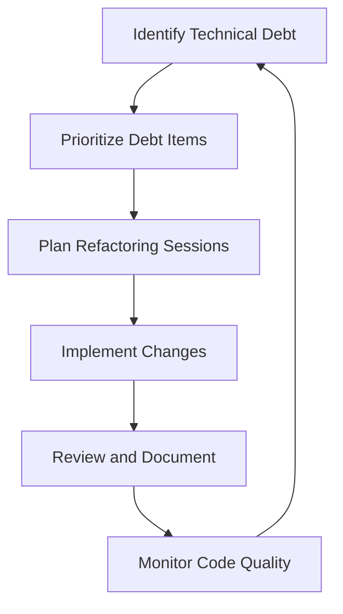

## 16.4 Dealing with Technical Debt

In the fast-paced world of software development, the concept of technical debt is an inevitable reality. As Ruby developers, understanding and managing technical debt is crucial for maintaining scalable and maintainable applications. In this section, we will delve into the nature of technical debt, its causes, and the strategies to manage it effectively.

### Understanding Technical Debt

**Technical debt** refers to the implied cost of additional rework caused by choosing an easy solution now instead of using a better approach that would take longer. It is a metaphor introduced by Ward Cunningham to describe the trade-offs between short-term gains and long-term code quality.

#### Causes of Technical Debt

1. **Time Constraints**: Often, developers face tight deadlines, leading to quick fixes and shortcuts.
2. **Lack of Knowledge**: Inexperienced developers might implement solutions that are not optimal.
3. **Changing Requirements**: As project requirements evolve, previously written code may no longer be suitable.
4. **Poor Design Decisions**: Initial design choices may not scale well as the application grows.
5. **Lack of Documentation**: Insufficient documentation can lead to misunderstandings and incorrect implementations.

### Long-Term Implications of Technical Debt

Accumulating technical debt can have severe long-term consequences:

- **Increased Maintenance Costs**: As debt accumulates, the cost of maintaining the codebase rises.
- **Reduced Agility**: High technical debt can slow down the development process, making it harder to implement new features.
- **Decreased Code Quality**: Over time, the codebase becomes more complex and harder to understand.
- **Higher Risk of Bugs**: Poorly written code is more prone to errors and bugs.

### Tracking and Prioritizing Technical Debt

To manage technical debt effectively, it is essential to track and prioritize it. Here are some methods to consider:

1. **Code Reviews**: Regular code reviews can help identify areas of technical debt.
2. **Automated Tools**: Use tools like RuboCop, Reek, and CodeClimate to analyze code quality and identify debt.
3. **Technical Debt Register**: Maintain a list of known debt items, including their impact and priority.
4. **Debt Quadrant**: Categorize debt based on its impact and urgency to prioritize effectively.

### Strategies for Reducing Technical Debt

#### Code Reviews and Refactoring Sessions

- **Regular Code Reviews**: Encourage a culture of regular code reviews to catch potential debt early.
- **Scheduled Refactoring**: Allocate time for refactoring sessions to address accumulated debt.
- **Pair Programming**: Use pair programming to share knowledge and improve code quality.

#### Coding Standards and Best Practices

- **Adopt Coding Standards**: Implement coding standards to ensure consistency across the codebase.
- **Continuous Integration**: Use CI/CD pipelines to enforce coding standards and run automated tests.
- **Documentation**: Maintain comprehensive documentation to aid understanding and reduce misunderstandings.

#### Stakeholder Communication

- **Transparent Communication**: Keep stakeholders informed about the state of technical debt and its impact.
- **Educate Stakeholders**: Help stakeholders understand the importance of addressing technical debt.
- **Balance Features and Debt**: Work with stakeholders to balance the need for new features with debt reduction.

### Encouraging a Culture of Quality

Creating a culture that values quality and continuous improvement is vital for managing technical debt:

- **Quality Metrics**: Use metrics to track code quality and technical debt over time.
- **Continuous Learning**: Encourage developers to learn and adopt new techniques and best practices.
- **Reward Quality**: Recognize and reward efforts to improve code quality and reduce technical debt.

### Code Example: Refactoring a Ruby Class

Let's look at a simple example of refactoring a Ruby class to reduce technical debt. Consider the following class:

```ruby
# Original class with technical debt
class Order
  def initialize(items)
    @items = items
  end

  def total_price
    total = 0
    @items.each do |item|
      total += item.price * item.quantity
    end
    total
  end

  def print_order
    @items.each do |item|
      puts "Item: #{item.name}, Quantity: #{item.quantity}, Price: #{item.price}"
    end
  end
end
```

This class has some technical debt due to the lack of separation of concerns. Let's refactor it:

```ruby
# Refactored class with reduced technical debt
class Order
  def initialize(items)
    @items = items
  end

  def total_price
    @items.sum(&:total_price)
  end

  def print_order
    @items.each { |item| puts item.details }
  end
end

class Item
  attr_reader :name, :quantity, :price

  def initialize(name, quantity, price)
    @name = name
    @quantity = quantity
    @price = price
  end

  def total_price
    price * quantity
  end

  def details
    "Item: #{name}, Quantity: #{quantity}, Price: #{price}"
  end
end
```

**Key Improvements:**

- **Separation of Concerns**: The `Item` class now handles its own details and total price calculation.
- **Use of Enumerable Methods**: The `sum` method simplifies the total price calculation.

### Visualizing Technical Debt Management

Below is a flowchart illustrating the process of managing technical debt:



**Description**: This flowchart represents a continuous cycle of identifying, prioritizing, and addressing technical debt, followed by monitoring and documentation.

### Try It Yourself

Experiment with the provided code example by adding new methods or modifying existing ones. Consider how changes might introduce new technical debt and how you could refactor to prevent it.

### Knowledge Check

- What are some common causes of technical debt?
- How can technical debt impact a software project in the long term?
- What strategies can be used to track and prioritize technical debt?
- Why is stakeholder communication important when dealing with technical debt?
- How can a culture of quality help in managing technical debt?

### Conclusion

Managing technical debt is an ongoing process that requires diligence and commitment. By understanding its causes and implications, tracking and prioritizing debt items, and fostering a culture of quality, we can ensure that our Ruby applications remain scalable and maintainable. Remember, addressing technical debt is not just about fixing code; it's about improving the overall health of the software and enabling future growth.

## Quiz: Dealing with Technical Debt



### What is technical debt?

- [x] The implied cost of additional rework caused by choosing an easy solution now instead of a better approach that would take longer.
- [ ] The financial cost of software development.
- [ ] The amount of code that needs to be written.
- [ ] The time taken to complete a project.

> **Explanation:** Technical debt refers to the trade-offs between short-term gains and long-term code quality.

### Which of the following is a cause of technical debt?

- [x] Time constraints
- [x] Lack of knowledge
- [ ] Abundant resources
- [ ] Perfect documentation

> **Explanation:** Time constraints and lack of knowledge are common causes of technical debt.

### What is a long-term implication of technical debt?

- [x] Increased maintenance costs
- [ ] Decreased code readability
- [ ] Faster development
- [ ] Reduced team size

> **Explanation:** Technical debt can lead to increased maintenance costs over time.

### How can technical debt be tracked?

- [x] Using automated tools like RuboCop
- [x] Maintaining a technical debt register
- [ ] Ignoring it
- [ ] Only relying on manual reviews

> **Explanation:** Automated tools and a technical debt register are effective ways to track technical debt.

### Why is stakeholder communication important in managing technical debt?

- [x] To keep them informed about the state of technical debt
- [ ] To hide the debt from them
- [ ] To increase project costs
- [ ] To reduce team morale

> **Explanation:** Transparent communication helps stakeholders understand the impact of technical debt.

### What is a benefit of regular code reviews?

- [x] Identifying potential technical debt early
- [ ] Increasing technical debt
- [ ] Reducing code quality
- [ ] Slowing down development

> **Explanation:** Regular code reviews help catch potential debt early and improve code quality.

### What is the role of coding standards in managing technical debt?

- [x] Ensuring consistency across the codebase
- [ ] Increasing technical debt
- [ ] Making code harder to read
- [ ] Reducing team collaboration

> **Explanation:** Coding standards ensure consistency, which helps manage technical debt.

### How can a culture of quality help manage technical debt?

- [x] By encouraging continuous improvement
- [ ] By ignoring technical debt
- [ ] By reducing team size
- [ ] By increasing project costs

> **Explanation:** A culture of quality encourages continuous improvement, which helps manage technical debt.

### What is a key improvement in the refactored Ruby class example?

- [x] Separation of concerns
- [ ] Increased complexity
- [ ] Reduced readability
- [ ] More lines of code

> **Explanation:** The refactored class demonstrates separation of concerns, improving code quality.

### True or False: Technical debt only affects the development team.

- [ ] True
- [x] False

> **Explanation:** Technical debt affects the entire project, including stakeholders and future development.



Remember, managing technical debt is a journey, not a destination. Keep learning, stay curious, and embrace the challenge of maintaining a healthy codebase.
