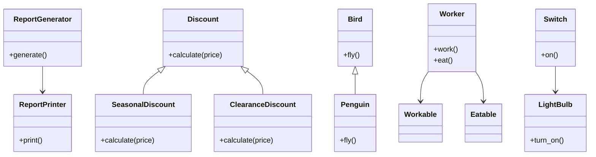

## 16.6 Applying SOLID Principles

In the world of software development, creating scalable and maintainable applications is a constant challenge. The SOLID principles, a set of five object-oriented design principles, provide a framework to achieve this goal. By adhering to these principles, developers can write code that is easier to understand, extend, and maintain. In this section, we will explore each of the SOLID principles, provide Ruby examples, and discuss how they can guide your refactoring decisions.

### Introduction to SOLID Principles

The SOLID principles are a set of guidelines that help developers design software that is easy to manage and extend. They were introduced by Robert C. Martin, also known as Uncle Bob, and have become a cornerstone of modern software design. Let's dive into each principle and see how they can be applied in Ruby.

### Single Responsibility Principle (SRP)

**Definition**: A class should have only one reason to change, meaning it should have only one job or responsibility.

**Explanation**: The Single Responsibility Principle (SRP) emphasizes that a class should only have one responsibility or task. This makes the class easier to understand and modify, as changes to one responsibility do not affect others.

**Ruby Example**:

```ruby
# Before applying SRP
class Report
  def initialize(data)
    @data = data
  end

  def generate
    # logic to generate report
  end

  def print
    # logic to print report
  end
end

# After applying SRP
class ReportGenerator
  def initialize(data)
    @data = data
  end

  def generate
    # logic to generate report
  end
end

class ReportPrinter
  def initialize(report)
    @report = report
  end

  def print
    # logic to print report
  end
end
```

**Benefits**: By adhering to SRP, each class has a clear purpose, making the codebase easier to navigate and reducing the risk of introducing bugs when making changes.

### Open/Closed Principle (OCP)

**Definition**: Software entities (classes, modules, functions, etc.) should be open for extension but closed for modification.

**Explanation**: The Open/Closed Principle (OCP) suggests that you should be able to add new functionality to a class without altering its existing code. This is often achieved through inheritance or composition.

**Ruby Example**:

```ruby
# Before applying OCP
class Discount
  def calculate(price, type)
    if type == :seasonal
      price * 0.9
    elsif type == :clearance
      price * 0.5
    else
      price
    end
  end
end

# After applying OCP
class Discount
  def calculate(price)
    price
  end
end

class SeasonalDiscount < Discount
  def calculate(price)
    price * 0.9
  end
end

class ClearanceDiscount < Discount
  def calculate(price)
    price * 0.5
  end
end
```

**Benefits**: OCP allows for the easy addition of new features without risking existing functionality, promoting a more flexible and robust codebase.

### Liskov Substitution Principle (LSP)

**Definition**: Objects of a superclass should be replaceable with objects of a subclass without affecting the correctness of the program.

**Explanation**: The Liskov Substitution Principle (LSP) ensures that a subclass can stand in for its superclass without altering the desirable properties of the program. This principle is crucial for maintaining polymorphism.

**Ruby Example**:

```ruby
# Before applying LSP
class Bird
  def fly
    "Flying"
  end
end

class Penguin < Bird
  def fly
    raise "Penguins can't fly!"
  end
end

# After applying LSP
class Bird
  def fly
    "Flying"
  end
end

class Penguin < Bird
  def fly
    "Penguins can't fly!"
  end
end
```

**Benefits**: LSP ensures that your code remains consistent and predictable, allowing for safe polymorphic behavior.

### Interface Segregation Principle (ISP)

**Definition**: Clients should not be forced to depend on interfaces they do not use.

**Explanation**: The Interface Segregation Principle (ISP) advocates for creating smaller, more specific interfaces rather than large, general-purpose ones. This reduces the impact of changes and makes the code easier to understand.

**Ruby Example**:

```ruby
# Before applying ISP
class Worker
  def work
    # work logic
  end

  def eat
    # eat logic
  end
end

# After applying ISP
module Workable
  def work
    # work logic
  end
end

module Eatable
  def eat
    # eat logic
  end
end

class Worker
  include Workable
  include Eatable
end
```

**Benefits**: ISP leads to more modular and flexible code, allowing for easier maintenance and extension.

### Dependency Inversion Principle (DIP)

**Definition**: High-level modules should not depend on low-level modules. Both should depend on abstractions. Abstractions should not depend on details. Details should depend on abstractions.

**Explanation**: The Dependency Inversion Principle (DIP) encourages the use of interfaces or abstract classes to decouple high-level and low-level components, promoting a more flexible and testable codebase.

**Ruby Example**:

```ruby
# Before applying DIP
class LightBulb
  def turn_on
    "LightBulb on"
  end
end

class Switch
  def initialize
    @light_bulb = LightBulb.new
  end

  def on
    @light_bulb.turn_on
  end
end

# After applying DIP
class LightBulb
  def turn_on
    "LightBulb on"
  end
end

class Switch
  def initialize(device)
    @device = device
  end

  def on
    @device.turn_on
  end
end

light_bulb = LightBulb.new
switch = Switch.new(light_bulb)
switch.on
```

**Benefits**: DIP fosters a more modular architecture, making it easier to swap out components and test individual parts of the system.

### Benefits of Adhering to SOLID Principles

Adhering to the SOLID principles offers numerous benefits:

- **Maintainability**: Code is easier to understand and modify, reducing the risk of introducing bugs.
- **Scalability**: New features can be added with minimal impact on existing code.
- **Testability**: Code is more modular, making it easier to test individual components.
- **Flexibility**: The system can adapt to changing requirements with minimal disruption.

### How SOLID Principles Guide Refactoring Decisions

When refactoring code, the SOLID principles serve as a valuable guide:

- **Identify Responsibilities**: Break down classes and methods to ensure each has a single responsibility.
- **Encapsulate Changes**: Use inheritance and composition to extend functionality without modifying existing code.
- **Ensure Substitutability**: Verify that subclasses can replace their superclasses without altering behavior.
- **Refine Interfaces**: Create specific interfaces to reduce dependencies and improve modularity.
- **Decouple Components**: Use abstractions to separate high-level and low-level modules.

### Common Misconceptions and Challenges

Applying SOLID principles can be challenging, and misconceptions often arise:

- **Over-Engineering**: Avoid creating unnecessary abstractions or interfaces. Focus on solving the problem at hand.
- **Misinterpreting LSP**: Ensure that subclasses truly extend the behavior of their superclasses without altering expected behavior.
- **Balancing ISP**: Find the right balance between too many small interfaces and overly large ones.

### Visualizing SOLID Principles

To better understand the relationships and interactions between the SOLID principles, let's visualize them using a class diagram:



### Try It Yourself

Experiment with the code examples provided. Try modifying the classes to see how changes affect the overall design. Consider how you might apply these principles to your own projects.

### Conclusion

The SOLID principles are a powerful tool for creating scalable and maintainable Ruby applications. By understanding and applying these principles, you can write code that is easier to manage and extend. Remember, this is just the beginning. As you continue to develop your skills, you'll find new ways to apply these principles to create robust and flexible software.

## Quiz: Applying SOLID Principles



### Which principle states that a class should have only one reason to change?

- [x] Single Responsibility Principle
- [ ] Open/Closed Principle
- [ ] Liskov Substitution Principle
- [ ] Dependency Inversion Principle

> **Explanation:** The Single Responsibility Principle emphasizes that a class should have only one responsibility or reason to change.

### What does the Open/Closed Principle advocate for?

- [x] Open for extension, closed for modification
- [ ] Open for modification, closed for extension
- [ ] Open for both extension and modification
- [ ] Closed for both extension and modification

> **Explanation:** The Open/Closed Principle suggests that software entities should be open for extension but closed for modification.

### Which principle ensures that a subclass can replace its superclass without affecting the program?

- [ ] Single Responsibility Principle
- [ ] Open/Closed Principle
- [x] Liskov Substitution Principle
- [ ] Interface Segregation Principle

> **Explanation:** The Liskov Substitution Principle ensures that objects of a superclass can be replaced with objects of a subclass without affecting the correctness of the program.

### What is the main focus of the Interface Segregation Principle?

- [ ] Creating large, general-purpose interfaces
- [x] Creating smaller, more specific interfaces
- [ ] Avoiding the use of interfaces altogether
- [ ] Using a single interface for all classes

> **Explanation:** The Interface Segregation Principle advocates for creating smaller, more specific interfaces rather than large, general-purpose ones.

### Which principle emphasizes the use of abstractions to decouple high-level and low-level components?

- [ ] Single Responsibility Principle
- [ ] Open/Closed Principle
- [ ] Liskov Substitution Principle
- [x] Dependency Inversion Principle

> **Explanation:** The Dependency Inversion Principle encourages the use of interfaces or abstract classes to decouple high-level and low-level components.

### What is a common misconception about the SOLID principles?

- [x] They always lead to over-engineering
- [ ] They are only applicable to large projects
- [ ] They are not relevant to Ruby programming
- [ ] They are only useful for testing

> **Explanation:** A common misconception is that applying SOLID principles always leads to over-engineering, but they should be applied judiciously to solve specific problems.

### How can the Single Responsibility Principle guide refactoring decisions?

- [x] By breaking down classes and methods to ensure each has a single responsibility
- [ ] By creating large, monolithic classes
- [ ] By avoiding the use of classes altogether
- [ ] By focusing on performance optimization

> **Explanation:** The Single Responsibility Principle guides refactoring by encouraging the breakdown of classes and methods to ensure each has a single responsibility.

### What is a benefit of adhering to the Open/Closed Principle?

- [x] New features can be added with minimal impact on existing code
- [ ] It eliminates the need for testing
- [ ] It allows for unrestricted modification of existing code
- [ ] It simplifies the codebase by reducing the number of classes

> **Explanation:** Adhering to the Open/Closed Principle allows new features to be added with minimal impact on existing code, promoting flexibility and robustness.

### Which principle is crucial for maintaining polymorphism?

- [ ] Single Responsibility Principle
- [ ] Open/Closed Principle
- [x] Liskov Substitution Principle
- [ ] Interface Segregation Principle

> **Explanation:** The Liskov Substitution Principle is crucial for maintaining polymorphism by ensuring that subclasses can replace their superclasses without altering behavior.

### True or False: The Dependency Inversion Principle suggests that high-level modules should depend on low-level modules.

- [ ] True
- [x] False

> **Explanation:** False. The Dependency Inversion Principle suggests that high-level modules should not depend on low-level modules; both should depend on abstractions.



Remember, mastering the SOLID principles is a journey. As you continue to apply these principles, you'll find new ways to create scalable and maintainable Ruby applications. Keep experimenting, stay curious, and enjoy the journey!
