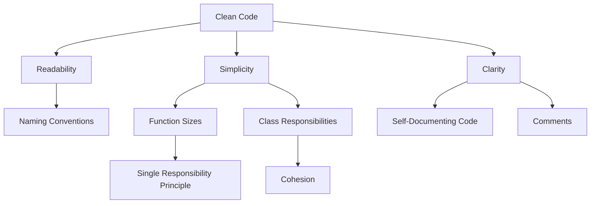

## 16.7 Clean Code Practices

In the world of software development, writing clean code is not just a preference but a necessity. Clean code is code that is easy to read, understand, and maintain. It is the foundation of scalable and robust applications. In this section, we will explore the principles and practices that contribute to writing clean code in Ruby, a language known for its elegance and simplicity.

### Characteristics of Clean Code

Clean code is characterized by several key attributes that make it stand out:

- **Readability**: Code should be easy to read and understand. This means using meaningful names, clear logic, and a consistent style.
- **Simplicity**: Avoid unnecessary complexity. Simple code is easier to test, debug, and extend.
- **Clarity**: The intent of the code should be clear to anyone reading it. This often means writing code that is self-documenting.

### Naming Conventions

Naming is one of the most important aspects of writing clean code. Good names can make your code self-explanatory, reducing the need for comments. Here are some rules for naming:

- **Use Descriptive Names**: Names should describe the purpose of the variable, function, or class. For example, `calculate_total` is more descriptive than `calc`.
- **Be Consistent**: Use a consistent naming convention throughout your codebase. Rubyists often use snake_case for variables and methods, and CamelCase for classes and modules.
- **Avoid Abbreviations**: Abbreviations can be confusing. Use full words unless the abbreviation is widely understood.

### Function Sizes and Class Responsibilities

Keeping functions and classes small and focused is crucial for clean code:

- **Single Responsibility Principle (SRP)**: Each class should have one responsibility, and each function should do one thing and do it well.
- **Limit Function Length**: Functions should be short enough to fit on a single screen. If a function is too long, consider breaking it into smaller, more focused functions.
- **Cohesion**: Ensure that the methods within a class are related and work together to fulfill the class's responsibility.

### Importance of Comments and Self-Documenting Code

While comments can be helpful, they should not be a crutch for unclear code:

- **Write Self-Documenting Code**: Aim to write code that is so clear that it doesn't need comments. Use meaningful names and simple logic.
- **Use Comments Sparingly**: Comments should explain why something is done, not what is done. Avoid redundant comments that state the obvious.
- **Update Comments**: Ensure comments are updated when the code changes to prevent them from becoming misleading.

### Practices for Pure Functions and Avoiding Side Effects

Pure functions are functions that do not have side effects and always produce the same output for the same input:

- **Keep Functions Pure**: Whenever possible, write functions that do not modify external state or depend on it. This makes them easier to test and reason about.
- **Avoid Side Effects**: Functions should not change the state of the system or have observable interactions with the outside world (like modifying a global variable or writing to a file).

### Consistent Coding Standards Across Teams

Consistency in coding standards is vital for team collaboration:

- **Adopt a Style Guide**: Use a style guide like the [Ruby Style Guide](https://rubystyle.guide/) to ensure consistency across your codebase.
- **Automate Style Checks**: Use tools like RuboCop to enforce style rules automatically.
- **Regularly Review Standards**: As a team, regularly review and update your coding standards to incorporate new best practices.

### Encouraging Peer Reviews and Knowledge Sharing

Peer reviews and knowledge sharing are essential for maintaining code quality:

- **Conduct Code Reviews**: Regular code reviews help catch issues early and ensure adherence to coding standards.
- **Share Knowledge**: Encourage team members to share insights and learnings. This can be done through regular meetings, documentation, or pair programming.
- **Foster a Learning Culture**: Create an environment where team members feel comfortable asking questions and seeking help.

### Code Examples

Let's look at some code examples that illustrate these clean code practices.

#### Example 1: Descriptive Naming and Simplicity

```ruby
# Bad Example
def calc(a, b)
  a + b
end

# Good Example
def calculate_sum(first_number, second_number)
  first_number + second_number
end
```

In the good example, the function name and parameter names clearly describe what the function does and what the parameters represent.

#### Example 2: Single Responsibility Principle

```ruby
# Bad Example
class Order
  def initialize
    @items = []
  end

  def add_item(item)
    @items << item
  end

  def calculate_total
    @items.sum(&:price)
  end

  def print_receipt
    puts "Receipt"
    @items.each { |item| puts item.name }
    puts "Total: #{calculate_total}"
  end
end

# Good Example
class Order
  def initialize
    @items = []
  end

  def add_item(item)
    @items << item
  end

  def calculate_total
    @items.sum(&:price)
  end
end

class ReceiptPrinter
  def print(order)
    puts "Receipt"
    order.items.each { |item| puts item.name }
    puts "Total: #{order.calculate_total}"
  end
end
```

In the good example, the `Order` class is responsible only for managing items and calculating the total, while the `ReceiptPrinter` class handles printing the receipt.

#### Example 3: Pure Functions

```ruby
# Impure Function
def add_to_total(total, value)
  $global_total += value
  total + value
end

# Pure Function
def add(value1, value2)
  value1 + value2
end
```

The pure function `add` does not modify any external state and always returns the same result for the same inputs.

### Visualizing Clean Code Practices

To better understand how these practices fit together, let's visualize the relationship between different clean code principles using a diagram.



This diagram illustrates how the core attributes of clean code—readability, simplicity, and clarity—are supported by specific practices like naming conventions, function sizes, and self-documenting code.

### Try It Yourself

Experiment with the code examples provided. Try renaming variables and functions to make them more descriptive, or refactor a class to adhere to the Single Responsibility Principle. Notice how these changes improve the readability and maintainability of your code.

### References and Links

For further reading on clean code practices, consider the following resources:

- [Clean Code: A Handbook of Agile Software Craftsmanship by Robert C. Martin](https://www.oreilly.com/library/view/clean-code-a/9780136083238/)
- [Ruby Style Guide](https://rubystyle.guide/)
- [Refactoring: Improving the Design of Existing Code by Martin Fowler](https://martinfowler.com/books/refactoring.html)

### Knowledge Check

- What are the key characteristics of clean code?
- How can naming conventions improve code readability?
- Why is it important to keep functions small and focused?
- What is the Single Responsibility Principle?
- How can peer reviews contribute to code quality?

### Embrace the Journey

Remember, writing clean code is a journey, not a destination. As you continue to practice these principles, you'll find that your code becomes easier to read, understand, and maintain. Keep experimenting, stay curious, and enjoy the process of becoming a better developer!

## Quiz: Clean Code Practices



### What is a key characteristic of clean code?

- [x] Readability
- [ ] Complexity
- [ ] Obfuscation
- [ ] Redundancy

> **Explanation:** Clean code is characterized by readability, making it easy to understand and maintain.

### Which naming convention is commonly used in Ruby for variables and methods?

- [x] snake_case
- [ ] CamelCase
- [ ] kebab-case
- [ ] PascalCase

> **Explanation:** Rubyists typically use snake_case for variables and methods.

### What principle suggests that a class should have only one reason to change?

- [x] Single Responsibility Principle
- [ ] Open/Closed Principle
- [ ] Liskov Substitution Principle
- [ ] Interface Segregation Principle

> **Explanation:** The Single Responsibility Principle states that a class should have only one reason to change.

### What is a pure function?

- [x] A function that does not have side effects and returns the same output for the same input
- [ ] A function that modifies global state
- [ ] A function that depends on external input
- [ ] A function that writes to a file

> **Explanation:** Pure functions do not have side effects and always produce the same output for the same input.

### Why should comments be used sparingly in clean code?

- [x] Because code should be self-documenting
- [ ] Because comments are unnecessary
- [ ] Because comments slow down execution
- [ ] Because comments are difficult to write

> **Explanation:** Clean code should be self-documenting, reducing the need for comments.

### What tool can be used to enforce coding standards in Ruby?

- [x] RuboCop
- [ ] ESLint
- [ ] Prettier
- [ ] JSLint

> **Explanation:** RuboCop is a tool used to enforce coding standards in Ruby.

### What is the benefit of peer reviews?

- [x] They help catch issues early and ensure adherence to coding standards
- [ ] They slow down development
- [ ] They are only useful for junior developers
- [ ] They replace automated testing

> **Explanation:** Peer reviews help catch issues early and ensure adherence to coding standards.

### What is the purpose of a style guide?

- [x] To ensure consistency across a codebase
- [ ] To dictate the architecture of an application
- [ ] To replace documentation
- [ ] To enforce runtime performance

> **Explanation:** A style guide ensures consistency across a codebase.

### What is a common practice to maintain code quality in a team?

- [x] Conducting regular code reviews
- [ ] Avoiding documentation
- [ ] Writing code in isolation
- [ ] Using different coding styles

> **Explanation:** Conducting regular code reviews is a common practice to maintain code quality.

### True or False: Clean code should prioritize performance over readability.

- [ ] True
- [x] False

> **Explanation:** Clean code prioritizes readability and maintainability, which often leads to better performance as a result.


