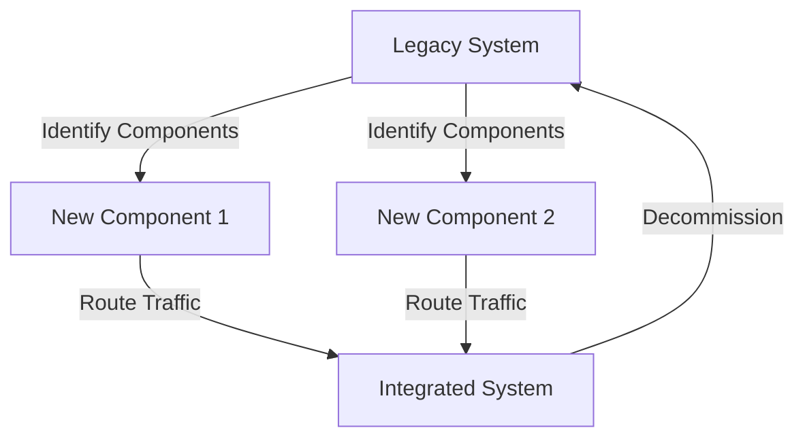

## 16.8 Patterns for Maintaining Legacy Code

In the world of software development, legacy code is a term that often evokes a mix of dread and nostalgia. It refers to code that is outdated or inherited from previous projects, often lacking proper documentation or tests. Despite its challenges, legacy code is a reality for many developers, and learning how to maintain and improve it is crucial for the longevity and scalability of applications. In this section, we will explore effective patterns and strategies for maintaining legacy Ruby codebases, ensuring they remain robust and adaptable to future needs.

### Understanding Legacy Code

**Legacy code** is typically defined as code that is difficult to understand, modify, or extend. It often lacks automated tests, making changes risky and time-consuming. Legacy systems may have been developed using outdated technologies or practices, and they might not adhere to modern design principles. Despite these challenges, legacy code is often mission-critical, and replacing it entirely is not always feasible due to cost, time, or risk considerations.

#### Challenges of Legacy Code

1. **Lack of Documentation**: Legacy code often lacks comprehensive documentation, making it difficult for new developers to understand its purpose and functionality.
2. **Absence of Tests**: Without automated tests, making changes to legacy code can introduce new bugs, as there is no safety net to catch regressions.
3. **Complex Dependencies**: Legacy systems may have complex interdependencies, making it challenging to isolate and modify specific components.
4. **Technical Debt**: Over time, shortcuts and quick fixes accumulate, leading to technical debt that can hinder future development.

### Strategies for Maintaining Legacy Code

Maintaining legacy code requires a strategic approach that balances the need for improvements with the risk of introducing new issues. Here are some effective patterns and techniques for managing legacy codebases:

#### 1. The Strangler Fig Pattern

The [Strangler Fig pattern](https://martinfowler.com/bliki/StranglerFigApplication.html) is a technique for gradually replacing parts of a legacy system with new functionality. Inspired by the way a strangler fig plant grows around a tree and eventually replaces it, this pattern allows developers to incrementally modernize a system without a complete rewrite.

**Implementation Steps:**

- **Identify Components**: Start by identifying the components of the legacy system that need replacement or improvement.
- **Create New Functionality**: Develop new components that replicate the functionality of the legacy components.
- **Route Traffic**: Gradually route traffic from the legacy components to the new ones, ensuring they work seamlessly together.
- **Decommission Legacy Code**: Once the new components are fully functional and tested, decommission the legacy components.

**Benefits:**

- Reduces risk by allowing gradual changes.
- Enables testing and validation of new components before full deployment.
- Minimizes disruption to users and business operations.

#### 2. Add Tests Before Making Changes

Before making any changes to legacy code, it is crucial to add tests to ensure that existing functionality is preserved. This practice provides a safety net that allows developers to refactor and improve code with confidence.

**Steps to Add Tests:**

- **Identify Critical Paths**: Focus on the most critical parts of the codebase that are frequently used or prone to errors.
- **Write Unit Tests**: Create unit tests for individual functions or methods to verify their behavior.
- **Implement Integration Tests**: Develop integration tests to ensure that different parts of the system work together as expected.
- **Use Test Coverage Tools**: Utilize tools like SimpleCov to measure test coverage and identify untested areas.

**Example Code Snippet:**

```ruby
# Example of a unit test for a legacy method
require 'minitest/autorun'

class LegacyCodeTest < Minitest::Test
  def test_legacy_method
    result = legacy_method(5)
    assert_equal 25, result, "Expected legacy_method to return 25 for input 5"
  end
end

def legacy_method(x)
  x * x
end
```

#### 3. Understand and Document Existing Code

Understanding the existing codebase is essential for effective maintenance. Documentation helps new developers get up to speed quickly and ensures that knowledge is not lost over time.

**Techniques for Understanding Code:**

- **Code Walkthroughs**: Conduct walkthroughs with team members to discuss and understand the code.
- **Static Analysis Tools**: Use tools like RuboCop to analyze code quality and identify potential issues.
- **Refactor for Clarity**: Simplify complex code structures to make them more readable and maintainable.

**Documentation Practices:**

- **Inline Comments**: Add comments within the code to explain complex logic or decisions.
- **External Documentation**: Maintain external documentation that provides an overview of the system architecture and key components.
- **Use Diagrams**: Create diagrams to visualize system architecture, data flow, and dependencies.

#### 4. Avoid Introducing New Technical Debt

While maintaining legacy code, it is important to avoid introducing new technical debt. This requires a disciplined approach to coding and a commitment to best practices.

**Best Practices:**

- **Adhere to Coding Standards**: Follow established coding standards and guidelines to ensure consistency and quality.
- **Refactor Regularly**: Continuously refactor code to improve its structure and readability.
- **Review Code Changes**: Conduct code reviews to catch potential issues and ensure adherence to best practices.

### Case Studies: Success Stories in Legacy Code Modernization

#### Case Study 1: Modernizing a Legacy E-commerce Platform

An e-commerce company faced challenges with their legacy platform, which was built using outdated technologies and lacked automated tests. By adopting the Strangler Fig pattern, they gradually replaced key components with modern equivalents, such as transitioning from a monolithic architecture to microservices. This approach allowed them to improve performance, scalability, and maintainability without disrupting their business operations.

#### Case Study 2: Refactoring a Financial Application

A financial services company inherited a legacy application with complex business logic and no documentation. They started by adding comprehensive tests to critical parts of the system, ensuring that existing functionality was preserved. Through regular refactoring and documentation efforts, they were able to simplify the codebase, reduce technical debt, and improve developer productivity.

### Visualizing the Strangler Fig Pattern

To better understand the Strangler Fig pattern, let's visualize the process using a Mermaid.js diagram:



**Diagram Description:** This diagram illustrates the process of gradually replacing components of a legacy system with new components, eventually leading to a fully modernized system.

### Knowledge Check

Before we conclude, let's reinforce what we've learned with a few questions:

1. What is legacy code, and why is it challenging to maintain?
2. How does the Strangler Fig pattern help in modernizing legacy systems?
3. Why is it important to add tests before making changes to legacy code?
4. What are some techniques for understanding and documenting existing code?
5. How can we avoid introducing new technical debt while maintaining legacy code?

### Embrace the Journey

Maintaining legacy code is a challenging but rewarding endeavor. By applying the patterns and strategies discussed in this section, you can transform legacy systems into robust, maintainable, and scalable applications. Remember, this is just the beginning. As you progress, you'll gain more insights and skills to tackle even the most complex legacy codebases. Keep experimenting, stay curious, and enjoy the journey!

## Quiz: Patterns for Maintaining Legacy Code



### What is a common challenge associated with legacy code?

- [x] Lack of documentation
- [ ] Excessive comments
- [ ] Overuse of modern design patterns
- [ ] Too many automated tests

> **Explanation:** Legacy code often lacks comprehensive documentation, making it difficult for new developers to understand its purpose and functionality.

### Which pattern is used to gradually replace parts of a legacy system?

- [x] Strangler Fig Pattern
- [ ] Singleton Pattern
- [ ] Factory Pattern
- [ ] Observer Pattern

> **Explanation:** The Strangler Fig pattern is a technique for gradually replacing parts of a legacy system with new functionality.

### What is the first step in implementing the Strangler Fig pattern?

- [x] Identify components to replace
- [ ] Decommission legacy code
- [ ] Route traffic to new components
- [ ] Create new functionality

> **Explanation:** The first step in implementing the Strangler Fig pattern is to identify the components of the legacy system that need replacement or improvement.

### Why is it important to add tests before making changes to legacy code?

- [x] To ensure existing functionality is preserved
- [ ] To increase code complexity
- [ ] To make the codebase larger
- [ ] To introduce new features

> **Explanation:** Adding tests before making changes ensures that existing functionality is preserved, providing a safety net for refactoring and improvements.

### What tool can be used to measure test coverage in Ruby?

- [x] SimpleCov
- [ ] RuboCop
- [ ] RSpec
- [ ] Bundler

> **Explanation:** SimpleCov is a tool used to measure test coverage in Ruby, helping identify untested areas of the codebase.

### Which of the following is a technique for understanding existing code?

- [x] Code walkthroughs
- [ ] Ignoring complex logic
- [ ] Removing comments
- [ ] Avoiding documentation

> **Explanation:** Code walkthroughs involve discussing and understanding the code with team members, which is a technique for understanding existing code.

### What is a best practice to avoid introducing new technical debt?

- [x] Adhere to coding standards
- [ ] Skip code reviews
- [ ] Avoid refactoring
- [ ] Ignore coding guidelines

> **Explanation:** Adhering to coding standards and guidelines ensures consistency and quality, helping avoid introducing new technical debt.

### What is a benefit of the Strangler Fig pattern?

- [x] Reduces risk by allowing gradual changes
- [ ] Requires a complete rewrite
- [ ] Increases disruption to users
- [ ] Eliminates the need for testing

> **Explanation:** The Strangler Fig pattern reduces risk by allowing gradual changes, enabling testing and validation of new components before full deployment.

### True or False: Legacy code is always easy to understand and modify.

- [ ] True
- [x] False

> **Explanation:** Legacy code is often difficult to understand and modify due to lack of documentation, tests, and adherence to modern design principles.

### What is a key takeaway from maintaining legacy code?

- [x] Transform legacy systems into robust applications
- [ ] Avoid any changes to the codebase
- [ ] Focus solely on adding new features
- [ ] Disregard existing functionality

> **Explanation:** The key takeaway is to transform legacy systems into robust, maintainable, and scalable applications by applying effective patterns and strategies.


