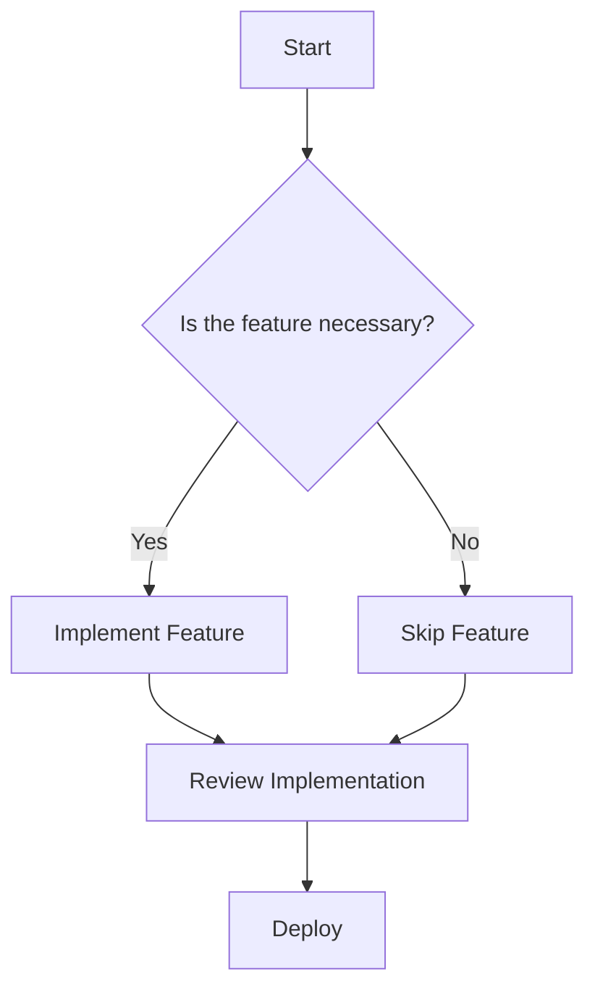

## 16.9 Avoiding Over-Engineering

In the world of software development, over-engineering is a common pitfall that can lead to unnecessarily complex and unmanageable codebases. This section will guide you through understanding what over-engineering is, how to recognize it, and strategies to avoid it in your Ruby applications. We'll explore the principle of YAGNI ("You Aren't Gonna Need It"), discuss the importance of focusing on current requirements, and provide practical examples to illustrate these concepts.

### Understanding Over-Engineering

**Over-engineering** occurs when a solution is more complex than necessary for the problem at hand. This often results from anticipating future needs that may never materialize, leading to wasted effort and resources. Over-engineered code can be difficult to understand, maintain, and extend, ultimately hindering the development process.

#### Drawbacks of Over-Engineering

1. **Increased Complexity**: Over-engineered solutions introduce unnecessary complexity, making the code harder to read and understand.
2. **Maintenance Challenges**: Complex systems are more difficult to maintain and debug, increasing the likelihood of errors.
3. **Slower Development**: Time spent on unnecessary features or abstractions delays the delivery of valuable functionality.
4. **Resource Waste**: Over-engineering consumes more resources, including time, money, and developer effort, without delivering proportional benefits.

### Recognizing Over-Engineered Code

Identifying over-engineered code is the first step in avoiding it. Here are some common signs:

1. **Unnecessary Patterns or Abstractions**: Implementing design patterns or abstractions that do not solve a current problem.
2. **Excessive Generalization**: Making code overly generic or flexible without a clear need.
3. **Premature Optimization**: Optimizing code before understanding if performance is an issue.
4. **Feature Creep**: Adding features that are not required by the current project scope.

### Simpler Solutions to Common Problems

Let's explore some examples of how to simplify solutions in Ruby, focusing on practicality and clarity.

#### Example 1: Simplifying a Singleton

The Singleton pattern is often overused. In many cases, a simple module with class methods can achieve the same result without the complexity of a full Singleton implementation.

```ruby
# Over-engineered Singleton
class Logger
  private_class_method :new

  def self.instance
    @instance ||= new
  end

  def log(message)
    puts message
  end
end

# Simpler Solution
module Logger
  def self.log(message)
    puts message
  end
end

# Usage
Logger.log("This is a log message.")
```

#### Example 2: Avoiding Unnecessary Abstractions

Consider a scenario where you need to parse different file formats. Instead of creating a complex hierarchy of classes, use a simple case statement.

```ruby
# Over-engineered Abstraction
class FileParser
  def parse(file)
    case file.type
    when :json
      JsonParser.new.parse(file)
    when :xml
      XmlParser.new.parse(file)
    else
      raise "Unsupported file type"
    end
  end
end

# Simpler Solution
def parse_file(file)
  case file.type
  when :json
    parse_json(file)
  when :xml
    parse_xml(file)
  else
    raise "Unsupported file type"
  end
end

def parse_json(file)
  # JSON parsing logic
end

def parse_xml(file)
  # XML parsing logic
end
```

### Embracing the YAGNI Principle

The YAGNI principle, which stands for "You Aren't Gonna Need It," is a key concept in avoiding over-engineering. It encourages developers to focus on current requirements and avoid implementing features or abstractions that are not immediately necessary.

#### Applying YAGNI in Practice

1. **Focus on Current Requirements**: Build only what is needed for the current iteration or release.
2. **Iterate and Refactor**: Develop incrementally, refactoring as new requirements emerge.
3. **Avoid Premature Optimization**: Optimize only when there is a proven need for performance improvements.

### Balancing Future Planning and Current Needs

While it's important to avoid over-engineering, it's also crucial to plan for the future. The key is finding a balance between addressing current needs and being prepared for future changes.

#### Strategies for Balanced Development

1. **Modular Design**: Design systems in a modular way, allowing for easy extension and modification.
2. **Use Interfaces and Contracts**: Define clear interfaces and contracts to facilitate future changes without over-complicating the current implementation.
3. **Adopt Agile Practices**: Use agile methodologies to iteratively develop and refine your software, ensuring it meets current needs while remaining adaptable.

### Visualizing Over-Engineering

To better understand the impact of over-engineering, let's visualize a simple scenario using a Mermaid.js diagram.



**Diagram Description**: This flowchart illustrates a decision-making process to determine whether a feature is necessary. If not, the feature is skipped, avoiding over-engineering.

### Knowledge Check

Before we conclude, let's engage with some questions to reinforce the concepts covered.

1. What is over-engineering, and why is it problematic?
2. How can you recognize over-engineered code?
3. Provide an example of a simpler solution to a common problem.
4. Explain the YAGNI principle and its importance.
5. How can you balance future planning with current needs?

### Conclusion

Avoiding over-engineering is crucial for building scalable and maintainable Ruby applications. By focusing on current requirements, embracing the YAGNI principle, and balancing future planning with present needs, you can create efficient and effective software solutions. Remember, simplicity is often the key to success in software development.

### Quiz: Avoiding Over-Engineering



### What is a common sign of over-engineered code?

- [x] Unnecessary patterns or abstractions
- [ ] Lack of documentation
- [ ] Use of comments
- [ ] Simple code structure

> **Explanation:** Over-engineered code often includes unnecessary patterns or abstractions that do not solve a current problem.

### Which principle helps prevent over-engineering by focusing on current needs?

- [x] YAGNI
- [ ] DRY
- [ ] SOLID
- [ ] KISS

> **Explanation:** The YAGNI principle, "You Aren't Gonna Need It," encourages focusing on current requirements.

### What is a drawback of over-engineering?

- [x] Increased complexity
- [ ] Faster development
- [ ] Simplified maintenance
- [ ] Reduced resource usage

> **Explanation:** Over-engineering leads to increased complexity, making the code harder to maintain and understand.

### How can you simplify a Singleton pattern in Ruby?

- [x] Use a module with class methods
- [ ] Create multiple instances
- [ ] Use inheritance
- [ ] Avoid using modules

> **Explanation:** A module with class methods can achieve the same result as a Singleton without added complexity.

### What is the focus of the YAGNI principle?

- [x] Current requirements
- [ ] Future features
- [ ] Code optimization
- [ ] Documentation

> **Explanation:** YAGNI focuses on building only what is needed for the current iteration or release.

### How can you balance future planning with current needs?

- [x] Use modular design
- [ ] Implement all possible features
- [ ] Avoid refactoring
- [ ] Ignore future changes

> **Explanation:** Modular design allows for easy extension and modification, balancing future planning with current needs.

### What is a benefit of avoiding over-engineering?

- [x] Easier maintenance
- [ ] Increased complexity
- [ ] Slower development
- [ ] More resource usage

> **Explanation:** Avoiding over-engineering results in simpler, more maintainable code.

### What does the YAGNI principle stand for?

- [x] You Aren't Gonna Need It
- [ ] You Always Gonna Need It
- [ ] You Aren't Gonna Ignore It
- [ ] You Always Gonna Ignore It

> **Explanation:** YAGNI stands for "You Aren't Gonna Need It," emphasizing the focus on current needs.

### What is a common pitfall of over-engineering?

- [x] Premature optimization
- [ ] Lack of features
- [ ] Simple code structure
- [ ] Efficient resource usage

> **Explanation:** Premature optimization is a common pitfall of over-engineering, leading to unnecessary complexity.

### True or False: Over-engineering can lead to resource waste.

- [x] True
- [ ] False

> **Explanation:** Over-engineering consumes more resources, including time, money, and developer effort, without delivering proportional benefits.



Remember, this is just the beginning. As you progress, you'll build more complex and interactive applications. Keep experimenting, stay curious, and enjoy the journey!

---
