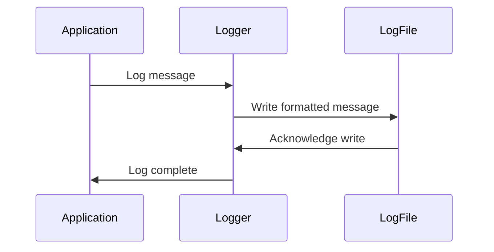

## 17.1 Logging Best Practices in Ruby

### Introduction

In the realm of software development and operations, logging serves as a critical component for understanding application behavior, diagnosing issues, and ensuring system transparency. Effective logging practices can significantly enhance debugging, monitoring, and auditing processes, making them indispensable for building scalable and maintainable applications. In this section, we will delve into the best practices for logging in Ruby, exploring various strategies and techniques to optimize your logging efforts.

### The Importance of Logging

Logging is more than just a record of events; it is a window into the inner workings of your application. By capturing detailed information about application execution, logs provide invaluable insights that can help developers and operators:

- **Diagnose and Debug Issues**: Logs can reveal the root cause of errors and unexpected behavior, facilitating quicker resolution.
- **Monitor System Health**: Continuous logging allows for real-time monitoring of application performance and resource usage.
- **Audit and Compliance**: Logs serve as an audit trail, documenting system activity for compliance and security purposes.
- **Improve User Experience**: By understanding how users interact with your application, you can make informed decisions to enhance usability.

### Logging Levels: Understanding Their Use Cases

Ruby's logging system provides several levels of logging, each serving a distinct purpose. Understanding these levels is crucial for effective log management:

- **DEBUG**: Detailed information, typically of interest only when diagnosing problems. Use this level to log fine-grained informational events that are useful during development and debugging.
- **INFO**: Informational messages that highlight the progress of the application at a coarse-grained level. This level is suitable for general application flow tracking.
- **WARN**: Potentially harmful situations that are not necessarily errors but may require attention. Use this level to log unexpected events that do not disrupt the application.
- **ERROR**: Error events that might still allow the application to continue running. This level is used to log issues that need immediate attention but are not fatal.
- **FATAL**: Very severe error events that will presumably lead the application to abort. Use this level for critical issues that require immediate intervention.

### Implementing Logging with Ruby's Built-in `Logger` Class

Ruby provides a built-in `Logger` class that offers a flexible and easy-to-use interface for logging. Let's explore how to implement logging using this class.

#### Basic Setup

To start using the `Logger` class, you need to require it and create an instance:

```ruby
require 'logger'

# Create a new logger that outputs to STDOUT
logger = Logger.new(STDOUT)

# Set the logging level
logger.level = Logger::DEBUG
```

#### Logging Messages

Once the logger is set up, you can log messages at different levels:

```ruby
logger.debug("This is a debug message.")
logger.info("This is an info message.")
logger.warn("This is a warning message.")
logger.error("This is an error message.")
logger.fatal("This is a fatal message.")
```

#### Configuring Log Formats

The `Logger` class allows you to customize the format of log messages. You can define a custom formatter to include additional context such as timestamps and severity levels:

```ruby
logger.formatter = proc do |severity, datetime, progname, msg|
  "#{datetime}: #{severity} - #{msg}\n"
end
```

#### Log Rotation

To prevent log files from growing indefinitely, you can configure log rotation. The `Logger` class supports automatic log rotation based on file size or time:

```ruby
# Rotate logs daily
logger = Logger.new('application.log', 'daily')

# Rotate logs when they reach 10 MB
logger = Logger.new('application.log', 10, 1024 * 1024 * 10)
```

### Best Practices for Logging in Ruby

Implementing effective logging practices can greatly enhance the utility of your logs. Here are some best practices to consider:

#### Avoid Logging Sensitive Information

Ensure that logs do not contain sensitive information such as passwords, credit card numbers, or personal identification details. This is crucial for maintaining user privacy and complying with data protection regulations.

#### Use Consistent and Structured Log Formats

Adopt a consistent log format to make logs easier to parse and analyze. Structured formats like JSON can be particularly useful for automated log processing and integration with log management tools.

```ruby
require 'json'

logger.formatter = proc do |severity, datetime, progname, msg|
  { time: datetime, level: severity, message: msg }.to_json + "\n"
end
```

#### Include Contextual Information

Enrich your logs with contextual information such as timestamps, request IDs, and user identifiers. This additional data can help correlate log entries and provide a clearer picture of application behavior.

#### Balance Logging Volume

Avoid over-logging, which can lead to log bloat and make it difficult to find relevant information. Conversely, under-logging can result in missing critical insights. Strive for a balance that captures essential information without overwhelming the log files.

### The Role of Logging in Debugging, Monitoring, and Auditing

Logging plays a pivotal role in various aspects of software development and operations:

- **Debugging**: Logs provide a detailed account of application execution, helping developers trace the sequence of events leading to an issue.
- **Monitoring**: Continuous logging enables real-time monitoring of application health and performance, allowing for proactive issue detection.
- **Auditing**: Logs serve as a historical record of system activity, supporting compliance and security audits.

### Common Pitfalls to Avoid

While logging is a powerful tool, there are common pitfalls to be aware of:

- **Over-Logging**: Excessive logging can lead to performance degradation and make it difficult to extract meaningful insights.
- **Under-Logging**: Insufficient logging can result in missing critical information needed for troubleshooting.
- **Inconsistent Log Formats**: Inconsistent formats can complicate log analysis and integration with log management tools.
- **Logging Sensitive Data**: Including sensitive information in logs can pose security and privacy risks.

### Try It Yourself

Experiment with the following code snippet to see how logging works in Ruby. Try modifying the log levels, formats, and destinations to observe the changes:

```ruby
require 'logger'

# Create a logger that writes to a file
logger = Logger.new('my_app.log')

# Set a custom log format
logger.formatter = proc do |severity, datetime, progname, msg|
  "#{datetime}: #{severity} - #{msg}\n"
end

# Log messages at different levels
logger.debug("Debugging information")
logger.info("General information")
logger.warn("Warning message")
logger.error("Error encountered")
logger.fatal("Fatal error occurred")
```

### Visualizing the Logging Process

To better understand the flow of logging in a Ruby application, let's visualize the process using a sequence diagram:



This diagram illustrates the interaction between the application, the logger, and the log file, highlighting the flow of log messages from generation to storage.

### Conclusion

Effective logging is a cornerstone of robust software development and operations. By following best practices and leveraging Ruby's built-in logging capabilities, you can enhance your application's transparency, improve debugging and monitoring efforts, and ensure compliance with auditing requirements. Remember, logging is not just about capturing data; it's about capturing the right data in the right way.

## Quiz: Logging Best Practices in Ruby



### What is the primary purpose of logging in software development?

- [x] To provide insights into application behavior and facilitate debugging
- [ ] To increase application performance
- [ ] To replace documentation
- [ ] To manage user authentication

> **Explanation:** Logging provides insights into application behavior, which is crucial for debugging, monitoring, and auditing.

### Which logging level is used for potentially harmful situations that are not errors?

- [ ] DEBUG
- [ ] INFO
- [x] WARN
- [ ] ERROR

> **Explanation:** The WARN level is used for logging potentially harmful situations that are not necessarily errors.

### How can you prevent log files from growing indefinitely?

- [ ] By deleting old logs manually
- [x] By configuring log rotation
- [ ] By reducing log verbosity
- [ ] By using a database for logs

> **Explanation:** Log rotation can be configured to automatically manage log file size and retention.

### What is a best practice for logging sensitive information?

- [ ] Always log sensitive information for auditing
- [x] Avoid logging sensitive information
- [ ] Encrypt sensitive information in logs
- [ ] Log sensitive information only in debug mode

> **Explanation:** Avoid logging sensitive information to maintain user privacy and comply with data protection regulations.

### What is the benefit of using structured log formats like JSON?

- [x] Easier parsing and integration with log management tools
- [ ] Reduced log file size
- [ ] Increased log verbosity
- [ ] Simplified log rotation

> **Explanation:** Structured formats like JSON facilitate automated log processing and integration with log management tools.

### What is a common pitfall of over-logging?

- [ ] Missing critical information
- [x] Performance degradation and log bloat
- [ ] Inconsistent log formats
- [ ] Security risks

> **Explanation:** Over-logging can lead to performance issues and make it difficult to extract meaningful insights from logs.

### How can contextual information in logs be beneficial?

- [x] It helps correlate log entries and provides a clearer picture of application behavior
- [ ] It reduces log file size
- [ ] It simplifies log rotation
- [ ] It increases log verbosity

> **Explanation:** Contextual information enriches logs, aiding in correlating entries and understanding application behavior.

### What is the role of logging in auditing?

- [ ] To replace documentation
- [ ] To increase application performance
- [x] To serve as a historical record of system activity
- [ ] To manage user authentication

> **Explanation:** Logs serve as an audit trail, documenting system activity for compliance and security purposes.

### Which logging level should be used for critical issues that require immediate intervention?

- [ ] DEBUG
- [ ] INFO
- [ ] WARN
- [x] FATAL

> **Explanation:** The FATAL level is used for very severe error events that will presumably lead the application to abort.

### True or False: Logging is only useful during the development phase of an application.

- [ ] True
- [x] False

> **Explanation:** Logging is useful throughout the entire lifecycle of an application, including development, testing, and production.



Remember, this is just the beginning. As you progress, you'll build more complex and interactive applications. Keep experimenting, stay curious, and enjoy the journey!
