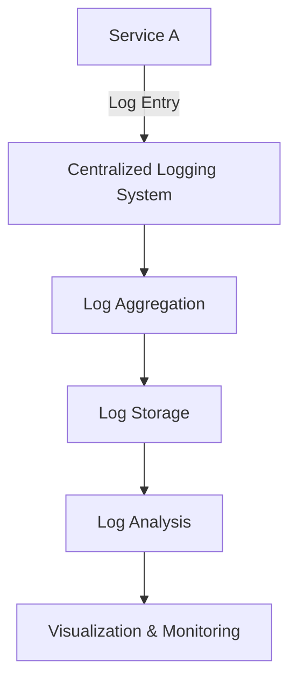

## 17.10 Logging in Distributed Systems

In the world of distributed systems and microservices, logging plays a crucial role in maintaining observability and ensuring the smooth operation of applications. As systems grow in complexity, the challenges of logging increase, requiring robust strategies and tools to manage logs effectively. In this section, we will explore the intricacies of logging in distributed systems, discuss the need for centralized logging solutions, and provide practical examples and best practices for managing logs across multiple services.

### Challenges of Logging in Distributed Systems

Distributed systems, by their nature, consist of multiple interconnected services that communicate over a network. This architecture introduces several challenges when it comes to logging:

- **Volume and Velocity**: With numerous services generating logs, the volume of log data can be overwhelming. The velocity at which logs are produced can also strain traditional logging systems.
- **Diversity**: Different services may use different logging formats, making it difficult to aggregate and analyze logs consistently.
- **Correlation**: Identifying related logs across services is challenging without a mechanism to correlate them.
- **Latency and Reliability**: Network latency and failures can affect log delivery, leading to incomplete or delayed log data.
- **Security and Compliance**: Ensuring that logs are secure and compliant with regulations is critical, especially when logs contain sensitive information.

### The Need for Centralized Logging Solutions

To address these challenges, centralized logging solutions have become essential in distributed systems. Centralized logging involves collecting logs from various services and storing them in a single location for easy access and analysis. This approach offers several benefits:

- **Simplified Log Management**: Centralized logging provides a unified view of logs, making it easier to search, analyze, and monitor log data.
- **Improved Correlation**: By aggregating logs in one place, it becomes easier to correlate events across services using identifiers like trace IDs or correlation IDs.
- **Enhanced Security**: Centralized logging solutions often include features for securing log data, such as encryption and access controls.
- **Scalability**: These solutions are designed to handle large volumes of log data, ensuring that logging infrastructure can scale with the application.

### Tools for Log Aggregation

Several tools are available for log aggregation in distributed systems. Let's explore some popular options:

#### ELK Stack

The ELK Stack, consisting of Elasticsearch, Logstash, and Kibana, is a powerful open-source solution for log aggregation and analysis.

- **Elasticsearch**: A distributed search and analytics engine that stores and indexes log data.
- **Logstash**: A data processing pipeline that ingests logs, transforms them, and sends them to Elasticsearch.
- **Kibana**: A visualization tool that provides a user-friendly interface for exploring and analyzing log data.

```ruby
# Example of configuring Logstash to ingest logs from a Ruby application
input {
  file {
    path => "/var/log/myapp/*.log"
    start_position => "beginning"
  }
}

filter {
  grok {
    match => { "message" => "%{TIMESTAMP_ISO8601:timestamp} %{LOGLEVEL:loglevel} %{GREEDYDATA:message}" }
  }
}

output {
  elasticsearch {
    hosts => ["http://localhost:9200"]
    index => "myapp-logs"
  }
}
```

#### Graylog

Graylog is another open-source log management platform that provides real-time log analysis and alerting capabilities. It supports a wide range of input sources and offers a flexible query language for searching logs.

#### Fluentd

Fluentd is a data collector that unifies the logging layer, allowing you to collect logs from various sources and route them to different destinations. It is highly extensible and supports plugins for integration with various systems.

```ruby
# Example of using Fluentd to forward logs from a Ruby application
<source>
  @type tail
  path /var/log/myapp/*.log
  pos_file /var/log/td-agent/myapp.pos
  tag myapp
  format none
</source>

<match myapp>
  @type forward
  <server>
    host 192.168.1.1
    port 24224
  </server>
</match>
```

### Strategies for Correlating Logs Across Services

In distributed systems, correlating logs from different services is essential for tracing the flow of requests and diagnosing issues. Here are some strategies for achieving log correlation:

#### Trace IDs and Correlation IDs

Assigning a unique identifier to each request, known as a trace ID or correlation ID, allows you to track the request as it traverses different services. By including this ID in log entries, you can easily correlate logs related to the same request.

```ruby
# Example of adding a correlation ID to logs in a Ruby application
require 'securerandom'

def log_with_correlation_id(message, correlation_id = SecureRandom.uuid)
  puts "[#{correlation_id}] #{message}"
end

correlation_id = SecureRandom.uuid
log_with_correlation_id("Starting process", correlation_id)
# Pass the correlation_id to other services or components
```

#### Distributed Tracing

Distributed tracing tools, such as OpenTelemetry, provide a more comprehensive solution for tracing requests across services. These tools automatically propagate trace IDs and collect trace data, which can be visualized to understand the flow of requests.

### Best Practices for Log Retention, Security, and Compliance

When managing logs in distributed systems, it's important to consider log retention, security, and compliance:

- **Log Retention**: Define a log retention policy that specifies how long logs should be retained. Consider the trade-off between storage costs and the need for historical data.
- **Security**: Ensure that logs are encrypted both in transit and at rest. Implement access controls to restrict who can view or modify log data.
- **Compliance**: Be aware of regulatory requirements that may affect log management, such as GDPR or HIPAA. Ensure that logs are handled in compliance with these regulations.

### The Role of Structured Logging

Structured logging involves logging data in a structured format, such as JSON, rather than plain text. This approach simplifies log management by making it easier to parse, search, and analyze logs.

```ruby
# Example of structured logging in a Ruby application
require 'json'

def structured_log(message, level: 'INFO', **additional_data)
  log_entry = {
    timestamp: Time.now.utc.iso8601,
    level: level,
    message: message
  }.merge(additional_data)

  puts log_entry.to_json
end

structured_log("User login", user_id: 123, action: "login")
```

### Visualizing Log Flow in Distributed Systems

To better understand the flow of logs in a distributed system, let's visualize the process using a Mermaid.js diagram:



**Diagram Description**: This diagram illustrates the flow of logs from a service to a centralized logging system. Logs are aggregated, stored, analyzed, and visualized for monitoring purposes.

### Try It Yourself

Experiment with the code examples provided in this section. Try modifying the log formats, adding correlation IDs, or integrating with a centralized logging tool like ELK Stack or Fluentd. Observe how these changes affect log management and analysis.

### Knowledge Check

- What are the key challenges of logging in distributed systems?
- Why is centralized logging important in microservices architectures?
- How can trace IDs or correlation IDs help in correlating logs across services?
- What are the benefits of structured logging?

### Embrace the Journey

Remember, mastering logging in distributed systems is a journey. As you implement these techniques, you'll gain valuable insights into your applications and improve their reliability and performance. Keep exploring, experimenting, and refining your logging strategies to ensure your systems are observable and maintainable.

## Quiz: Logging in Distributed Systems



### What is a primary challenge of logging in distributed systems?

- [x] Correlating logs across multiple services
- [ ] Storing logs in a single file
- [ ] Generating logs in real-time
- [ ] Using plain text for logs

> **Explanation:** Correlating logs across multiple services is a primary challenge due to the distributed nature of the system.

### Why is centralized logging important in distributed systems?

- [x] It provides a unified view of logs
- [ ] It reduces the number of logs generated
- [ ] It eliminates the need for log analysis
- [ ] It ensures logs are always encrypted

> **Explanation:** Centralized logging provides a unified view of logs, making it easier to manage and analyze them.

### Which tool is part of the ELK Stack?

- [x] Elasticsearch
- [ ] Graylog
- [ ] Fluentd
- [ ] Prometheus

> **Explanation:** Elasticsearch is part of the ELK Stack, which also includes Logstash and Kibana.

### What is a trace ID used for?

- [x] Correlating logs across services
- [ ] Encrypting log data
- [ ] Compressing log files
- [ ] Generating log entries

> **Explanation:** A trace ID is used to correlate logs across services by providing a unique identifier for each request.

### What is structured logging?

- [x] Logging data in a structured format like JSON
- [ ] Logging data in plain text
- [ ] Logging data without timestamps
- [ ] Logging data in binary format

> **Explanation:** Structured logging involves logging data in a structured format like JSON, making it easier to parse and analyze.

### What is a benefit of using Fluentd?

- [x] It unifies the logging layer
- [ ] It encrypts logs automatically
- [ ] It stores logs in a database
- [ ] It generates log entries

> **Explanation:** Fluentd unifies the logging layer by collecting logs from various sources and routing them to different destinations.

### How can log retention policies help?

- [x] By defining how long logs should be kept
- [ ] By encrypting logs
- [ ] By generating more logs
- [ ] By reducing log volume

> **Explanation:** Log retention policies define how long logs should be kept, balancing storage costs and the need for historical data.

### What is the role of Kibana in the ELK Stack?

- [x] Visualizing log data
- [ ] Collecting log data
- [ ] Storing log data
- [ ] Encrypting log data

> **Explanation:** Kibana is used for visualizing log data in the ELK Stack, providing a user-friendly interface for analysis.

### What is a correlation ID?

- [x] A unique identifier for correlating logs
- [ ] A method for encrypting logs
- [ ] A format for storing logs
- [ ] A tool for generating logs

> **Explanation:** A correlation ID is a unique identifier used to correlate logs related to the same request across services.

### True or False: Centralized logging solutions can handle large volumes of log data.

- [x] True
- [ ] False

> **Explanation:** Centralized logging solutions are designed to handle large volumes of log data, ensuring scalability.


