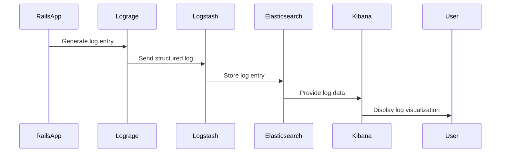

## 17.2 Structured Logging with Lograge

In the world of software development, logging is a crucial aspect of monitoring and maintaining applications. Traditional logging methods often produce multi-line log entries that can be difficult to parse and analyze. This is where structured logging comes into play, offering a more organized and efficient way to handle logs. In this section, we will explore structured logging using the Lograge gem in Ruby on Rails applications, providing you with the tools to produce single-line log entries that are easier to parse and analyze.

### Understanding Structured Logging

**Structured logging** refers to the practice of producing log entries in a consistent, structured format, often as single-line JSON objects. This approach contrasts with traditional logging, where log entries are typically unstructured text, making them harder to parse and analyze programmatically.

#### Benefits of Structured Logging

1. **Consistency**: Structured logs maintain a consistent format, making them easier to parse and analyze.
2. **Searchability**: With structured data, you can perform more precise searches and queries.
3. **Aggregation**: Structured logs are easier to aggregate and visualize using tools like the ELK Stack (Elasticsearch, Logstash, Kibana).
4. **Automation**: Automated systems can more easily process structured logs for monitoring and alerting.

### Introducing Lograge

[Lograge](https://github.com/roidrage/lograge) is a Ruby gem designed to simplify and enhance logging in Ruby on Rails applications. It transforms Rails' default multi-line log entries into single-line, structured log entries, making them more suitable for log aggregation and analysis.

#### Purpose of Lograge

- **Simplification**: Converts verbose Rails logs into concise, single-line entries.
- **Customization**: Allows developers to customize log formats and include additional fields.
- **Integration**: Facilitates integration with log management and analysis tools.

### Integrating Lograge into a Rails Application

Let's walk through the steps to integrate Lograge into a Ruby on Rails application.

#### Step 1: Add Lograge to Your Gemfile

To begin, add Lograge to your application's `Gemfile`:

```ruby
gem 'lograge'
```

Run `bundle install` to install the gem.

#### Step 2: Configure Lograge in Your Application

Next, configure Lograge in your Rails application. Open `config/environments/production.rb` (or any other environment file you wish to configure) and add the following configuration:

```ruby
Rails.application.configure do
  # Enable Lograge
  config.lograge.enabled = true

  # Set the log format to JSON
  config.lograge.formatter = Lograge::Formatters::Json.new

  # Customize log output
  config.lograge.custom_options = lambda do |event|
    { time: event.time, host: event.payload[:host] }
  end
end
```

#### Step 3: Customize Lograge Configuration

Lograge allows you to customize the log format and include additional fields. Here are some examples:

- **Custom Log Format**: You can specify a custom log format, such as JSON, to suit your needs.
- **Additional Fields**: Add custom fields to your logs to capture more context.

```ruby
config.lograge.custom_options = lambda do |event|
  {
    time: event.time,
    host: event.payload[:host],
    user_id: event.payload[:user_id],
    params: event.payload[:params]
  }
end
```

### Example: Configuring Lograge for Custom Log Formats

Let's look at a complete example of configuring Lograge to produce JSON-formatted logs with custom fields:

```ruby
Rails.application.configure do
  config.lograge.enabled = true
  config.lograge.formatter = Lograge::Formatters::Json.new

  config.lograge.custom_options = lambda do |event|
    {
      time: event.time,
      host: event.payload[:host],
      user_id: event.payload[:user_id],
      params: event.payload[:params],
      request_id: event.payload[:request_id]
    }
  end
end
```

### Facilitating Log Aggregation and Analysis

Structured logs are particularly useful when integrated with log aggregation and analysis tools like the ELK Stack. Here's how structured logging with Lograge can enhance your log management:

#### ELK Stack Integration

- **Elasticsearch**: Store and index structured logs for fast search and retrieval.
- **Logstash**: Process and transform logs before sending them to Elasticsearch.
- **Kibana**: Visualize and analyze logs with powerful dashboards.

### Best Practices for Using Lograge Effectively

1. **Consistent Formatting**: Ensure all logs follow a consistent format for easier parsing.
2. **Meaningful Fields**: Include fields that provide meaningful context for each log entry.
3. **Performance Considerations**: Be mindful of the performance impact of logging, especially in high-traffic applications.
4. **Security**: Avoid logging sensitive information, such as passwords or personal data.

### Try It Yourself

To get hands-on experience with Lograge, try modifying the configuration to include additional fields or change the log format. Experiment with integrating your logs into an ELK Stack setup to see the benefits of structured logging in action.

### Visualizing Structured Logging with Lograge

To better understand how Lograge transforms logs, let's visualize the process using a sequence diagram.



This diagram illustrates the flow of log data from a Rails application through Lograge to an ELK Stack setup, culminating in visualization with Kibana.

### Conclusion

Structured logging with Lograge offers a powerful way to enhance log management in Ruby on Rails applications. By producing single-line, structured log entries, you can simplify log parsing, facilitate aggregation, and improve analysis. Remember to follow best practices to ensure your logging strategy is both effective and secure.

### Quiz: Structured Logging with Lograge



### What is the primary benefit of structured logging over traditional logging?

- [x] Consistency and ease of parsing
- [ ] Increased verbosity
- [ ] Reduced log size
- [ ] Automatic error correction

> **Explanation:** Structured logging provides a consistent format, making logs easier to parse and analyze.

### Which gem is used for structured logging in Ruby on Rails applications?

- [x] Lograge
- [ ] Devise
- [ ] RSpec
- [ ] Capistrano

> **Explanation:** Lograge is a gem specifically designed for structured logging in Ruby on Rails.

### How does Lograge transform Rails logs?

- [x] Converts multi-line logs into single-line entries
- [ ] Increases the verbosity of logs
- [ ] Encrypts log entries
- [ ] Removes all log entries

> **Explanation:** Lograge simplifies Rails logs by converting them into single-line, structured entries.

### What format can Lograge use for log entries?

- [x] JSON
- [ ] XML
- [ ] CSV
- [ ] HTML

> **Explanation:** Lograge can format log entries as JSON, which is a common structured format.

### What tool is part of the ELK Stack for visualizing logs?

- [x] Kibana
- [ ] Lograge
- [ ] Redis
- [ ] Sidekiq

> **Explanation:** Kibana is used for visualizing logs in the ELK Stack.

### What should you avoid logging for security reasons?

- [x] Sensitive information
- [ ] Request URLs
- [ ] User agents
- [ ] HTTP methods

> **Explanation:** Sensitive information, such as passwords, should not be logged for security reasons.

### Which component of the ELK Stack stores and indexes logs?

- [x] Elasticsearch
- [ ] Logstash
- [ ] Kibana
- [ ] Redis

> **Explanation:** Elasticsearch is responsible for storing and indexing logs in the ELK Stack.

### What is a key feature of structured logs?

- [x] Consistent format
- [ ] Increased size
- [ ] Reduced readability
- [ ] Automatic error correction

> **Explanation:** Structured logs maintain a consistent format, which aids in parsing and analysis.

### True or False: Lograge can only be used in production environments.

- [ ] True
- [x] False

> **Explanation:** Lograge can be configured for any environment, not just production.

### What is a best practice when using Lograge?

- [x] Avoid logging sensitive information
- [ ] Log every possible detail
- [ ] Use different formats for each log entry
- [ ] Disable logging in production

> **Explanation:** It's important to avoid logging sensitive information to maintain security.



Remember, this is just the beginning. As you progress, you'll build more complex and interactive applications. Keep experimenting, stay curious, and enjoy the journey!
