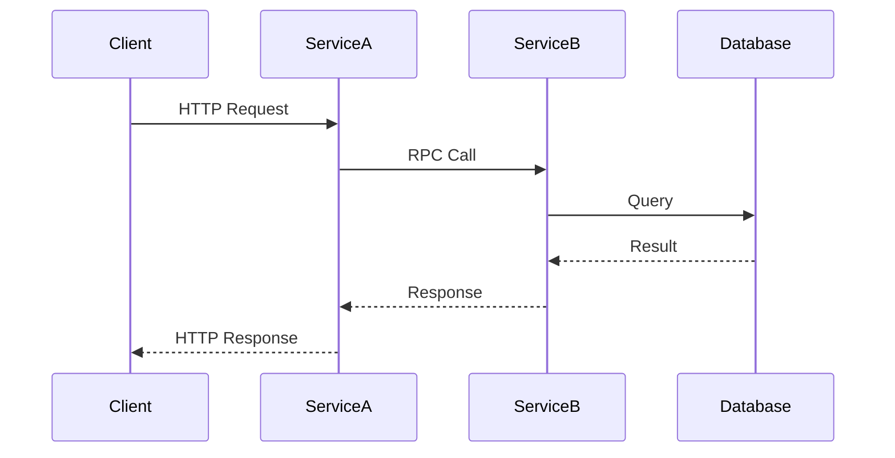

## 17.4 Distributed Tracing with OpenTelemetry

In the world of microservices and distributed systems, understanding the flow of requests across services is crucial for diagnosing performance issues and ensuring system reliability. Distributed tracing provides the visibility needed to track requests as they traverse through various components of a system. In this section, we'll explore how to implement distributed tracing in Ruby applications using OpenTelemetry, a powerful observability framework.

### Understanding the Need for Distributed Tracing

As applications grow in complexity, especially with the adoption of microservices architectures, traditional logging and monitoring techniques often fall short. Distributed tracing addresses these challenges by:

- **Providing End-to-End Visibility**: It allows developers to see the entire journey of a request across multiple services.
- **Identifying Performance Bottlenecks**: By visualizing the time spent in each service, developers can pinpoint slow operations.
- **Facilitating Root Cause Analysis**: Traces help in understanding the context of errors and failures, making it easier to diagnose issues.

### Introduction to OpenTelemetry

OpenTelemetry is an open-source observability framework that provides APIs, libraries, and agents to collect telemetry data (traces, metrics, logs) from applications. It consists of several key components:

- **Traces**: Represent the execution path through a system.
- **Spans**: Individual units of work within a trace, each representing a single operation.
- **Context Propagation**: Mechanism to pass trace context across service boundaries.

OpenTelemetry supports multiple languages, including Ruby, through the [opentelemetry-ruby](https://github.com/open-telemetry/opentelemetry-ruby) SDK.

### Integrating OpenTelemetry into Ruby Applications

To start using OpenTelemetry in your Ruby application, follow these steps:

#### Step 1: Install the OpenTelemetry Ruby SDK

Add the following gems to your `Gemfile`:

```ruby
gem 'opentelemetry-sdk'
gem 'opentelemetry-exporter-jaeger' # or 'opentelemetry-exporter-zipkin'
```

Run `bundle install` to install the gems.

#### Step 2: Configure OpenTelemetry

Set up OpenTelemetry in your application by initializing the SDK and configuring the exporter:

```ruby
require 'opentelemetry/sdk'
require 'opentelemetry/exporter/jaeger'

OpenTelemetry::SDK.configure do |c|
  c.use_all() # automatically use all available instrumentation
  c.add_span_processor(
    OpenTelemetry::SDK::Trace::Export::BatchSpanProcessor.new(
      OpenTelemetry::Exporter::Jaeger::CollectorExporter.new(
        endpoint: 'http://localhost:14268/api/traces'
      )
    )
  )
end
```

This configuration uses the Jaeger exporter to send trace data to a Jaeger backend. Adjust the `endpoint` as needed for your setup.

### Instrumenting Code with Spans

Once OpenTelemetry is configured, you can start instrumenting your code to create spans and attach metadata.

#### Creating Spans

Use the `OpenTelemetry::Trace` API to create spans around operations you want to trace:

```ruby
tracer = OpenTelemetry.tracer_provider.tracer('my_app', '1.0')

tracer.in_span('operation_name') do |span|
  # Your operation code here
  span.set_attribute('key', 'value') # Add metadata to the span
end
```

#### Attaching Metadata

Spans can carry additional metadata, such as attributes and events, to provide more context:

```ruby
tracer.in_span('database_query') do |span|
  span.set_attribute('db.system', 'mysql')
  span.set_attribute('db.statement', 'SELECT * FROM users')
  # Execute the database query
end
```

### Exporting Trace Data

To visualize and analyze trace data, export it to a backend like Jaeger or Zipkin.

#### Using Jaeger

Ensure Jaeger is running in your environment. You can use Docker to quickly set up Jaeger:

```bash
docker run -d --name jaeger \
  -e COLLECTOR_ZIPKIN_HTTP_PORT=9411 \
  -p 5775:5775/udp \
  -p 6831:6831/udp \
  -p 6832:6832/udp \
  -p 5778:5778 \
  -p 16686:16686 \
  -p 14268:14268 \
  -p 14250:14250 \
  -p 9411:9411 \
  jaegertracing/all-in-one:1.22
```

Access the Jaeger UI at `http://localhost:16686` to view traces.

#### Using Zipkin

For Zipkin, configure the exporter similarly:

```ruby
require 'opentelemetry/exporter/zipkin'

OpenTelemetry::SDK.configure do |c|
  c.add_span_processor(
    OpenTelemetry::SDK::Trace::Export::BatchSpanProcessor.new(
      OpenTelemetry::Exporter::Zipkin::Exporter.new(
        endpoint: 'http://localhost:9411/api/v2/spans'
      )
    )
  )
end
```

### Benefits of Distributed Tracing

Distributed tracing provides several advantages:

- **Improved Performance Analysis**: By visualizing traces, you can identify slow services and optimize them.
- **Enhanced Debugging**: Traces provide a detailed view of request paths, making it easier to locate and fix issues.
- **Better Resource Allocation**: Understanding service dependencies helps in efficient resource allocation.

### Best Practices for Distributed Tracing

- **Consistent Trace IDs**: Ensure trace IDs are consistent across services to maintain trace continuity.
- **Minimal Overhead**: Instrument only critical paths to reduce performance overhead.
- **Security Considerations**: Be cautious with sensitive data in trace metadata.

### Visualizing Distributed Tracing

To better understand distributed tracing, let's visualize a simple trace flow using Mermaid.js:



This diagram illustrates a typical request flow in a microservices architecture, highlighting the interactions between services and the database.

### Try It Yourself

Experiment with the code examples by:

- Modifying span names and attributes to suit your application's operations.
- Changing the exporter configuration to test with different backends.
- Adding more spans to trace additional parts of your application.

### Conclusion

Distributed tracing with OpenTelemetry is a powerful tool for gaining insights into your application's performance and behavior. By following the steps outlined in this guide, you can effectively implement distributed tracing in your Ruby applications, enhancing your ability to diagnose issues and optimize performance.

## Quiz: Distributed Tracing with OpenTelemetry



### What is the primary purpose of distributed tracing?

- [x] To provide end-to-end visibility of requests across services
- [ ] To replace traditional logging
- [ ] To enhance security
- [ ] To reduce application size

> **Explanation:** Distributed tracing provides end-to-end visibility of requests across services, helping in performance analysis and debugging.

### Which component of OpenTelemetry represents individual units of work?

- [ ] Traces
- [x] Spans
- [ ] Contexts
- [ ] Metrics

> **Explanation:** Spans represent individual units of work within a trace in OpenTelemetry.

### How do you create a span in Ruby using OpenTelemetry?

- [x] `tracer.in_span('operation_name') do |span| ... end`
- [ ] `OpenTelemetry.create_span('operation_name')`
- [ ] `span = OpenTelemetry::Span.new('operation_name')`
- [ ] `OpenTelemetry::Trace.start_span('operation_name')`

> **Explanation:** The `tracer.in_span` method is used to create a span in Ruby with OpenTelemetry.

### What is a best practice when using distributed tracing?

- [x] Ensure consistent trace IDs across services
- [ ] Instrument every line of code
- [ ] Use different trace IDs for each service
- [ ] Avoid using metadata in spans

> **Explanation:** Consistent trace IDs across services ensure trace continuity and accurate tracing.

### Which exporter is used to send trace data to Jaeger?

- [x] `opentelemetry-exporter-jaeger`
- [ ] `opentelemetry-exporter-zipkin`
- [ ] `opentelemetry-exporter-prometheus`
- [ ] `opentelemetry-exporter-datadog`

> **Explanation:** The `opentelemetry-exporter-jaeger` is used to send trace data to Jaeger.

### What is the role of context propagation in distributed tracing?

- [x] To pass trace context across service boundaries
- [ ] To store trace data locally
- [ ] To encrypt trace data
- [ ] To generate new trace IDs

> **Explanation:** Context propagation passes trace context across service boundaries, maintaining trace continuity.

### Which of the following is NOT a benefit of distributed tracing?

- [ ] Improved performance analysis
- [ ] Enhanced debugging
- [x] Increased application size
- [ ] Better resource allocation

> **Explanation:** Distributed tracing does not increase application size; it aids in performance analysis, debugging, and resource allocation.

### How can you visualize trace data in Jaeger?

- [x] By accessing the Jaeger UI at `http://localhost:16686`
- [ ] By using the Zipkin UI
- [ ] By checking application logs
- [ ] By using the OpenTelemetry CLI

> **Explanation:** Trace data can be visualized in Jaeger by accessing its UI at `http://localhost:16686`.

### What should you be cautious about when adding metadata to spans?

- [x] Including sensitive data
- [ ] Using too many attributes
- [ ] Using consistent trace IDs
- [ ] Using different span names

> **Explanation:** Be cautious about including sensitive data in span metadata to maintain security.

### True or False: Distributed tracing can replace traditional logging entirely.

- [ ] True
- [x] False

> **Explanation:** Distributed tracing complements traditional logging but does not replace it entirely.



Remember, distributed tracing is a journey. As you integrate it into your applications, you'll uncover new insights and opportunities for optimization. Keep exploring, stay curious, and enjoy the process!
