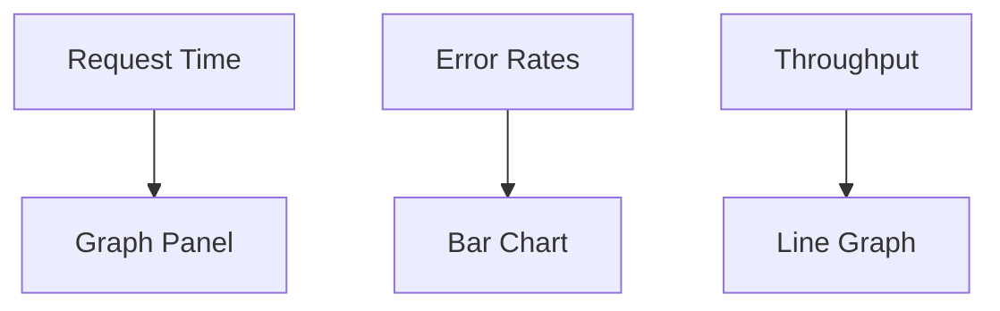

## 17.5 Metrics Collection and Visualization

In the realm of software development, especially when working with Ruby applications, understanding the health and performance of your application is crucial. Metrics collection and visualization play a pivotal role in achieving this understanding. They provide insights into how your application behaves under various conditions, helping you make informed decisions to enhance performance and user experience. In this section, we'll delve into the importance of metrics, explore different types of metrics, and demonstrate how to collect and visualize them using popular tools and libraries.

### Importance of Metrics in Observing Application Health

Metrics are quantitative measures that provide insights into the performance, health, and usage patterns of an application. They are essential for:

- **Monitoring Performance**: Metrics help you track the performance of your application over time, identifying trends and potential bottlenecks.
- **Detecting Anomalies**: By setting thresholds and alerts, you can quickly identify and respond to unusual behavior or performance degradation.
- **Capacity Planning**: Metrics provide data that can be used to predict future resource needs, ensuring your application can scale effectively.
- **Improving User Experience**: By understanding how users interact with your application, you can make data-driven decisions to enhance usability and satisfaction.

### Types of Metrics

Metrics can be broadly categorized into three types:

1. **System-Level Metrics**: These metrics provide insights into the underlying infrastructure supporting your application. Common system-level metrics include:
   - **CPU Usage**: Measures the percentage of CPU resources being used.
   - **Memory Usage**: Tracks the amount of memory being consumed.
   - **Disk I/O**: Monitors the read and write operations on disk storage.

2. **Application-Level Metrics**: These metrics focus on the performance and behavior of the application itself. Examples include:
   - **Request Time**: Measures the time taken to process a request.
   - **Error Rates**: Tracks the frequency of errors occurring within the application.
   - **Throughput**: Measures the number of requests processed over a given period.

3. **Business Metrics**: These metrics are specific to the business logic and goals of the application. They help in understanding user behavior and business outcomes. Examples include:
   - **User Sign-Ups**: Tracks the number of new users registering on the platform.
   - **Conversion Rates**: Measures the percentage of users completing a desired action, such as making a purchase.
   - **Revenue**: Tracks the income generated by the application.

### Collecting Metrics with StatsD and statsd-instrument

To effectively collect metrics, we can use tools like StatsD, a network daemon that listens for statistics, and libraries such as [statsd-instrument](https://github.com/Shopify/statsd-instrument) for Ruby applications.

#### Setting Up StatsD

StatsD is a simple, powerful tool for collecting and aggregating metrics. It works by listening for metrics sent over UDP, aggregating them, and then sending them to a backend service like Graphite or Datadog for storage and visualization.

1. **Install StatsD**: You can install StatsD using npm:

   ```bash
   npm install -g statsd
   ```

2. **Configure StatsD**: Create a configuration file to specify the backend and other settings. For example, to use Graphite as a backend:

   ```json
   {
     "graphiteHost": "localhost",
     "graphitePort": 2003
   }
   ```

3. **Run StatsD**: Start the StatsD daemon with the configuration file:

   ```bash
   statsd /path/to/config.js
   ```

#### Using statsd-instrument in Ruby

The `statsd-instrument` gem provides a simple interface for sending metrics to StatsD from Ruby applications.

1. **Install the Gem**: Add `statsd-instrument` to your Gemfile and run `bundle install`:

   ```ruby
   gem 'statsd-instrument'
   ```

2. **Configure StatsD Client**: Set up the StatsD client in your application:

   ```ruby
   require 'statsd-instrument'

   StatsD.backend = StatsD::Instrument::Backends::UDPBackend.new('localhost:8125')
   ```

3. **Collect Metrics**: Use the provided methods to collect metrics. For example, to measure request time:

   ```ruby
   def process_request
     StatsD.measure('request.time') do
       # Code to process the request
     end
   end
   ```

   To track error rates:

   ```ruby
   def handle_error
     StatsD.increment('errors.count')
   end
   ```

### Visualizing Metrics with Grafana

Once you've collected metrics, visualizing them is crucial for gaining actionable insights. Grafana is a popular open-source platform for monitoring and observability, allowing you to create interactive and dynamic dashboards.

#### Setting Up Grafana

1. **Install Grafana**: Follow the installation instructions for your operating system from the [official Grafana website](https://grafana.com/get).

2. **Configure Data Source**: Add a data source in Grafana to connect to your metrics backend (e.g., Graphite, Prometheus).

3. **Create Dashboards**: Use Grafana's intuitive interface to create dashboards and panels for visualizing your metrics. You can use various visualization types such as graphs, heatmaps, and tables.

#### Example Dashboard

Here's an example of how you might visualize application-level metrics in Grafana:



In this diagram, we have three metrics: Request Time, Error Rates, and Throughput, each visualized using different types of panels in Grafana.

### Creating Actionable Insights from Metric Data

Collecting and visualizing metrics is only the first step. To truly benefit from your metrics, you need to derive actionable insights:

- **Identify Trends**: Look for patterns in your metrics over time. For example, a gradual increase in request time might indicate a performance bottleneck.
- **Set Alerts**: Use tools like Grafana to set up alerts based on metric thresholds or trends. For example, you might set an alert if error rates exceed a certain percentage.
- **Correlate Metrics**: Analyze how different metrics relate to each other. For example, a spike in CPU usage might correlate with an increase in request throughput.

### Practices for Alerting Based on Metric Thresholds or Trends

Effective alerting is crucial for maintaining application health and performance. Here are some best practices:

- **Define Clear Thresholds**: Set thresholds for your metrics that indicate when action is needed. Avoid setting thresholds too low, which can lead to alert fatigue.
- **Use Anomaly Detection**: Implement anomaly detection algorithms to identify unusual patterns in your metrics that might not be captured by static thresholds.
- **Prioritize Alerts**: Categorize alerts based on severity and impact. Critical alerts should be addressed immediately, while informational alerts can be reviewed periodically.
- **Test Alerting Systems**: Regularly test your alerting systems to ensure they are functioning correctly and providing the necessary notifications.

### Try It Yourself

To deepen your understanding of metrics collection and visualization, try the following exercises:

1. **Modify the Code**: Experiment with the `statsd-instrument` gem by adding additional metrics to your application. For example, track the number of database queries per request.

2. **Create a Custom Dashboard**: Use Grafana to create a custom dashboard for your application metrics. Try different visualization types and explore the available plugins.

3. **Set Up Alerts**: Configure alerts in Grafana based on your metrics. Test the alerts by simulating conditions that would trigger them.

### Summary

In this section, we've explored the importance of metrics in observing application health, discussed different types of metrics, and demonstrated how to collect and visualize them using tools like StatsD and Grafana. By effectively leveraging metrics, you can gain valuable insights into your application's performance, detect anomalies, and make data-driven decisions to enhance user experience.

Remember, this is just the beginning. As you progress, you'll build more complex and interactive monitoring systems. Keep experimenting, stay curious, and enjoy the journey!

## Quiz: Metrics Collection and Visualization



### What is the primary purpose of collecting metrics in an application?

- [x] To monitor performance and detect anomalies
- [ ] To increase application complexity
- [ ] To replace manual testing
- [ ] To eliminate the need for logging

> **Explanation:** Metrics are collected to monitor application performance, detect anomalies, and gain insights into usage patterns.

### Which of the following is NOT a type of metric discussed in this section?

- [ ] System-Level Metrics
- [ ] Application-Level Metrics
- [ ] Business Metrics
- [x] User Interface Metrics

> **Explanation:** User Interface Metrics were not discussed as a type of metric in this section.

### What tool is commonly used to visualize metrics in dashboards?

- [ ] StatsD
- [x] Grafana
- [ ] Ruby
- [ ] Bundler

> **Explanation:** Grafana is a popular tool for visualizing metrics in dashboards.

### What is the role of the `statsd-instrument` gem in Ruby applications?

- [x] To send metrics to StatsD
- [ ] To visualize metrics
- [ ] To store metrics in a database
- [ ] To replace logging

> **Explanation:** The `statsd-instrument` gem is used to send metrics from Ruby applications to StatsD.

### Which of the following is a system-level metric?

- [x] CPU Usage
- [ ] Request Time
- [ ] User Sign-Ups
- [ ] Conversion Rates

> **Explanation:** CPU Usage is a system-level metric that measures the percentage of CPU resources being used.

### What is a common practice for setting up alerts based on metrics?

- [x] Define clear thresholds
- [ ] Ignore all alerts
- [ ] Set thresholds too low
- [ ] Use only manual checks

> **Explanation:** Defining clear thresholds is a common practice for setting up alerts based on metrics.

### Which tool can be used to collect metrics in a Ruby application?

- [x] StatsD
- [ ] Rails
- [ ] RSpec
- [ ] Capistrano

> **Explanation:** StatsD is a tool that can be used to collect metrics in a Ruby application.

### What type of metric would you use to track the number of new users registering on a platform?

- [ ] System-Level Metric
- [ ] Application-Level Metric
- [x] Business Metric
- [ ] User Interface Metric

> **Explanation:** Tracking the number of new users registering on a platform is a business metric.

### True or False: Metrics can help in capacity planning for an application.

- [x] True
- [ ] False

> **Explanation:** Metrics provide data that can be used to predict future resource needs, aiding in capacity planning.

### What is the benefit of using anomaly detection in metrics?

- [x] To identify unusual patterns not captured by static thresholds
- [ ] To increase the number of alerts
- [ ] To replace all manual monitoring
- [ ] To eliminate the need for dashboards

> **Explanation:** Anomaly detection helps identify unusual patterns in metrics that might not be captured by static thresholds.


