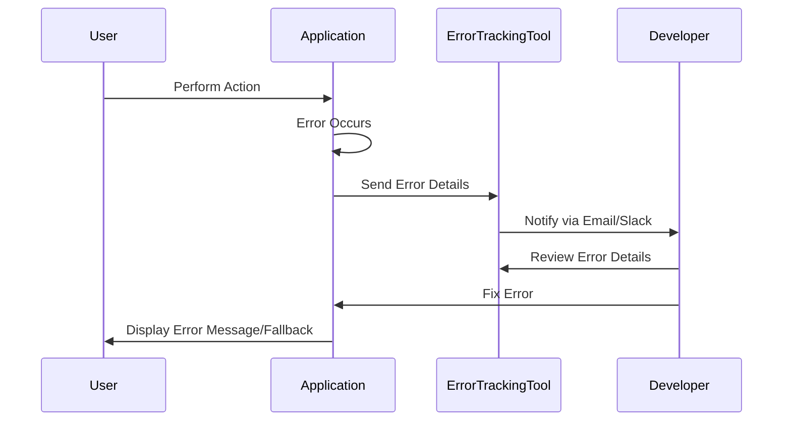

## 17.6 Error Tracking and Exception Handling

In the realm of software development, particularly when working with Ruby applications, error tracking and exception handling are crucial components for maintaining robust and reliable systems. This section delves into the strategies and tools available for effectively managing exceptions in Ruby applications, ensuring that errors are not only captured but also addressed promptly and efficiently.

### Understanding the Limitations of Logs for Error Tracking

While logging is a fundamental aspect of application monitoring, relying solely on logs for error tracking can be limiting. Logs provide a historical record of events and errors, but they often lack the context needed to diagnose issues effectively. Here are some limitations of using logs alone:

- **Volume and Noise**: Logs can quickly become overwhelming, especially in large applications. Important error messages can be buried under a deluge of less critical log entries.
- **Lack of Context**: Logs may not capture all the necessary context, such as user actions or environmental conditions, that led to an error.
- **Delayed Detection**: Logs require manual inspection or additional tooling to detect errors, which can delay response times.
- **No Aggregation**: Logs do not inherently aggregate similar errors, making it difficult to identify patterns or recurring issues.

To overcome these limitations, integrating dedicated error tracking tools can provide significant advantages.

### Introducing Error Tracking Tools

Several error tracking tools are designed to enhance the error management process by providing real-time notifications, detailed context, and aggregation capabilities. Let's explore three popular tools: Sentry, Rollbar, and Honeybadger.

#### Sentry

[Sentry](https://sentry.io/welcome/) is an open-source error tracking tool that provides real-time error monitoring and aggregation. It captures exceptions, stack traces, and contextual data, allowing developers to diagnose and fix issues quickly.

#### Rollbar

[Rollbar](https://rollbar.com/) offers real-time error tracking and monitoring for web applications. It provides detailed insights into errors, including stack traces and contextual information, and supports integration with various development tools.

#### Honeybadger

[Honeybadger](https://www.honeybadger.io/) is another powerful error monitoring tool that focuses on providing clear and actionable error reports. It captures exceptions, notifies developers in real-time, and offers integrations with popular development tools.

### Integrating Error Tracking Tools into Ruby Applications

Integrating these tools into Ruby applications is straightforward and can significantly enhance error management capabilities. Below, we provide examples of how to integrate Sentry, Rollbar, and Honeybadger into a Ruby on Rails application.

#### Integrating Sentry

To integrate Sentry into a Ruby on Rails application, follow these steps:

1. **Add the Sentry Gem**: Add the `sentry-ruby` gem to your Gemfile:

   ```ruby
   gem 'sentry-ruby'
   gem 'sentry-rails'
   ```

2. **Bundle Install**: Run `bundle install` to install the gem.

3. **Configure Sentry**: Create a new initializer file `config/initializers/sentry.rb` and configure Sentry with your DSN (Data Source Name):

   ```ruby
   Sentry.init do |config|
     config.dsn = 'your_sentry_dsn_here'
     config.breadcrumbs_logger = [:active_support_logger, :http_logger]
     config.traces_sample_rate = 0.5 # Adjust the sample rate as needed
   end
   ```

4. **Verify Integration**: Trigger an error in your application to verify that Sentry captures it.

#### Integrating Rollbar

To integrate Rollbar into a Ruby on Rails application, follow these steps:

1. **Add the Rollbar Gem**: Add the `rollbar` gem to your Gemfile:

   ```ruby
   gem 'rollbar'
   ```

2. **Bundle Install**: Run `bundle install` to install the gem.

3. **Configure Rollbar**: Generate a Rollbar configuration file:

   ```bash
   rails generate rollbar
   ```

   Edit the generated `config/initializers/rollbar.rb` file to include your Rollbar access token:

   ```ruby
   Rollbar.configure do |config|
     config.access_token = 'your_rollbar_access_token_here'
     config.environment = Rails.env
     config.framework = "Rails: #{Rails::VERSION::STRING}"
   end
   ```

4. **Verify Integration**: Test the integration by triggering an error in your application.

#### Integrating Honeybadger

To integrate Honeybadger into a Ruby on Rails application, follow these steps:

1. **Add the Honeybadger Gem**: Add the `honeybadger` gem to your Gemfile:

   ```ruby
   gem 'honeybadger'
   ```

2. **Bundle Install**: Run `bundle install` to install the gem.

3. **Configure Honeybadger**: Generate a Honeybadger configuration file:

   ```bash
   rails generate honeybadger
   ```

   Edit the generated `config/honeybadger.yml` file to include your Honeybadger API key:

   ```yaml
   api_key: 'your_honeybadger_api_key_here'
   ```

4. **Verify Integration**: Trigger an error in your application to ensure Honeybadger captures it.

### How Error Tracking Tools Capture Exceptions

Error tracking tools like Sentry, Rollbar, and Honeybadger capture exceptions by hooking into the application's error handling mechanisms. They automatically collect stack traces, request data, and other contextual information when an error occurs. This data is then sent to the respective service, where it is aggregated and presented in a user-friendly interface.

#### Key Features of Error Tracking Tools

- **Real-Time Notifications**: Receive immediate alerts when errors occur, allowing for quick response and resolution.
- **Error Aggregation**: Group similar errors together to identify patterns and prioritize fixes.
- **Contextual Data**: Capture detailed information about the environment, user actions, and request parameters at the time of the error.
- **Integrations**: Seamlessly integrate with development tools like Slack, GitHub, and JIRA for streamlined workflows.

### Benefits of Real-Time Error Notifications and Aggregation

Real-time error notifications and aggregation offer several benefits:

- **Faster Response Times**: Immediate alerts enable developers to address issues before they impact users significantly.
- **Improved Debugging**: Aggregated errors and contextual data provide insights into the root cause of issues, facilitating quicker debugging.
- **Enhanced User Experience**: By resolving errors promptly, applications maintain a higher level of reliability and user satisfaction.

### Best Practices for Handling Exceptions Gracefully

Handling exceptions gracefully is essential for maintaining application stability and providing a positive user experience. Here are some best practices:

- **Use Custom Exceptions**: Define custom exception classes to represent specific error conditions in your application.
- **Log Exceptions**: Ensure that all exceptions are logged with sufficient detail to aid in debugging.
- **Notify Developers**: Use error tracking tools to notify developers of critical errors in real-time.
- **Provide User Feedback**: Display user-friendly error messages and fallback options when errors occur.
- **Implement Retry Logic**: For transient errors, implement retry mechanisms to recover gracefully.
- **Test Exception Handling**: Regularly test your application's exception handling logic to ensure it behaves as expected.

### Visualizing Error Tracking and Exception Handling

To better understand the flow of error tracking and exception handling, let's visualize the process using a sequence diagram.



**Diagram Description**: This sequence diagram illustrates the flow of error tracking and exception handling. When a user performs an action that triggers an error, the application sends error details to the error tracking tool. The tool notifies the developer, who reviews the error and implements a fix. Meanwhile, the application provides feedback to the user.

### Knowledge Check

Before we conclude, let's reinforce our understanding with a few questions:

- What are the limitations of relying solely on logs for error tracking?
- How do error tracking tools like Sentry, Rollbar, and Honeybadger enhance error management?
- What are the benefits of real-time error notifications?
- Why is it important to handle exceptions gracefully in a Ruby application?

### Embrace the Journey

Remember, mastering error tracking and exception handling is a journey. As you integrate these tools and practices into your Ruby applications, you'll enhance your ability to build scalable and maintainable systems. Keep experimenting, stay curious, and enjoy the process!

## Quiz: Error Tracking and Exception Handling



### What is a limitation of relying solely on logs for error tracking?

- [x] Logs can become overwhelming and lack context.
- [ ] Logs provide real-time notifications.
- [ ] Logs automatically aggregate similar errors.
- [ ] Logs capture all necessary user actions.

> **Explanation:** Logs can become overwhelming due to volume and often lack the context needed for effective error diagnosis.

### Which tool is NOT mentioned as an error tracking solution in this guide?

- [ ] Sentry
- [ ] Rollbar
- [ ] Honeybadger
- [x] NewRelic

> **Explanation:** NewRelic is not mentioned in this guide as an error tracking solution.

### How do error tracking tools capture exceptions?

- [x] By hooking into the application's error handling mechanisms.
- [ ] By manually inspecting logs.
- [ ] By polling the application at regular intervals.
- [ ] By analyzing user feedback.

> **Explanation:** Error tracking tools hook into the application's error handling mechanisms to automatically capture exceptions.

### What is a benefit of real-time error notifications?

- [x] Faster response times to address issues.
- [ ] Increased application complexity.
- [ ] Delayed error detection.
- [ ] Reduced debugging capabilities.

> **Explanation:** Real-time notifications enable faster response times, allowing developers to address issues promptly.

### Which of the following is a best practice for handling exceptions gracefully?

- [x] Use custom exceptions.
- [x] Log exceptions with detail.
- [ ] Ignore minor errors.
- [ ] Display technical error messages to users.

> **Explanation:** Using custom exceptions and logging exceptions with detail are best practices for handling exceptions gracefully.

### What does error aggregation help with?

- [x] Identifying patterns and prioritizing fixes.
- [ ] Increasing the number of errors.
- [ ] Delaying error notifications.
- [ ] Reducing application performance.

> **Explanation:** Error aggregation helps identify patterns and prioritize fixes by grouping similar errors together.

### Which of the following is a feature of error tracking tools?

- [x] Contextual data capture.
- [ ] Manual error reporting.
- [ ] Lack of integration options.
- [ ] Delayed error notifications.

> **Explanation:** Error tracking tools capture contextual data to provide insights into the root cause of issues.

### What should be included in user feedback when an error occurs?

- [x] User-friendly error messages.
- [ ] Technical stack traces.
- [ ] Developer contact information.
- [ ] Error codes only.

> **Explanation:** User-friendly error messages should be included in user feedback to maintain a positive user experience.

### Why is it important to test exception handling regularly?

- [x] To ensure it behaves as expected.
- [ ] To increase application complexity.
- [ ] To reduce the number of exceptions.
- [ ] To avoid using error tracking tools.

> **Explanation:** Regular testing of exception handling ensures that it behaves as expected and maintains application stability.

### True or False: Error tracking tools can integrate with development tools like Slack and GitHub.

- [x] True
- [ ] False

> **Explanation:** Error tracking tools can integrate with development tools like Slack and GitHub for streamlined workflows.


