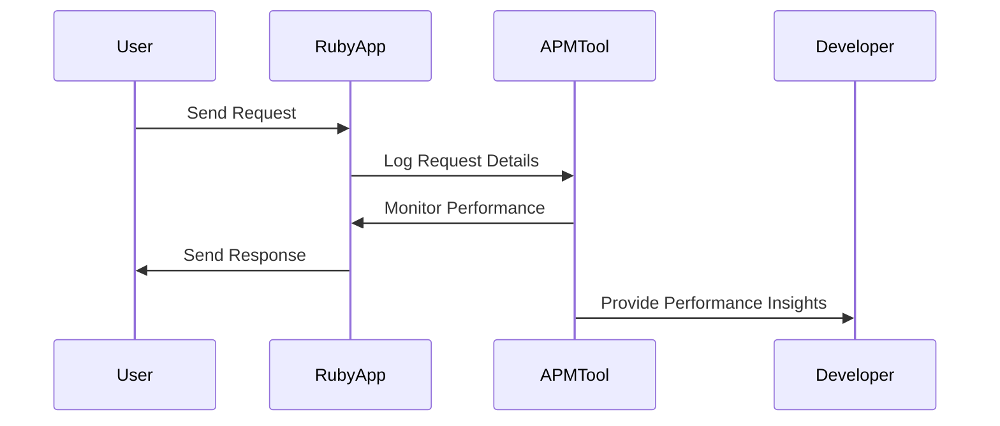

## 17.7 Performance Monitoring Tools

In the realm of Ruby development, ensuring that your applications perform optimally is crucial for user satisfaction and operational efficiency. Performance monitoring tools play a vital role in identifying bottlenecks, monitoring resource usage, and maintaining the health of your applications. This section delves into various Application Performance Monitoring (APM) tools, their integration into Ruby applications, and how to interpret the data they provide.

### Understanding Application Performance Monitoring (APM)

Application Performance Monitoring (APM) tools are designed to help developers and operations teams monitor the performance of their applications in real-time. These tools provide insights into various aspects of application performance, including:

- **Response Times**: Measure how long it takes for your application to respond to user requests.
- **Throughput**: Track the number of requests your application handles over a given period.
- **Database Queries**: Monitor the performance of database interactions, identifying slow queries.
- **External Calls**: Analyze the performance of calls to external services or APIs.

By leveraging APM tools, developers can gain a comprehensive view of their application's performance, allowing them to proactively address issues before they impact users.

### Popular APM Tools for Ruby Applications
#### Middleware APM Tool
[Middleware APM](https://middleware.io/product/apm/) provides an advanced APM (Application Performance Monitoring) tool tailored to help developers and businesses monitor, optimize, and enhance application performance across diverse tech stacks. Its features are designed to address the needs of modern, distributed systems with a focus on simplicity, scalability, and actionable insights.
- **Real-Time Monitoring**: Track application performance metrics, including response times and error rates, in real time.
- **Distributed Tracing**: Visualize and trace requests across microservices to identify bottlenecks.
- **Error Reporting**: Detect and log errors with detailed stack traces for quicker resolution.
- **Resource Utilization Metrics**: Monitor CPU, memory, and network usage to optimize infrastructure.
- **Custom Dashboards**: Create dashboards for tailored insights and key performance indicators.

Steps to Integrate Middleware.io APM Tool
1. **Sign Up for Middleware.io**

2. **Install the Middleware.io Agent**

Add the Middleware.io APM agent to your application. For instance, in a Ruby application:

```ruby
   gem 'middleware_apm'
   ```

3.  **Configure the Agent**

4.  **Deploy Your Application**

5.  **Analyze Performance Data**

#### New Relic

[New Relic](https://newrelic.com/) is a widely-used APM tool that provides detailed insights into application performance. It offers features such as:

- **Real-Time Monitoring**: Track application performance metrics in real-time.
- **Error Tracking**: Identify and diagnose errors within your application.
- **Transaction Tracing**: Analyze individual transactions to pinpoint performance bottlenecks.

To integrate New Relic into a Ruby application, follow these steps:

1. **Sign Up for New Relic**: Create an account on the New Relic website.
2. **Install the New Relic Agent**: Add the New Relic gem to your application's Gemfile:

   ```ruby
   gem 'newrelic_rpm'
   ```

3. **Configure the Agent**: Add a `newrelic.yml` configuration file to your application, specifying your New Relic license key and other settings.
4. **Deploy Your Application**: Deploy your application with the New Relic agent installed to start collecting performance data.

#### Datadog APM

[Datadog APM](https://www.datadoghq.com/product/apm/) is another powerful tool for monitoring Ruby applications. It provides:

- **Distributed Tracing**: Track requests as they flow through distributed systems.
- **Service Monitoring**: Monitor the performance of individual services within your application.
- **Custom Dashboards**: Create custom dashboards to visualize performance metrics.

To integrate Datadog APM into a Ruby application:

1. **Sign Up for Datadog**: Register for an account on the Datadog website.
2. **Install the Datadog Agent**: Add the Datadog gem to your Gemfile:

   ```ruby
   gem 'ddtrace'
   ```

3. **Configure the Agent**: Set up the Datadog agent by configuring environment variables or using a configuration file.
4. **Deploy Your Application**: Deploy your application with the Datadog agent to begin monitoring.

#### Scout APM

[Scout APM](https://scoutapm.com/) is known for its simplicity and ease of use. It offers:

- **Detailed Performance Metrics**: Gain insights into response times, throughput, and more.
- **Error Monitoring**: Track and resolve errors in your application.
- **N+1 Query Detection**: Identify inefficient database queries.

To integrate Scout APM into a Ruby application:

1. **Sign Up for Scout APM**: Create an account on the Scout APM website.
2. **Install the Scout Agent**: Add the Scout gem to your Gemfile:

   ```ruby
   gem 'scout_apm'
   ```

3. **Configure the Agent**: Add a `scout_apm.yml` configuration file to your application, specifying your Scout key and other settings.
4. **Deploy Your Application**: Deploy your application with the Scout agent to start collecting data.

### Interpreting Performance Data

Once you've integrated an APM tool into your Ruby application, the next step is to interpret the performance data it provides. Here are some key metrics to focus on:

- **Response Time**: Look for spikes or trends in response times that may indicate performance issues.
- **Throughput**: Monitor the number of requests your application handles to ensure it can scale with demand.
- **Error Rates**: Keep an eye on error rates to identify and resolve issues quickly.
- **Database Performance**: Analyze slow queries and optimize them to improve overall application performance.

### Importance of Monitoring in Production Environments

Monitoring application performance in production environments is crucial for maintaining a high-quality user experience. By continuously monitoring performance metrics, you can:

- **Identify Bottlenecks**: Detect and resolve performance bottlenecks before they impact users.
- **Optimize Resource Usage**: Ensure your application uses resources efficiently, reducing costs.
- **Improve User Satisfaction**: Provide a smooth and responsive user experience by addressing performance issues promptly.

### Open-Source Alternatives and Built-In Tools

In addition to commercial APM tools, there are open-source alternatives and built-in tools that can help monitor Ruby application performance:

#### Skylight

[Skylight](https://www.skylight.io/) is an open-source APM tool that provides insights into application performance. It offers features such as:

- **Request Tracing**: Track the performance of individual requests.
- **Error Monitoring**: Identify and resolve errors within your application.
- **Custom Metrics**: Define custom metrics to monitor specific aspects of your application.

#### Rack::Profiler

[Rack::Profiler](https://github.com/MiniProfiler/rack-mini-profiler) is a lightweight profiling tool for Ruby applications. It provides:

- **Request Profiling**: Analyze the performance of individual requests.
- **Database Query Analysis**: Monitor the performance of database queries.
- **Customizable UI**: Customize the profiler's user interface to suit your needs.

### Try It Yourself

To get hands-on experience with performance monitoring tools, try integrating one of the APM tools mentioned above into a sample Ruby application. Experiment with different configurations and explore the performance data they provide. Consider modifying the application to introduce performance bottlenecks and observe how the APM tool helps identify and resolve them.

### Visualizing Performance Monitoring

To better understand how APM tools work, let's visualize the process of monitoring a Ruby application's performance using a sequence diagram:



This diagram illustrates the flow of a user request through a Ruby application, with the APM tool monitoring performance and providing insights to the developer.

### References and Further Reading

- [New Relic Documentation](https://docs.newrelic.com/)
- [Datadog APM Documentation](https://docs.datadoghq.com/tracing/)
- [Scout APM Documentation](https://docs.scoutapm.com/)
- [Skylight Documentation](https://www.skylight.io/docs)
- [Rack::Profiler GitHub Repository](https://github.com/MiniProfiler/rack-mini-profiler)

### Knowledge Check

- What are the key metrics monitored by APM tools?
- How can you integrate New Relic into a Ruby application?
- Why is it important to monitor application performance in production environments?
- What are some open-source alternatives to commercial APM tools?

### Embrace the Journey

Remember, performance monitoring is an ongoing process. As you continue to develop and deploy Ruby applications, keep experimenting with different tools and techniques to ensure optimal performance. Stay curious, and enjoy the journey of building scalable and maintainable applications!

## Quiz: Performance Monitoring Tools



### Which of the following is a popular APM tool for Ruby applications?

- [x] New Relic
- [ ] GitHub
- [ ] Jenkins
- [ ] Docker

> **Explanation:** New Relic is a widely-used APM tool for monitoring Ruby applications.

### What does APM stand for?

- [x] Application Performance Monitoring
- [ ] Automated Performance Management
- [ ] Application Process Management
- [ ] Automated Process Monitoring

> **Explanation:** APM stands for Application Performance Monitoring, which involves tracking the performance of applications.

### Which metric is NOT typically monitored by APM tools?

- [ ] Response Time
- [ ] Throughput
- [x] Code Style
- [ ] Error Rates

> **Explanation:** Code style is not a performance metric monitored by APM tools.

### What is the primary purpose of integrating an APM tool into a Ruby application?

- [x] To monitor and improve application performance
- [ ] To manage application deployments
- [ ] To automate code testing
- [ ] To enhance code readability

> **Explanation:** APM tools are integrated to monitor and improve application performance.

### Which of the following is an open-source APM tool for Ruby applications?

- [x] Skylight
- [ ] New Relic
- [ ] Datadog
- [ ] Scout APM

> **Explanation:** Skylight is an open-source APM tool for Ruby applications.

### What is the benefit of monitoring application performance in production environments?

- [x] To identify and resolve performance bottlenecks
- [ ] To automate code deployments
- [ ] To enhance code readability
- [ ] To manage application dependencies

> **Explanation:** Monitoring in production helps identify and resolve performance bottlenecks.

### Which tool provides distributed tracing for Ruby applications?

- [x] Datadog APM
- [ ] GitHub
- [ ] Jenkins
- [ ] Docker

> **Explanation:** Datadog APM provides distributed tracing for Ruby applications.

### What does the Rack::Profiler tool help analyze?

- [x] Request performance
- [ ] Code style
- [ ] Deployment processes
- [ ] Code readability

> **Explanation:** Rack::Profiler helps analyze the performance of individual requests.

### Which APM tool is known for its simplicity and ease of use?

- [x] Scout APM
- [ ] New Relic
- [ ] Datadog
- [ ] Jenkins

> **Explanation:** Scout APM is known for its simplicity and ease of use.

### True or False: APM tools can help optimize resource usage in Ruby applications.

- [x] True
- [ ] False

> **Explanation:** APM tools can help optimize resource usage by providing insights into application performance.




