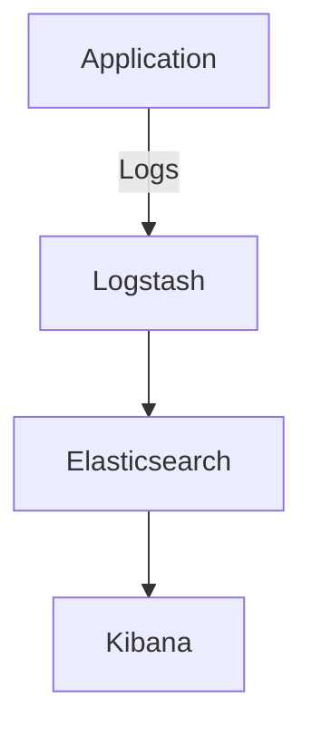
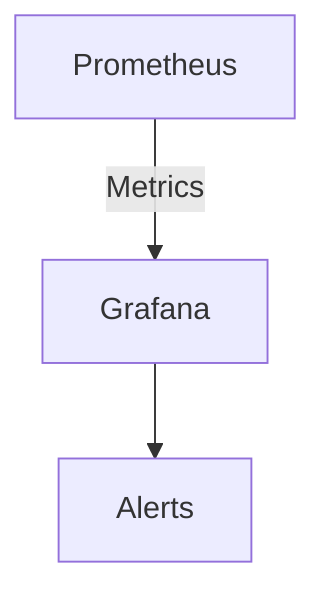

## 17.8 Continuous Observability Strategies

In today's fast-paced development environment, maintaining a robust and scalable Ruby application requires more than just writing efficient code. It demands a comprehensive understanding of how your application behaves in production. This is where continuous observability comes into play. By integrating logging, metrics, and tracing, we can gain a holistic view of our application's health and performance, enabling us to detect and resolve issues proactively.

### Understanding Observability

Observability is the ability to infer the internal state of a system based on the data it produces. It is built on three foundational pillars:

1. **Logging**: Captures discrete events and errors within the application, providing a narrative of what happened.
2. **Metrics**: Quantitative measures that reflect the performance and health of the system, such as response times, error rates, and resource utilization.
3. **Tracing**: Follows the flow of requests through the system, providing insights into the interactions between different components.

By combining these elements, we can achieve a comprehensive view of our application's behavior, allowing us to monitor its health continuously and respond to anomalies swiftly.

### The Importance of Continuous Observability

Continuous observability is crucial for several reasons:

- **Proactive Monitoring**: By continuously observing system behavior, we can identify potential issues before they impact users.
- **Faster Incident Resolution**: With detailed logs, metrics, and traces, we can quickly pinpoint the root cause of issues, reducing downtime.
- **Improved System Understanding**: Observability provides insights into how different components interact, helping us optimize performance and scalability.
- **Enhanced User Experience**: By maintaining a healthy application, we ensure a seamless experience for users, boosting satisfaction and retention.

### Implementing Continuous Observability

To implement continuous observability in Ruby applications, we need to focus on several key strategies:

#### 1. Instrumentation

Instrumentation involves adding code to your application to collect observability data. This can include:

- **Logging**: Use Ruby's built-in `Logger` class or third-party libraries like `Lograge` to capture detailed logs. Ensure logs are structured and include contextual information to facilitate analysis.

```ruby
require 'logger'

logger = Logger.new(STDOUT)
logger.info("Application started")
logger.error("An error occurred")
```

- **Metrics**: Use libraries like `Prometheus` or `StatsD` to collect metrics. Instrument critical parts of your application to track performance indicators.

```ruby
require 'prometheus/client'

prometheus = Prometheus::Client.registry
counter = Prometheus::Client::Counter.new(:http_requests_total, docstring: 'A counter of HTTP requests made')
prometheus.register(counter)

counter.increment(labels: { method: 'get', path: '/home' })
```

- **Tracing**: Implement distributed tracing using tools like `OpenTelemetry`. This involves propagating trace context across service boundaries to track requests end-to-end.

```ruby
require 'opentelemetry/sdk'

OpenTelemetry::SDK.configure do |c|
  c.use 'OpenTelemetry::Instrumentation::Rack'
  c.use 'OpenTelemetry::Instrumentation::ActiveRecord'
end
```

#### 2. Centralized Logging

Centralized logging involves aggregating logs from different parts of your application into a single location for analysis. This can be achieved using tools like the ELK Stack (Elasticsearch, Logstash, Kibana).

- **Elasticsearch**: Stores and indexes logs for fast retrieval.
- **Logstash**: Collects and processes logs from various sources.
- **Kibana**: Provides a web interface for querying and visualizing logs.



#### 3. Proactive Monitoring

Proactive monitoring involves setting up alerts and dashboards to track key metrics and detect anomalies. Tools like `Prometheus` and `Grafana` can be used to create real-time dashboards and alerting systems.

- **Prometheus**: Scrapes metrics from your application and stores them in a time-series database.
- **Grafana**: Visualizes metrics and sets up alerts based on predefined thresholds.



#### 4. Automatic Anomaly Detection

Automatic anomaly detection uses machine learning algorithms to identify unusual patterns in your observability data. This can help detect issues that traditional threshold-based alerts might miss.

- **Machine Learning Models**: Train models on historical data to recognize normal behavior and flag deviations.
- **Integration with Observability Tools**: Use tools like `Datadog` or `New Relic` that offer built-in anomaly detection capabilities.

#### 5. Cultural Aspects and DevOps Practices

Continuous observability is not just about tools and technology; it also involves cultural changes within your organization. Embrace DevOps practices to foster collaboration between development and operations teams.

- **Shared Responsibility**: Encourage developers and operations teams to work together on observability initiatives.
- **Continuous Feedback**: Use observability data to provide feedback to development teams, helping them improve code quality and performance.
- **Blameless Postmortems**: Conduct post-incident reviews to learn from failures and improve observability practices.

### Setting Up an Observability Stack

Let's explore how to set up a basic observability stack using some popular tools:

#### ELK Stack

1. **Install Elasticsearch**: Set up an Elasticsearch cluster to store and index logs.
2. **Configure Logstash**: Use Logstash to collect logs from your Ruby application and send them to Elasticsearch.
3. **Visualize with Kibana**: Set up Kibana to create dashboards and visualize log data.

#### Prometheus and Grafana

1. **Install Prometheus**: Set up Prometheus to scrape metrics from your application.
2. **Configure Grafana**: Connect Grafana to Prometheus and create dashboards to visualize metrics.
3. **Set Up Alerts**: Define alerting rules in Grafana to notify you of anomalies.

#### OpenTelemetry

1. **Install OpenTelemetry SDK**: Add the OpenTelemetry SDK to your Ruby application.
2. **Instrument Your Application**: Use OpenTelemetry to instrument your application and collect trace data.
3. **Export Traces**: Send trace data to a backend like Jaeger or Zipkin for analysis.

### Proactive Monitoring and Anomaly Detection

Proactive monitoring involves setting up alerts and dashboards to track key metrics and detect anomalies. Tools like `Prometheus` and `Grafana` can be used to create real-time dashboards and alerting systems.

- **Prometheus**: Scrapes metrics from your application and stores them in a time-series database.
- **Grafana**: Visualizes metrics and sets up alerts based on predefined thresholds.


### Cultural Aspects and DevOps Practices

Continuous observability is not just about tools and technology; it also involves cultural changes within your organization. Embrace DevOps practices to foster collaboration between development and operations teams.

- **Shared Responsibility**: Encourage developers and operations teams to work together on observability initiatives.
- **Continuous Feedback**: Use observability data to provide feedback to development teams, helping them improve code quality and performance.
- **Blameless Postmortems**: Conduct post-incident reviews to learn from failures and improve observability practices.

### Try It Yourself

To get hands-on experience with continuous observability, try setting up a simple Ruby application and integrate it with the ELK Stack, Prometheus, and OpenTelemetry. Experiment with different logging formats, metrics, and tracing configurations to see how they impact your ability to monitor and troubleshoot the application.

### Knowledge Check

- What are the three pillars of observability?
- How can centralized logging improve your ability to troubleshoot issues?
- What role does instrumentation play in observability?
- Why is proactive monitoring important for maintaining application health?
- How can DevOps practices support continuous observability?

### Conclusion

Continuous observability is a critical component of modern software development, enabling us to maintain insight into our application's behavior and respond to issues proactively. By integrating logging, metrics, and tracing, we can achieve a comprehensive view of our system's health, ensuring a seamless experience for users and a robust, scalable application.

Remember, this is just the beginning. As you progress, you'll build more complex and interactive observability setups. Keep experimenting, stay curious, and enjoy the journey!

## Quiz: Continuous Observability Strategies



### What are the three pillars of observability?

- [x] Logging, Metrics, Tracing
- [ ] Logging, Monitoring, Debugging
- [ ] Metrics, Debugging, Tracing
- [ ] Monitoring, Debugging, Logging

> **Explanation:** The three pillars of observability are Logging, Metrics, and Tracing, which together provide a comprehensive view of system behavior.

### Why is centralized logging important?

- [x] It aggregates logs for easier analysis
- [ ] It increases application performance
- [ ] It reduces the need for metrics
- [ ] It eliminates the need for tracing

> **Explanation:** Centralized logging aggregates logs from different parts of the application, making it easier to analyze and troubleshoot issues.

### What is the role of instrumentation in observability?

- [x] To collect observability data
- [ ] To enhance application security
- [ ] To improve user interface
- [ ] To reduce code complexity

> **Explanation:** Instrumentation involves adding code to collect observability data, such as logs, metrics, and traces, which are essential for monitoring application health.

### How does proactive monitoring benefit an application?

- [x] By identifying issues before they impact users
- [ ] By reducing the need for logging
- [ ] By eliminating the need for tracing
- [ ] By improving code readability

> **Explanation:** Proactive monitoring helps identify potential issues before they affect users, allowing for faster incident resolution and improved application reliability.

### How can DevOps practices support continuous observability?

- [x] By fostering collaboration between development and operations teams
- [ ] By reducing the need for metrics
- [ ] By eliminating the need for tracing
- [ ] By improving user interface design

> **Explanation:** DevOps practices encourage collaboration between development and operations teams, which is crucial for implementing and maintaining effective observability strategies.

### What tool is commonly used for visualizing metrics?

- [x] Grafana
- [ ] Elasticsearch
- [ ] Logstash
- [ ] Kibana

> **Explanation:** Grafana is a popular tool for visualizing metrics and setting up alerts based on predefined thresholds.

### What is the purpose of using OpenTelemetry in a Ruby application?

- [x] To implement distributed tracing
- [ ] To enhance application security
- [ ] To improve user interface
- [ ] To reduce code complexity

> **Explanation:** OpenTelemetry is used to implement distributed tracing, which helps track requests across service boundaries and provides insights into application performance.

### What is a benefit of automatic anomaly detection?

- [x] It identifies unusual patterns that traditional alerts might miss
- [ ] It eliminates the need for logging
- [ ] It reduces application performance
- [ ] It improves user interface design

> **Explanation:** Automatic anomaly detection uses machine learning to identify unusual patterns in observability data, helping detect issues that traditional alerts might miss.

### What is the ELK Stack used for?

- [x] Centralized logging
- [ ] Distributed tracing
- [ ] Metrics visualization
- [ ] Application security

> **Explanation:** The ELK Stack (Elasticsearch, Logstash, Kibana) is used for centralized logging, aggregating logs from different parts of the application for analysis.

### True or False: Observability is only about collecting logs.

- [ ] True
- [x] False

> **Explanation:** Observability is not just about collecting logs; it also involves collecting metrics and traces to provide a comprehensive view of system behavior.


