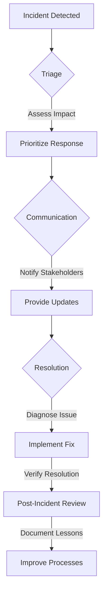

## 17.9 Alerting and Incident Response

In the realm of software development, particularly in Ruby applications, maintaining application reliability is paramount. Timely alerts and a robust incident response plan are critical components in achieving this goal. This section will guide you through the process of setting up effective alerting systems, configuring alerts to minimize noise, and developing comprehensive incident response plans.

### Importance of Timely Alerts

Timely alerts are essential for maintaining the reliability and performance of your Ruby applications. They serve as the first line of defense against potential issues, enabling you to address problems before they escalate into significant outages or performance degradations. By receiving alerts promptly, you can ensure that your application remains available and responsive to users.

#### Key Benefits of Timely Alerts

- **Proactive Issue Resolution**: Alerts allow you to identify and resolve issues before they impact users.
- **Reduced Downtime**: Quick response to alerts minimizes application downtime.
- **Improved User Experience**: Maintaining application performance ensures a positive user experience.
- **Enhanced Reliability**: Consistent monitoring and alerting contribute to overall application reliability.

### Best Practices for Configuring Alerts

Configuring alerts effectively is crucial to avoid alert fatigue and ensure that alerts are relevant and actionable. Here are some best practices to consider:

1. **Define Clear Alerting Criteria**: Establish specific criteria for triggering alerts based on key performance indicators (KPIs) and service level objectives (SLOs).

2. **Set Appropriate Thresholds**: Determine thresholds for alerts that reflect the acceptable performance levels for your application. Avoid setting thresholds too low, which can lead to unnecessary alerts, or too high, which may delay response to critical issues.

3. **Prioritize Alerts**: Categorize alerts based on their severity and impact on the application. This helps in prioritizing response efforts.

4. **Use Contextual Information**: Include relevant context in alerts, such as affected services, potential causes, and suggested actions, to facilitate quicker resolution.

5. **Regularly Review and Adjust Alerts**: Continuously evaluate the effectiveness of your alerting system and make adjustments as needed to improve accuracy and reduce noise.

### Tools for Alerting

Several tools can assist in setting up and managing alerts for Ruby applications. Two popular options are [PagerDuty](https://www.pagerduty.com/) and [Opsgenie](https://www.atlassian.com/software/opsgenie).

#### PagerDuty

PagerDuty is a powerful incident management platform that integrates with various monitoring tools to provide real-time alerts and incident response capabilities. It offers features such as on-call scheduling, escalation policies, and automated incident response workflows.

#### Opsgenie

Opsgenie, part of the Atlassian suite, is another robust alerting and incident management tool. It provides flexible alerting rules, on-call management, and integration with numerous monitoring and collaboration tools.

### Setting Up Alert Thresholds

Setting up alert thresholds involves defining the conditions under which alerts are triggered. This can be based on metrics such as CPU usage, memory consumption, response times, and error rates. Here's a step-by-step guide to setting up alert thresholds:

1. **Identify Key Metrics**: Determine the critical metrics that reflect the health and performance of your application.

2. **Establish Baselines**: Analyze historical data to establish baseline performance levels for these metrics.

3. **Define Thresholds**: Set thresholds that indicate when a metric deviates significantly from its baseline, warranting an alert.

4. **Implement Alerting Rules**: Configure your monitoring tools to trigger alerts when thresholds are breached.

5. **Test and Refine**: Test your alerting setup to ensure it accurately reflects the application's performance and refine thresholds as necessary.

### Incident Response Processes

An effective incident response process is essential for addressing issues promptly and minimizing their impact. The process typically involves the following stages:

#### Triage

During the triage stage, the incident is assessed to determine its severity and impact. This involves:

- **Identifying the Incident**: Recognize the occurrence of an incident through alerts or user reports.
- **Assessing Impact**: Evaluate the extent of the incident's impact on the application and users.
- **Prioritizing Response**: Determine the urgency of the response based on the incident's severity.

#### Communication

Effective communication is crucial throughout the incident response process. This includes:

- **Notifying Stakeholders**: Inform relevant stakeholders, including developers, operations teams, and management, about the incident.
- **Providing Updates**: Regularly update stakeholders on the progress of the incident response efforts.
- **Documenting Actions**: Keep a detailed record of actions taken during the incident response for future reference.

#### Resolution

The resolution stage involves addressing the root cause of the incident and restoring normal operations. Key steps include:

- **Diagnosing the Issue**: Identify the underlying cause of the incident through investigation and analysis.
- **Implementing a Fix**: Apply a solution to resolve the issue and prevent recurrence.
- **Verifying Resolution**: Confirm that the issue has been resolved and the application is functioning as expected.

### Post-Incident Reviews and Documentation

Conducting post-incident reviews is a vital part of the incident response process. These reviews help identify areas for improvement and prevent similar incidents in the future. Key components of a post-incident review include:

- **Incident Summary**: Provide a brief overview of the incident, including its impact and resolution.
- **Root Cause Analysis**: Analyze the root cause of the incident and identify contributing factors.
- **Lessons Learned**: Document insights gained from the incident and any changes implemented to prevent recurrence.
- **Action Items**: Outline specific actions to improve incident response processes and application reliability.

### Code Example: Setting Up Alerts with PagerDuty

Below is a Ruby code example demonstrating how to set up alerts using the PagerDuty API:

```ruby
require 'net/http'
require 'json'

# Define the PagerDuty API endpoint and authentication token
pagerduty_api_url = 'https://api.pagerduty.com/incidents'
auth_token = 'YOUR_PAGERDUTY_AUTH_TOKEN'

# Function to trigger an alert
def trigger_alert(service_id, incident_title, incident_description)
  uri = URI(pagerduty_api_url)
  request = Net::HTTP::Post.new(uri)
  request['Content-Type'] = 'application/json'
  request['Authorization'] = "Token token=#{auth_token}"

  # Define the incident payload
  incident_payload = {
    incident: {
      type: 'incident',
      title: incident_title,
      service: {
        id: service_id,
        type: 'service_reference'
      },
      body: {
        type: 'incident_body',
        details: incident_description
      }
    }
  }

  # Send the request to PagerDuty
  request.body = incident_payload.to_json
  response = Net::HTTP.start(uri.hostname, uri.port, use_ssl: true) do |http|
    http.request(request)
  end

  # Output the response
  puts "Response: #{response.code} #{response.message}"
end

# Example usage
service_id = 'YOUR_SERVICE_ID'
incident_title = 'High CPU Usage Detected'
incident_description = 'The CPU usage has exceeded the defined threshold.'

trigger_alert(service_id, incident_title, incident_description)
```

### Try It Yourself

Experiment with the code example by modifying the `incident_title` and `incident_description` to simulate different alert scenarios. You can also explore integrating other monitoring tools with PagerDuty to enhance your alerting capabilities.

### Visualizing the Incident Response Process

Below is a Mermaid.js diagram illustrating the typical flow of an incident response process:



### References and Links

- [PagerDuty Documentation](https://support.pagerduty.com/docs)
- [Opsgenie Documentation](https://docs.opsgenie.com/docs)
- [Monitoring Ruby Applications](https://www.ruby-lang.org/en/documentation/)

### Knowledge Check

- What are the key benefits of timely alerts in maintaining application reliability?
- How can you avoid alert fatigue when configuring alerts?
- What are the stages of an effective incident response process?

### Embrace the Journey

Remember, mastering alerting and incident response is an ongoing journey. As you continue to refine your processes and tools, you'll enhance the reliability and performance of your Ruby applications. Keep experimenting, stay curious, and enjoy the journey!

## Quiz: Alerting and Incident Response



### What is the primary benefit of timely alerts in Ruby applications?

- [x] Proactive issue resolution
- [ ] Increased application complexity
- [ ] Reduced development time
- [ ] Enhanced user interface

> **Explanation:** Timely alerts enable proactive issue resolution, allowing you to address problems before they impact users.

### Which tool is commonly used for alerting and incident management in Ruby applications?

- [x] PagerDuty
- [ ] GitHub
- [ ] Docker
- [ ] Jenkins

> **Explanation:** PagerDuty is a popular tool for alerting and incident management, providing real-time alerts and incident response capabilities.

### What is a key practice to avoid alert fatigue?

- [x] Setting appropriate thresholds
- [ ] Ignoring low-severity alerts
- [ ] Increasing alert frequency
- [ ] Disabling alerts during off-hours

> **Explanation:** Setting appropriate thresholds helps ensure that alerts are relevant and actionable, reducing the risk of alert fatigue.

### What is the first stage of the incident response process?

- [x] Triage
- [ ] Resolution
- [ ] Communication
- [ ] Post-Incident Review

> **Explanation:** Triage is the first stage of the incident response process, where the incident is assessed to determine its severity and impact.

### What should be included in post-incident reviews?

- [x] Incident summary
- [ ] Marketing strategies
- [ ] Financial reports
- [ ] User feedback

> **Explanation:** Post-incident reviews should include an incident summary, root cause analysis, lessons learned, and action items for improvement.

### Which of the following is a benefit of conducting post-incident reviews?

- [x] Identifying areas for improvement
- [ ] Increasing alert frequency
- [ ] Reducing application features
- [ ] Enhancing user interface design

> **Explanation:** Post-incident reviews help identify areas for improvement and prevent similar incidents in the future.

### What is a common tool for managing on-call schedules and escalation policies?

- [x] Opsgenie
- [ ] GitLab
- [ ] Visual Studio Code
- [ ] Slack

> **Explanation:** Opsgenie is a tool that provides features for managing on-call schedules and escalation policies.

### What is the purpose of setting alert thresholds?

- [x] To indicate when a metric deviates significantly from its baseline
- [ ] To increase application complexity
- [ ] To reduce development time
- [ ] To enhance user interface design

> **Explanation:** Alert thresholds are set to indicate when a metric deviates significantly from its baseline, warranting an alert.

### Which stage of the incident response process involves diagnosing the issue?

- [x] Resolution
- [ ] Triage
- [ ] Communication
- [ ] Post-Incident Review

> **Explanation:** The resolution stage involves diagnosing the issue, implementing a fix, and verifying resolution.

### True or False: Effective communication is not necessary during the incident response process.

- [ ] True
- [x] False

> **Explanation:** Effective communication is crucial throughout the incident response process to inform stakeholders and coordinate response efforts.




