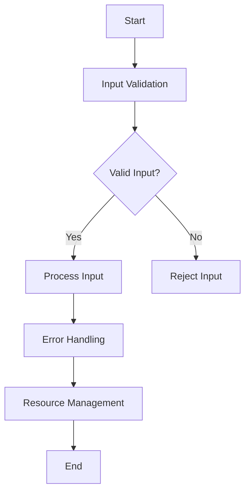

## 18.1 Secure Coding Practices in Ruby

In today's digital landscape, security is paramount. As Ruby developers, we must prioritize secure coding practices to protect our applications from vulnerabilities and ensure the integrity of our systems. This section delves into essential secure coding principles tailored for Ruby, providing you with the knowledge to build robust and secure applications.

### The Importance of Security in Software Development

Security is not just an afterthought; it is a fundamental aspect of software development. With the increasing number of cyber threats, developers must adopt a security-first mindset. This involves understanding potential vulnerabilities, implementing preventive measures, and continuously monitoring for security breaches.

### General Secure Coding Practices Adapted for Ruby

Ruby, known for its elegance and simplicity, offers unique features that can be leveraged to enhance security. However, these features can also introduce vulnerabilities if not used correctly. Let's explore some general secure coding practices adapted for Ruby:

#### 1. Input Validation

Input validation is the first line of defense against malicious attacks. Ensure that all user inputs are validated and sanitized before processing. This prevents common vulnerabilities such as SQL injection and cross-site scripting (XSS).

```ruby
# Example of input validation in Ruby
def sanitize_input(input)
  # Remove any unwanted characters
  input.gsub(/[^0-9a-z ]/i, '')
end

user_input = "<script>alert('XSS')</script>"
safe_input = sanitize_input(user_input)
puts safe_input # Output: alertXSS
```

#### 2. Error Handling

Proper error handling is crucial to prevent information leakage and maintain application stability. Use Ruby's exception handling mechanisms to catch and manage errors gracefully.

```ruby
# Example of error handling in Ruby
begin
  # Code that may raise an exception
  result = 10 / 0
rescue ZeroDivisionError => e
  puts "Error: #{e.message}"
ensure
  puts "Execution completed."
end
```

#### 3. Resource Management

Efficient resource management ensures that your application does not exhaust system resources, leading to denial-of-service (DoS) attacks. Use Ruby's built-in mechanisms to manage resources effectively.

```ruby
# Example of resource management in Ruby
File.open('example.txt', 'r') do |file|
  # Process the file
  puts file.read
end
# The file is automatically closed after the block
```

### Principle of Least Privilege

The principle of least privilege dictates that code should run with the minimum level of access necessary to perform its function. This reduces the risk of unauthorized access and limits the potential damage from security breaches.

- **Limit Access**: Restrict access to sensitive data and functions.
- **Use Environment Variables**: Store sensitive information like API keys in environment variables instead of hardcoding them in your application.
- **Role-Based Access Control (RBAC)**: Implement RBAC to ensure users have only the permissions they need.

### Using Linters and Security Scanners

Tools like linters and security scanners can help identify potential security issues in your code. For Ruby on Rails applications, [Brakeman](https://brakemanscanner.org/) is a popular static analysis tool that scans your code for security vulnerabilities.

```bash
# Install Brakeman
gem install brakeman

# Run Brakeman on your Rails application
brakeman
```

Brakeman provides detailed reports on potential security issues, allowing you to address them before they become critical.

### Regular Code Reviews

Regular code reviews are essential for maintaining code quality and security. Encourage team members to focus on security aspects during reviews, such as:

- Ensuring proper input validation and error handling
- Checking for hardcoded credentials and sensitive information
- Verifying the use of secure libraries and frameworks

### Try It Yourself

Experiment with the code examples provided in this section. Modify the input validation function to allow only specific characters, or enhance the error handling example to log errors to a file. By actively engaging with the code, you'll gain a deeper understanding of secure coding practices.

### Visualizing Secure Coding Practices

To better understand the flow of secure coding practices, let's visualize the process using a flowchart:



**Figure 1**: A flowchart illustrating the secure coding process, from input validation to resource management.

### References and Further Reading

- [OWASP Ruby on Rails Security Guide](https://owasp.org/www-project-ruby-on-rails-security-guide/)
- [Ruby Security Guide](https://www.ruby-lang.org/en/security/)
- [Brakeman Documentation](https://brakemanscanner.org/docs/)

### Knowledge Check

- What is the principle of least privilege, and how does it apply to secure coding?
- How can input validation prevent common vulnerabilities?
- Why is error handling important in secure coding?
- What role do linters and security scanners play in maintaining code security?

### Embrace the Journey

Remember, security is an ongoing journey. As you continue to develop your Ruby applications, keep security at the forefront of your mind. Stay curious, keep learning, and enjoy the process of building secure and robust applications.

## Quiz: Secure Coding Practices in Ruby



### What is the primary purpose of input validation in Ruby?

- [x] To prevent malicious attacks by ensuring only valid data is processed
- [ ] To improve application performance
- [ ] To enhance user experience
- [ ] To simplify code maintenance

> **Explanation:** Input validation ensures that only valid data is processed, preventing malicious attacks such as SQL injection and XSS.

### Which tool is commonly used for static analysis of Ruby on Rails applications?

- [x] Brakeman
- [ ] RuboCop
- [ ] ESLint
- [ ] JSHint

> **Explanation:** Brakeman is a static analysis tool specifically designed for Ruby on Rails applications to identify security vulnerabilities.

### What does the principle of least privilege entail?

- [x] Running code with the minimum level of access necessary
- [ ] Granting all users full access to the system
- [ ] Using the most privileged account for all operations
- [ ] Disabling all security features

> **Explanation:** The principle of least privilege involves running code with the minimum level of access necessary to reduce the risk of unauthorized access.

### Why is error handling important in secure coding?

- [x] To prevent information leakage and maintain application stability
- [ ] To increase application speed
- [ ] To simplify code logic
- [ ] To enhance user interface design

> **Explanation:** Proper error handling prevents information leakage and maintains application stability by managing errors gracefully.

### How can environment variables enhance security in Ruby applications?

- [x] By storing sensitive information like API keys securely
- [ ] By increasing application performance
- [ ] By simplifying code syntax
- [ ] By improving user interface design

> **Explanation:** Environment variables store sensitive information securely, preventing exposure in the source code.

### What is the role of regular code reviews in secure coding?

- [x] To maintain code quality and focus on security aspects
- [ ] To increase application speed
- [ ] To simplify code logic
- [ ] To enhance user interface design

> **Explanation:** Regular code reviews help maintain code quality and focus on security aspects, ensuring potential vulnerabilities are addressed.

### Which of the following is a common vulnerability that input validation can prevent?

- [x] SQL injection
- [ ] Memory leaks
- [ ] Performance bottlenecks
- [ ] UI glitches

> **Explanation:** Input validation can prevent SQL injection by ensuring only valid data is processed.

### What is the benefit of using linters in Ruby development?

- [x] To identify potential security issues and code inconsistencies
- [ ] To increase application speed
- [ ] To enhance user interface design
- [ ] To simplify code syntax

> **Explanation:** Linters help identify potential security issues and code inconsistencies, improving overall code quality.

### How does resource management contribute to secure coding?

- [x] By preventing denial-of-service (DoS) attacks through efficient resource use
- [ ] By increasing application speed
- [ ] By simplifying code logic
- [ ] By enhancing user interface design

> **Explanation:** Efficient resource management prevents denial-of-service (DoS) attacks by ensuring resources are used efficiently.

### True or False: Secure coding practices are only necessary during the initial development phase.

- [ ] True
- [x] False

> **Explanation:** Secure coding practices are necessary throughout the entire software development lifecycle, not just during the initial development phase.



By following these secure coding practices, you can build robust Ruby applications that stand strong against potential security threats. Keep exploring, stay vigilant, and continue to prioritize security in your development journey.
