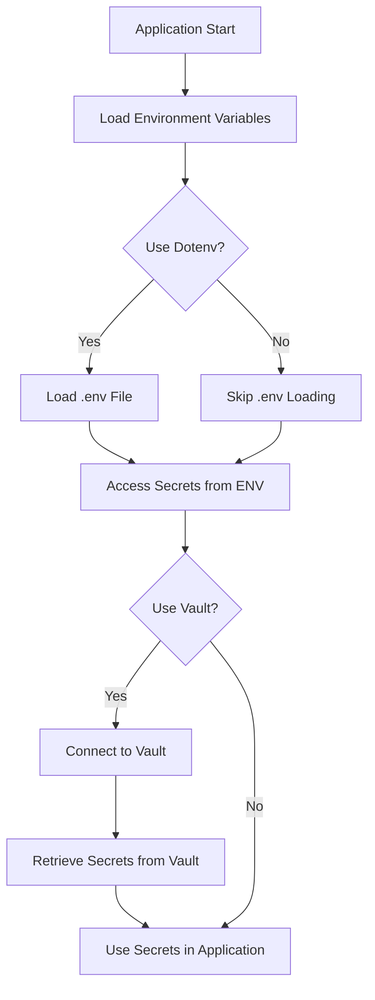

## 18.13 Handling Secrets and Configuration Management

In the world of software development, managing secrets and configuration securely is paramount. Secrets such as API keys, database passwords, and encryption keys are critical to the security and functionality of your applications. Mishandling these can lead to severe security breaches and data leaks. In this section, we will explore best practices for managing sensitive configuration data securely within Ruby applications.

### Understanding the Risks

Before diving into the solutions, it's crucial to understand the risks associated with improper handling of secrets:

- **Hardcoding Secrets**: Storing secrets directly in your codebase is a significant security risk. If your code is ever exposed, so are your secrets.
- **Version Control Exposure**: Committing secrets to version control systems like Git can lead to accidental exposure, especially in open-source projects.
- **Environment Leaks**: Improperly configured environments can leak secrets through logs or error messages.
- **Access Control**: Without proper access control, unauthorized users might gain access to sensitive information.

### Strategies for Secure Secret Management

To mitigate these risks, consider the following strategies:

#### 1. Use Environment Variables

Environment variables are a simple and effective way to manage secrets. They keep sensitive data out of your codebase and can be easily configured per environment (development, testing, production).

```ruby
# Accessing an environment variable in Ruby
api_key = ENV['API_KEY']
```

**Best Practices**:
- Ensure environment variables are set securely on your deployment platform.
- Avoid logging environment variables to prevent accidental exposure.

#### 2. Utilize Configuration Files with Caution

Configuration files can be used to manage secrets, but they should be handled with care:

- **Encrypt Configuration Files**: Use tools like [Rails Credentials](https://guides.rubyonrails.org/security.html#custom-credentials) to encrypt sensitive data.
- **Access Control**: Restrict access to configuration files to only those who need it.

#### 3. Employ Secret Management Tools

Tools like [dotenv](https://github.com/bkeepers/dotenv) can help manage environment variables more effectively by loading them from a `.env` file.

```ruby
# .env file
API_KEY=your_api_key_here

# Ruby code
require 'dotenv/load'
api_key = ENV['API_KEY']
```

**Note**: Ensure `.env` files are not committed to version control by adding them to your `.gitignore`.

### Integrating with Secret Management Services

For more robust secret management, consider integrating with dedicated secret management services like [HashiCorp Vault](https://www.vaultproject.io/).

#### HashiCorp Vault

Vault provides secure storage, dynamic secrets, and detailed access control. Here's a basic example of integrating Vault with a Ruby application:

```ruby
require 'vault'

# Configure Vault client
Vault.address = 'https://vault.example.com'
Vault.token = 'your-vault-token'

# Retrieve a secret
secret = Vault.logical.read('secret/data/myapp')
api_key = secret.data[:data]['API_KEY']
```

**Benefits**:
- **Dynamic Secrets**: Vault can generate secrets on demand, reducing the risk of exposure.
- **Access Control**: Fine-grained access control ensures only authorized users can access secrets.
- **Audit Logs**: Vault provides detailed audit logs for monitoring access to secrets.

### Secure Storage and Rotation of Secrets

#### Secure Storage

- **Encryption**: Always encrypt secrets at rest and in transit.
- **Access Control**: Implement strict access controls to limit who can view or modify secrets.

#### Secret Rotation

Regularly rotating secrets reduces the risk of long-term exposure. Automate secret rotation using tools like Vault or AWS Secrets Manager.

### Importance of Access Control and Auditing

- **Access Control**: Implement role-based access control (RBAC) to ensure only authorized users can access secrets.
- **Auditing**: Regularly audit access to secrets to detect unauthorized access or anomalies.

### Visualizing Secret Management Workflow

Below is a diagram illustrating a typical secret management workflow using environment variables and a secret management service like Vault.



### Try It Yourself

Experiment with the following code snippets to understand how to manage secrets in Ruby:

1. **Modify the `.env` file** to include a new secret and access it in your Ruby application.
2. **Integrate HashiCorp Vault** with a sample Ruby application and retrieve a secret.

### References and Further Reading

- [Rails Security Guide](https://guides.rubyonrails.org/security.html)
- [Dotenv GitHub Repository](https://github.com/bkeepers/dotenv)
- [HashiCorp Vault Documentation](https://www.vaultproject.io/docs)

### Knowledge Check

- Why is it risky to hardcode secrets in your codebase?
- What are the benefits of using a secret management service like Vault?
- How can you ensure environment variables are not exposed in logs?

### Summary

Handling secrets and configuration securely is a critical aspect of building robust Ruby applications. By following best practices such as using environment variables, employing secret management tools, and implementing strict access controls, you can significantly reduce the risk of exposing sensitive data.

Remember, this is just the beginning. As you progress, you'll discover more advanced techniques for managing secrets and configurations. Keep experimenting, stay curious, and enjoy the journey!

## Quiz: Handling Secrets and Configuration Management



### Why is it risky to hardcode secrets in your codebase?

- [x] They can be exposed if the code is shared or leaked.
- [ ] They make the code run slower.
- [ ] They improve security by being hidden in the code.
- [ ] They are automatically encrypted by Ruby.

> **Explanation:** Hardcoding secrets in your codebase can lead to exposure if the code is shared or leaked, compromising security.

### What is a benefit of using environment variables for secrets?

- [x] They keep secrets out of the codebase.
- [ ] They are visible to all users.
- [ ] They are automatically encrypted.
- [ ] They cannot be changed once set.

> **Explanation:** Environment variables keep secrets out of the codebase, reducing the risk of exposure.

### Which tool can help manage environment variables in Ruby?

- [x] Dotenv
- [ ] Rails
- [ ] RSpec
- [ ] Bundler

> **Explanation:** Dotenv is a tool that helps manage environment variables by loading them from a `.env` file.

### What is a key feature of HashiCorp Vault?

- [x] Dynamic secrets generation
- [ ] Automatic code deployment
- [ ] Database management
- [ ] Front-end development

> **Explanation:** HashiCorp Vault can generate dynamic secrets, enhancing security by reducing the risk of exposure.

### How can you prevent `.env` files from being committed to version control?

- [x] Add them to `.gitignore`
- [ ] Encrypt them
- [ ] Rename them
- [ ] Delete them after use

> **Explanation:** Adding `.env` files to `.gitignore` prevents them from being committed to version control.

### What is a benefit of secret rotation?

- [x] Reduces the risk of long-term exposure
- [ ] Increases application speed
- [ ] Decreases code complexity
- [ ] Eliminates the need for encryption

> **Explanation:** Regularly rotating secrets reduces the risk of long-term exposure, enhancing security.

### What is a key aspect of secure storage for secrets?

- [x] Encryption at rest and in transit
- [ ] Storing them in plain text
- [ ] Making them publicly accessible
- [ ] Using them in every log message

> **Explanation:** Encrypting secrets at rest and in transit ensures they are protected from unauthorized access.

### What is an advantage of using a secret management service?

- [x] Provides detailed audit logs
- [ ] Automatically writes code
- [ ] Manages user interfaces
- [ ] Increases application size

> **Explanation:** Secret management services provide detailed audit logs, helping monitor access to secrets.

### What is a common risk of improperly configured environments?

- [x] Secrets can be leaked through logs
- [ ] Code runs faster
- [ ] Secrets are automatically encrypted
- [ ] Environments become more secure

> **Explanation:** Improperly configured environments can leak secrets through logs, compromising security.

### True or False: Access control is not important for secret management.

- [ ] True
- [x] False

> **Explanation:** Access control is crucial for secret management to ensure only authorized users can access sensitive information.




