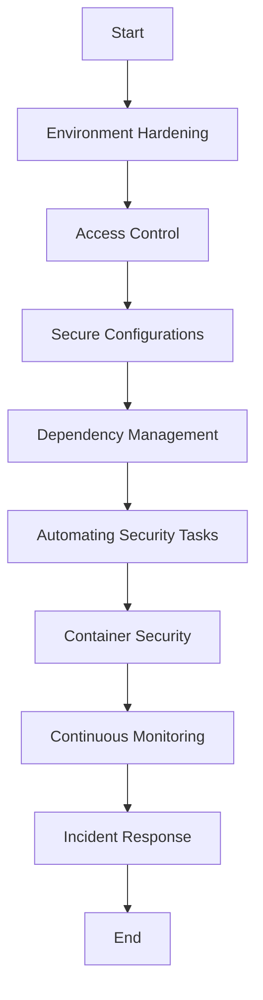

## 18.14 Secure Deployment Practices

Deploying Ruby applications securely is a critical aspect of building scalable and maintainable systems. This section provides a comprehensive guide to secure deployment practices, covering server configurations, access controls, infrastructure security, and more. By following these guidelines, you can ensure that your Ruby applications are protected against potential threats and vulnerabilities.

### Introduction to Secure Deployment

Secure deployment involves a series of practices and configurations aimed at protecting applications from unauthorized access, data breaches, and other security threats. It encompasses various aspects of the deployment process, including server hardening, access control, dependency management, and continuous monitoring.

### Environment Hardening

Environment hardening is the process of securing the server environment where your Ruby application is deployed. This involves several key steps:

1. **Operating System Updates**: Regularly update the operating system to patch known vulnerabilities. Use automated tools to ensure updates are applied promptly.

2. **Minimal Installation**: Install only the necessary software and services required for your application. This reduces the attack surface and minimizes potential vulnerabilities.

3. **Disable Unnecessary Services**: Identify and disable services that are not needed for your application. This prevents attackers from exploiting unused services.

4. **File Permissions**: Set strict file permissions to ensure that only authorized users can access sensitive files and directories.

5. **Firewall Configuration**: Use firewalls to restrict access to your server. Configure rules to allow only necessary traffic and block all other connections.

### Access Control and SSH Key Management

Access control is crucial for preventing unauthorized access to your server and application. Here are some best practices:

1. **SSH Key Management**: Use SSH keys instead of passwords for server access. Ensure that keys are stored securely and rotated regularly.

2. **User Accounts**: Create separate user accounts for different roles and responsibilities. Avoid using the root account for routine tasks.

3. **Role-Based Access Control (RBAC)**: Implement RBAC to restrict access based on user roles. This ensures that users have only the permissions necessary for their tasks.

4. **Two-Factor Authentication (2FA)**: Enable 2FA for accessing critical systems and applications. This adds an extra layer of security.

### Secure Configurations

Configuring your application and server securely is essential for protecting against attacks. Consider the following practices:

1. **Secure Configuration Management**: Use configuration management tools like Chef or Ansible to automate the deployment of secure configurations. This ensures consistency and reduces human error.

2. **Environment Variables**: Store sensitive information, such as API keys and database credentials, in environment variables. Avoid hardcoding them in your application code.

3. **HTTPS and SSL/TLS**: Use HTTPS to encrypt data in transit. Configure SSL/TLS certificates to secure communication between clients and servers.

4. **Content Security Policy (CSP)**: Implement CSP to prevent cross-site scripting (XSS) attacks. Define which resources can be loaded by your application.

### Dependency Management and Vulnerability Patching

Keeping your application dependencies up to date is crucial for security. Follow these guidelines:

1. **Dependency Updates**: Regularly update your Ruby gems and other dependencies to the latest versions. Use tools like Bundler to manage dependencies.

2. **Vulnerability Scanning**: Use vulnerability scanning tools to identify and patch known vulnerabilities in your dependencies. Tools like Brakeman can help with static analysis of Ruby on Rails applications.

3. **Security Advisories**: Subscribe to security advisories for the libraries and frameworks you use. This helps you stay informed about potential vulnerabilities.

### Automating Security Tasks

Automation can help streamline security tasks and reduce the risk of human error. Here are some examples:

1. **Configuration Management Tools**: Use tools like Chef, Ansible, or Puppet to automate the deployment of secure configurations. This ensures consistency across environments.

2. **Continuous Integration/Continuous Deployment (CI/CD)**: Integrate security checks into your CI/CD pipeline. This allows you to catch security issues early in the development process.

3. **Automated Testing**: Implement automated security testing to identify vulnerabilities in your application. Tools like OWASP ZAP can help with dynamic application security testing.

### Container Security Considerations

If you're using Docker or Kubernetes, consider the following security practices:

1. **Image Scanning**: Scan container images for vulnerabilities before deploying them. Use tools like Clair or Trivy for image scanning.

2. **Least Privilege**: Run containers with the least privilege necessary. Avoid running containers as the root user.

3. **Network Policies**: Implement network policies to control traffic between containers. This helps prevent unauthorized access.

4. **Secrets Management**: Use Kubernetes secrets or other secure methods to manage sensitive information in containers.

### Continuous Monitoring and Incident Response

Continuous monitoring and incident response are essential for maintaining security over time. Implement the following practices:

1. **Log Monitoring**: Monitor logs for suspicious activity. Use tools like ELK Stack or Splunk for centralized log management.

2. **Intrusion Detection Systems (IDS)**: Deploy IDS to detect and respond to potential threats. Tools like Snort or Suricata can help with network-based intrusion detection.

3. **Incident Response Plan**: Develop and test an incident response plan. This ensures that your team is prepared to respond to security incidents effectively.

4. **Regular Audits**: Conduct regular security audits to identify and address potential vulnerabilities. This helps maintain a strong security posture.

### Code Example: Automating Security with Chef

Below is an example of using Chef to automate the deployment of secure configurations on a Ruby application server:

```ruby
# Chef Recipe for Secure Deployment

# Update the package manager
execute 'update_package_manager' do
  command 'apt-get update'
end

# Install necessary packages
package 'Install packages' do
  package_name ['nginx', 'ufw']
end

# Configure the firewall
execute 'configure_firewall' do
  command 'ufw allow "Nginx Full" && ufw enable'
end

# Set file permissions
file '/var/www/myapp/config/secrets.yml' do
  owner 'root'
  group 'root'
  mode '0600'
end

# Enable HTTPS with SSL/TLS
cookbook_file '/etc/nginx/sites-available/myapp' do
  source 'myapp'
  notifies :reload, 'service[nginx]'
end

service 'nginx' do
  action [:enable, :start]
end
```

### Try It Yourself

Experiment with the Chef recipe above by modifying it to include additional security configurations, such as setting up SSH key management or configuring a Content Security Policy.

### Visualizing Secure Deployment Practices

Below is a diagram illustrating the secure deployment process for a Ruby application:



**Diagram Description**: This flowchart represents the sequential steps involved in securely deploying a Ruby application, from environment hardening to incident response.

### References and Links

- [OWASP Secure Coding Practices](https://owasp.org/www-project-secure-coding-practices-quick-reference-guide/)
- [Chef Documentation](https://docs.chef.io/)
- [Ansible Security Automation](https://www.ansible.com/solutions/security)
- [Docker Security Best Practices](https://docs.docker.com/engine/security/best-practices/)

### Knowledge Check

- What are the key steps involved in environment hardening?
- How can SSH key management improve server security?
- Why is it important to regularly update dependencies?
- What role does automation play in secure deployment?
- How can container security be enhanced in a Kubernetes environment?

### Embrace the Journey

Remember, secure deployment is an ongoing process. As you implement these practices, continue to learn and adapt to new security challenges. Stay curious, keep experimenting, and enjoy the journey of building secure Ruby applications!

## Quiz: Secure Deployment Practices



### What is the primary purpose of environment hardening?

- [x] To reduce the attack surface and minimize vulnerabilities
- [ ] To increase server performance
- [ ] To simplify server management
- [ ] To enhance user experience

> **Explanation:** Environment hardening focuses on reducing the attack surface by minimizing vulnerabilities and securing the server environment.

### Why should SSH keys be used instead of passwords?

- [x] SSH keys provide stronger security than passwords
- [ ] SSH keys are easier to remember
- [ ] SSH keys are faster to use
- [ ] SSH keys are less expensive

> **Explanation:** SSH keys offer stronger security compared to passwords, making them a preferred choice for secure server access.

### What is the benefit of using configuration management tools like Chef?

- [x] They automate the deployment of secure configurations
- [ ] They increase application performance
- [ ] They reduce code complexity
- [ ] They enhance user interface design

> **Explanation:** Configuration management tools automate the deployment of secure configurations, ensuring consistency and reducing human error.

### How can HTTPS improve application security?

- [x] By encrypting data in transit
- [ ] By speeding up data transfer
- [ ] By simplifying server configuration
- [ ] By reducing server load

> **Explanation:** HTTPS encrypts data in transit, protecting it from interception and ensuring secure communication between clients and servers.

### What is the role of vulnerability scanning in secure deployment?

- [x] To identify and patch known vulnerabilities
- [ ] To improve application performance
- [ ] To simplify code maintenance
- [ ] To enhance user experience

> **Explanation:** Vulnerability scanning helps identify and patch known vulnerabilities, ensuring that applications remain secure.

### Why is it important to conduct regular security audits?

- [x] To identify and address potential vulnerabilities
- [ ] To increase application speed
- [ ] To reduce development costs
- [ ] To enhance user engagement

> **Explanation:** Regular security audits help identify and address potential vulnerabilities, maintaining a strong security posture.

### How can container security be improved in a Kubernetes environment?

- [x] By implementing network policies and running containers with least privilege
- [ ] By increasing container size
- [ ] By reducing container count
- [ ] By simplifying container configuration

> **Explanation:** Implementing network policies and running containers with the least privilege necessary are key practices for enhancing container security.

### What is the purpose of an incident response plan?

- [x] To prepare for and respond to security incidents effectively
- [ ] To increase application speed
- [ ] To simplify server management
- [ ] To enhance user experience

> **Explanation:** An incident response plan ensures that teams are prepared to respond to security incidents effectively, minimizing impact.

### How does log monitoring contribute to secure deployment?

- [x] By detecting suspicious activity
- [ ] By increasing server speed
- [ ] By reducing server load
- [ ] By enhancing user interface

> **Explanation:** Log monitoring helps detect suspicious activity, allowing for timely responses to potential security threats.

### True or False: Automating security tasks can reduce the risk of human error.

- [x] True
- [ ] False

> **Explanation:** Automating security tasks reduces the risk of human error by ensuring consistent and accurate deployment of security measures.


