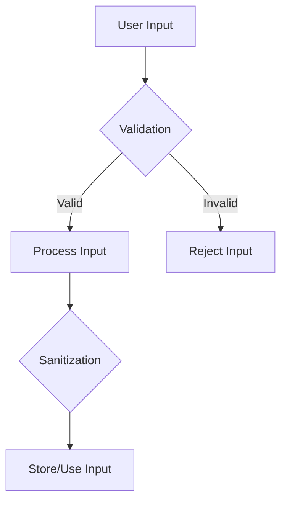

## 18.2 Input Validation and Sanitization

In the realm of software development, particularly when dealing with web applications, input validation and sanitization are critical components of security. They serve as the first line of defense against malicious data that could lead to vulnerabilities such as injection attacks. In this section, we'll explore the importance of these practices in Ruby applications, discuss various strategies for implementing them, and provide practical examples to guide you in securing your applications.

### Understanding the Risks of Unvalidated Input

Unvalidated input is a significant security risk. When user input is not properly checked, it can lead to various types of attacks, including:

- **SQL Injection**: Malicious SQL statements are inserted into an entry field for execution.
- **Cross-Site Scripting (XSS)**: Attackers inject scripts into web pages viewed by other users.
- **Command Injection**: Attackers execute arbitrary commands on the host operating system.

These attacks can lead to data breaches, unauthorized access, and other severe consequences. Therefore, implementing robust input validation and sanitization is essential.

### Strategies for Input Validation

Input validation ensures that the data received by your application is both expected and safe. Here are some strategies to consider:

#### Whitelisting

Whitelisting involves defining a set of acceptable inputs and rejecting anything that doesn't match. This is often more secure than blacklisting, which involves specifying what is not allowed.

```ruby
def validate_username(username)
  # Allow only alphanumeric characters
  if username =~ /\A[a-zA-Z0-9]+\z/
    true
  else
    false
  end
end
```

#### Data Type Checks

Ensure that the input matches the expected data type. This can prevent type-related vulnerabilities.

```ruby
def validate_age(age)
  Integer(age) rescue false
end
```

#### Length Checks

Limit the length of input to prevent buffer overflow attacks and ensure data integrity.

```ruby
def validate_password_length(password)
  password.length.between?(8, 128)
end
```

### Input Sanitization Methods

Sanitization involves cleaning input data to remove or encode unsafe characters. This is crucial for preventing injection attacks.

#### Removing Unsafe Characters

Strip out characters that are known to be dangerous, such as HTML tags or SQL commands.

```ruby
def sanitize_input(input)
  input.gsub(/<.*?>/, '')
end
```

#### Encoding

Encode input to ensure that special characters are treated as data rather than executable code.

```ruby
require 'cgi'

def encode_input(input)
  CGI.escapeHTML(input)
end
```

### Validating Input in Controllers and Models

In Ruby on Rails applications, input validation is often handled in models using ActiveModel::Validations. This ensures that data is validated before being saved to the database.

```ruby
class User < ApplicationRecord
  validates :username, presence: true, format: { with: /\A[a-zA-Z0-9]+\z/, message: "only allows letters and numbers" }
  validates :email, presence: true, uniqueness: true
  validates :age, numericality: { only_integer: true, greater_than: 0 }
end
```

In controllers, you can use strong parameters to whitelist attributes that are allowed to be mass-assigned.

```ruby
class UsersController < ApplicationController
  def create
    @user = User.new(user_params)
    if @user.save
      redirect_to @user
    else
      render :new
    end
  end

  private

  def user_params
    params.require(:user).permit(:username, :email, :age)
  end
end
```

### Gems for Input Validation and Sanitization

Ruby offers several gems to assist with input validation and sanitization. One of the most popular is ActiveModel::Validations, which provides a comprehensive set of validation helpers.

- **ActiveModel::Validations**: [Documentation](https://api.rubyonrails.org/classes/ActiveModel/Validations.html)

Other useful gems include:

- **Sanitize**: A whitelist-based HTML sanitizer.
- **Rack::Protection**: Provides various security measures for Rack applications.

### Importance of Server-Side Validation

While client-side validation can enhance user experience by providing immediate feedback, it should never be relied upon for security. Client-side validation can be bypassed by attackers, so always implement server-side validation to ensure data integrity and security.

### Try It Yourself

Experiment with the following code examples by modifying the validation rules or adding new ones. Consider how different types of input might affect the outcome and how you can enhance security.

```ruby
# Try modifying the regex pattern to allow additional characters
def validate_username(username)
  if username =~ /\A[a-zA-Z0-9]+\z/
    true
  else
    false
  end
end

# Experiment with different data types and see how the validation behaves
def validate_age(age)
  Integer(age) rescue false
end
```

### Visualizing Input Validation and Sanitization

To better understand the flow of input validation and sanitization, consider the following diagram:



**Figure 1**: This diagram illustrates the process of validating and sanitizing user input before it is processed or stored.

### References and Further Reading

- [OWASP Input Validation Cheat Sheet](https://cheatsheetseries.owasp.org/cheatsheets/Input_Validation_Cheat_Sheet.html)
- [Ruby on Rails Security Guide](https://guides.rubyonrails.org/security.html)
- [ActiveModel::Validations Documentation](https://api.rubyonrails.org/classes/ActiveModel/Validations.html)

### Knowledge Check

- What are the risks associated with unvalidated input?
- How does whitelisting differ from blacklisting?
- Why is server-side validation crucial even if client-side validation is implemented?

### Embrace the Journey

Remember, mastering input validation and sanitization is a journey. As you continue to develop your skills, you'll build more secure and robust applications. Keep experimenting, stay curious, and enjoy the process!

## Quiz: Input Validation and Sanitization



### What is the primary risk of unvalidated input?

- [x] Injection attacks
- [ ] Slow performance
- [ ] Increased memory usage
- [ ] Poor user experience

> **Explanation:** Unvalidated input can lead to injection attacks, which are a significant security risk.

### Which strategy involves defining acceptable inputs?

- [x] Whitelisting
- [ ] Blacklisting
- [ ] Encoding
- [ ] Decoding

> **Explanation:** Whitelisting involves specifying what inputs are allowed, making it more secure than blacklisting.

### What is the purpose of input sanitization?

- [x] Remove or encode unsafe characters
- [ ] Increase application speed
- [ ] Enhance user interface
- [ ] Reduce memory usage

> **Explanation:** Input sanitization removes or encodes unsafe characters to prevent injection attacks.

### Which gem is commonly used for validations in Rails?

- [x] ActiveModel::Validations
- [ ] Devise
- [ ] Pundit
- [ ] RSpec

> **Explanation:** ActiveModel::Validations provides a comprehensive set of validation helpers in Rails.

### Why is server-side validation important?

- [x] Client-side validation can be bypassed
- [ ] It improves user experience
- [ ] It reduces server load
- [ ] It speeds up development

> **Explanation:** Server-side validation is crucial because client-side validation can be bypassed by attackers.

### What does the `sanitize_input` method do in the example?

- [x] Removes HTML tags
- [ ] Encodes input
- [ ] Validates input length
- [ ] Checks data type

> **Explanation:** The `sanitize_input` method removes HTML tags from the input.

### What is a common use case for encoding input?

- [x] Preventing XSS attacks
- [ ] Improving application speed
- [ ] Enhancing UI design
- [ ] Reducing database size

> **Explanation:** Encoding input is commonly used to prevent XSS attacks by treating special characters as data.

### Which of the following is a benefit of using strong parameters in Rails?

- [x] Prevents mass assignment vulnerabilities
- [ ] Increases application speed
- [ ] Enhances UI design
- [ ] Reduces memory usage

> **Explanation:** Strong parameters help prevent mass assignment vulnerabilities by whitelisting attributes.

### What is the role of `CGI.escapeHTML` in input sanitization?

- [x] Encodes special characters
- [ ] Removes unsafe characters
- [ ] Validates input length
- [ ] Checks data type

> **Explanation:** `CGI.escapeHTML` encodes special characters to prevent them from being executed as code.

### True or False: Client-side validation is sufficient for application security.

- [ ] True
- [x] False

> **Explanation:** Client-side validation is not sufficient for security as it can be bypassed; server-side validation is necessary.




