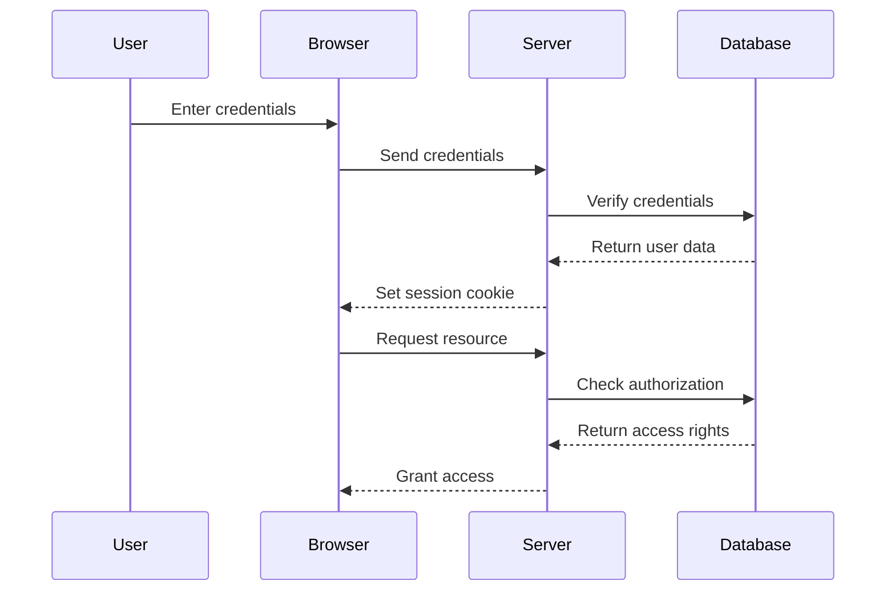

## 18.3 Authentication and Authorization Strategies

In the realm of web development, ensuring that users are who they claim to be and that they have the appropriate permissions to access resources is paramount. This section delves into the intricacies of authentication and authorization in Ruby applications, providing you with the tools and knowledge to implement these security measures effectively.

### Understanding Authentication and Authorization

Before diving into implementation strategies, let's clarify the distinction between authentication and authorization:

- **Authentication**: This is the process of verifying the identity of a user. It answers the question, "Who are you?" Common methods include passwords, tokens, and biometric verification.
  
- **Authorization**: Once a user's identity is confirmed, authorization determines what resources the user can access. It answers the question, "What are you allowed to do?"

### Best Practices for Secure Authentication

Implementing authentication securely is crucial to protect user data and prevent unauthorized access. Here are some best practices:

1. **Use Strong Password Policies**: Encourage users to create strong passwords by enforcing complexity requirements and regular updates.

2. **Implement Multi-Factor Authentication (MFA)**: Enhance security by requiring additional verification methods, such as SMS codes or authentication apps.

3. **Secure Password Storage**: Use hashing algorithms like bcrypt to store passwords securely. Avoid storing plain text passwords.

4. **Use Secure Connections**: Always use HTTPS to encrypt data transmitted between the client and server.

5. **Limit Login Attempts**: Implement mechanisms to prevent brute force attacks by limiting the number of login attempts.

6. **Session Management**: Ensure that sessions are managed securely, with proper expiration and invalidation mechanisms.

### Authentication in Ruby with Devise

[Devise](https://github.com/heartcombo/devise) is a popular authentication solution for Ruby on Rails applications. It provides a comprehensive suite of features to handle user registration, login, password recovery, and more.

#### Setting Up Devise

To get started with Devise, add it to your Gemfile:

```ruby
gem 'devise'
```

Run the following command to install the gem:

```bash
bundle install
```

Next, generate the Devise configuration:

```bash
rails generate devise:install
```

This command sets up the necessary configuration files and instructions for further setup. Follow the instructions provided in the terminal to complete the setup.

#### Creating a User Model with Devise

To create a user model with Devise, run:

```bash
rails generate devise User
```

This command generates a migration to add Devise-specific fields to the User model. Run the migration to update the database:

```bash
rails db:migrate
```

Devise provides a variety of modules that you can include in your User model to customize authentication behavior, such as:

- **Database Authenticatable**: Handles hashing and storing passwords in the database.
- **Registerable**: Manages user registration.
- **Recoverable**: Provides password recovery functionality.
- **Rememberable**: Manages generating and clearing token for remembering the user from a saved cookie.

#### Customizing Devise

Devise is highly customizable. You can modify views, controllers, and routes to fit your application's needs. For example, to customize the Devise views, run:

```bash
rails generate devise:views
```

This command copies the Devise views into your application, allowing you to modify them as needed.

### Authorization Strategies

Once authentication is in place, the next step is to implement authorization to control access to resources. Two common strategies are Role-Based Access Control (RBAC) and Attribute-Based Access Control (ABAC).

#### Role-Based Access Control (RBAC)

RBAC assigns permissions to roles, and users are assigned to these roles. This approach simplifies permission management by grouping users with similar access needs.

##### Implementing RBAC with CanCanCan

[CanCanCan](https://github.com/CanCanCommunity/cancancan) is a popular authorization library for Ruby on Rails that facilitates RBAC.

To use CanCanCan, add it to your Gemfile:

```ruby
gem 'cancancan'
```

Run the following command to install the gem:

```bash
bundle install
```

Generate the Ability class, which defines user permissions:

```bash
rails generate cancan:ability
```

In the generated `ability.rb` file, define permissions based on roles:

```ruby
class Ability
  include CanCan::Ability

  def initialize(user)
    user ||= User.new # guest user (not logged in)

    if user.admin?
      can :manage, :all
    else
      can :read, :all
    end
  end
end
```

In this example, admin users have full access, while regular users can only read resources.

#### Attribute-Based Access Control (ABAC)

ABAC uses attributes of users, resources, and the environment to determine access. This approach offers more granular control compared to RBAC.

##### Implementing ABAC with Pundit

[Pundit](https://github.com/varvet/pundit) is a lightweight authorization library that supports ABAC.

To use Pundit, add it to your Gemfile:

```ruby
gem 'pundit'
```

Run the following command to install the gem:

```bash
bundle install
```

Include Pundit in your application controller:

```ruby
class ApplicationController < ActionController::Base
  include Pundit
end
```

Generate a policy for a model to define access rules:

```bash
rails generate pundit:policy Post
```

In the generated `post_policy.rb` file, define authorization logic:

```ruby
class PostPolicy
  attr_reader :user, :post

  def initialize(user, post)
    @user = user
    @post = post
  end

  def update?
    user.admin? || post.user == user
  end
end
```

In this example, only admins or the post's owner can update the post.

### Session Management and Security Considerations

Session management is a critical aspect of authentication and authorization. Here are some security considerations:

- **Session Expiration**: Implement session expiration to reduce the risk of session hijacking.
- **Secure Cookies**: Use secure cookies to store session data, ensuring they are only transmitted over HTTPS.
- **Session Invalidation**: Invalidate sessions on logout or after a period of inactivity to prevent unauthorized access.

### Visualizing Authentication and Authorization Flow

To better understand the flow of authentication and authorization, let's visualize the process using a sequence diagram.



This diagram illustrates the interaction between the user, browser, server, and database during authentication and authorization.

### Try It Yourself

To deepen your understanding, try modifying the code examples provided. For instance, experiment with different Devise modules or customize the CanCanCan and Pundit policies to fit different scenarios.

### Further Reading and Resources

- [Devise Documentation](https://github.com/heartcombo/devise)
- [CanCanCan Documentation](https://github.com/CanCanCommunity/cancancan)
- [Pundit Documentation](https://github.com/varvet/pundit)
- [OWASP Authentication Cheat Sheet](https://cheatsheetseries.owasp.org/cheatsheets/Authentication_Cheat_Sheet.html)

### Knowledge Check

- What is the difference between authentication and authorization?
- How does Devise help in implementing authentication in Ruby on Rails?
- What are the key differences between RBAC and ABAC?
- How can you customize Devise views in a Rails application?
- What is the purpose of the Ability class in CanCanCan?

### Conclusion

Implementing robust authentication and authorization strategies is essential for securing Ruby applications. By leveraging tools like Devise, CanCanCan, and Pundit, you can ensure that your application not only verifies user identities but also enforces appropriate access controls.

Remember, this is just the beginning. As you progress, you'll build more secure and scalable applications. Keep experimenting, stay curious, and enjoy the journey!

## Quiz: Authentication and Authorization Strategies



### What is the primary purpose of authentication?

- [x] To verify the identity of a user
- [ ] To determine what resources a user can access
- [ ] To encrypt user data
- [ ] To manage user sessions

> **Explanation:** Authentication is the process of verifying the identity of a user.

### Which gem is commonly used for authentication in Ruby on Rails applications?

- [x] Devise
- [ ] Pundit
- [ ] CanCanCan
- [ ] RSpec

> **Explanation:** Devise is a popular gem for handling authentication in Ruby on Rails applications.

### What is the main difference between RBAC and ABAC?

- [x] RBAC assigns permissions based on roles, while ABAC uses attributes
- [ ] RBAC uses attributes, while ABAC assigns permissions based on roles
- [ ] RBAC is more granular than ABAC
- [ ] ABAC is less flexible than RBAC

> **Explanation:** RBAC assigns permissions based on roles, whereas ABAC uses attributes for more granular control.

### How can you customize Devise views in a Rails application?

- [x] By generating Devise views and modifying them
- [ ] By editing the Devise gem directly
- [ ] By using a different gem
- [ ] By changing the Rails configuration

> **Explanation:** You can customize Devise views by generating them into your application and modifying them as needed.

### What is the role of the Ability class in CanCanCan?

- [x] To define user permissions
- [ ] To manage user sessions
- [ ] To handle authentication
- [ ] To encrypt data

> **Explanation:** The Ability class in CanCanCan is used to define user permissions based on roles.

### Which of the following is a best practice for secure password storage?

- [x] Using hashing algorithms like bcrypt
- [ ] Storing passwords in plain text
- [ ] Encrypting passwords with a simple cipher
- [ ] Using base64 encoding

> **Explanation:** Using hashing algorithms like bcrypt is a best practice for secure password storage.

### What is a common method to enhance authentication security?

- [x] Implementing Multi-Factor Authentication (MFA)
- [ ] Using simple passwords
- [ ] Storing passwords in cookies
- [ ] Disabling HTTPS

> **Explanation:** Implementing Multi-Factor Authentication (MFA) enhances security by requiring additional verification methods.

### How does Pundit support authorization in Ruby applications?

- [x] By providing a policy-based approach
- [ ] By managing user sessions
- [ ] By encrypting data
- [ ] By handling authentication

> **Explanation:** Pundit supports authorization by providing a policy-based approach to define access rules.

### What is a key consideration in session management?

- [x] Session expiration and invalidation
- [ ] Storing sessions in plain text
- [ ] Using cookies without encryption
- [ ] Disabling session management

> **Explanation:** Session expiration and invalidation are key considerations to prevent unauthorized access.

### True or False: Authorization determines what resources a user can access.

- [x] True
- [ ] False

> **Explanation:** Authorization is the process of determining what resources a user can access.


