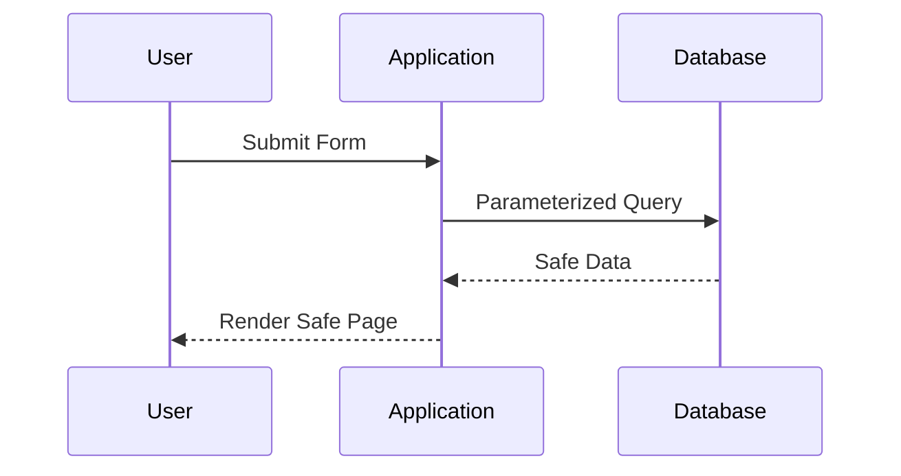

## 18.4 Protecting Against Injection Attacks

In the realm of software security, injection attacks stand as one of the most prevalent and dangerous threats. These attacks exploit vulnerabilities in an application to execute unintended commands or queries, potentially leading to data breaches, unauthorized access, and system compromise. As Ruby developers, understanding and mitigating these risks is crucial to building secure applications. In this section, we will explore various types of injection attacks, including SQL injection, command injection, and cross-site scripting (XSS), and provide strategies to protect your Ruby applications from these threats.

### Understanding Injection Attacks

Injection attacks occur when an attacker is able to insert or "inject" malicious code into a program, altering its execution path. This can happen in various contexts, such as database queries, shell commands, or web page rendering. The impact of such attacks can range from data leakage to complete system takeover.

#### Types of Injection Attacks

1. **SQL Injection**: This involves injecting malicious SQL code into a query, allowing attackers to manipulate database operations.
2. **Command Injection**: This occurs when an attacker is able to execute arbitrary commands on the host operating system.
3. **Cross-Site Scripting (XSS)**: This involves injecting malicious scripts into web pages viewed by other users, potentially stealing cookies or session tokens.

### Preventing SQL Injection

SQL injection is one of the most common forms of injection attacks. It exploits vulnerabilities in the way SQL queries are constructed, allowing attackers to execute arbitrary SQL commands. To prevent SQL injection, it is essential to use parameterized queries and Object-Relational Mapping (ORM) methods.

#### Parameterized Queries

Parameterized queries ensure that user input is treated as data, not executable code. This is achieved by separating SQL code from data input, preventing attackers from altering the query structure.

```ruby
# Example of a parameterized query using ActiveRecord
User.where("email = ?", params[:email])
```

In this example, the `?` placeholder is used to safely insert the user input, ensuring that it is treated as a string rather than executable SQL.

#### Using ActiveRecord Safely

ActiveRecord, the ORM used in Ruby on Rails, provides a safe interface for database interactions. By using ActiveRecord methods, you can avoid the pitfalls of SQL injection.

```ruby
# Safe query using ActiveRecord
user = User.find_by(email: params[:email])
```

ActiveRecord automatically handles parameterization, ensuring that user inputs are safely escaped.

#### Avoiding Dynamic SQL

Dynamic SQL, where queries are constructed by concatenating strings, is highly susceptible to injection attacks. Avoid using string interpolation or concatenation to build SQL queries.

```ruby
# Unsafe dynamic SQL example
User.where("email = '#{params[:email]}'") # Vulnerable to SQL injection
```

### Preventing Command Injection

Command injection occurs when an attacker is able to execute arbitrary commands on the host operating system. This can happen if user input is passed directly to system commands without proper validation or escaping.

#### Safe Command Execution

To prevent command injection, use safe methods like `system` with arrays, which automatically handle escaping.

```ruby
# Safe command execution
system("ls", "-l", "/home/user")
```

In this example, the `system` method is used with an array, ensuring that each argument is treated as a separate entity, preventing injection.

#### Avoiding Shell Expansion

Avoid using methods that allow shell expansion, such as backticks or `exec`, with user input.

```ruby
# Unsafe command execution
`rm -rf #{params[:directory]}` # Vulnerable to command injection
```

Instead, use safer alternatives that do not invoke the shell.

### Preventing Cross-Site Scripting (XSS)

XSS attacks occur when an attacker is able to inject malicious scripts into web pages viewed by other users. These scripts can steal cookies, session tokens, or other sensitive information.

#### Output Encoding and HTML Escaping

To prevent XSS, ensure that all user-generated content is properly encoded before being rendered in the browser. Use HTML escaping to neutralize potentially harmful scripts.

```erb
<%= h user_input %> <!-- Safely escape user input -->
```

In this example, the `h` method is used to escape HTML characters, preventing script execution.

#### Content Security Policy (CSP)

Implementing a Content Security Policy (CSP) can further protect against XSS by restricting the sources from which scripts can be loaded.

```html
<meta http-equiv="Content-Security-Policy" content="default-src 'self'; script-src 'self'">
```

A CSP can prevent the execution of malicious scripts by only allowing scripts from trusted sources.

### Keeping Libraries and Frameworks Up-to-Date

One of the simplest yet most effective ways to protect against injection attacks is to keep your libraries and frameworks up-to-date. Security vulnerabilities are regularly discovered and patched, so staying current with updates is crucial.

#### Regular Updates and Patching

- Regularly update your Ruby and Rails versions to benefit from security patches.
- Use tools like `bundler-audit` to check for vulnerabilities in your Gemfile.

### Visualizing Injection Attack Prevention

To better understand the flow of preventing injection attacks, let's visualize the process using a sequence diagram.



This diagram illustrates how user input is safely processed using parameterized queries, ensuring that only safe data is rendered back to the user.

### Knowledge Check

- **Question**: What is the primary method to prevent SQL injection in Ruby applications?
  - **Answer**: Use parameterized queries and ORM methods like ActiveRecord.

- **Question**: How can you safely execute system commands in Ruby?
  - **Answer**: Use the `system` method with arrays to prevent command injection.

- **Question**: What is a key technique to prevent XSS attacks?
  - **Answer**: Use output encoding and HTML escaping to neutralize scripts.

### Try It Yourself

Experiment with the code examples provided. Try modifying the SQL queries and command execution methods to see how they behave with different inputs. Implement a simple web form and test how different encoding techniques prevent XSS.

### Conclusion

Protecting against injection attacks is a critical aspect of building secure Ruby applications. By understanding the different types of injection attacks and implementing the prevention techniques discussed, you can safeguard your applications from these threats. Remember, security is an ongoing process, and staying informed about the latest vulnerabilities and patches is essential.

## Quiz: Protecting Against Injection Attacks



### What is the primary method to prevent SQL injection in Ruby applications?

- [x] Use parameterized queries and ORM methods like ActiveRecord
- [ ] Use dynamic SQL queries
- [ ] Disable user input
- [ ] Use string interpolation in SQL queries

> **Explanation:** Parameterized queries and ORM methods ensure that user input is treated as data, not executable code, preventing SQL injection.

### How can you safely execute system commands in Ruby?

- [x] Use the `system` method with arrays
- [ ] Use backticks for command execution
- [ ] Use string interpolation in system commands
- [ ] Use `exec` with user input

> **Explanation:** Using the `system` method with arrays ensures that each argument is treated as a separate entity, preventing command injection.

### What is a key technique to prevent XSS attacks?

- [x] Use output encoding and HTML escaping
- [ ] Disable JavaScript in the browser
- [ ] Use inline scripts
- [ ] Allow all user-generated content

> **Explanation:** Output encoding and HTML escaping neutralize potentially harmful scripts, preventing XSS attacks.

### Which of the following is a common type of injection attack?

- [x] SQL Injection
- [ ] Buffer Overflow
- [ ] Man-in-the-Middle
- [ ] Phishing

> **Explanation:** SQL Injection is a common type of injection attack that exploits vulnerabilities in SQL query construction.

### What is the purpose of a Content Security Policy (CSP)?

- [x] Restrict the sources from which scripts can be loaded
- [ ] Disable all scripts on a webpage
- [ ] Allow all external scripts
- [ ] Encrypt user data

> **Explanation:** A CSP restricts the sources from which scripts can be loaded, preventing the execution of malicious scripts.

### Why is it important to keep libraries and frameworks up-to-date?

- [x] To benefit from security patches and updates
- [ ] To add new features
- [ ] To increase application size
- [ ] To improve user interface

> **Explanation:** Keeping libraries and frameworks up-to-date ensures that you benefit from security patches and updates, protecting against known vulnerabilities.

### What is a potential impact of an injection attack?

- [x] Data breach
- [ ] Improved performance
- [ ] Enhanced user experience
- [ ] Increased application speed

> **Explanation:** Injection attacks can lead to data breaches, unauthorized access, and system compromise.

### Which method should be avoided to prevent command injection?

- [x] Using backticks with user input
- [ ] Using `system` with arrays
- [ ] Using parameterized queries
- [ ] Using ORM methods

> **Explanation:** Using backticks with user input can lead to command injection, as it allows shell expansion.

### What is the role of `bundler-audit` in Ruby applications?

- [x] Check for vulnerabilities in the Gemfile
- [ ] Improve application performance
- [ ] Enhance user interface
- [ ] Add new features

> **Explanation:** `bundler-audit` checks for vulnerabilities in the Gemfile, ensuring that your application is protected against known security issues.

### True or False: Dynamic SQL queries are safe from SQL injection.

- [ ] True
- [x] False

> **Explanation:** Dynamic SQL queries are not safe from SQL injection, as they can be manipulated by attackers to execute arbitrary SQL commands.



Remember, this is just the beginning. As you progress, you'll build more secure and robust applications. Keep experimenting, stay curious, and enjoy the journey!
