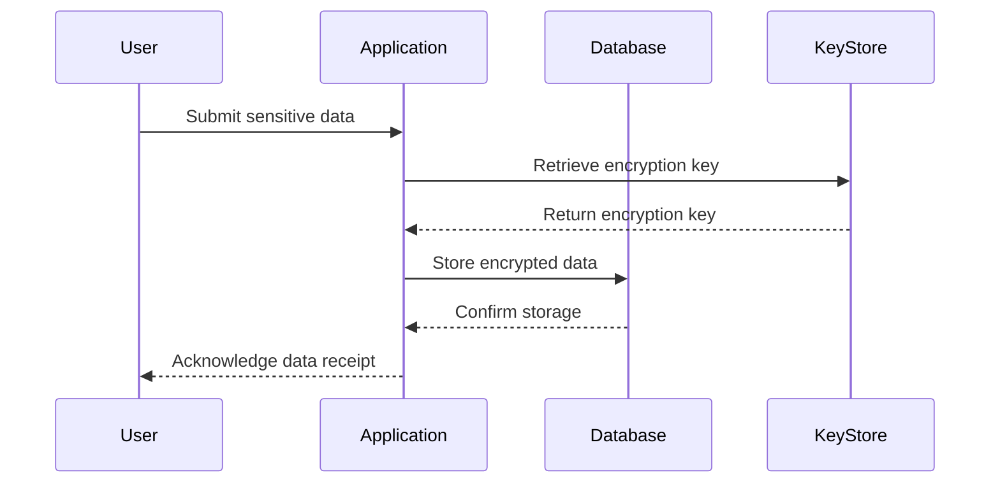

## 18.5 Encryption and Secure Data Storage

In today's digital age, protecting sensitive data is paramount. Whether it's personal information, credit card numbers, or confidential business data, ensuring that this information is secure both at rest and in transit is crucial. In this section, we will explore how to implement encryption and secure data storage in Ruby applications, leveraging libraries like OpenSSL and AttrEncrypted. We will also delve into best practices for key management, compliance requirements, and more.

### Understanding the Need for Encryption

Encryption is the process of converting plain text into a coded format, known as ciphertext, which can only be read by someone who has the decryption key. This is essential for protecting sensitive data from unauthorized access. Let's explore why encryption is necessary:

- **Data Breaches**: With the increasing number of data breaches, encryption acts as a last line of defense, ensuring that even if data is accessed, it remains unreadable.
- **Compliance**: Regulations like GDPR and PCI DSS mandate the encryption of sensitive data to protect user privacy and financial information.
- **Trust**: Encrypting data helps build trust with users, assuring them that their information is secure.

### Symmetric vs. Asymmetric Encryption

Before diving into Ruby-specific implementations, it's important to understand the two main types of encryption: symmetric and asymmetric.

#### Symmetric Encryption

In symmetric encryption, the same key is used for both encryption and decryption. This method is fast and efficient, making it suitable for encrypting large amounts of data. However, the challenge lies in securely sharing the key between parties.

**Use Cases**:
- Encrypting files or databases.
- Securing data in transit within a closed network.

#### Asymmetric Encryption

Asymmetric encryption uses a pair of keys: a public key for encryption and a private key for decryption. This method is more secure for key exchange but is computationally intensive, making it less suitable for large datasets.

**Use Cases**:
- Secure key exchange.
- Digital signatures and certificates.

### Implementing Encryption in Ruby

Ruby provides robust libraries for implementing both symmetric and asymmetric encryption. Let's explore how to use these libraries effectively.

#### Using OpenSSL for Encryption

OpenSSL is a powerful library that provides a wide range of cryptographic functions. It is included in Ruby's standard library, making it a convenient choice for encryption tasks.

**Symmetric Encryption with OpenSSL**:

```ruby
require 'openssl'

# Generate a random key and initialization vector
key = OpenSSL::Cipher.new('AES-256-CBC').random_key
iv = OpenSSL::Cipher.new('AES-256-CBC').random_iv

# Encrypt data
cipher = OpenSSL::Cipher.new('AES-256-CBC')
cipher.encrypt
cipher.key = key
cipher.iv = iv
encrypted_data = cipher.update('Sensitive data') + cipher.final

# Decrypt data
decipher = OpenSSL::Cipher.new('AES-256-CBC')
decipher.decrypt
decipher.key = key
decipher.iv = iv
decrypted_data = decipher.update(encrypted_data) + decipher.final

puts "Decrypted data: #{decrypted_data}"
```

**Asymmetric Encryption with OpenSSL**:

```ruby
require 'openssl'

# Generate RSA key pair
rsa_key = OpenSSL::PKey::RSA.new(2048)

# Encrypt data with public key
public_key = rsa_key.public_key
encrypted_data = public_key.public_encrypt('Sensitive data')

# Decrypt data with private key
decrypted_data = rsa_key.private_decrypt(encrypted_data)

puts "Decrypted data: #{decrypted_data}"
```

#### Using AttrEncrypted for Secure Data Storage

AttrEncrypted is a Ruby gem that simplifies the process of encrypting ActiveRecord attributes. It integrates seamlessly with Rails applications, providing an easy way to secure sensitive data.

**Example Usage**:

```ruby
# Gemfile
gem 'attr_encrypted'

# Model with encrypted attributes
class User < ApplicationRecord
  attr_encrypted :email, key: 'a secret key'
  attr_encrypted :ssn, key: 'another secret key'
end

# Usage
user = User.new(email: 'user@example.com', ssn: '123-45-6789')
user.save

puts user.encrypted_email # Access encrypted data
puts user.email # Access decrypted data
```

### Best Practices for Key Management

Effective key management is critical for maintaining the security of encrypted data. Here are some best practices:

- **Key Rotation**: Regularly rotate encryption keys to minimize the risk of key compromise.
- **Secure Storage**: Store keys in a secure location, such as a hardware security module (HSM) or a key management service (KMS).
- **Access Control**: Limit access to encryption keys to only those who need it, and use strong authentication mechanisms.

### Secure Data Storage Practices

In addition to encryption, secure data storage practices are essential for protecting sensitive information.

#### Encrypted Databases

Many modern databases offer built-in encryption features. For example, PostgreSQL supports Transparent Data Encryption (TDE), which encrypts data at rest.

#### Encrypted File Systems

Use encrypted file systems to protect data stored on disk. Tools like LUKS (Linux Unified Key Setup) can be used to encrypt entire partitions.

### Compliance Requirements

When handling sensitive data, it's important to be aware of compliance requirements such as GDPR and PCI DSS.

- **GDPR**: The General Data Protection Regulation requires organizations to protect personal data and privacy of EU citizens. Encryption is a key component of GDPR compliance.
- **PCI DSS**: The Payment Card Industry Data Security Standard mandates encryption of cardholder data to protect against fraud.

### Visualizing Encryption and Secure Data Storage

To better understand the flow of encryption and secure data storage, let's visualize the process using a sequence diagram.



### Try It Yourself

Experiment with the code examples provided. Try changing the encryption algorithms or key sizes to see how it affects the performance and security of your application. You can also explore integrating these encryption techniques into a Rails application to secure user data.

### Knowledge Check

- What are the differences between symmetric and asymmetric encryption?
- Why is key management important in encryption?
- How can you ensure compliance with GDPR and PCI DSS when handling sensitive data?

### Summary

In this section, we've explored the importance of encryption and secure data storage in Ruby applications. We've covered the basics of symmetric and asymmetric encryption, demonstrated how to use libraries like OpenSSL and AttrEncrypted, and discussed best practices for key management and compliance. Remember, encryption is just one part of a comprehensive security strategy. Always stay informed about the latest security practices and continuously evaluate your application's security posture.

## Quiz: Encryption and Secure Data Storage



### What is the primary purpose of encryption?

- [x] To protect sensitive data from unauthorized access
- [ ] To increase data storage capacity
- [ ] To improve data processing speed
- [ ] To enhance user interface design

> **Explanation:** Encryption is primarily used to protect sensitive data from unauthorized access by converting it into a coded format.

### Which type of encryption uses the same key for both encryption and decryption?

- [x] Symmetric encryption
- [ ] Asymmetric encryption
- [ ] Hashing
- [ ] Digital signatures

> **Explanation:** Symmetric encryption uses the same key for both encryption and decryption, making it efficient for large datasets.

### What library is included in Ruby's standard library for cryptographic functions?

- [x] OpenSSL
- [ ] AttrEncrypted
- [ ] Devise
- [ ] BCrypt

> **Explanation:** OpenSSL is included in Ruby's standard library and provides a wide range of cryptographic functions.

### What is a key advantage of asymmetric encryption?

- [x] Secure key exchange
- [ ] Faster encryption speed
- [ ] Smaller key sizes
- [ ] Simpler implementation

> **Explanation:** Asymmetric encryption is advantageous for secure key exchange because it uses a pair of keys (public and private).

### Which gem simplifies the encryption of ActiveRecord attributes in Rails applications?

- [x] AttrEncrypted
- [ ] Devise
- [ ] Pundit
- [ ] CanCanCan

> **Explanation:** AttrEncrypted is a Ruby gem that simplifies the encryption of ActiveRecord attributes in Rails applications.

### What is a recommended practice for managing encryption keys?

- [x] Regularly rotate encryption keys
- [ ] Store keys in plain text files
- [ ] Share keys with all team members
- [ ] Use the same key for all applications

> **Explanation:** Regularly rotating encryption keys is a recommended practice to minimize the risk of key compromise.

### Which regulation mandates the encryption of cardholder data?

- [x] PCI DSS
- [ ] GDPR
- [ ] HIPAA
- [ ] SOX

> **Explanation:** PCI DSS mandates the encryption of cardholder data to protect against fraud.

### What is the role of a hardware security module (HSM) in key management?

- [x] Secure storage of encryption keys
- [ ] Encrypting large datasets
- [ ] Improving application performance
- [ ] Simplifying user authentication

> **Explanation:** A hardware security module (HSM) is used for the secure storage of encryption keys.

### What is the benefit of using an encrypted file system?

- [x] Protects data stored on disk
- [ ] Increases disk space
- [ ] Speeds up data retrieval
- [ ] Simplifies file management

> **Explanation:** An encrypted file system protects data stored on disk by encrypting entire partitions.

### True or False: Encryption alone is sufficient for comprehensive data security.

- [ ] True
- [x] False

> **Explanation:** Encryption is an important part of data security, but it should be combined with other security measures for comprehensive protection.



Remember, this is just the beginning. As you progress, you'll build more secure and robust applications. Keep experimenting, stay curious, and enjoy the journey!
