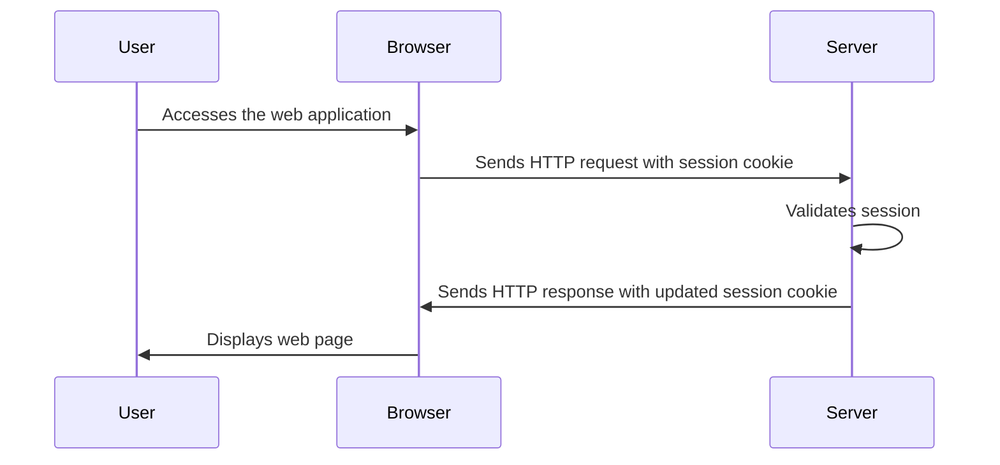

## 18.6 Managing Sessions and Cookies Securely

In the realm of web development, managing sessions and cookies securely is paramount to safeguarding user data and maintaining the integrity of web applications. In this section, we will delve into the intricacies of session and cookie management, explore potential security risks, and provide best practices for implementing secure session handling in Ruby applications, particularly focusing on Rails.

### Understanding Sessions and Cookies

Before diving into security measures, let's first understand what sessions and cookies are and how they function in web applications.

#### Sessions

A session is a server-side storage of information that is used to maintain state across multiple requests from the same client. Sessions are crucial for applications that require user authentication and personalized experiences. In Ruby on Rails, sessions are typically managed using a session store, which can be configured to use different storage mechanisms such as cookies, databases, or in-memory stores.

#### Cookies

Cookies are small pieces of data stored on the client-side, typically in the user's browser. They are used to persist information across requests and can be used to store session identifiers, preferences, or other data. Cookies are sent with every HTTP request to the server, allowing the server to recognize returning users.

### Security Risks in Session and Cookie Management

While sessions and cookies are essential for web applications, they also introduce several security risks if not managed properly. Some common vulnerabilities include:

- **Session Hijacking**: An attacker gains unauthorized access to a user's session by stealing the session identifier.
- **Session Fixation**: An attacker sets a known session identifier for a user, allowing them to hijack the session once the user logs in.
- **Cross-Site Scripting (XSS)**: Malicious scripts can access cookies if they are not marked as HttpOnly.
- **Cross-Site Request Forgery (CSRF)**: An attacker tricks a user into performing actions on a web application where they are authenticated.

### Best Practices for Secure Session Management

To mitigate these risks, it is essential to follow best practices for secure session and cookie management. Let's explore these practices in detail.

#### 1. Use Secure, HttpOnly Cookies

When storing session identifiers in cookies, it is crucial to mark them as `Secure` and `HttpOnly`. The `Secure` attribute ensures that cookies are only sent over HTTPS, preventing them from being intercepted over unencrypted connections. The `HttpOnly` attribute prevents client-side scripts from accessing the cookies, mitigating the risk of XSS attacks.

```ruby
# Example of setting secure and HttpOnly cookies in Rails
Rails.application.config.session_store :cookie_store, key: '_your_app_session', secure: Rails.env.production?, httponly: true
```

#### 2. Implement Session Expiration and Regeneration

Sessions should have a limited lifespan to reduce the risk of session hijacking. Implementing session expiration ensures that sessions are invalidated after a certain period of inactivity. Additionally, regenerating session identifiers after login or privilege escalation can prevent session fixation attacks.

```ruby
# Example of session expiration and regeneration in Rails
class ApplicationController < ActionController::Base
  before_action :expire_session

  private

  def expire_session
    if session[:last_seen] && session[:last_seen] < 15.minutes.ago
      reset_session
    else
      session[:last_seen] = Time.current
    end
  end
end
```

#### 3. Store Minimal Information in Cookies

Cookies should only store minimal, non-sensitive information. Avoid storing sensitive data such as passwords or personal information in cookies. Instead, use cookies to store session identifiers and retrieve sensitive data from the server-side session store.

#### 4. Use Strong Session Identifiers

Session identifiers should be long, random, and unique to prevent attackers from guessing or brute-forcing them. Rails automatically generates strong session identifiers, but it is essential to ensure that your session store is configured correctly.

#### 5. Protect Against CSRF Attacks

Rails provides built-in protection against CSRF attacks by including a CSRF token in forms and verifying it with each request. Ensure that CSRF protection is enabled in your application.

```ruby
# Example of enabling CSRF protection in Rails
class ApplicationController < ActionController::Base
  protect_from_forgery with: :exception
end
```

### Implementing Secure Session Management in Rails

Now that we've covered the best practices, let's see how to implement secure session management in a Ruby on Rails application.

#### Configuring the Session Store

Rails allows you to configure the session store to use different storage mechanisms. The default is the cookie store, but you can also use database-backed stores or in-memory stores for added security.

```ruby
# Example of configuring the session store in Rails
Rails.application.config.session_store :active_record_store, key: '_your_app_session'
```

#### Using Encrypted Cookies

Rails provides encrypted cookies, which encrypt the cookie data before storing it on the client-side. This adds an additional layer of security by ensuring that even if cookies are intercepted, the data remains unreadable.

```ruby
# Example of using encrypted cookies in Rails
cookies.encrypted[:user_id] = { value: current_user.id, expires: 1.hour.from_now }
```

### Visualizing Session and Cookie Management

To better understand the flow of session and cookie management, let's visualize the process using a sequence diagram.



### Knowledge Check

Let's reinforce our understanding with a few questions:

- What is the purpose of marking cookies as `Secure` and `HttpOnly`?
- How does session expiration help in securing web applications?
- Why should sensitive data not be stored in cookies?

### Try It Yourself

To deepen your understanding, try modifying the code examples provided:

- Experiment with different session expiration times and observe the behavior.
- Implement a custom session store and compare it with the default cookie store.
- Test the impact of removing the `Secure` and `HttpOnly` attributes from cookies.

### Conclusion

Managing sessions and cookies securely is a critical aspect of web application security. By following best practices and leveraging Rails' built-in mechanisms, you can protect your applications from common vulnerabilities and ensure a secure user experience. Remember, security is an ongoing process, and staying informed about the latest threats and mitigation strategies is essential.

## Quiz: Managing Sessions and Cookies Securely



### What is the primary purpose of marking cookies as `Secure`?

- [x] To ensure cookies are only sent over HTTPS
- [ ] To prevent cookies from being accessed by JavaScript
- [ ] To encrypt the cookie data
- [ ] To make cookies expire after a certain time

> **Explanation:** The `Secure` attribute ensures that cookies are only sent over HTTPS, preventing interception over unencrypted connections.

### How does session expiration contribute to security?

- [x] It reduces the risk of session hijacking
- [ ] It prevents cookies from being accessed by JavaScript
- [ ] It encrypts session data
- [ ] It increases the lifespan of a session

> **Explanation:** Session expiration limits the time a session is valid, reducing the risk of session hijacking by invalidating sessions after inactivity.

### What is a potential risk of storing sensitive data in cookies?

- [x] Data can be intercepted and read by attackers
- [ ] Cookies cannot store large amounts of data
- [ ] Cookies are not accessible by the server
- [ ] Cookies expire too quickly

> **Explanation:** Storing sensitive data in cookies poses a risk as they can be intercepted and read by attackers, compromising user data.

### What is the role of the `HttpOnly` attribute in cookies?

- [x] To prevent client-side scripts from accessing cookies
- [ ] To ensure cookies are only sent over HTTPS
- [ ] To encrypt the cookie data
- [ ] To make cookies expire after a certain time

> **Explanation:** The `HttpOnly` attribute prevents client-side scripts from accessing cookies, mitigating the risk of XSS attacks.

### Which of the following is a best practice for session management?

- [x] Use strong, random session identifiers
- [ ] Store passwords in session cookies
- [ ] Disable CSRF protection
- [ ] Use the same session identifier for all users

> **Explanation:** Using strong, random session identifiers is a best practice to prevent attackers from guessing or brute-forcing session IDs.

### What is the benefit of using encrypted cookies in Rails?

- [x] It ensures cookie data remains unreadable even if intercepted
- [ ] It prevents cookies from being sent over HTTP
- [ ] It increases the size of cookies
- [ ] It allows cookies to store more data

> **Explanation:** Encrypted cookies ensure that cookie data remains unreadable even if intercepted, adding an additional layer of security.

### How can CSRF attacks be mitigated in Rails?

- [x] By enabling CSRF protection with a CSRF token
- [ ] By storing session data in cookies
- [ ] By using the same session identifier for all users
- [ ] By disabling HTTPS

> **Explanation:** CSRF attacks can be mitigated by enabling CSRF protection, which includes a CSRF token in forms and verifies it with each request.

### What is the purpose of session regeneration?

- [x] To prevent session fixation attacks
- [ ] To increase the lifespan of a session
- [ ] To store more data in the session
- [ ] To encrypt session data

> **Explanation:** Session regeneration prevents session fixation attacks by generating a new session identifier after login or privilege escalation.

### Why is it important to configure the session store correctly?

- [x] To ensure session identifiers are strong and secure
- [ ] To allow cookies to store more data
- [ ] To disable CSRF protection
- [ ] To increase the size of cookies

> **Explanation:** Configuring the session store correctly ensures that session identifiers are strong and secure, preventing unauthorized access.

### True or False: Cookies should store minimal, non-sensitive information.

- [x] True
- [ ] False

> **Explanation:** Cookies should store minimal, non-sensitive information to reduce the risk of data exposure if intercepted.



Remember, this is just the beginning. As you progress, you'll build more secure and robust web applications. Keep experimenting, stay curious, and enjoy the journey!
