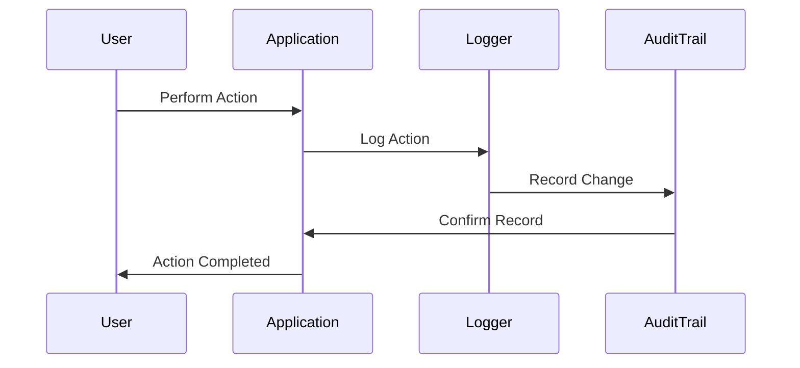

## 18.7 Logging and Auditing for Security

In today's digital landscape, ensuring the security of applications is paramount. Logging and auditing play a crucial role in maintaining this security by providing a detailed record of system activities. This section will guide you through the importance of security-focused logging, what information should be logged, and how to implement auditing in Ruby applications using tools like PaperTrail. We'll also discuss compliance requirements and the importance of regular log reviews.

### The Importance of Security-Focused Logging

Security-focused logging is essential for detecting suspicious activities and potential security breaches. By maintaining detailed logs, developers and security teams can:

- **Identify Unauthorized Access**: Logs can reveal unauthorized access attempts, helping to prevent data breaches.
- **Monitor Changes to Critical Data**: Tracking changes to sensitive data ensures that any unauthorized modifications are quickly identified and addressed.
- **Facilitate Incident Response**: In the event of a security incident, logs provide a trail of evidence that can be used to understand the breach and prevent future occurrences.
- **Ensure Compliance**: Many industries have regulatory requirements mandating the logging of specific activities to ensure data protection and privacy.

### What Information Should Be Logged?

When implementing logging for security purposes, it's important to capture relevant information without compromising user privacy. Key elements to log include:

- **Login Attempts**: Record successful and failed login attempts, including timestamps and IP addresses.
- **Access to Sensitive Data**: Log access to critical data, noting who accessed it and when.
- **Changes to Data**: Track modifications to important data, including what was changed and by whom.
- **System Errors and Exceptions**: Capture errors and exceptions to identify potential vulnerabilities.
- **Configuration Changes**: Log changes to system configurations that could impact security.

### Avoid Logging Sensitive Information

While logging is crucial for security, it's equally important to avoid logging sensitive information such as passwords, credit card numbers, and personal identification numbers (PINs). Exposing such data in logs can lead to security breaches and non-compliance with data protection regulations.

### Implementing Auditing with PaperTrail

PaperTrail is a popular Ruby gem that provides auditing capabilities by tracking changes to ActiveRecord models. It creates a version history for each record, allowing you to see what changes were made, when, and by whom.

#### Setting Up PaperTrail

To get started with PaperTrail, add it to your Gemfile:

```ruby
gem 'paper_trail', '~> 12.0'
```

Run `bundle install` to install the gem, then generate the necessary migration:

```bash
rails generate paper_trail:install
rails db:migrate
```

#### Using PaperTrail

Once installed, you can enable versioning on your models by including the `has_paper_trail` method:

```ruby
class Article < ApplicationRecord
  has_paper_trail
end
```

This will automatically track changes to the `Article` model. You can access the version history through the `versions` association:

```ruby
article = Article.find(1)
article.versions.each do |version|
  puts "Version #{version.index}: #{version.changeset}"
end
```

#### Customizing PaperTrail

PaperTrail allows for customization to fit your auditing needs. You can specify which attributes to track, exclude certain changes, or add metadata to versions:

```ruby
class Article < ApplicationRecord
  has_paper_trail only: [:title, :content], skip: [:updated_at]
end
```

### Compliance Requirements

Various industries have compliance requirements that necessitate auditing and logging. Understanding these requirements is crucial for ensuring your application meets legal standards.

- **HIPAA (Health Insurance Portability and Accountability Act)**: Requires logging of access to patient data to protect privacy.
- **SOX (Sarbanes-Oxley Act)**: Mandates auditing of financial records to prevent fraud.
- **GDPR (General Data Protection Regulation)**: Requires logging of data processing activities to ensure user privacy.

### Regular Review and Analysis of Security Logs

Logging is only effective if the logs are regularly reviewed and analyzed. Establish a routine for examining logs to identify anomalies and potential security threats. Use automated tools to assist in log analysis and alert you to suspicious activities.

### Visualizing Logging and Auditing Processes

To better understand the flow of logging and auditing in a Ruby application, consider the following sequence diagram:



This diagram illustrates how user actions are logged and recorded in an audit trail, providing a clear path for tracking changes and ensuring security.

### Try It Yourself

Experiment with PaperTrail by modifying the code examples provided. Try adding metadata to your versions or excluding certain attributes from being tracked. Observe how these changes affect the version history and consider how you might apply these techniques to your own applications.

### Knowledge Check

- What are the key elements that should be logged for security purposes?
- Why is it important to avoid logging sensitive information?
- How does PaperTrail help in implementing auditing in Ruby applications?
- What are some compliance requirements that necessitate logging and auditing?
- How can regular review and analysis of logs enhance security?

### Embrace the Journey

Remember, logging and auditing are ongoing processes that require regular attention and adaptation. As you continue to develop and secure your applications, keep experimenting with different logging strategies, stay informed about compliance requirements, and enjoy the journey of creating secure and reliable software.

## Quiz: Logging and Auditing for Security



### What is the primary purpose of security-focused logging?

- [x] To detect suspicious activities and potential security breaches
- [ ] To improve application performance
- [ ] To reduce server load
- [ ] To enhance user interface design

> **Explanation:** Security-focused logging is primarily used to detect suspicious activities and potential security breaches.

### Which of the following should be logged for security purposes?

- [x] Login attempts
- [x] Changes to critical data
- [ ] User preferences
- [ ] UI layout changes

> **Explanation:** Login attempts and changes to critical data are important for security logging, while user preferences and UI layout changes are not.

### Why should sensitive information not be logged?

- [x] To prevent security breaches and ensure compliance
- [ ] To reduce log file size
- [ ] To improve application speed
- [ ] To enhance user experience

> **Explanation:** Logging sensitive information can lead to security breaches and non-compliance with data protection regulations.

### What is PaperTrail used for in Ruby applications?

- [x] Auditing changes to ActiveRecord models
- [ ] Improving application performance
- [ ] Enhancing UI design
- [ ] Managing user sessions

> **Explanation:** PaperTrail is used for auditing changes to ActiveRecord models in Ruby applications.

### Which compliance requirement mandates logging of access to patient data?

- [x] HIPAA
- [ ] SOX
- [ ] GDPR
- [ ] PCI DSS

> **Explanation:** HIPAA requires logging of access to patient data to protect privacy.

### How can regular review of logs enhance security?

- [x] By identifying anomalies and potential security threats
- [ ] By improving application speed
- [ ] By reducing server load
- [ ] By enhancing user interface design

> **Explanation:** Regular review of logs helps identify anomalies and potential security threats.

### What does the `has_paper_trail` method do in a Ruby model?

- [x] Enables versioning and auditing of the model
- [ ] Improves application performance
- [ ] Enhances UI design
- [ ] Manages user sessions

> **Explanation:** The `has_paper_trail` method enables versioning and auditing of the model in Ruby applications.

### Which of the following is a key benefit of security-focused logging?

- [x] Facilitating incident response
- [ ] Improving application speed
- [ ] Enhancing UI design
- [ ] Reducing server load

> **Explanation:** Security-focused logging facilitates incident response by providing a trail of evidence.

### What is a common pitfall to avoid in security logging?

- [x] Logging sensitive information
- [ ] Logging too frequently
- [ ] Using automated tools
- [ ] Reviewing logs regularly

> **Explanation:** Logging sensitive information is a common pitfall that can lead to security breaches.

### True or False: Logging is only effective if logs are regularly reviewed and analyzed.

- [x] True
- [ ] False

> **Explanation:** Regular review and analysis of logs are essential for effective security logging.


