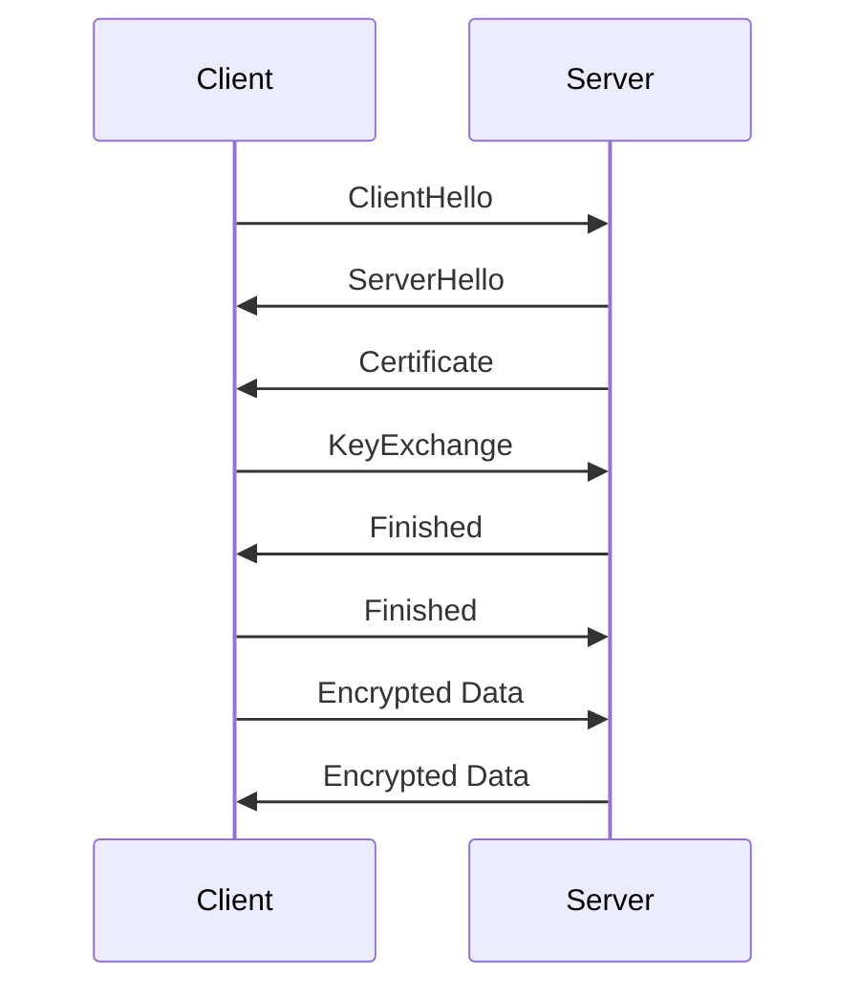

## 18.8 Implementing SSL/TLS in Ruby Applications

In today's digital landscape, securing data in transit is paramount. SSL (Secure Sockets Layer) and TLS (Transport Layer Security) are cryptographic protocols designed to provide secure communication over a computer network. In this section, we will explore how to implement SSL/TLS in Ruby applications, focusing on enabling HTTPS, managing certificates, and configuring secure protocols.

### Understanding SSL/TLS

SSL/TLS protocols are essential for encrypting data between a client and a server, ensuring that sensitive information such as passwords, credit card numbers, and personal data remain confidential. SSL is the predecessor of TLS, and while the term "SSL" is still commonly used, modern implementations use TLS.

#### Key Concepts

- **Encryption**: Converts data into a secure format that can only be read by someone with the correct decryption key.
- **Authentication**: Verifies the identity of the parties involved in the communication.
- **Integrity**: Ensures that the data has not been altered during transmission.

### Enabling HTTPS in Ruby Web Applications

To secure a Ruby web application with HTTPS, you need to configure your web server to use SSL/TLS. This involves obtaining an SSL/TLS certificate and configuring your server to use it.

#### Steps to Enable HTTPS

1. **Obtain an SSL/TLS Certificate**: Certificates can be obtained from Certificate Authorities (CAs) such as Let's Encrypt, which offers free certificates.
2. **Configure Your Web Server**: Depending on your web server (e.g., Nginx, Apache), you'll need to configure it to use the certificate.
3. **Update Application Configuration**: Ensure your Ruby application is configured to use HTTPS.

### Obtaining and Managing SSL/TLS Certificates

SSL/TLS certificates are digital certificates that authenticate the identity of a website and enable encrypted connections. Let's Encrypt is a popular choice for obtaining free SSL/TLS certificates.

#### Using Let's Encrypt

Let's Encrypt provides a simple way to obtain and renew certificates using the Certbot tool. Here's how you can use it:

1. **Install Certbot**: Follow the instructions on the [Certbot website](https://certbot.eff.org/) to install Certbot for your server.
2. **Obtain a Certificate**: Run Certbot to obtain a certificate for your domain.
   ```bash
   sudo certbot --nginx -d yourdomain.com -d www.yourdomain.com
   ```
3. **Renew Certificates Automatically**: Certbot can automatically renew certificates before they expire.
   ```bash
   sudo certbot renew --dry-run
   ```

### Setting Up SSL/TLS in Rails Applications

Ruby on Rails is a popular framework for building web applications. Configuring SSL/TLS in a Rails application involves setting up your web server and ensuring Rails is configured to use HTTPS.

#### Configuring Nginx for SSL/TLS

Nginx is a widely used web server that can be configured to handle SSL/TLS.

1. **Install Nginx**: Ensure Nginx is installed on your server.
2. **Edit Nginx Configuration**: Update the Nginx configuration file to include SSL/TLS settings.
   ```nginx
   server {
       listen 443 ssl;
       server_name yourdomain.com www.yourdomain.com;

       ssl_certificate /etc/letsencrypt/live/yourdomain.com/fullchain.pem;
       ssl_certificate_key /etc/letsencrypt/live/yourdomain.com/privkey.pem;

       ssl_protocols TLSv1.2 TLSv1.3;
       ssl_ciphers 'HIGH:!aNULL:!MD5';

       location / {
           proxy_pass http://localhost:3000;
           proxy_set_header Host $host;
           proxy_set_header X-Real-IP $remote_addr;
           proxy_set_header X-Forwarded-For $proxy_add_x_forwarded_for;
           proxy_set_header X-Forwarded-Proto $scheme;
       }
   }
   ```
3. **Test and Reload Nginx**: Test the configuration and reload Nginx.
   ```bash
   sudo nginx -t
   sudo systemctl reload nginx
   ```

#### Configuring Rails for HTTPS

In your Rails application, ensure that all traffic is redirected to HTTPS.

1. **Force SSL in Rails**: Add the following line to your `config/environments/production.rb` file.
   ```ruby
   config.force_ssl = true
   ```

### Configuring Secure Protocols and Cipher Suites

To ensure the highest level of security, configure your server to use the latest protocols and cipher suites.

#### Recommended Protocols and Ciphers

- **Protocols**: Use TLSv1.2 and TLSv1.3.
- **Ciphers**: Use strong ciphers that provide forward secrecy.

### Testing SSL/TLS Configurations

After setting up SSL/TLS, it's crucial to test your configuration to ensure it's secure.

#### Tools for Testing

- **SSL Labs**: Use [SSL Labs](https://www.ssllabs.com/ssltest/) to test your server's SSL/TLS configuration.
- **OpenSSL**: Use OpenSSL commands to test your server's SSL/TLS setup.

### Visualizing SSL/TLS Handshake

To better understand how SSL/TLS works, let's visualize the handshake process using a sequence diagram.



**Description**: This diagram illustrates the SSL/TLS handshake process, where the client and server exchange messages to establish a secure connection.

### Knowledge Check

- **Why is SSL/TLS important for web applications?**
- **What are the steps to enable HTTPS in a Ruby web application?**
- **How can you obtain an SSL/TLS certificate for free?**

### Try It Yourself

Experiment with the provided Nginx configuration by modifying the cipher suites and testing the impact on security using SSL Labs.

### Conclusion

Implementing SSL/TLS in Ruby applications is a crucial step in securing data in transit. By following the steps outlined in this guide, you can ensure that your applications are protected against eavesdropping and data tampering. Remember, security is an ongoing process, and staying informed about the latest best practices is essential.

## Quiz: Implementing SSL/TLS in Ruby Applications



### What is the primary purpose of SSL/TLS in web applications?

- [x] To encrypt data between a client and a server
- [ ] To improve website loading speed
- [ ] To manage user sessions
- [ ] To enhance SEO rankings

> **Explanation:** SSL/TLS is primarily used to encrypt data in transit, ensuring confidentiality and integrity.

### Which tool can be used to obtain a free SSL/TLS certificate?

- [x] Certbot
- [ ] OpenSSL
- [ ] Wireshark
- [ ] Nmap

> **Explanation:** Certbot is a tool provided by Let's Encrypt to obtain free SSL/TLS certificates.

### What configuration is necessary in Rails to enforce HTTPS?

- [x] `config.force_ssl = true`
- [ ] `config.enable_https = true`
- [ ] `config.ssl_enforce = true`
- [ ] `config.use_ssl = true`

> **Explanation:** The `config.force_ssl = true` setting in Rails ensures that all traffic is redirected to HTTPS.

### Which protocols should be used for secure SSL/TLS communication?

- [x] TLSv1.2 and TLSv1.3
- [ ] SSLv3 and TLSv1.0
- [ ] SSLv2 and SSLv3
- [ ] TLSv1.0 and TLSv1.1

> **Explanation:** TLSv1.2 and TLSv1.3 are the recommended protocols for secure communication.

### What is the role of a Certificate Authority (CA)?

- [x] To issue digital certificates
- [ ] To encrypt data
- [ ] To manage DNS records
- [ ] To host websites

> **Explanation:** A Certificate Authority issues digital certificates that authenticate the identity of websites.

### Which command tests the Nginx configuration?

- [x] `sudo nginx -t`
- [ ] `sudo nginx -reload`
- [ ] `sudo nginx -config`
- [ ] `sudo nginx -check`

> **Explanation:** The `sudo nginx -t` command tests the Nginx configuration for errors.

### What is a key benefit of using Let's Encrypt?

- [x] Free SSL/TLS certificates
- [ ] Faster data transmission
- [ ] Improved server performance
- [ ] Enhanced SEO

> **Explanation:** Let's Encrypt provides free SSL/TLS certificates, making it accessible for everyone.

### Which tool can be used to test SSL/TLS configurations?

- [x] SSL Labs
- [ ] Wireshark
- [ ] Nmap
- [ ] Certbot

> **Explanation:** SSL Labs is a popular tool for testing SSL/TLS configurations.

### What does the `ssl_protocols` directive in Nginx specify?

- [x] The SSL/TLS protocols to be used
- [ ] The server's IP address
- [ ] The domain name
- [ ] The server's hostname

> **Explanation:** The `ssl_protocols` directive specifies which SSL/TLS protocols the server should use.

### True or False: SSL and TLS are the same protocols.

- [ ] True
- [x] False

> **Explanation:** SSL is the predecessor of TLS, and while they serve similar purposes, TLS is the more modern and secure protocol.



Remember, implementing SSL/TLS is just one aspect of securing your Ruby applications. Stay informed, keep your systems updated, and continue to learn about new security practices.
