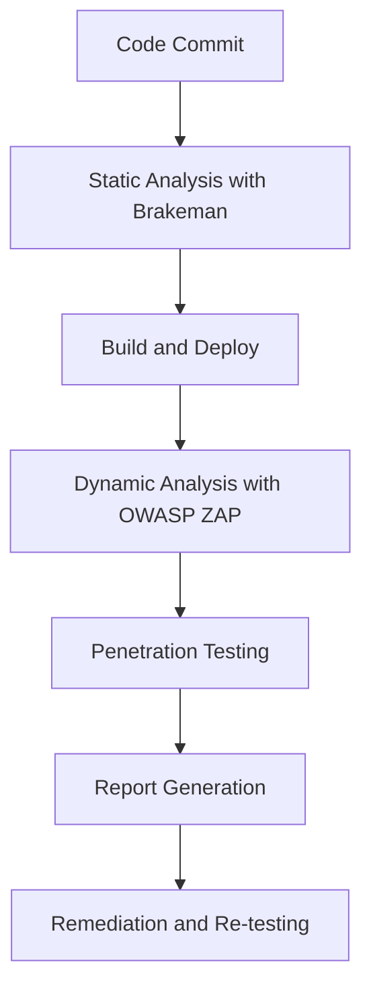

## 18.9 Security Testing and Vulnerability Scanning

In today's digital landscape, ensuring the security of your applications is paramount. Security testing and vulnerability scanning are crucial processes in identifying and mitigating potential threats to your Ruby applications. This section will guide you through the importance of regular security testing, the different types of security tests, and how to integrate these practices into your development workflow.

### The Importance of Regular Security Testing

Security testing is a proactive measure to identify vulnerabilities before they can be exploited by malicious actors. Regular security testing helps in:

- **Protecting Sensitive Data**: Ensuring that personal and sensitive information is secure from unauthorized access.
- **Maintaining Trust**: Building and maintaining user trust by demonstrating a commitment to security.
- **Compliance**: Meeting industry standards and regulatory requirements for data protection.
- **Preventing Financial Loss**: Avoiding the costs associated with data breaches, including fines, legal fees, and loss of business.

### Types of Security Tests

Security testing can be broadly categorized into three types: static analysis, dynamic analysis, and penetration testing. Each type serves a unique purpose and provides different insights into the security posture of your application.

#### Static Analysis

Static analysis involves examining the source code of an application without executing it. This type of analysis helps identify vulnerabilities such as SQL injection, cross-site scripting (XSS), and insecure data handling practices.

**Tool Highlight: Brakeman**

[Brakeman](https://brakemanscanner.org/) is a popular static analysis tool specifically designed for Ruby on Rails applications. It scans the codebase for security vulnerabilities and provides detailed reports.

```ruby
# Example of a potential vulnerability detected by Brakeman
def user_input
  params[:user_input] # Potential SQL injection vulnerability
end
```

Brakeman can be integrated into your CI/CD pipeline to ensure that security checks are performed automatically with every code change.

#### Dynamic Analysis

Dynamic analysis involves testing the application in a running state. This type of testing simulates real-world attacks to identify vulnerabilities that may not be apparent in the source code.

**Tool Highlight: OWASP ZAP**

[OWASP ZAP](https://www.zaproxy.org/) is a widely-used tool for dynamic analysis. It acts as a proxy to intercept and analyze HTTP requests and responses, allowing you to identify security issues in web applications.

```bash
# Example command to start OWASP ZAP in headless mode
zap.sh -daemon -config api.disablekey=true
```

#### Penetration Testing

Penetration testing, or pen testing, involves simulating attacks on the application to identify vulnerabilities from an attacker's perspective. This type of testing is often performed by security professionals and provides a comprehensive assessment of the application's security.

### Integrating Security Testing into CI/CD Pipelines

Integrating security testing into your CI/CD pipeline ensures that vulnerabilities are identified and addressed early in the development process. This integration can be achieved by:

- **Automating Static Analysis**: Use tools like Brakeman to automatically scan the codebase for vulnerabilities during the build process.
- **Running Dynamic Analysis**: Incorporate tools like OWASP ZAP to perform dynamic analysis on deployed environments.
- **Continuous Monitoring**: Set up alerts and notifications for identified vulnerabilities to ensure timely remediation.

```yaml
# Example CI/CD pipeline configuration for integrating Brakeman
stages:
  - test

brakeman:
  stage: test
  script:
    - brakeman -o brakeman-output.json
  artifacts:
    paths:
      - brakeman-output.json
```

### Timely Remediation of Identified Vulnerabilities

Identifying vulnerabilities is only the first step; timely remediation is crucial to maintaining a secure application. Best practices for remediation include:

- **Prioritizing Vulnerabilities**: Focus on high-risk vulnerabilities that pose the greatest threat to the application.
- **Implementing Fixes**: Develop and deploy patches to address identified vulnerabilities.
- **Re-testing**: After remediation, re-test the application to ensure that vulnerabilities have been effectively addressed.

### Visualizing Security Testing Workflow

Below is a diagram illustrating the workflow of integrating security testing into a CI/CD pipeline:



**Diagram Description**: This flowchart represents the integration of security testing into a CI/CD pipeline, starting from code commit to remediation and re-testing.

### References and Further Reading

- [Brakeman Documentation](https://brakemanscanner.org/docs/)
- [OWASP ZAP User Guide](https://www.zaproxy.org/docs/)
- [CI/CD Security Best Practices](https://www.redhat.com/en/topics/devops/what-is-ci-cd)

### Knowledge Check

- What are the three main types of security tests?
- How can Brakeman be integrated into a CI/CD pipeline?
- Why is timely remediation of vulnerabilities important?

### Embrace the Journey

Remember, security is an ongoing process. As you continue to develop and maintain your Ruby applications, regular security testing and vulnerability scanning will help you stay ahead of potential threats. Keep learning, stay vigilant, and enjoy the journey of building secure applications!

## Quiz: Security Testing and Vulnerability Scanning



### What is the primary purpose of security testing?

- [x] To identify and mitigate potential vulnerabilities
- [ ] To improve application performance
- [ ] To enhance user interface design
- [ ] To increase code readability

> **Explanation:** Security testing is primarily aimed at identifying and mitigating potential vulnerabilities in an application.

### Which tool is specifically designed for static analysis of Ruby on Rails applications?

- [x] Brakeman
- [ ] OWASP ZAP
- [ ] JMeter
- [ ] Selenium

> **Explanation:** Brakeman is a static analysis tool specifically designed for Ruby on Rails applications.

### What type of analysis involves testing the application in a running state?

- [ ] Static Analysis
- [x] Dynamic Analysis
- [ ] Code Review
- [ ] Unit Testing

> **Explanation:** Dynamic analysis involves testing the application in a running state to identify vulnerabilities.

### Which tool is commonly used for dynamic analysis of web applications?

- [ ] Brakeman
- [x] OWASP ZAP
- [ ] GitLab CI
- [ ] Jenkins

> **Explanation:** OWASP ZAP is a widely-used tool for dynamic analysis of web applications.

### What is the role of penetration testing?

- [x] To simulate attacks and identify vulnerabilities from an attacker's perspective
- [ ] To improve code quality
- [ ] To enhance user experience
- [ ] To optimize database queries

> **Explanation:** Penetration testing involves simulating attacks to identify vulnerabilities from an attacker's perspective.

### How can security testing be integrated into a CI/CD pipeline?

- [x] By automating static analysis and dynamic analysis
- [ ] By manually reviewing code changes
- [ ] By increasing server capacity
- [ ] By reducing deployment frequency

> **Explanation:** Security testing can be integrated into a CI/CD pipeline by automating static and dynamic analysis.

### Why is it important to prioritize vulnerabilities?

- [x] To focus on high-risk vulnerabilities that pose the greatest threat
- [ ] To improve application aesthetics
- [ ] To reduce code complexity
- [ ] To enhance user engagement

> **Explanation:** Prioritizing vulnerabilities allows teams to focus on high-risk issues that pose the greatest threat to the application.

### What should be done after vulnerabilities are remediated?

- [x] Re-test the application to ensure vulnerabilities are addressed
- [ ] Increase the application's feature set
- [ ] Reduce the application's functionality
- [ ] Ignore further testing

> **Explanation:** After remediation, re-testing the application ensures that vulnerabilities have been effectively addressed.

### Which of the following is a benefit of regular security testing?

- [x] Maintaining user trust
- [ ] Increasing application size
- [ ] Reducing code readability
- [ ] Decreasing application speed

> **Explanation:** Regular security testing helps maintain user trust by demonstrating a commitment to security.

### True or False: Security testing is a one-time process.

- [ ] True
- [x] False

> **Explanation:** Security testing is an ongoing process that should be conducted regularly to ensure application security.




