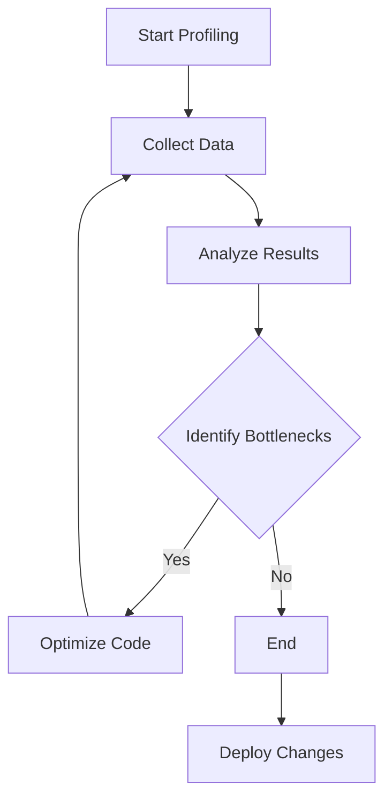

## 19.1 Profiling Ruby Applications

In the world of software development, performance is a critical aspect that can make or break an application. As Ruby developers, we strive to build applications that are not only functional but also efficient and responsive. Profiling is a powerful technique that helps us achieve this goal by identifying performance bottlenecks and optimizing resource usage. In this section, we will explore the concept of profiling, introduce some popular profiling tools, and demonstrate how to use them effectively to enhance your Ruby applications.

### What is Profiling?

Profiling is the process of analyzing a program to determine where it spends most of its time and how it uses resources such as CPU and memory. By understanding these aspects, developers can pinpoint performance bottlenecks and make informed decisions about where to focus optimization efforts. Profiling is essential for:

- **Identifying Inefficiencies**: Discovering slow or resource-intensive parts of your code.
- **Improving Performance**: Enhancing the speed and responsiveness of your application.
- **Optimizing Resource Usage**: Reducing CPU and memory consumption.
- **Ensuring Scalability**: Preparing your application to handle increased load.

### Why Profiling is Important

Profiling is crucial because it provides insights that are not apparent from simply reading code or running tests. It helps you understand the real-world performance characteristics of your application, which can be affected by various factors such as data size, user interactions, and system architecture. By profiling your application, you can:

- **Detect Performance Bottlenecks**: Identify the parts of your code that are slowing down your application.
- **Optimize Critical Paths**: Focus your optimization efforts on the most impactful areas.
- **Validate Performance Improvements**: Measure the effectiveness of your optimizations.
- **Enhance User Experience**: Deliver a faster and more responsive application to your users.

### Profiling Tools for Ruby

Ruby offers several powerful tools for profiling applications. In this section, we will introduce three popular profiling tools: `ruby-prof`, `stackprof`, and `perftools.rb`. Each tool has its strengths and is suited for different profiling needs.

#### ruby-prof

[ruby-prof](https://github.com/ruby-prof/ruby-prof) is a fast code profiler for Ruby that provides detailed reports on CPU and memory usage. It is highly configurable and supports various output formats, including text, graph, and call tree.

**Installation:**

To install `ruby-prof`, run the following command:

```bash
gem install ruby-prof
```

**Basic Usage:**

Here's a simple example of how to use `ruby-prof` to profile a Ruby script:

```ruby
require 'ruby-prof'

# Start profiling
RubyProf.start

# Code to profile
def fibonacci(n)
  return n if n <= 1
  fibonacci(n - 1) + fibonacci(n - 2)
end

fibonacci(30)

# Stop profiling
result = RubyProf.stop

# Print a flat profile to text
printer = RubyProf::FlatPrinter.new(result)
printer.print(STDOUT)
```

**Interpreting Results:**

The output of `ruby-prof` provides a detailed breakdown of method calls, including the time spent in each method and the number of calls. This information helps you identify which methods are consuming the most resources.

#### stackprof

[stackprof](https://github.com/tmm1/stackprof) is a sampling call-stack profiler for Ruby. It is lightweight and provides insights into CPU usage by sampling the call stack at regular intervals.

**Installation:**

To install `stackprof`, run the following command:

```bash
gem install stackprof
```

**Basic Usage:**

Here's how to use `stackprof` to profile a Ruby script:

```ruby
require 'stackprof'

# Profile the block of code
StackProf.run(mode: :cpu, out: 'stackprof.dump') do
  # Code to profile
  def factorial(n)
    return 1 if n == 0
    n * factorial(n - 1)
  end

  factorial(5000)
end

# Analyze the results
system('stackprof stackprof.dump --text')
```

**Interpreting Results:**

The `stackprof` output shows the percentage of time spent in each method, helping you identify which methods are the most CPU-intensive.

#### perftools.rb

[perftools.rb](https://github.com/tmm1/perftools.rb) is a Ruby interface to the Google Performance Tools (gperftools). It provides detailed CPU and memory profiling information.

**Installation:**

To install `perftools.rb`, you need to have gperftools installed on your system. Once installed, you can add `perftools.rb` to your Gemfile:

```ruby
gem 'perftools.rb'
```

**Basic Usage:**

Here's an example of how to use `perftools.rb` to profile a Ruby script:

```ruby
require 'perftools'

# Start profiling
PerfTools::CpuProfiler.start("/tmp/profile_data") do
  # Code to profile
  def sum_of_squares(n)
    (1..n).map { |i| i * i }.reduce(:+)
  end

  sum_of_squares(10000)
end

# Analyze the results using pprof
system('pprof.rb --text /tmp/profile_data')
```

**Interpreting Results:**

`perftools.rb` provides detailed information about CPU usage, including call graphs and flat profiles. This helps you understand the flow of execution and identify bottlenecks.

### Profiling Web Applications

Profiling web applications requires special considerations due to the complexity of web environments. One popular tool for profiling Ruby web applications is `rack-mini-profiler`.

#### rack-mini-profiler

[rack-mini-profiler](https://github.com/MiniProfiler/rack-mini-profiler) is a middleware that provides insights into the performance of web requests. It is easy to integrate with Ruby web frameworks like Rails and Sinatra.

**Installation:**

To install `rack-mini-profiler`, add it to your Gemfile:

```ruby
gem 'rack-mini-profiler'
```

**Basic Usage:**

Here's how to use `rack-mini-profiler` in a Rails application:

1. Add the gem to your Gemfile and run `bundle install`.
2. Add the following line to your `config/application.rb`:

```ruby
require 'rack-mini-profiler'
Rack::MiniProfilerRails.initialize!(Rails.application)
```

3. Start your Rails server and access your application. You will see a small panel displaying profiling information for each request.

**Interpreting Results:**

`rack-mini-profiler` provides detailed information about the time spent in each part of the request lifecycle, including database queries, view rendering, and more. This helps you identify slow parts of your application and optimize them.

### Interpreting Profiling Results

Interpreting profiling results is crucial for identifying performance bottlenecks and making informed optimization decisions. Here are some tips for analyzing profiling data:

- **Focus on Hotspots**: Identify methods or parts of your code that consume the most resources and focus your optimization efforts there.
- **Look for Inefficient Algorithms**: Check if there are any algorithms that can be optimized or replaced with more efficient ones.
- **Analyze Memory Usage**: Identify memory leaks or excessive memory usage that can be optimized.
- **Consider I/O Operations**: Check if there are any slow I/O operations that can be optimized or parallelized.

### Profiling in Production-like Environments

Profiling in production-like environments is essential to obtain accurate performance data. Here are some best practices for profiling in such environments:

- **Use Realistic Data**: Profile your application with data that closely resembles production data to get accurate results.
- **Simulate User Load**: Use tools like Apache JMeter or Locust to simulate user load and profile your application under realistic conditions.
- **Monitor System Resources**: Keep an eye on system resources such as CPU, memory, and disk usage to identify any bottlenecks.

### Try It Yourself

Now that we've covered the basics of profiling Ruby applications, it's time to try it yourself. Use the code examples provided in this section to profile your own Ruby scripts and web applications. Experiment with different profiling tools and analyze the results to identify performance bottlenecks. Remember, profiling is an iterative process, so keep refining your code and re-profiling to achieve optimal performance.

### Visualizing Profiling Data

Visualizing profiling data can help you understand the performance characteristics of your application more intuitively. Here are some ways to visualize profiling data:



**Figure 1: Profiling Workflow**

This diagram illustrates the typical workflow of profiling an application. Start by collecting profiling data, analyze the results to identify bottlenecks, optimize the code, and repeat the process until the performance is satisfactory.

### References and Further Reading

- [ruby-prof GitHub Repository](https://github.com/ruby-prof/ruby-prof)
- [stackprof GitHub Repository](https://github.com/tmm1/stackprof)
- [perftools.rb GitHub Repository](https://github.com/tmm1/perftools.rb)
- [rack-mini-profiler GitHub Repository](https://github.com/MiniProfiler/rack-mini-profiler)

### Knowledge Check

Before we wrap up, let's test your understanding of profiling Ruby applications. Try answering the following questions to reinforce your learning.

## Quiz: Profiling Ruby Applications



### What is the primary purpose of profiling a Ruby application?

- [x] To identify performance bottlenecks
- [ ] To add new features
- [ ] To refactor code
- [ ] To improve code readability

> **Explanation:** Profiling is primarily used to identify performance bottlenecks in an application.

### Which tool is a fast code profiler for Ruby that provides detailed reports on CPU and memory usage?

- [x] ruby-prof
- [ ] stackprof
- [ ] perftools.rb
- [ ] rack-mini-profiler

> **Explanation:** ruby-prof is a fast code profiler for Ruby that provides detailed reports on CPU and memory usage.

### How does stackprof profile a Ruby application?

- [x] By sampling the call stack at regular intervals
- [ ] By analyzing memory usage
- [ ] By generating a call graph
- [ ] By monitoring I/O operations

> **Explanation:** stackprof profiles a Ruby application by sampling the call stack at regular intervals.

### Which tool provides insights into the performance of web requests in Ruby web applications?

- [ ] ruby-prof
- [ ] stackprof
- [ ] perftools.rb
- [x] rack-mini-profiler

> **Explanation:** rack-mini-profiler provides insights into the performance of web requests in Ruby web applications.

### What is a key benefit of profiling in production-like environments?

- [x] Obtaining accurate performance data
- [ ] Reducing code complexity
- [ ] Enhancing code readability
- [ ] Simplifying deployment

> **Explanation:** Profiling in production-like environments helps obtain accurate performance data.

### Which of the following is NOT a profiling tool for Ruby?

- [ ] ruby-prof
- [ ] stackprof
- [ ] perftools.rb
- [x] JMeter

> **Explanation:** JMeter is a load testing tool, not a profiling tool for Ruby.

### What should you focus on when interpreting profiling results?

- [x] Hotspots
- [ ] Code readability
- [ ] Code complexity
- [ ] Code style

> **Explanation:** When interpreting profiling results, focus on hotspots that consume the most resources.

### What is the purpose of visualizing profiling data?

- [x] To understand performance characteristics intuitively
- [ ] To improve code readability
- [ ] To refactor code
- [ ] To add new features

> **Explanation:** Visualizing profiling data helps understand performance characteristics intuitively.

### Which tool requires gperftools to be installed on the system?

- [ ] ruby-prof
- [ ] stackprof
- [x] perftools.rb
- [ ] rack-mini-profiler

> **Explanation:** perftools.rb requires gperftools to be installed on the system.

### Profiling is an iterative process. True or False?

- [x] True
- [ ] False

> **Explanation:** Profiling is an iterative process where you continuously refine your code and re-profile to achieve optimal performance.



Remember, profiling is a powerful tool in your arsenal for building efficient and scalable Ruby applications. Keep experimenting, stay curious, and enjoy the journey of optimizing your code!
