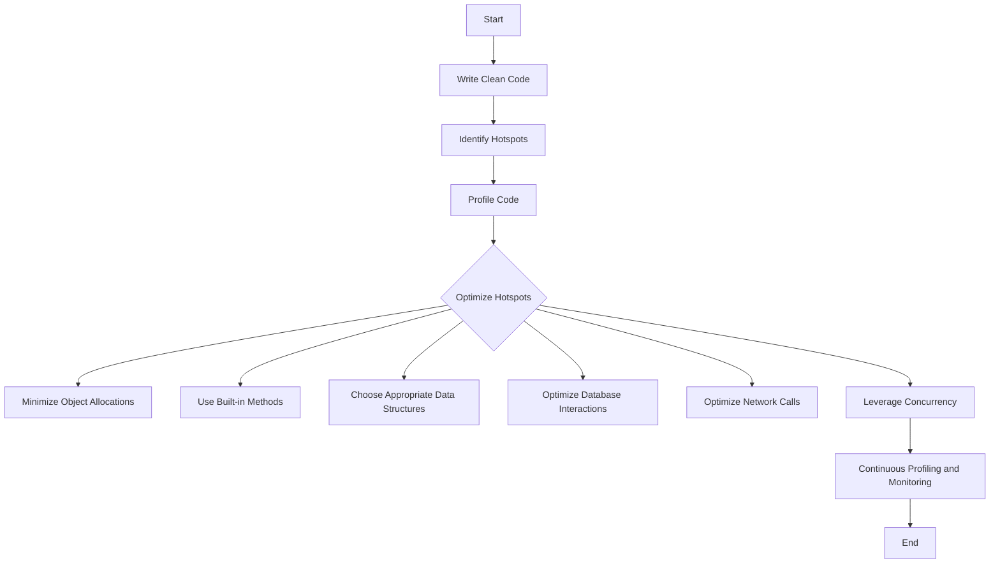

## 19.10 Best Practices for High-Performance Ruby Code

In the world of software development, performance is a critical aspect that can make or break an application. Ruby, known for its elegance and simplicity, can sometimes be perceived as slower compared to other languages. However, with the right techniques and practices, Ruby can be optimized to perform efficiently even under heavy loads. In this section, we will explore best practices for writing high-performance Ruby code, focusing on efficiency, scalability, and maintainability.

### Key Principles for High-Performance Ruby Code

#### Write Clean and Maintainable Code

Before diving into performance optimization, it's crucial to write clean and maintainable code. Clean code is easier to understand, debug, and optimize. Follow these principles:

- **Adopt a consistent coding style**: Use Ruby style guides to maintain consistency across your codebase.
- **Refactor regularly**: Keep your codebase clean by refactoring and removing unnecessary complexity.
- **Avoid premature optimization**: Focus on writing clear and correct code first, then optimize the bottlenecks.

#### Focus on Hotspots

Identify the parts of your code that are most critical to performance. These are often referred to as "hotspots." Use profiling tools to find these areas and focus your optimization efforts there.

- **Use profiling tools**: Tools like `ruby-prof`, `stackprof`, and `benchmark` can help identify performance bottlenecks.
- **Measure before optimizing**: Always measure the performance impact of your changes to ensure they have the desired effect.

### Coding Techniques for Enhanced Performance

#### Minimize Object Allocations

Ruby is an object-oriented language, and creating objects can be expensive in terms of memory and CPU usage. Minimize unnecessary object allocations to improve performance.

```ruby
# Avoid creating unnecessary objects
# Bad
def sum_array(arr)
  arr.map { |n| n.to_i }.reduce(:+)
end

# Good
def sum_array(arr)
  arr.reduce(0) { |sum, n| sum + n }
end
```

#### Use Built-in Methods

Ruby's standard library provides a wealth of built-in methods that are optimized for performance. Use these methods instead of writing custom implementations.

```ruby
# Use built-in methods for better performance
# Bad
def reverse_string(str)
  reversed = ""
  str.each_char { |char| reversed = char + reversed }
  reversed
end

# Good
def reverse_string(str)
  str.reverse
end
```

#### Choose Appropriate Data Structures and Algorithms

Selecting the right data structures and algorithms is crucial for performance. Consider time and space complexity when choosing data structures.

- **Arrays vs. Hashes**: Use arrays for ordered collections and hashes for key-value pairs.
- **Sets for uniqueness**: Use `Set` when you need to ensure uniqueness and fast lookups.

```ruby
require 'set'

# Use Set for unique collections
unique_numbers = Set.new([1, 2, 3, 2, 1])
```

### Continuous Profiling and Monitoring

Performance optimization is an ongoing process. Continuously profile and monitor your application to catch performance regressions early.

- **Automate profiling**: Integrate profiling into your CI/CD pipeline to catch performance issues before they reach production.
- **Use monitoring tools**: Tools like New Relic and Skylight can provide insights into your application's performance in production.

### Optimizing Database Interactions

Database interactions are often a major source of performance bottlenecks. Optimize these interactions to improve overall application performance.

#### Use Efficient Queries

Write efficient SQL queries to minimize database load. Use indexes, avoid N+1 queries, and fetch only the data you need.

```ruby
# Avoid N+1 queries
# Bad
users.each do |user|
  puts user.posts.count
end

# Good
users.includes(:posts).each do |user|
  puts user.posts.count
end
```

#### Cache Results

Cache expensive database queries to reduce load and improve response times. Use caching libraries like `redis` or `memcached`.

```ruby
# Cache results to improve performance
def expensive_query
  Rails.cache.fetch('expensive_query', expires_in: 12.hours) do
    # Perform expensive query
  end
end
```

### Optimizing Network Calls

Network calls can be slow and unpredictable. Optimize these interactions to improve application responsiveness.

#### Use Asynchronous Processing

Perform network calls asynchronously to avoid blocking the main thread. Use libraries like `Sidekiq` or `Resque` for background processing.

```ruby
# Use Sidekiq for background processing
class NetworkWorker
  include Sidekiq::Worker

  def perform(url)
    # Perform network call
  end
end
```

#### Batch Requests

Batch multiple network requests into a single request to reduce latency and improve performance.

### Concurrency and Parallelism

Ruby's concurrency model can be leveraged to improve performance, especially for I/O-bound tasks.

#### Use Threads and Fibers

Ruby supports threads and fibers for concurrent execution. Use threads for I/O-bound tasks and fibers for lightweight concurrency.

```ruby
# Use threads for concurrent execution
threads = []
10.times do
  threads << Thread.new do
    # Perform I/O-bound task
  end
end
threads.each(&:join)
```

#### Leverage Ractors

Ruby 3 introduced Ractors for parallel execution. Use Ractors for CPU-bound tasks to take advantage of multi-core processors.

```ruby
# Use Ractors for parallel execution
ractor = Ractor.new do
  # Perform CPU-bound task
end
ractor.take
```

### Try It Yourself

Experiment with the code examples provided in this section. Try modifying them to see how changes affect performance. For instance, try replacing a built-in method with a custom implementation and measure the performance difference.

### Visualizing Ruby's Performance Optimization

Below is a flowchart that visualizes the process of optimizing Ruby code for performance:



### References and Links

- [Ruby Style Guide](https://rubystyle.guide/)
- [Ruby Profiler](https://ruby-prof.github.io/)
- [New Relic](https://newrelic.com/)
- [Skylight](https://www.skylight.io/)

### Knowledge Check

- What are the benefits of using built-in methods in Ruby?
- How can you minimize object allocations in Ruby?
- Why is it important to choose the right data structures and algorithms?
- How can you optimize database interactions in a Ruby application?
- What role does concurrency play in Ruby performance optimization?

### Embrace the Journey

Remember, performance optimization is a journey, not a destination. As you continue to develop your Ruby applications, keep these best practices in mind. Stay curious, experiment with different techniques, and enjoy the process of making your code faster and more efficient.

## Quiz: Best Practices for High-Performance Ruby Code



### What is the first step in optimizing Ruby code for performance?

- [x] Write clean and maintainable code
- [ ] Use Ractors for parallel execution
- [ ] Minimize object allocations
- [ ] Optimize database interactions

> **Explanation:** Writing clean and maintainable code is the foundation for any optimization efforts. It ensures that the code is easy to understand and modify.

### Which tool can be used to identify performance bottlenecks in Ruby code?

- [x] ruby-prof
- [ ] Sidekiq
- [ ] Redis
- [ ] Ractor

> **Explanation:** `ruby-prof` is a profiling tool that helps identify performance bottlenecks in Ruby code.

### How can you minimize object allocations in Ruby?

- [x] Avoid creating unnecessary objects
- [ ] Use Ractors for parallel execution
- [ ] Perform network calls asynchronously
- [ ] Use caching libraries

> **Explanation:** Minimizing object allocations involves avoiding the creation of unnecessary objects, which can reduce memory usage and improve performance.

### What is a common technique to optimize database interactions?

- [x] Use efficient queries and avoid N+1 queries
- [ ] Use threads for concurrent execution
- [ ] Batch multiple network requests
- [ ] Use built-in methods

> **Explanation:** Writing efficient queries and avoiding N+1 queries can significantly improve database interaction performance.

### Which Ruby feature introduced in version 3 can be used for parallel execution?

- [x] Ractors
- [ ] Threads
- [ ] Fibers
- [ ] Sidekiq

> **Explanation:** Ractors, introduced in Ruby 3, allow for parallel execution, taking advantage of multi-core processors.

### What is the benefit of using built-in methods in Ruby?

- [x] They are optimized for performance
- [ ] They are easier to read
- [ ] They reduce code complexity
- [ ] They are more secure

> **Explanation:** Built-in methods are optimized for performance and can be more efficient than custom implementations.

### How can you optimize network calls in Ruby applications?

- [x] Perform network calls asynchronously
- [ ] Use Ractors for parallel execution
- [ ] Minimize object allocations
- [ ] Use efficient queries

> **Explanation:** Performing network calls asynchronously can prevent blocking the main thread and improve application responsiveness.

### What is the role of continuous profiling in performance optimization?

- [x] To catch performance regressions early
- [ ] To write clean and maintainable code
- [ ] To minimize object allocations
- [ ] To use built-in methods

> **Explanation:** Continuous profiling helps catch performance regressions early, ensuring that the application remains efficient over time.

### Which data structure should be used for unique collections in Ruby?

- [x] Set
- [ ] Array
- [ ] Hash
- [ ] Queue

> **Explanation:** `Set` is used for unique collections and provides fast lookups.

### True or False: Premature optimization is a recommended practice in Ruby development.

- [ ] True
- [x] False

> **Explanation:** Premature optimization is not recommended as it can lead to complex and hard-to-maintain code. Focus on writing clear and correct code first.


