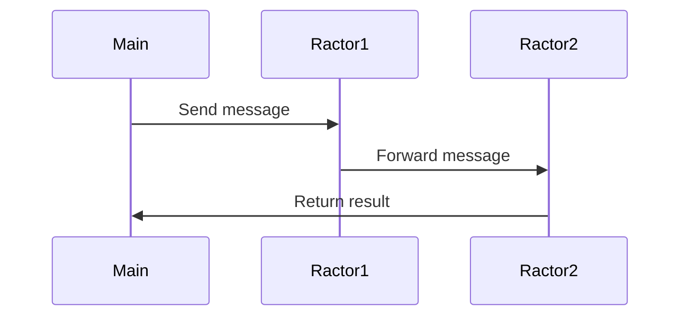

## 19.11 Concurrency Optimization with Ractors

In this section, we delve into the world of concurrency optimization using Ractors, a powerful feature introduced in Ruby 3. Ractors provide a way to achieve parallel execution in Ruby applications, allowing developers to harness the full potential of multi-core processors. Let's explore how to effectively use Ractors to build scalable and maintainable applications.

### Introduction to Ractors

Ractors, short for "Ruby Actors," are an abstraction for parallel execution in Ruby. They allow you to run Ruby code concurrently, leveraging multiple CPU cores. Unlike traditional threads, Ractors provide a safer concurrency model by isolating state and communication between them.

#### Key Features of Ractors

- **Isolation**: Each Ractor has its own memory space, preventing data races and ensuring thread safety.
- **Message Passing**: Ractors communicate through message passing, avoiding shared state and reducing synchronization issues.
- **Parallel Execution**: Ractors can run truly parallel on multi-core systems, unlike Ruby threads which are limited by the Global Interpreter Lock (GIL).

### Structuring Applications with Ractors

To effectively use Ractors, it's essential to structure your application in a way that maximizes their benefits. Here are some strategies:

#### Identify Concurrency Opportunities

1. **Task Decomposition**: Break down your application into independent tasks that can be executed concurrently. This is crucial for leveraging Ractors effectively.
2. **Data Isolation**: Ensure that each task operates on its own data set to avoid the need for synchronization.
3. **Communication Design**: Plan how Ractors will communicate with each other. Use message passing to exchange data between Ractors.

#### Implementing Ractors

Let's look at a simple example of using Ractors to perform concurrent computations:

```ruby
# Define a method to perform a computation
def compute_square(number)
  number * number
end

# Create an array of numbers
numbers = [1, 2, 3, 4, 5]

# Create a Ractor for each computation
ractors = numbers.map do |number|
  Ractor.new(number) do |num|
    compute_square(num)
  end
end

# Collect results from each Ractor
results = ractors.map(&:take)

puts "Squares: #{results}"
```

In this example, we create a Ractor for each number in the array to compute its square concurrently. Each Ractor runs in parallel, and we collect the results using the `take` method.

### Synchronization and Communication

Ractors communicate through message passing, which involves sending and receiving messages between them. This model avoids shared state and reduces the complexity of synchronization.

#### Sending and Receiving Messages

- **Sending Messages**: Use the `send` method to send messages to a Ractor.
- **Receiving Messages**: Use the `receive` method to receive messages in a Ractor.

Here's an example demonstrating message passing between Ractors:

```ruby
# Create a Ractor to send a message
sender = Ractor.new do
  Ractor.yield "Hello from sender!"
end

# Create a Ractor to receive a message
receiver = Ractor.new(sender) do |sender_ractor|
  message = sender_ractor.take
  puts "Received message: #{message}"
end

receiver.take
```

In this example, the `sender` Ractor sends a message, and the `receiver` Ractor receives and prints it.

### Best Practices for Using Ractors

1. **Minimize Communication Overhead**: Keep message passing between Ractors efficient to avoid bottlenecks.
2. **Avoid Shared State**: Design your application to minimize shared state and rely on message passing for communication.
3. **Error Handling**: Implement robust error handling within Ractors to manage failures gracefully.
4. **Resource Management**: Monitor resource usage and ensure Ractors are properly terminated to avoid resource leaks.

### Limitations and Considerations

While Ractors offer powerful concurrency capabilities, there are some limitations and considerations to keep in mind:

- **Complexity**: Designing applications with Ractors can be complex, especially when dealing with communication and synchronization.
- **Overhead**: Creating and managing Ractors incurs overhead, so use them judiciously.
- **Compatibility**: Ensure that libraries and gems used in your application are compatible with Ractors.

### Performance Considerations

Ractors can significantly improve the performance of Ruby applications by enabling parallel execution. However, it's important to measure and optimize performance:

- **Profiling**: Use profiling tools to identify bottlenecks and optimize Ractor usage.
- **Benchmarking**: Conduct benchmarks to compare the performance of Ractor-based implementations with traditional approaches.
- **Scalability**: Test the scalability of your application by increasing the number of Ractors and measuring performance.

### Potential Use Cases

Ractors are well-suited for applications that require parallel processing and can benefit from concurrency, such as:

- **Data Processing**: Perform parallel data processing tasks, such as transforming large datasets.
- **Web Servers**: Handle multiple requests concurrently in web server applications.
- **Simulations**: Run simulations that involve independent computations.

### Try It Yourself

Experiment with Ractors by modifying the examples provided. Try creating Ractors for different tasks, such as fetching data from APIs or processing files concurrently. Observe how Ractors improve performance and scalability in your applications.

### Visualizing Ractor Communication

To better understand Ractor communication, let's visualize the message passing process using a sequence diagram:



This diagram illustrates the flow of messages between Ractors and the main process, highlighting the isolation and communication model.

### Conclusion

Ractors provide a powerful tool for optimizing concurrency in Ruby applications. By leveraging parallel execution and message passing, you can build scalable and maintainable applications that take full advantage of modern multi-core processors. Remember to design your applications with data isolation and efficient communication in mind, and always measure performance to ensure optimal results.

## Quiz: Concurrency Optimization with Ractors



### What is the primary advantage of using Ractors in Ruby?

- [x] They provide parallel execution by isolating state and using message passing.
- [ ] They allow direct access to shared memory for faster computation.
- [ ] They eliminate the need for synchronization in concurrent applications.
- [ ] They are a replacement for all threading models in Ruby.

> **Explanation:** Ractors provide parallel execution by isolating state and using message passing, which avoids shared memory issues.

### How do Ractors communicate with each other?

- [x] Through message passing using `send` and `receive` methods.
- [ ] By directly accessing shared variables.
- [ ] Using global variables accessible to all Ractors.
- [ ] Through file-based communication.

> **Explanation:** Ractors communicate through message passing using `send` and `receive` methods, ensuring isolation.

### What is a key consideration when designing applications with Ractors?

- [x] Minimize communication overhead to avoid bottlenecks.
- [ ] Use shared state to simplify data access.
- [ ] Avoid error handling within Ractors.
- [ ] Ensure all Ractors run on a single core.

> **Explanation:** Minimizing communication overhead is crucial to avoid bottlenecks and ensure efficient Ractor operation.

### Which of the following is a limitation of Ractors?

- [x] Designing applications with Ractors can be complex.
- [ ] Ractors cannot run in parallel on multi-core systems.
- [ ] Ractors require shared memory for communication.
- [ ] Ractors are only available in Ruby 2.x.

> **Explanation:** Designing applications with Ractors can be complex due to the need for efficient communication and synchronization.

### What is a potential use case for Ractors?

- [x] Parallel data processing tasks.
- [ ] Single-threaded applications.
- [ ] Applications with heavy reliance on shared state.
- [ ] Applications that do not require concurrency.

> **Explanation:** Ractors are well-suited for parallel data processing tasks, leveraging concurrency for improved performance.

### How can you measure the performance of Ractor-based implementations?

- [x] Use profiling tools and conduct benchmarks.
- [ ] Rely solely on theoretical analysis.
- [ ] Avoid measuring performance as Ractors are always optimal.
- [ ] Use only manual observation.

> **Explanation:** Profiling tools and benchmarks help measure and optimize the performance of Ractor-based implementations.

### What is a best practice when using Ractors?

- [x] Implement robust error handling within Ractors.
- [ ] Share state between Ractors for faster communication.
- [ ] Avoid using message passing to reduce complexity.
- [ ] Use Ractors only for single-threaded tasks.

> **Explanation:** Implementing robust error handling within Ractors ensures graceful management of failures.

### What is the role of the `take` method in Ractors?

- [x] It retrieves the result from a Ractor.
- [ ] It sends a message to a Ractor.
- [ ] It initializes a new Ractor.
- [ ] It terminates a Ractor.

> **Explanation:** The `take` method retrieves the result from a Ractor, allowing the main process to access the Ractor's output.

### Which Ruby version introduced Ractors?

- [x] Ruby 3
- [ ] Ruby 2.7
- [ ] Ruby 2.6
- [ ] Ruby 2.5

> **Explanation:** Ractors were introduced in Ruby 3, providing a new model for concurrency and parallel execution.

### True or False: Ractors eliminate the need for synchronization in concurrent applications.

- [ ] True
- [x] False

> **Explanation:** While Ractors reduce the need for synchronization by isolating state, they do not eliminate it entirely, as communication still requires careful design.



Remember, this is just the beginning. As you progress, you'll build more complex and interactive applications using Ractors. Keep experimenting, stay curious, and enjoy the journey!
