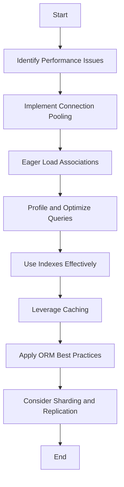

## 19.12 Optimizing Database Interactions

In the world of software development, database interactions often become a bottleneck that can significantly impact the performance of your Ruby applications. Optimizing these interactions is crucial for building scalable and maintainable applications. In this section, we'll explore various techniques and best practices to enhance database performance, reduce latency, and minimize resource usage.

### Common Performance Issues with Database Interactions

Before diving into optimization strategies, it's essential to understand the common performance issues that arise with database interactions:

1. **N+1 Query Problem**: This occurs when an application executes a query to retrieve a list of items and then executes additional queries for each item to fetch related data.
2. **Inefficient Queries**: Poorly written queries can lead to excessive data retrieval, unnecessary computations, and increased load times.
3. **Lack of Indexes**: Without proper indexing, database searches can become slow and resource-intensive.
4. **Connection Overhead**: Establishing a new database connection for each request can be costly in terms of time and resources.
5. **Data Redundancy**: Storing duplicate data can lead to increased storage requirements and slower query performance.

### Strategies for Optimizing Database Interactions

#### 1. Connection Pooling

**Connection pooling** is a technique used to manage database connections efficiently. Instead of opening and closing a new connection for each request, a pool of connections is maintained and reused. This reduces the overhead associated with establishing connections and improves application performance.

**Implementation in Ruby:**

```ruby
# In your database configuration file (e.g., database.yml for Rails)
production:
  adapter: postgresql
  pool: 5
  timeout: 5000
```

**Key Points:**
- Adjust the pool size based on your application's concurrency requirements.
- Ensure that connections are properly closed and returned to the pool after use.

#### 2. Eager Loading Associations

Eager loading is a technique used to load related data in a single query, thus preventing the N+1 query problem. By fetching all necessary data in one go, you can significantly reduce the number of queries executed.

**Example with ActiveRecord:**

```ruby
# Without eager loading
users = User.all
users.each do |user|
  puts user.profile.name
end

# With eager loading
users = User.includes(:profile).all
users.each do |user|
  puts user.profile.name
end
```

**Key Points:**
- Use `includes` to specify associations that should be loaded eagerly.
- Monitor query logs to identify and address N+1 query issues.

#### 3. Profiling and Optimizing Slow Queries

Profiling your database queries helps identify slow queries that need optimization. Tools like `EXPLAIN` in SQL can provide insights into how queries are executed and where improvements can be made.

**Using EXPLAIN:**

```sql
EXPLAIN SELECT * FROM users WHERE email = 'example@example.com';
```

**Key Points:**
- Analyze the query execution plan to identify bottlenecks.
- Optimize queries by rewriting them or adding indexes where necessary.

#### 4. Using Database Indexes Effectively

Indexes are crucial for improving query performance. They allow the database to find rows more quickly and efficiently. However, over-indexing can lead to increased storage requirements and slower write operations.

**Creating an Index:**

```sql
CREATE INDEX index_users_on_email ON users (email);
```

**Key Points:**
- Index columns that are frequently used in WHERE clauses or as join keys.
- Regularly review and maintain indexes to ensure they remain effective.

#### 5. Leveraging Caching for Commonly Accessed Data

Caching is a powerful technique to reduce database load by storing frequently accessed data in memory. This can be achieved using tools like Redis or Memcached.

**Example with Rails Caching:**

```ruby
# Caching a user's profile
user_profile = Rails.cache.fetch("user_profile_#{user.id}") do
  user.profile
end
```

**Key Points:**
- Identify data that is read frequently but changes infrequently.
- Set appropriate expiration times for cached data to ensure consistency.

#### 6. ORM Best Practices with ActiveRecord

ActiveRecord, the ORM used in Rails, provides several features that can help optimize database interactions:

- **Batch Processing**: Use methods like `find_each` to process records in batches, reducing memory usage.
- **Select Only Required Columns**: Use `select` to fetch only the columns you need, reducing data transfer.
- **Avoid Callbacks for Bulk Operations**: Disable callbacks when performing bulk updates to improve performance.

**Example of Batch Processing:**

```ruby
User.find_each(batch_size: 1000) do |user|
  # Process user
end
```

**Key Points:**
- Understand the features and limitations of your ORM.
- Regularly review and refactor database interactions for efficiency.

#### 7. Database Sharding and Replication for Scalability

As your application grows, a single database instance may not be sufficient to handle the load. Sharding and replication are techniques used to distribute data across multiple database instances.

- **Sharding**: Divides the database into smaller, more manageable pieces, each hosted on a separate server.
- **Replication**: Copies data across multiple servers to improve read performance and provide redundancy.

**Key Points:**
- Evaluate the need for sharding and replication based on your application's requirements.
- Implement a robust strategy for data distribution and consistency.

### Visualizing Database Optimization Strategies

To better understand the flow of database optimization strategies, let's visualize the process using a flowchart.



**Description**: This flowchart illustrates the sequential steps involved in optimizing database interactions, starting from identifying performance issues to considering advanced strategies like sharding and replication.

### Knowledge Check

- **What is the N+1 query problem, and how can it be resolved?**
- **How does connection pooling improve database performance?**
- **What are the benefits of using database indexes, and what are the potential downsides?**
- **Explain the difference between sharding and replication.**

### Try It Yourself

Experiment with the following code snippets to deepen your understanding of database optimization techniques:

1. **Modify the connection pool size** in your Rails application and observe the impact on performance under load.
2. **Refactor a query** in your application to use eager loading and compare the number of queries executed before and after.
3. **Create an index** on a frequently queried column and measure the change in query execution time.

### Embrace the Journey

Optimizing database interactions is a continuous process that requires regular monitoring and adjustment. As you implement these strategies, remember that each application is unique, and the optimal solution may vary based on specific requirements and constraints. Keep experimenting, stay curious, and enjoy the journey of building high-performance Ruby applications!

## Quiz: Optimizing Database Interactions



### What is the primary benefit of connection pooling in database interactions?

- [x] Reduces the overhead of establishing new connections
- [ ] Increases the number of available connections
- [ ] Improves data integrity
- [ ] Enhances data security

> **Explanation:** Connection pooling reduces the overhead of establishing new connections by reusing existing ones, improving performance.

### How can the N+1 query problem be resolved in Ruby applications?

- [x] By using eager loading
- [ ] By increasing the database connection pool size
- [ ] By adding more indexes
- [ ] By using a different database

> **Explanation:** Eager loading resolves the N+1 query problem by loading related data in a single query.

### What is a potential downside of over-indexing a database?

- [x] Increased storage requirements
- [ ] Faster write operations
- [ ] Improved query performance
- [ ] Enhanced data security

> **Explanation:** Over-indexing can lead to increased storage requirements and slower write operations.

### Which tool can be used to analyze query execution plans?

- [x] EXPLAIN
- [ ] Rails Console
- [ ] Redis
- [ ] Memcached

> **Explanation:** The `EXPLAIN` tool is used to analyze query execution plans and identify optimization opportunities.

### What is the difference between sharding and replication?

- [x] Sharding divides data across servers; replication copies data across servers
- [ ] Sharding copies data across servers; replication divides data across servers
- [ ] Both sharding and replication divide data across servers
- [ ] Both sharding and replication copy data across servers

> **Explanation:** Sharding divides data across servers, while replication copies data across servers for redundancy and performance.

### Which of the following is a best practice for ORM usage in Ruby?

- [x] Use batch processing for large datasets
- [ ] Always load all columns from a table
- [ ] Disable connection pooling
- [ ] Avoid using indexes

> **Explanation:** Using batch processing for large datasets is a best practice to reduce memory usage and improve performance.

### How can caching improve database performance?

- [x] By storing frequently accessed data in memory
- [ ] By increasing the number of database connections
- [ ] By reducing the need for indexes
- [ ] By improving data security

> **Explanation:** Caching improves performance by storing frequently accessed data in memory, reducing database load.

### What is the purpose of using `find_each` in ActiveRecord?

- [x] To process records in batches
- [ ] To load all records at once
- [ ] To disable eager loading
- [ ] To create indexes

> **Explanation:** `find_each` processes records in batches, reducing memory usage and improving performance.

### Which strategy can help improve read performance and provide redundancy?

- [x] Replication
- [ ] Sharding
- [ ] Connection pooling
- [ ] Caching

> **Explanation:** Replication improves read performance and provides redundancy by copying data across multiple servers.

### True or False: Eager loading can help reduce the number of queries executed in an application.

- [x] True
- [ ] False

> **Explanation:** Eager loading reduces the number of queries by fetching related data in a single query.


