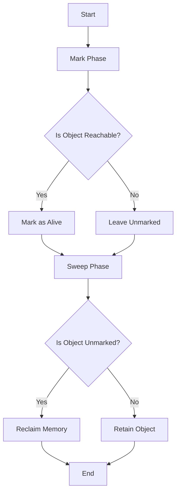

## 19.2 Memory Management and Garbage Collection

In the world of Ruby programming, understanding memory management and garbage collection is crucial for building scalable and maintainable applications. Memory management involves the allocation and deallocation of memory resources, while garbage collection (GC) is the process of automatically reclaiming memory that is no longer in use. This section will delve into how Ruby handles these processes, explore various garbage collection strategies, and provide practical tips for optimizing memory usage.

### Understanding Memory Allocation in Ruby

Ruby, like many high-level programming languages, abstracts memory management to simplify development. However, understanding the underlying mechanisms can help you write more efficient code.

#### Memory Allocation Process

1. **Object Creation**: When you create a new object in Ruby, memory is allocated from the heap. The heap is a region of memory used for dynamic memory allocation.
2. **Memory Layout**: Ruby objects are stored in a contiguous block of memory. Each object has a header containing metadata, such as the object's class and flags, followed by the object's data.
3. **Memory Pools**: Ruby uses memory pools to manage object allocation. Pools are pre-allocated blocks of memory that reduce the overhead of frequent memory allocation and deallocation.

### Garbage Collection in Ruby

Garbage collection is the process of identifying and reclaiming memory that is no longer in use by the program. Ruby employs several garbage collection strategies to manage memory efficiently.

#### Mark-and-Sweep Algorithm

The mark-and-sweep algorithm is a fundamental garbage collection strategy used by Ruby. It consists of two phases:

1. **Mark Phase**: The garbage collector traverses all reachable objects starting from the root set (e.g., global variables, stack variables) and marks them as alive.
2. **Sweep Phase**: The garbage collector scans the heap for unmarked objects and reclaims their memory.

#### Generational Garbage Collection

Ruby 2.1 introduced generational garbage collection, which optimizes the mark-and-sweep algorithm by categorizing objects into generations based on their lifespan:

1. **Young Generation**: Newly created objects are placed in the young generation. These objects are frequently collected because most objects have a short lifespan.
2. **Old Generation**: Objects that survive multiple garbage collection cycles are promoted to the old generation. These objects are collected less frequently.

Generational garbage collection improves performance by focusing on collecting short-lived objects, which are more common in typical Ruby applications.

### Optimizing Memory Usage

Efficient memory management is key to optimizing application performance. Here are some strategies to reduce memory consumption:

#### Reuse Objects

Reusing objects can significantly reduce memory allocation overhead. Instead of creating new objects, modify existing ones when possible. This is particularly useful for objects that are frequently created and destroyed, such as strings and arrays.

#### Avoid Memory Leaks

Memory leaks occur when objects are no longer needed but are not reclaimed by the garbage collector. To avoid memory leaks:

- **Remove References**: Ensure that objects are no longer referenced when they are no longer needed.
- **Use Weak References**: Use weak references for objects that should not prevent garbage collection.

#### Optimize Data Structures

Choose data structures that minimize memory usage. For example, use symbols instead of strings for identifiers, as symbols are immutable and stored only once in memory.

### Adjusting Garbage Collection Settings

Ruby allows you to adjust garbage collection settings using environment variables. These settings can help you fine-tune the garbage collector's behavior to suit your application's needs.

#### Key Environment Variables

- **`RUBY_GC_HEAP_INIT_SLOTS`**: Sets the initial size of the heap.
- **`RUBY_GC_HEAP_GROWTH_FACTOR`**: Controls the rate at which the heap grows.
- **`RUBY_GC_HEAP_GROWTH_MAX_SLOTS`**: Limits the maximum number of slots the heap can grow by.
- **`RUBY_GC_HEAP_FREE_SLOTS`**: Sets the number of free slots to maintain in the heap.

Adjusting these variables can help you balance memory usage and garbage collection frequency.

### Monitoring Memory Usage

Monitoring memory usage is essential for identifying performance bottlenecks and optimizing memory management. Ruby provides several tools for this purpose.

#### GC::Profiler

The `GC::Profiler` module allows you to profile garbage collection activity in your Ruby application. It provides detailed information about each garbage collection cycle, including the time taken and the number of objects collected.

```ruby
require 'gc/profiler'

GC::Profiler.enable

# Your application code here

GC::Profiler.report
```

#### Derailed Benchmarks

[Derailed Benchmarks](https://github.com/zombocom/derailed_benchmarks) is a gem that helps you analyze memory usage and identify memory bloat in your Ruby applications. It provides tools for measuring memory usage over time and identifying memory leaks.

### Writing Memory-Efficient Code

Writing memory-efficient code involves adopting best practices that minimize memory usage and improve performance.

#### Use Symbols Wisely

Symbols are immutable and stored only once in memory, making them more memory-efficient than strings for identifiers. However, avoid dynamically creating symbols, as they are never garbage collected.

#### Limit Object Creation

Minimize the creation of temporary objects, especially in loops and frequently called methods. Use in-place operations and modify existing objects when possible.

#### Profile and Optimize

Regularly profile your application's memory usage to identify areas for optimization. Use tools like `GC::Profiler` and `derailed_benchmarks` to gain insights into memory consumption patterns.

### Visualizing Ruby's Garbage Collection Process

To better understand Ruby's garbage collection process, let's visualize it using a flowchart.



**Figure 1**: Ruby's Garbage Collection Process

### Try It Yourself

Experiment with the following code to see how Ruby's garbage collection works. Modify the code to create more objects or adjust garbage collection settings and observe the impact on memory usage.

```ruby
require 'gc/profiler'

GC::Profiler.enable

# Create a large number of objects
100_000.times do
  Object.new
end

GC.start

puts GC::Profiler.report
```

### Knowledge Check

- What is the purpose of garbage collection in Ruby?
- How does the mark-and-sweep algorithm work?
- What are the benefits of generational garbage collection?
- How can you reduce memory consumption in a Ruby application?
- What tools can you use to monitor memory usage in Ruby?

### Conclusion

Understanding memory management and garbage collection in Ruby is essential for optimizing application performance. By adopting best practices and leveraging Ruby's tools and settings, you can build efficient, scalable applications that make the most of available memory resources. Remember, this is just the beginning. As you progress, continue to experiment, profile, and optimize your code to achieve the best performance.

## Quiz: Memory Management and Garbage Collection



### What is the primary purpose of garbage collection in Ruby?

- [x] To automatically reclaim memory that is no longer in use
- [ ] To allocate memory for new objects
- [ ] To manage memory pools
- [ ] To optimize CPU usage

> **Explanation:** Garbage collection automatically reclaims memory that is no longer in use, freeing it for future allocations.

### Which algorithm does Ruby's garbage collector primarily use?

- [x] Mark-and-sweep
- [ ] Reference counting
- [ ] Copying
- [ ] Incremental

> **Explanation:** Ruby primarily uses the mark-and-sweep algorithm for garbage collection.

### What is a key advantage of generational garbage collection?

- [x] It focuses on collecting short-lived objects, improving performance.
- [ ] It eliminates the need for a mark phase.
- [ ] It reduces the memory footprint of the application.
- [ ] It increases the frequency of garbage collection cycles.

> **Explanation:** Generational garbage collection focuses on collecting short-lived objects, which are more common, thus improving performance.

### How can you reduce memory consumption in a Ruby application?

- [x] Reuse objects and avoid memory leaks
- [ ] Increase the heap size
- [ ] Use more global variables
- [ ] Disable garbage collection

> **Explanation:** Reusing objects and avoiding memory leaks are effective strategies for reducing memory consumption.

### Which tool can you use to profile garbage collection activity in Ruby?

- [x] GC::Profiler
- [ ] derailed_benchmarks
- [ ] RubyGems
- [ ] Rake

> **Explanation:** `GC::Profiler` is a tool for profiling garbage collection activity in Ruby.

### What is the effect of dynamically creating symbols in Ruby?

- [x] They are never garbage collected, leading to potential memory bloat.
- [ ] They are collected more frequently than strings.
- [ ] They improve performance by reducing memory usage.
- [ ] They are automatically converted to strings.

> **Explanation:** Dynamically created symbols are never garbage collected, which can lead to memory bloat.

### What is the role of memory pools in Ruby?

- [x] To reduce the overhead of frequent memory allocation and deallocation
- [ ] To store global variables
- [ ] To manage CPU usage
- [ ] To optimize disk I/O

> **Explanation:** Memory pools reduce the overhead of frequent memory allocation and deallocation by pre-allocating blocks of memory.

### How can you adjust Ruby's garbage collection settings?

- [x] Using environment variables
- [ ] By modifying the Ruby source code
- [ ] Through the RubyGems configuration
- [ ] By changing the system's memory settings

> **Explanation:** Ruby's garbage collection settings can be adjusted using environment variables.

### What is the impact of using weak references in Ruby?

- [x] They allow objects to be garbage collected even if they are still referenced.
- [ ] They prevent objects from being garbage collected.
- [ ] They increase the memory footprint of the application.
- [ ] They improve the performance of the garbage collector.

> **Explanation:** Weak references allow objects to be garbage collected even if they are still referenced, helping to avoid memory leaks.

### True or False: Symbols in Ruby are stored only once in memory.

- [x] True
- [ ] False

> **Explanation:** Symbols are immutable and stored only once in memory, making them more memory-efficient than strings for identifiers.


