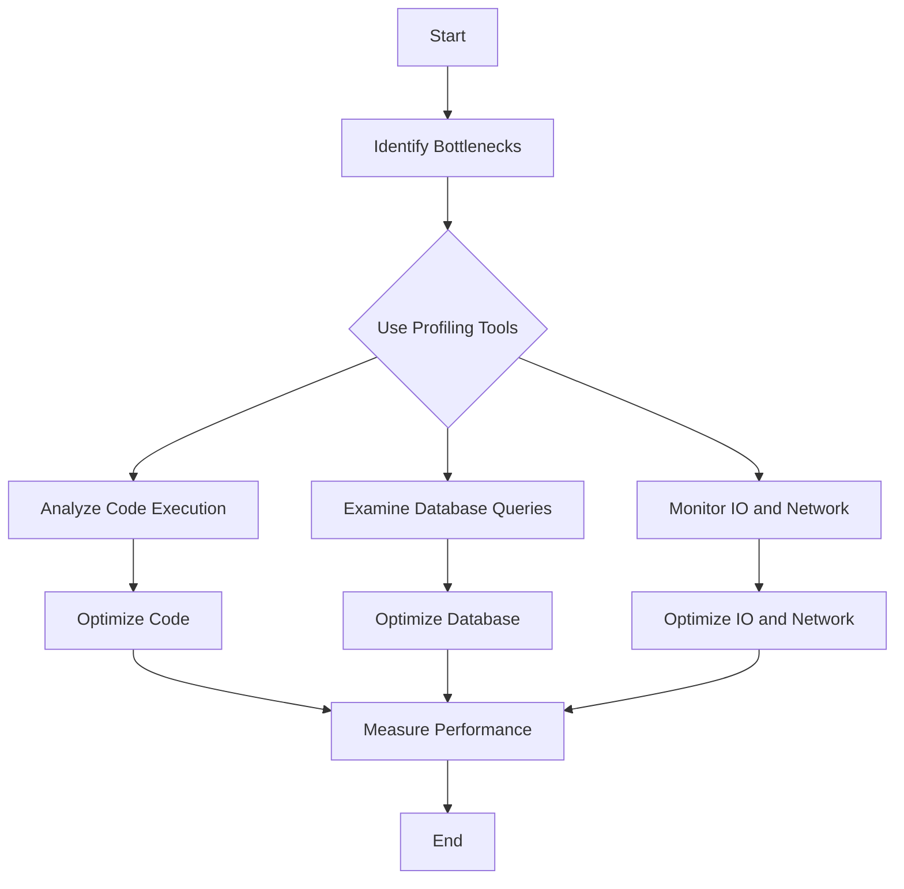

## 19.3 Identifying and Eliminating Bottlenecks

In the journey of building scalable and maintainable Ruby applications, identifying and eliminating bottlenecks is crucial. Bottlenecks can severely impact the performance and responsiveness of your application, leading to poor user experience and increased operational costs. In this section, we will explore common sources of bottlenecks, methods for identifying them, and strategies for resolving these issues to enhance application efficiency.

### Understanding Bottlenecks

A bottleneck in software development refers to a point in the application where the performance is limited or constrained, causing delays and reducing overall throughput. Bottlenecks can occur in various parts of an application, including code execution, database interactions, network communication, and input/output operations.

#### Common Sources of Bottlenecks

1. **Inefficient Algorithms**: Algorithms with high time complexity can slow down your application. For example, using a bubble sort instead of a quicksort for large datasets can lead to significant performance issues.

2. **IO Latency**: Input/output operations, such as reading from or writing to files, can introduce delays, especially if not handled asynchronously.

3. **Database Queries**: Poorly optimized database queries, lack of indexing, and excessive data retrieval can lead to slow database performance.

4. **Network Latency**: Delays in network communication, especially in distributed systems, can cause bottlenecks.

5. **Resource Contention**: Competing for shared resources, such as CPU, memory, or disk, can lead to performance degradation.

### Identifying Bottlenecks

To effectively eliminate bottlenecks, you must first identify them. This involves monitoring and profiling your application to pinpoint areas of concern.

#### Profiling Tools

Profiling tools help you analyze the performance of your application by providing insights into resource usage, execution time, and potential bottlenecks. Here are some popular profiling tools for Ruby:

- **RubyProf**: A fast code profiler for Ruby that provides detailed reports on method calls, memory usage, and execution time.

- **StackProf**: A sampling call-stack profiler for Ruby that helps identify slow methods and lines of code.

- **New Relic**: A comprehensive application performance monitoring tool that provides real-time insights into application performance, including database queries and external services.

- **Scout APM**: A lightweight application performance monitoring tool that focuses on identifying slow database queries and N+1 queries.

#### Monitoring Tools

Monitoring tools provide continuous insights into the performance of your application in a production environment. They help you track key performance metrics and identify trends over time.

- **Prometheus**: An open-source monitoring and alerting toolkit that collects and stores metrics as time series data.

- **Grafana**: A visualization tool that works with Prometheus to create dashboards for monitoring application performance.

- **Datadog**: A monitoring and analytics platform that provides real-time insights into application performance, infrastructure, and logs.

### Methods for Identifying Bottlenecks

1. **Code Profiling**: Use profiling tools to analyze the execution time of methods and identify slow or inefficient code paths.

2. **Database Query Analysis**: Examine slow queries using database logs or monitoring tools. Look for queries with high execution time or those executed frequently.

3. **IO and Network Monitoring**: Monitor input/output operations and network requests to identify latency issues.

4. **Resource Utilization Monitoring**: Track CPU, memory, and disk usage to identify resource contention or leaks.

5. **User Experience Feedback**: Gather feedback from users to identify areas of the application that feel slow or unresponsive.

### Eliminating Bottlenecks

Once bottlenecks are identified, the next step is to eliminate them. This involves optimizing code, improving database performance, and enhancing resource management.

#### Code Optimization

1. **Improve Algorithm Complexity**: Replace inefficient algorithms with more efficient ones. For example, use a hash map for quick lookups instead of a linear search.

2. **Reduce Unnecessary Computations**: Avoid redundant calculations by caching results or using memoization techniques.

3. **Optimize Loops**: Minimize the number of iterations in loops and avoid nested loops where possible.

4. **Use Lazy Evaluation**: Delay computation until necessary using Ruby's lazy enumerators.

#### Database Optimization

1. **Indexing**: Create indexes on columns that are frequently used in WHERE clauses to speed up query execution.

2. **Query Optimization**: Rewrite complex queries to reduce execution time. Use EXPLAIN to analyze query plans and identify inefficiencies.

3. **Connection Pooling**: Use connection pooling to manage database connections efficiently and reduce latency.

4. **Data Caching**: Cache frequently accessed data to reduce database load and improve response times.

#### IO and Network Optimization

1. **Asynchronous IO**: Use asynchronous IO operations to prevent blocking and improve responsiveness.

2. **Batch Processing**: Process data in batches to reduce the number of IO operations and network requests.

3. **Compression**: Compress data before transmission to reduce network latency.

4. **Content Delivery Networks (CDNs)**: Use CDNs to distribute static content and reduce load times.

#### Resource Management

1. **Memory Management**: Use Ruby's garbage collector efficiently by minimizing object allocations and freeing unused objects.

2. **Thread Management**: Use threads or fibers to handle concurrent tasks and improve resource utilization.

3. **Load Balancing**: Distribute load across multiple servers to prevent resource contention and improve scalability.

### Measuring Performance Improvements

After making changes to eliminate bottlenecks, it's essential to measure performance improvements to ensure that the changes have the desired effect. Use the following methods to measure performance:

1. **Benchmarking**: Use benchmarking tools to measure the execution time of code before and after optimization.

2. **Load Testing**: Simulate user load to test the application's performance under stress and identify any remaining bottlenecks.

3. **User Feedback**: Gather feedback from users to assess improvements in application responsiveness and user experience.

4. **Monitoring Metrics**: Continuously monitor key performance metrics to track improvements and identify any new bottlenecks.

### Visualizing Bottlenecks

To better understand and communicate bottlenecks, visualizations can be incredibly helpful. Below is a simple flowchart illustrating the process of identifying and eliminating bottlenecks in a Ruby application.



### Try It Yourself

To solidify your understanding, try experimenting with the following code example. This example demonstrates how to use RubyProf to profile a simple Ruby application and identify bottlenecks.

```ruby
require 'ruby-prof'

# Define a method with a potential bottleneck
def slow_method
  sum = 0
  (1..100_000).each do |i|
    sum += i
  end
  sum
end

# Profile the method
RubyProf.start
slow_method
result = RubyProf.stop

# Print a flat profile report
printer = RubyProf::FlatPrinter.new(result)
printer.print(STDOUT)
```

**Experimentation Suggestions:**

- Modify the `slow_method` to include more complex calculations or nested loops.
- Use RubyProf's GraphPrinter or CallTreePrinter to visualize the call stack.
- Introduce a database query and profile its execution time.

### Conclusion

Identifying and eliminating bottlenecks is a critical step in optimizing Ruby applications for performance and scalability. By understanding common sources of bottlenecks, using profiling and monitoring tools, and applying optimization techniques, you can enhance the efficiency of your applications and provide a better user experience. Remember, performance optimization is an ongoing process, and continuous monitoring and feedback are essential to maintaining optimal performance.

## Quiz: Identifying and Eliminating Bottlenecks



### What is a bottleneck in software development?

- [x] A point where performance is limited or constrained
- [ ] A feature that enhances application speed
- [ ] A tool for monitoring application performance
- [ ] A type of database query

> **Explanation:** A bottleneck is a point in the application where performance is limited or constrained, causing delays and reducing overall throughput.

### Which tool is used for profiling Ruby applications?

- [x] RubyProf
- [ ] Grafana
- [ ] Prometheus
- [ ] Datadog

> **Explanation:** RubyProf is a fast code profiler for Ruby that provides detailed reports on method calls, memory usage, and execution time.

### What is the purpose of indexing in database optimization?

- [x] To speed up query execution
- [ ] To increase database size
- [ ] To reduce data redundancy
- [ ] To enhance data security

> **Explanation:** Indexing creates indexes on columns that are frequently used in WHERE clauses to speed up query execution.

### How can IO latency be reduced?

- [x] By using asynchronous IO operations
- [ ] By increasing the number of IO operations
- [ ] By using synchronous IO operations
- [ ] By reducing network bandwidth

> **Explanation:** Asynchronous IO operations prevent blocking and improve responsiveness, reducing IO latency.

### What is the benefit of using lazy evaluation in Ruby?

- [x] To delay computation until necessary
- [ ] To increase memory usage
- [ ] To execute code immediately
- [ ] To reduce code readability

> **Explanation:** Lazy evaluation delays computation until necessary, which can improve performance by avoiding unnecessary calculations.

### Which tool is used for monitoring application performance in production?

- [x] Prometheus
- [ ] RubyProf
- [ ] StackProf
- [ ] New Relic

> **Explanation:** Prometheus is an open-source monitoring and alerting toolkit that collects and stores metrics as time series data.

### What is the purpose of connection pooling in database optimization?

- [x] To manage database connections efficiently
- [ ] To increase the number of database connections
- [ ] To reduce database security
- [ ] To enhance data redundancy

> **Explanation:** Connection pooling manages database connections efficiently, reducing latency and improving performance.

### How can network latency be reduced?

- [x] By using compression
- [ ] By increasing data size
- [ ] By reducing server capacity
- [ ] By using synchronous requests

> **Explanation:** Compressing data before transmission reduces network latency by decreasing the amount of data sent over the network.

### What is the role of load balancing in resource management?

- [x] To distribute load across multiple servers
- [ ] To increase server load
- [ ] To reduce server capacity
- [ ] To enhance data security

> **Explanation:** Load balancing distributes load across multiple servers to prevent resource contention and improve scalability.

### True or False: Profiling tools are only useful during the development phase.

- [ ] True
- [x] False

> **Explanation:** Profiling tools are useful throughout the software lifecycle, including development, testing, and production, to identify and resolve performance bottlenecks.




