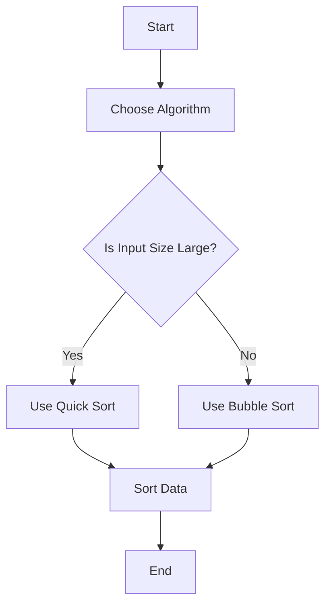

## 19.4 Optimizing Algorithms and Data Structures

In the world of software development, the choice of algorithms and data structures can make or break the performance of an application. This section delves into the importance of selecting efficient algorithms and data structures in Ruby, providing insights into how these choices impact performance, and offering practical examples to guide you in optimizing your Ruby applications.

### Understanding the Impact of Algorithms and Data Structures

Algorithms and data structures are the backbone of any application. They determine how data is stored, accessed, and manipulated. The efficiency of these operations directly affects the performance of your application. By choosing the right algorithm and data structure, you can significantly reduce execution time and memory usage, leading to faster and more responsive applications.

#### The Role of Algorithms

An algorithm is a step-by-step procedure or formula for solving a problem. The choice of algorithm can affect the speed and efficiency of your code. For instance, sorting a list of numbers can be done using various algorithms like Bubble Sort, Quick Sort, or Merge Sort, each with different performance characteristics.

#### The Role of Data Structures

Data structures are ways of organizing and storing data to enable efficient access and modification. Common data structures include arrays, linked lists, stacks, queues, trees, and hash tables. The choice of data structure can impact the complexity of operations like searching, inserting, and deleting data.

### Big O Notation: Measuring Efficiency

Big O notation is a mathematical notation used to describe the performance or complexity of an algorithm. It provides an upper bound on the time or space required by an algorithm as a function of the input size. Understanding Big O notation helps you compare the efficiency of different algorithms and choose the most appropriate one for your needs.

#### Common Big O Notations

- **O(1)**: Constant time complexity, where the execution time is independent of the input size.
- **O(log n)**: Logarithmic time complexity, where the execution time grows logarithmically with the input size.
- **O(n)**: Linear time complexity, where the execution time grows linearly with the input size.
- **O(n log n)**: Linearithmic time complexity, common in efficient sorting algorithms like Merge Sort.
- **O(n²)**: Quadratic time complexity, often seen in less efficient algorithms like Bubble Sort.

### Selecting Appropriate Algorithms

Choosing the right algorithm involves understanding the problem requirements and constraints. Here are some common algorithms and when to use them:

#### Sorting Algorithms

- **Quick Sort**: Efficient for large datasets, with average time complexity of O(n log n).
- **Merge Sort**: Stable and efficient for large datasets, with time complexity of O(n log n).
- **Bubble Sort**: Simple but inefficient for large datasets, with time complexity of O(n²).

#### Searching Algorithms

- **Binary Search**: Efficient for sorted arrays, with time complexity of O(log n).
- **Linear Search**: Suitable for small or unsorted datasets, with time complexity of O(n).

#### Graph Algorithms

- **Dijkstra's Algorithm**: Finds the shortest path in a graph, with time complexity of O(V²) using an adjacency matrix.
- **A* Search Algorithm**: Efficient for pathfinding and graph traversal, with time complexity of O(E).

### Selecting Appropriate Data Structures

The choice of data structure depends on the operations you need to perform efficiently. Here are some common data structures and their use cases:

#### Arrays

- **Use Case**: When you need fast access to elements by index.
- **Time Complexity**: O(1) for access, O(n) for insertion and deletion.

#### Linked Lists

- **Use Case**: When you need efficient insertion and deletion.
- **Time Complexity**: O(n) for access, O(1) for insertion and deletion.

#### Hash Tables

- **Use Case**: When you need fast access, insertion, and deletion.
- **Time Complexity**: O(1) for average case access, insertion, and deletion.

#### Trees

- **Use Case**: When you need to maintain a sorted order.
- **Time Complexity**: O(log n) for balanced trees like AVL or Red-Black trees.

### Code Examples: Improving Performance in Ruby

Let's explore some Ruby code examples to illustrate how choosing the right algorithm and data structure can improve performance.

#### Example 1: Sorting with Quick Sort

```ruby
# Quick Sort implementation in Ruby
def quick_sort(array)
  return array if array.length <= 1

  pivot = array.delete_at(rand(array.length))
  left, right = array.partition { |x| x < pivot }

  return *quick_sort(left), pivot, *quick_sort(right)
end

# Example usage
array = [3, 6, 8, 10, 1, 2, 1]
sorted_array = quick_sort(array)
puts "Sorted Array: #{sorted_array}"
```

In this example, Quick Sort is used to sort an array efficiently. The average time complexity is O(n log n), making it suitable for large datasets.

#### Example 2: Searching with Binary Search

```ruby
# Binary Search implementation in Ruby
def binary_search(array, target)
  low = 0
  high = array.length - 1

  while low <= high
    mid = (low + high) / 2
    guess = array[mid]

    return mid if guess == target
    if guess > target
      high = mid - 1
    else
      low = mid + 1
    end
  end

  nil
end

# Example usage
sorted_array = [1, 2, 3, 6, 8, 10]
index = binary_search(sorted_array, 6)
puts "Index of target: #{index}"
```

Binary Search is used here to find the index of a target element in a sorted array. The time complexity is O(log n), making it efficient for large datasets.

#### Example 3: Using Hash Tables for Fast Access

```ruby
# Using a Hash Table in Ruby
hash_table = { "apple" => 1, "banana" => 2, "cherry" => 3 }

# Accessing elements
puts "Value for 'banana': #{hash_table['banana']}"

# Inserting elements
hash_table["date"] = 4
puts "Updated Hash Table: #{hash_table}"
```

Hash tables provide O(1) average time complexity for access, insertion, and deletion, making them ideal for scenarios where fast access is required.

### Profiling to Guide Optimization Efforts

Before optimizing your code, it's essential to identify bottlenecks using profiling tools. Ruby provides several tools for profiling, such as `Benchmark`, `ruby-prof`, and `stackprof`. These tools help you measure the execution time of your code and identify areas that need optimization.

#### Example: Profiling with Benchmark

```ruby
require 'benchmark'

array = (1..100000).to_a.shuffle

Benchmark.bm do |x|
  x.report("Quick Sort:") { quick_sort(array) }
  x.report("Bubble Sort:") { bubble_sort(array) }
end
```

In this example, the `Benchmark` module is used to compare the performance of Quick Sort and Bubble Sort. Profiling helps you make informed decisions about which algorithms to use.

### Try It Yourself

Experiment with the code examples provided. Try modifying the input data, changing the algorithms, or using different data structures to see how it affects performance. This hands-on approach will deepen your understanding of how algorithms and data structures impact application performance.

### Visualizing Algorithm Complexity

To better understand the complexity of different algorithms, let's visualize their performance using a simple flowchart.



This flowchart illustrates the decision-making process for choosing a sorting algorithm based on input size.

### Key Takeaways

- **Algorithm and Data Structure Choice**: The choice of algorithm and data structure significantly impacts application performance.
- **Big O Notation**: Understanding Big O notation helps you evaluate the efficiency of algorithms.
- **Profiling**: Use profiling tools to identify bottlenecks and guide optimization efforts.
- **Experimentation**: Experiment with different algorithms and data structures to find the best fit for your application.

### References and Further Reading

- [Big O Notation](https://en.wikipedia.org/wiki/Big_O_notation)
- [Ruby Benchmark Module](https://ruby-doc.org/stdlib-2.7.0/libdoc/benchmark/rdoc/Benchmark.html)
- [Data Structures and Algorithms in Ruby](https://www.rubyguides.com/2018/08/data-structures-in-ruby/)

## Quiz: Optimizing Algorithms and Data Structures



### Which of the following algorithms has a time complexity of O(n log n)?

- [ ] Bubble Sort
- [x] Quick Sort
- [ ] Linear Search
- [ ] Binary Search

> **Explanation:** Quick Sort has an average time complexity of O(n log n), making it efficient for large datasets.


### What is the time complexity of accessing an element in a hash table?

- [x] O(1)
- [ ] O(n)
- [ ] O(log n)
- [ ] O(n²)

> **Explanation:** Hash tables provide O(1) average time complexity for access, insertion, and deletion.


### Which data structure is best for maintaining a sorted order?

- [ ] Array
- [ ] Linked List
- [x] Tree
- [ ] Hash Table

> **Explanation:** Trees, especially balanced trees like AVL or Red-Black trees, are ideal for maintaining a sorted order.


### What is the primary purpose of using Big O notation?

- [x] To describe the performance or complexity of an algorithm
- [ ] To measure the memory usage of an algorithm
- [ ] To determine the correctness of an algorithm
- [ ] To evaluate the readability of code

> **Explanation:** Big O notation is used to describe the performance or complexity of an algorithm in terms of time or space.


### Which algorithm is suitable for finding the shortest path in a graph?

- [ ] Bubble Sort
- [x] Dijkstra's Algorithm
- [ ] Quick Sort
- [ ] Binary Search

> **Explanation:** Dijkstra's Algorithm is used to find the shortest path in a graph.


### What is the time complexity of Binary Search?

- [ ] O(n)
- [x] O(log n)
- [ ] O(n²)
- [ ] O(1)

> **Explanation:** Binary Search has a time complexity of O(log n), making it efficient for large sorted datasets.


### Which data structure provides O(1) average time complexity for access, insertion, and deletion?

- [ ] Array
- [ ] Linked List
- [x] Hash Table
- [ ] Tree

> **Explanation:** Hash tables provide O(1) average time complexity for access, insertion, and deletion.


### What is the time complexity of Bubble Sort?

- [ ] O(n log n)
- [ ] O(log n)
- [x] O(n²)
- [ ] O(1)

> **Explanation:** Bubble Sort has a time complexity of O(n²), making it inefficient for large datasets.


### Which tool can be used for profiling Ruby code?

- [ ] RSpec
- [x] Benchmark
- [ ] Capistrano
- [ ] Rake

> **Explanation:** The Benchmark module in Ruby can be used to measure the execution time of code and identify performance bottlenecks.


### True or False: Profiling should be done before optimizing code.

- [x] True
- [ ] False

> **Explanation:** Profiling helps identify bottlenecks and guide optimization efforts, ensuring that you focus on the areas that will have the most significant impact on performance.



Remember, optimizing algorithms and data structures is a continuous process. As you gain more experience, you'll develop an intuition for selecting the right tools for the job. Keep experimenting, stay curious, and enjoy the journey of building efficient and scalable Ruby applications!
