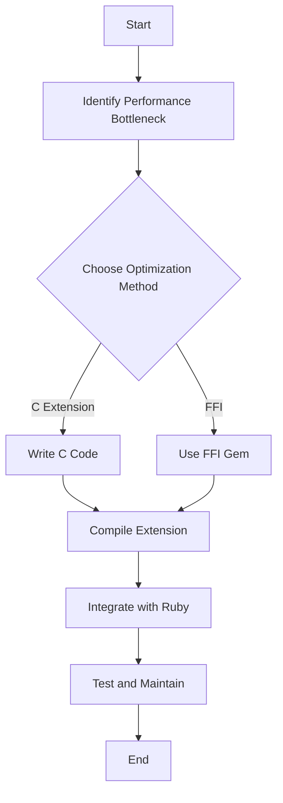

## 19.5 Using C Extensions and FFI for Performance

In the world of Ruby development, performance can sometimes be a bottleneck, especially when dealing with computationally intensive tasks. While Ruby is known for its elegance and ease of use, it may not always be the fastest option for performance-critical code. This is where C extensions and the Foreign Function Interface (FFI) come into play, allowing developers to harness the speed of native code while maintaining the flexibility of Ruby.

### Introduction to C Extensions and FFI

C extensions and FFI are two powerful techniques for enhancing the performance of Ruby applications by leveraging native code. Let's explore these concepts in detail:

- **C Extensions**: These are pieces of C code that are compiled and linked into the Ruby interpreter. They allow you to write performance-critical parts of your application in C, which can be significantly faster than Ruby.
  
- **Foreign Function Interface (FFI)**: This is a library that allows Ruby code to call functions written in other languages, such as C, without writing a full extension. It provides a bridge between Ruby and native libraries, enabling you to use existing C libraries directly from Ruby.

### When to Use Native Extensions

Before diving into writing C extensions or using FFI, it's crucial to determine when it's appropriate to use these techniques:

- **Performance-Critical Sections**: If you have identified specific parts of your application that are performance bottlenecks, consider using native extensions to optimize them.
  
- **Existing C Libraries**: If there are existing C libraries that provide the functionality you need, using FFI can save you time and effort compared to rewriting the functionality in Ruby.

- **Complex Algorithms**: For complex algorithms that require high performance, implementing them in C can yield significant speed improvements.

### Writing a Simple C Extension

Let's walk through the process of writing a simple C extension for Ruby. We'll create a basic extension that provides a fast implementation of a mathematical operation.

#### Step 1: Setting Up the Environment

First, ensure you have the necessary tools installed on your system, including a C compiler and Ruby development headers. You can usually install these via your package manager. For example, on Ubuntu, you might run:

```bash
sudo apt-get install build-essential ruby-dev
```

#### Step 2: Creating the Extension

Create a new directory for your extension and navigate into it:

```bash
mkdir my_extension
cd my_extension
```

Create a `extconf.rb` file, which is used to generate the Makefile for compiling the extension:

```ruby
# extconf.rb
require 'mkmf'

create_makefile('my_extension')
```

Next, create the C source file `my_extension.c`:

```c
// my_extension.c
#include "ruby.h"

VALUE MyExtension = Qnil;

void Init_my_extension();

VALUE method_fast_add(VALUE self, VALUE a, VALUE b) {
  int result = NUM2INT(a) + NUM2INT(b);
  return INT2NUM(result);
}

void Init_my_extension() {
  MyExtension = rb_define_module("MyExtension");
  rb_define_method(MyExtension, "fast_add", method_fast_add, 2);
}
```

#### Step 3: Compiling the Extension

Run the following command to compile the extension:

```bash
ruby extconf.rb
make
```

This will generate a shared library file (e.g., `my_extension.so`) that can be loaded into Ruby.

#### Step 4: Using the Extension in Ruby

You can now use the compiled extension in your Ruby code:

```ruby
require './my_extension'

include MyExtension

puts fast_add(10, 20) # Output: 30
```

### Using the FFI Gem

The FFI gem provides a simpler way to interface with C libraries without writing a full extension. Let's see how to use it:

#### Step 1: Installing the FFI Gem

First, install the FFI gem:

```bash
gem install ffi
```

#### Step 2: Using FFI to Call C Functions

Suppose you have a C library with a function that calculates the factorial of a number. Here's how you can call it from Ruby using FFI:

Create a C file `factorial.c`:

```c
// factorial.c
#include <stdio.h>

int factorial(int n) {
  if (n <= 1) return 1;
  return n * factorial(n - 1);
}
```

Compile it into a shared library:

```bash
gcc -shared -o libfactorial.so -fPIC factorial.c
```

Now, use FFI in Ruby to call the `factorial` function:

```ruby
require 'ffi'

module Factorial
  extend FFI::Library
  ffi_lib './libfactorial.so'
  attach_function :factorial, [:int], :int
end

puts Factorial.factorial(5) # Output: 120
```

### Trade-offs and Considerations

While C extensions and FFI can significantly boost performance, they come with trade-offs:

- **Increased Complexity**: Writing and maintaining C code can be more complex than Ruby, requiring knowledge of memory management and debugging native code.
  
- **Portability Issues**: Native extensions may not be portable across different platforms, requiring additional work to ensure compatibility.

- **Testing and Maintenance**: Ensure thorough testing of extensions, as bugs in C code can lead to crashes or undefined behavior.

### Testing and Maintaining Extensions

To maintain the reliability of your extensions, follow these best practices:

- **Automated Tests**: Write automated tests for both the Ruby and C parts of your code to catch issues early.
  
- **Continuous Integration**: Use CI tools to automatically build and test your extensions on different platforms.

- **Documentation**: Document the purpose and usage of your extensions to aid future maintenance.

### Visualizing the Integration Process

To better understand the integration process of C extensions and FFI in Ruby, let's visualize it using a flowchart:



This flowchart outlines the steps involved in optimizing Ruby applications using C extensions and FFI.

### Conclusion

Using C extensions and FFI can be a powerful way to enhance the performance of Ruby applications, especially for computationally intensive tasks. By carefully identifying performance bottlenecks and leveraging native code, you can achieve significant speed improvements while maintaining the flexibility of Ruby. Remember to weigh the trade-offs and follow best practices to ensure the reliability and maintainability of your extensions.

### Try It Yourself

Experiment with the examples provided in this guide. Try modifying the C code to implement different mathematical operations or use FFI to interface with other C libraries. This hands-on practice will deepen your understanding and help you apply these techniques to your own projects.

## Quiz: Using C Extensions and FFI for Performance



### What is the primary purpose of using C extensions in Ruby?

- [x] To improve performance by executing critical code in C
- [ ] To simplify code readability
- [ ] To enhance Ruby's syntax
- [ ] To replace Ruby's garbage collector

> **Explanation:** C extensions are used to execute performance-critical code in C, which can be faster than Ruby.

### What does FFI stand for in the context of Ruby?

- [x] Foreign Function Interface
- [ ] Fast Function Integration
- [ ] Functional Framework Interface
- [ ] File Format Integration

> **Explanation:** FFI stands for Foreign Function Interface, allowing Ruby to call functions from other languages.

### Which of the following is a trade-off of using C extensions?

- [x] Increased complexity
- [ ] Improved readability
- [ ] Enhanced portability
- [ ] Simplified debugging

> **Explanation:** C extensions increase complexity due to the need for C programming and memory management.

### What is the role of `extconf.rb` in creating a C extension?

- [x] To generate a Makefile for compiling the extension
- [ ] To define Ruby methods
- [ ] To execute the compiled code
- [ ] To manage Ruby dependencies

> **Explanation:** `extconf.rb` is used to generate a Makefile, which is necessary for compiling the C extension.

### How does FFI differ from C extensions?

- [x] FFI allows calling existing C libraries without writing a full extension
- [ ] FFI requires more complex setup than C extensions
- [ ] FFI is only used for file operations
- [ ] FFI is slower than C extensions

> **Explanation:** FFI provides a simpler way to call existing C libraries without the need for a full extension.

### What is a potential issue when using native extensions?

- [x] Portability across different platforms
- [ ] Reduced execution speed
- [ ] Increased memory usage
- [ ] Simplified code structure

> **Explanation:** Native extensions may face portability issues across different platforms.

### Which Ruby module is commonly used with FFI?

- [x] `ffi`
- [ ] `native`
- [ ] `c_ext`
- [ ] `interop`

> **Explanation:** The `ffi` module is commonly used to interface with C libraries in Ruby.

### What should be included in the `extconf.rb` file?

- [x] `require 'mkmf'` and `create_makefile`
- [ ] `require 'ffi'` and `attach_function`
- [ ] `require 'c_ext'` and `define_method`
- [ ] `require 'native'` and `compile_extension`

> **Explanation:** `extconf.rb` should include `require 'mkmf'` and `create_makefile` to generate a Makefile.

### Which command is used to compile a C extension?

- [x] `make`
- [ ] `gcc`
- [ ] `ruby compile`
- [ ] `ffi build`

> **Explanation:** The `make` command is used to compile the C extension after generating the Makefile.

### True or False: FFI can only be used with C libraries.

- [ ] True
- [x] False

> **Explanation:** FFI can be used with libraries written in other languages, not just C.



Remember, this is just the beginning. As you progress, you'll build more complex and interactive Ruby applications. Keep experimenting, stay curious, and enjoy the journey!
