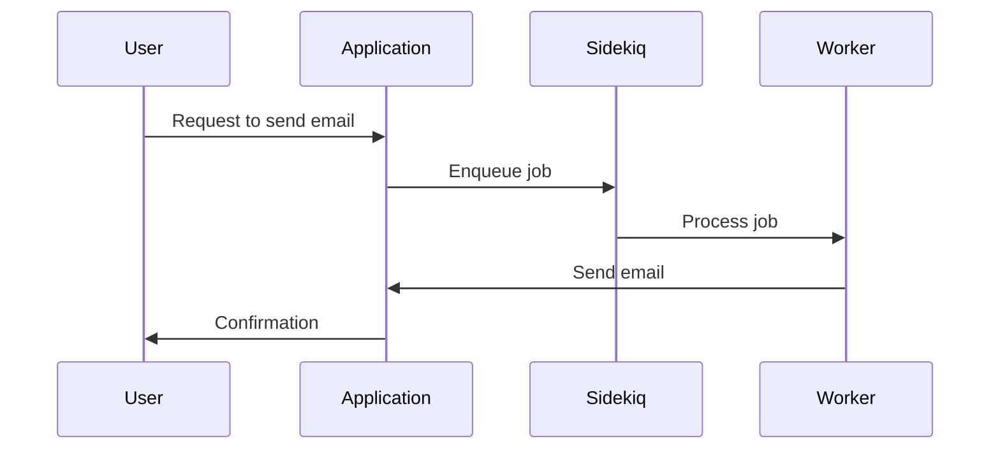

## 19.6 Asynchronous Processing with Background Jobs

In modern web applications, responsiveness and scalability are crucial for providing a seamless user experience. One effective strategy to achieve these goals is through asynchronous processing using background jobs. By offloading time-consuming tasks to background processes, we can keep our applications responsive and efficient. In this section, we'll explore the benefits of background jobs, introduce popular Ruby frameworks like Sidekiq, Resque, and Delayed Job, and provide practical examples and best practices for implementing these systems.

### Benefits of Offloading Tasks to Background Jobs

Offloading tasks to background jobs offers several advantages:

1. **Improved Responsiveness**: By moving lengthy operations such as sending emails, processing images, or performing complex calculations to background jobs, the main application thread remains free to handle user requests promptly.

2. **Scalability**: Background job systems can be scaled independently of the main application, allowing for better resource utilization and handling of increased workloads.

3. **Resource Management**: Background jobs can be scheduled to run during off-peak hours, optimizing resource usage and reducing the impact on system performance.

4. **Error Handling and Retries**: Background job frameworks often provide robust mechanisms for error handling and retries, ensuring that tasks are completed successfully even in the face of transient failures.

5. **Decoupling**: By separating background tasks from the main application logic, we achieve a cleaner architecture and easier maintenance.

### Introducing Background Job Frameworks

Several frameworks are available for implementing background jobs in Ruby applications. Let's explore three popular options: Sidekiq, Resque, and Delayed Job.

#### Sidekiq

[Sidekiq](https://sidekiq.org/) is a high-performance background job processor for Ruby that uses threads to handle many jobs at once. It is known for its speed and efficiency, making it a popular choice for high-throughput applications.

- **Installation**: Add Sidekiq to your Gemfile:

  ```ruby
  gem 'sidekiq'
  ```

- **Configuration**: Create a configuration file `config/sidekiq.yml`:

  ```yaml
  :concurrency: 5
  :queues:
    - default
    - mailers
  ```

- **Creating a Worker**: Define a worker class to perform background tasks:

  ```ruby
  class HardWorker
    include Sidekiq::Worker

    def perform(name, count)
      puts "Doing hard work for #{name} #{count} times!"
    end
  end
  ```

- **Enqueuing Jobs**: Enqueue jobs to be processed:

  ```ruby
  HardWorker.perform_async('Bob', 5)
  ```

#### Resque

[Resque](https://github.com/resque/resque) is a Redis-backed library for creating background jobs, placing them on multiple queues, and processing them later. It is known for its simplicity and reliability.

- **Installation**: Add Resque to your Gemfile:

  ```ruby
  gem 'resque'
  ```

- **Creating a Worker**: Define a worker class:

  ```ruby
  class MyJob
    @queue = :default

    def self.perform(name, count)
      puts "Processing #{name} #{count} times!"
    end
  end
  ```

- **Enqueuing Jobs**: Enqueue jobs using Resque:

  ```ruby
  Resque.enqueue(MyJob, 'Alice', 3)
  ```

#### Delayed Job

[Delayed Job](https://github.com/collectiveidea/delayed_job) is a database-backed asynchronous priority queue system. It is simple to set up and use, making it a good choice for smaller applications.

- **Installation**: Add Delayed Job to your Gemfile:

  ```ruby
  gem 'delayed_job_active_record'
  ```

- **Creating a Job**: Define a job by creating a method and calling `delay` on it:

  ```ruby
  class UserMailer
    def self.send_welcome_email(user_id)
      user = User.find(user_id)
      # Logic to send email
    end
  end

  UserMailer.delay.send_welcome_email(1)
  ```

### Best Practices for Background Jobs

Implementing background jobs effectively requires adhering to best practices to ensure reliability and maintainability.

#### Job Retries and Error Handling

- **Automatic Retries**: Configure your background job framework to automatically retry jobs in case of failures. This ensures that transient errors do not result in lost jobs.

- **Error Notification**: Set up error notifications to alert you when a job fails after all retry attempts. This allows for timely intervention and debugging.

- **Idempotency**: Ensure that your jobs are idempotent, meaning they can be safely retried without causing unintended side effects. This is crucial for maintaining data consistency.

#### Monitoring and Logging

- **Monitoring Tools**: Use monitoring tools to track the performance and status of your background jobs. Tools like Sidekiq's Web UI provide insights into job queues and processing times.

- **Logging**: Implement comprehensive logging for your background jobs to facilitate debugging and performance analysis.

#### Data Consistency

- **Atomic Operations**: Ensure that operations performed by background jobs are atomic, especially when interacting with databases. This prevents data corruption and maintains consistency.

- **Transaction Management**: Use database transactions to ensure that all operations within a job are completed successfully or rolled back in case of failure.

### Considerations for Using Background Jobs

When implementing background jobs, consider the following:

- **Queue Prioritization**: Assign priorities to different job queues to ensure that critical tasks are processed first.

- **Resource Allocation**: Monitor and adjust the resources allocated to your background job system to prevent bottlenecks and ensure efficient processing.

- **Security**: Ensure that sensitive data processed by background jobs is handled securely, following best practices for encryption and access control.

### Code Examples and Try It Yourself

Let's explore a practical example using Sidekiq to send welcome emails to new users.

```ruby
# app/workers/welcome_email_worker.rb
class WelcomeEmailWorker
  include Sidekiq::Worker

  def perform(user_id)
    user = User.find(user_id)
    UserMailer.welcome_email(user).deliver_now
  end
end

# Enqueue the job
WelcomeEmailWorker.perform_async(new_user.id)
```

**Try It Yourself**: Modify the `WelcomeEmailWorker` to include additional logic, such as logging the email sending status or handling exceptions gracefully.

### Visualizing Background Job Processing

Below is a sequence diagram illustrating the flow of a background job system using Sidekiq:



### References and Further Reading

- [Sidekiq Documentation](https://sidekiq.org/)
- [Resque GitHub Repository](https://github.com/resque/resque)
- [Delayed Job GitHub Repository](https://github.com/collectiveidea/delayed_job)
- [Ruby on Rails Guides: Active Job Basics](https://guides.rubyonrails.org/active_job_basics.html)

### Knowledge Check

- What are the benefits of using background jobs in a Ruby application?
- How does Sidekiq differ from Resque and Delayed Job?
- What are some best practices for implementing background jobs?
- How can you ensure data consistency when using background jobs?

### Embrace the Journey

Remember, implementing background jobs is just one step towards building scalable and maintainable applications. As you continue to explore Ruby design patterns, you'll discover more ways to enhance your application's performance and reliability. Keep experimenting, stay curious, and enjoy the journey!

## Quiz: Asynchronous Processing with Background Jobs



### What is a primary benefit of using background jobs in a Ruby application?

- [x] Improved responsiveness
- [ ] Increased memory usage
- [ ] Slower processing times
- [ ] Reduced scalability

> **Explanation:** Offloading tasks to background jobs keeps the main application thread free, improving responsiveness.

### Which Ruby background job framework is known for its high performance and use of threads?

- [x] Sidekiq
- [ ] Resque
- [ ] Delayed Job
- [ ] Active Job

> **Explanation:** Sidekiq uses threads to handle many jobs at once, making it highly performant.

### How can you ensure that a background job can be safely retried without causing unintended side effects?

- [x] Ensure idempotency
- [ ] Increase concurrency
- [ ] Use more workers
- [ ] Disable retries

> **Explanation:** Idempotency ensures that a job can be retried without causing unintended side effects.

### What is a common tool for monitoring Sidekiq job queues and processing times?

- [x] Sidekiq Web UI
- [ ] Resque Scheduler
- [ ] Delayed Job Monitor
- [ ] Active Job Dashboard

> **Explanation:** Sidekiq Web UI provides insights into job queues and processing times.

### Which of the following is a best practice for handling errors in background jobs?

- [x] Automatic retries
- [ ] Ignoring errors
- [ ] Disabling logging
- [ ] Increasing job priority

> **Explanation:** Automatic retries help ensure that transient errors do not result in lost jobs.

### What should you use to ensure that all operations within a job are completed successfully or rolled back in case of failure?

- [x] Database transactions
- [ ] Increased concurrency
- [ ] More workers
- [ ] Job prioritization

> **Explanation:** Database transactions ensure atomicity, preventing data corruption.

### Which framework is Redis-backed and known for its simplicity and reliability?

- [ ] Sidekiq
- [x] Resque
- [ ] Delayed Job
- [ ] Active Job

> **Explanation:** Resque is Redis-backed and known for its simplicity and reliability.

### What is a key consideration when processing sensitive data in background jobs?

- [x] Security
- [ ] Concurrency
- [ ] Performance
- [ ] Scalability

> **Explanation:** Security is crucial when handling sensitive data to ensure encryption and access control.

### Which framework is database-backed and simple to set up for smaller applications?

- [ ] Sidekiq
- [ ] Resque
- [x] Delayed Job
- [ ] Active Job

> **Explanation:** Delayed Job is database-backed and simple to set up, making it suitable for smaller applications.

### True or False: Background jobs can be scheduled to run during off-peak hours to optimize resource usage.

- [x] True
- [ ] False

> **Explanation:** Scheduling background jobs during off-peak hours optimizes resource usage and reduces system impact.


