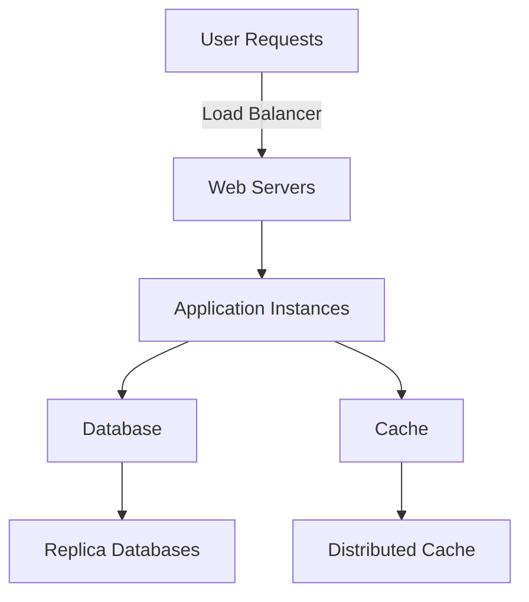

## 19.7 Scaling Ruby Applications

As Ruby applications grow in complexity and user base, the need to scale them effectively becomes paramount. Scaling is the process of adjusting the capacity of your application to handle increased load. In this section, we will explore various strategies and patterns for scaling Ruby applications both vertically and horizontally, ensuring they remain responsive and efficient under heavy load.

### Understanding Scaling: Vertical vs. Horizontal

**Vertical Scaling** involves adding more resources to a single server. This could mean upgrading the server's CPU, adding more RAM, or using faster storage. Vertical scaling is often simpler to implement but has limitations, as there's a maximum capacity a single machine can handle.

**Horizontal Scaling**, on the other hand, involves adding more servers to your pool of resources. This approach allows for potentially unlimited growth and is more resilient to failures, as the load is distributed across multiple machines.

#### Key Differences

- **Vertical Scaling**: 
  - Simplicity in implementation.
  - Limited by the maximum capacity of a single machine.
  - Often involves downtime during upgrades.

- **Horizontal Scaling**:
  - Requires more complex architecture.
  - Offers better fault tolerance and redundancy.
  - Can handle virtually unlimited growth.

### Techniques for Scaling Ruby Applications

#### Load Balancing

Load balancing is a critical component of horizontal scaling. It involves distributing incoming network traffic across multiple servers to ensure no single server becomes overwhelmed. Load balancers can be hardware-based or software-based, with popular software options including Nginx and HAProxy.

**Example of Load Balancing with Nginx:**

```nginx
http {
    upstream myapp {
        server app1.example.com;
        server app2.example.com;
    }

    server {
        listen 80;
        location / {
            proxy_pass http://myapp;
        }
    }
}
```

In this example, Nginx distributes incoming requests between `app1.example.com` and `app2.example.com`.

#### Stateless Application Design

Designing applications to be stateless is crucial for horizontal scaling. A stateless application does not store any session information on the server, allowing any server to handle any request. This is typically achieved by storing session data in a shared database or using distributed caching systems like Redis or Memcached.

#### Clustering

Clustering involves running multiple instances of your application on different servers. This can be managed using tools like Kubernetes or Docker Swarm, which automate the deployment, scaling, and management of containerized applications.

### Web Server Concurrency

Ruby applications often use web servers like Unicorn, Puma, or Passenger to handle concurrent requests. Each of these servers has different strengths and is suited to different use cases.

#### Unicorn

Unicorn is a Rack HTTP server for fast clients and Unix. It is designed to only serve fast clients on low-latency, high-bandwidth connections and is best suited for applications running behind a reverse proxy like Nginx.

**Unicorn Configuration Example:**

```ruby
worker_processes 4
timeout 30
preload_app true

before_fork do |server, worker|
  # Disconnect from the database
  ActiveRecord::Base.connection.disconnect! if defined?(ActiveRecord::Base)
end

after_fork do |server, worker|
  # Reconnect to the database
  ActiveRecord::Base.establish_connection if defined?(ActiveRecord::Base)
end
```

#### Puma

Puma is a multi-threaded, high-performance web server that is well-suited for handling concurrent requests in Ruby applications. It uses threads to serve multiple requests simultaneously, making it a good choice for applications that require high concurrency.

**Puma Configuration Example:**

```ruby
threads_count = ENV.fetch("RAILS_MAX_THREADS") { 5 }
threads threads_count, threads_count

port        ENV.fetch("PORT") { 3000 }
environment ENV.fetch("RAILS_ENV") { "development" }

workers ENV.fetch("WEB_CONCURRENCY") { 2 }
preload_app!

on_worker_boot do
  ActiveRecord::Base.establish_connection if defined?(ActiveRecord)
end
```

#### Passenger

Passenger is a web server and application server that integrates with Nginx or Apache. It is known for its ease of use and ability to manage multiple Ruby applications on the same server.

**Passenger Configuration Example:**

```nginx
server {
    listen 80;
    server_name www.example.com;
    root /var/www/myapp/public;

    passenger_enabled on;
    passenger_ruby /usr/bin/ruby;
}
```

### Scaling Background Job Systems

Background job systems like Sidekiq, Resque, and Delayed Job are essential for handling asynchronous tasks in Ruby applications. Scaling these systems involves increasing the number of workers and ensuring they can access shared resources like databases or caches.

**Example of Scaling Sidekiq:**

```yaml
:concurrency: 10
:queues:
  - default
  - mailers
```

In this configuration, Sidekiq is set to use 10 concurrent threads, allowing it to process multiple jobs simultaneously.

### Database Scaling Strategies

Databases often become bottlenecks in scaled applications. Strategies for scaling databases include:

- **Replication**: Creating copies of your database to distribute read operations across multiple servers.
- **Sharding**: Splitting your database into smaller, more manageable pieces, each hosted on a different server.
- **Caching**: Using in-memory data stores like Redis or Memcached to cache frequently accessed data.

#### Example of Database Replication:

```sql
-- On the master server
CREATE USER 'replica'@'%' IDENTIFIED BY 'password';
GRANT REPLICATION SLAVE ON *.* TO 'replica'@'%';

-- On the replica server
CHANGE MASTER TO
  MASTER_HOST='master_host',
  MASTER_USER='replica',
  MASTER_PASSWORD='password',
  MASTER_LOG_FILE='mysql-bin.000001',
  MASTER_LOG_POS=  107;
START SLAVE;
```

### Challenges in Scaling Ruby Applications

#### Session Management

In a stateless architecture, managing user sessions can be challenging. Solutions include using cookies to store session data or employing a distributed session store like Redis.

#### State Synchronization

Keeping state synchronized across multiple servers is another challenge. This can be addressed by using shared data stores or message queues to ensure all instances have access to the same data.

### Visualizing Scaling Strategies



**Diagram Description**: This diagram illustrates a typical horizontally scaled architecture, with user requests distributed by a load balancer to multiple web servers. These servers interact with a primary database, which replicates data to other databases for load distribution. A distributed cache is used to store frequently accessed data.

### Try It Yourself

Experiment with the provided code examples by modifying the number of worker processes or threads in the Unicorn and Puma configurations. Observe how these changes affect the application's ability to handle concurrent requests.

### References and Further Reading

- [Unicorn Documentation](https://bogomips.org/unicorn/)
- [Puma Documentation](https://puma.io/)
- [Passenger Documentation](https://www.phusionpassenger.com/)
- [Nginx Load Balancing](https://www.nginx.com/resources/glossary/load-balancing/)

### Knowledge Check

- What are the key differences between vertical and horizontal scaling?
- How does load balancing help in scaling applications?
- Why is stateless application design important for horizontal scaling?
- What are some challenges associated with scaling databases?

### Embrace the Journey

Scaling Ruby applications is a journey that involves understanding your application's unique needs and challenges. Remember, this is just the beginning. As you progress, you'll build more robust and scalable applications. Keep experimenting, stay curious, and enjoy the journey!

## Quiz: Scaling Ruby Applications



### What is vertical scaling?

- [x] Adding more resources to a single server
- [ ] Adding more servers to handle increased load
- [ ] Distributing load across multiple servers
- [ ] Using a load balancer to manage traffic

> **Explanation:** Vertical scaling involves adding more resources, such as CPU or RAM, to a single server to increase its capacity.

### What is horizontal scaling?

- [ ] Adding more resources to a single server
- [x] Adding more servers to handle increased load
- [ ] Using faster storage solutions
- [ ] Upgrading the server's CPU

> **Explanation:** Horizontal scaling involves adding more servers to distribute the load and handle increased traffic.

### Which of the following is a benefit of horizontal scaling?

- [x] Better fault tolerance
- [ ] Simplicity in implementation
- [ ] Limited growth potential
- [ ] Requires downtime during upgrades

> **Explanation:** Horizontal scaling offers better fault tolerance and redundancy by distributing the load across multiple servers.

### What is the purpose of a load balancer?

- [x] Distributing incoming network traffic across multiple servers
- [ ] Increasing the CPU capacity of a server
- [ ] Storing session information on the server
- [ ] Managing database connections

> **Explanation:** A load balancer distributes incoming network traffic across multiple servers to prevent any single server from becoming overwhelmed.

### Why is stateless application design important?

- [x] It allows any server to handle any request
- [ ] It stores session information on the server
- [ ] It limits the number of concurrent requests
- [ ] It increases the complexity of the application

> **Explanation:** Stateless application design allows any server to handle any request, facilitating horizontal scaling.

### Which web server is known for its multi-threaded capabilities?

- [ ] Unicorn
- [x] Puma
- [ ] Passenger
- [ ] Nginx

> **Explanation:** Puma is known for its multi-threaded capabilities, allowing it to handle multiple requests simultaneously.

### What is database replication?

- [x] Creating copies of your database to distribute read operations
- [ ] Splitting your database into smaller pieces
- [ ] Using in-memory data stores to cache data
- [ ] Storing session information in a shared database

> **Explanation:** Database replication involves creating copies of your database to distribute read operations across multiple servers.

### What is a challenge of scaling applications?

- [x] Session management
- [ ] Increasing CPU capacity
- [ ] Using a single server
- [ ] Limiting the number of users

> **Explanation:** Session management is a challenge in scaling applications, especially in a stateless architecture.

### Which tool is used for managing containerized applications?

- [ ] Unicorn
- [ ] Puma
- [x] Kubernetes
- [ ] Passenger

> **Explanation:** Kubernetes is used for managing containerized applications, automating deployment, scaling, and management.

### True or False: Horizontal scaling requires downtime during upgrades.

- [ ] True
- [x] False

> **Explanation:** Horizontal scaling does not require downtime during upgrades, as new servers can be added without affecting existing ones.


