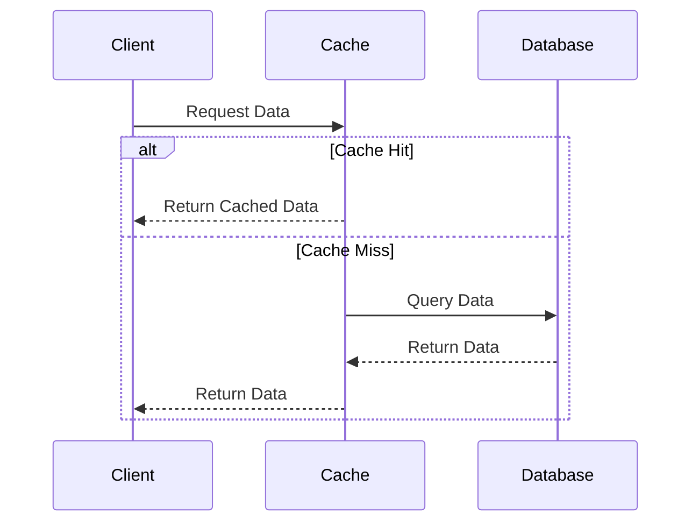

## 19.8 Caching Strategies and Techniques

In the realm of software development, caching is a pivotal technique for enhancing application performance. By storing frequently accessed data in a temporary storage area, caching reduces the need for redundant computations and database queries, thereby speeding up response times and improving user experience. In this section, we'll delve into various caching strategies and techniques, particularly focusing on their implementation in Ruby applications.

### The Role of Caching in Performance Optimization

Caching plays a crucial role in performance optimization by minimizing the time and resources required to retrieve data. It acts as a buffer between the application and the data source, storing copies of frequently accessed data in a faster storage medium. This reduces the load on the database and decreases latency, leading to quicker response times.

#### Key Benefits of Caching

- **Reduced Latency**: By serving data from a cache, applications can respond to requests faster than fetching data from a database.
- **Decreased Load on Backend Systems**: Caching reduces the number of queries sent to the database, which can significantly lower the load on backend systems.
- **Improved Scalability**: With reduced backend load, applications can handle more concurrent users and scale more effectively.
- **Cost Efficiency**: By reducing the need for expensive database operations, caching can lead to cost savings in terms of infrastructure and resources.

### Different Caching Levels

Caching can be implemented at various levels within an application. Each level serves a different purpose and can be used in conjunction to optimize performance.

#### 1. Application-Level Caching

Application-level caching involves storing data within the application itself. This can include caching results of expensive computations or frequently accessed data objects. Ruby provides several libraries and tools to facilitate application-level caching.

#### 2. Page Caching

Page caching involves storing entire pages of content. This is particularly useful for static pages that do not change often. By serving cached pages, the application can bypass the rendering process, leading to faster load times.

#### 3. Fragment Caching

Fragment caching allows developers to cache specific parts of a page. This is useful for pages that contain both static and dynamic content. By caching only the static parts, the application can reduce rendering time while still serving dynamic content.

#### 4. Object Caching

Object caching involves storing individual objects or data structures. This is useful for applications that frequently access the same data objects. By caching these objects, the application can avoid repeated database queries.

#### 5. HTTP Caching

HTTP caching leverages the caching capabilities of web browsers and proxies. By setting appropriate HTTP headers, developers can control how and when content is cached by clients and intermediaries.

### Implementing Caching in Ruby on Rails

Ruby on Rails provides built-in support for various caching strategies, making it easy to implement caching in your applications.

#### Using Rails Cache Store

Rails provides a unified caching interface through the `Rails.cache` object. This allows developers to store and retrieve cached data using a consistent API.

```ruby
# Store data in the cache
Rails.cache.write('my_key', 'my_value')

# Retrieve data from the cache
value = Rails.cache.read('my_key')

# Fetch data with a block
value = Rails.cache.fetch('my_key') do
  # Expensive operation
  'computed_value'
end
```

#### Page Caching in Rails

Page caching can be implemented using the `caches_page` method in Rails controllers. This method caches the entire output of a controller action.

```ruby
class ProductsController < ApplicationController
  caches_page :index

  def index
    @products = Product.all
  end
end
```

#### Fragment Caching in Rails

Fragment caching can be implemented using the `cache` helper in views. This allows developers to cache specific parts of a view.

```erb
<% cache @product do %>
  <div class="product">
    <h2><%= @product.name %></h2>
    <p><%= @product.description %></p>
  </div>
<% end %>
```

#### Object Caching with Memcached and Redis

Memcached and Redis are popular caching stores that can be used to implement object caching in Ruby applications.

##### Using Memcached

Memcached is a high-performance, distributed memory object caching system. It is ideal for caching objects and data structures.

```ruby
require 'dalli'

# Configure the Dalli client
cache = Dalli::Client.new('localhost:11211')

# Store data in Memcached
cache.set('my_key', 'my_value')

# Retrieve data from Memcached
value = cache.get('my_key')
```

##### Using Redis

Redis is an in-memory data structure store that supports various data types. It is widely used for caching due to its rich feature set.

```ruby
require 'redis'

# Configure the Redis client
redis = Redis.new(host: 'localhost', port: 6379)

# Store data in Redis
redis.set('my_key', 'my_value')

# Retrieve data from Redis
value = redis.get('my_key')
```

### Cache Invalidation Strategies

Cache invalidation is a critical aspect of caching. It involves removing or updating cached data when it becomes stale or invalid.

#### Common Cache Invalidation Strategies

- **Time-Based Expiration**: Set a time-to-live (TTL) for cached data, after which it is automatically invalidated.
- **Event-Based Invalidation**: Invalidate cache entries based on specific events, such as data updates or user actions.
- **Manual Invalidation**: Explicitly remove or update cache entries when necessary.

#### Cache Coherence

Cache coherence ensures that cached data remains consistent with the source data. This is particularly important in distributed systems where multiple caches may exist.

### Best Practices for Cache Key Management and Expiration

Effective cache key management and expiration strategies are essential for maintaining cache efficiency and preventing stale data.

#### Cache Key Management

- **Use Descriptive Keys**: Use descriptive and unique keys to avoid collisions and ensure clarity.
- **Include Versioning**: Incorporate versioning in cache keys to handle changes in data structure or format.
- **Namespace Keys**: Use namespaces to organize cache keys and prevent conflicts.

#### Cache Expiration

- **Set Appropriate TTLs**: Choose appropriate TTLs based on data volatility and application requirements.
- **Use Conditional Expiration**: Implement conditional expiration based on data changes or external factors.

### Visualizing Caching Strategies

To better understand caching strategies, let's visualize the flow of data in a typical caching scenario using a sequence diagram.



**Figure 1**: This sequence diagram illustrates the flow of data in a caching scenario. The client first requests data from the cache. If the data is available (cache hit), it is returned directly. If not (cache miss), the cache queries the database, stores the result, and returns it to the client.

### Try It Yourself

Experiment with the caching examples provided in this section. Try modifying the cache keys, expiration times, and caching strategies to see how they affect application performance. Consider using different caching stores like Memcached and Redis to explore their features and capabilities.

### Knowledge Check

- What are the benefits of using caching in an application?
- How does fragment caching differ from page caching?
- What are some common cache invalidation strategies?
- How can you implement object caching using Redis in a Ruby application?

### Embrace the Journey

Remember, caching is a powerful tool for optimizing application performance, but it requires careful planning and management. As you explore different caching strategies, keep in mind the trade-offs and challenges associated with each approach. Stay curious, experiment with different techniques, and enjoy the journey of building efficient and scalable Ruby applications!

## Quiz: Caching Strategies and Techniques



### What is the primary benefit of caching in an application?

- [x] Reducing latency and improving response times
- [ ] Increasing database load
- [ ] Decreasing application scalability
- [ ] Complicating codebase

> **Explanation:** Caching reduces latency by storing frequently accessed data in a faster storage medium, improving response times.

### Which caching level involves storing entire pages of content?

- [x] Page Caching
- [ ] Fragment Caching
- [ ] Object Caching
- [ ] HTTP Caching

> **Explanation:** Page caching involves storing entire pages of content, which is useful for static pages that do not change often.

### What is a common cache invalidation strategy?

- [x] Time-Based Expiration
- [ ] Increasing cache size
- [ ] Decreasing cache size
- [ ] Ignoring cache coherence

> **Explanation:** Time-based expiration involves setting a time-to-live (TTL) for cached data, after which it is automatically invalidated.

### Which tool is commonly used for object caching in Ruby applications?

- [x] Redis
- [ ] PostgreSQL
- [ ] MySQL
- [ ] SQLite

> **Explanation:** Redis is a popular in-memory data structure store used for object caching in Ruby applications.

### What is the purpose of cache key versioning?

- [x] To handle changes in data structure or format
- [ ] To increase cache size
- [ ] To decrease cache size
- [ ] To ignore cache coherence

> **Explanation:** Cache key versioning helps manage changes in data structure or format by incorporating versioning in cache keys.

### What is the role of the `Rails.cache` object in Ruby on Rails?

- [x] It provides a unified caching interface
- [ ] It manages database connections
- [ ] It handles user authentication
- [ ] It processes background jobs

> **Explanation:** The `Rails.cache` object provides a unified caching interface for storing and retrieving cached data in Rails applications.

### Which caching store is known for its high-performance, distributed memory object caching?

- [x] Memcached
- [ ] Redis
- [ ] PostgreSQL
- [ ] MySQL

> **Explanation:** Memcached is known for its high-performance, distributed memory object caching capabilities.

### What is the purpose of using namespaces in cache keys?

- [x] To organize cache keys and prevent conflicts
- [ ] To increase cache size
- [ ] To decrease cache size
- [ ] To ignore cache coherence

> **Explanation:** Using namespaces in cache keys helps organize them and prevent conflicts.

### What is a benefit of HTTP caching?

- [x] Leveraging caching capabilities of web browsers and proxies
- [ ] Increasing database load
- [ ] Decreasing application scalability
- [ ] Complicating codebase

> **Explanation:** HTTP caching leverages the caching capabilities of web browsers and proxies to improve performance.

### True or False: Cache coherence ensures that cached data remains consistent with the source data.

- [x] True
- [ ] False

> **Explanation:** Cache coherence ensures that cached data remains consistent with the source data, which is important in distributed systems.



By mastering caching strategies and techniques, you can significantly enhance the performance and scalability of your Ruby applications. Keep exploring, experimenting, and refining your caching implementations to achieve optimal results.
