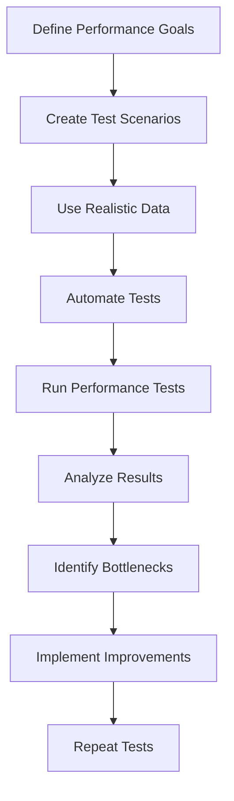

## 19.9 Performance Testing and Benchmarking

In the world of software development, performance is a critical factor that can make or break an application. As Ruby developers, we must ensure our applications are not only functional but also efficient and responsive. This section will guide you through the essential concepts of performance testing and benchmarking, providing you with the tools and techniques necessary to optimize your Ruby applications.

### Understanding Performance Testing and Benchmarking

**Performance Testing** is the process of evaluating the speed, responsiveness, and stability of a software application under a particular workload. It aims to identify performance bottlenecks and ensure that the application meets the required performance criteria.

**Benchmarking**, on the other hand, is a specific type of performance testing that involves measuring the performance of a particular piece of code or system against a standard or baseline. It helps in comparing the efficiency of different implementations and identifying areas for improvement.

### Tools for Performance Testing and Benchmarking

Several tools can assist in performance testing and benchmarking Ruby applications. Let's explore some of the most popular ones:

1. **Benchmark Module**: Ruby's standard library includes the `Benchmark` module, which provides methods to measure and report the time taken to execute Ruby code.

2. **JMeter**: Apache JMeter is an open-source tool designed to load test functional behavior and measure performance. It is widely used for testing web applications.

3. **Apache Bench (ab)**: A command-line tool for benchmarking HTTP servers. It is useful for measuring the performance of web applications by simulating multiple requests.

### Writing Benchmark Tests in Ruby

The `Benchmark` module in Ruby is a powerful tool for measuring the performance of your code. Here's a simple example of how to use it:

```ruby
require 'benchmark'

n = 50000
Benchmark.bm do |x|
  x.report("for loop:") do
    for i in 1..n do
      a = "1".to_i
    end
  end

  x.report("times loop:") do
    n.times do
      a = "1".to_i
    end
  end

  x.report("upto loop:") do
    1.upto(n) do
      a = "1".to_i
    end
  end
end
```

In this example, we compare the performance of three different loop constructs in Ruby. The `Benchmark.bm` method provides a formatted report of the time taken by each block of code.

### Setting Up Performance Tests

To accurately measure performance, it's crucial to simulate real-world usage scenarios. Here are some steps to set up effective performance tests:

1. **Define Performance Goals**: Clearly outline what you want to achieve with your performance tests. This could be response time, throughput, or resource utilization.

2. **Create Test Scenarios**: Develop scenarios that mimic actual user behavior. Consider factors like concurrent users, data volume, and transaction complexity.

3. **Use Realistic Data**: Populate your test environment with data that closely resembles production data. This ensures that the test results are relevant and actionable.

4. **Automate Tests**: Use tools like JMeter or ab to automate your performance tests. This allows you to run tests consistently and frequently.

### Interpreting Results and Identifying Improvements

Once you've conducted your performance tests, the next step is to analyze the results. Here are some tips for interpreting performance data:

- **Identify Bottlenecks**: Look for areas where the application is slow or unresponsive. This could be due to inefficient code, database queries, or network latency.

- **Compare Against Baselines**: Use benchmarking to compare the current performance against previous versions or alternative implementations.

- **Prioritize Improvements**: Focus on the areas that will have the most significant impact on performance. This could be optimizing critical code paths or improving database indexing.

### Importance of Consistent Testing Environments

To ensure the accuracy and reliability of your performance tests, it's essential to maintain a consistent testing environment. Here are some best practices:

- **Isolate the Test Environment**: Run tests in an environment that closely mirrors production but is isolated from other systems to avoid interference.

- **Control Variables**: Keep hardware, software, and network configurations consistent across tests.

- **Repeat Tests**: Conduct multiple test runs to account for variability and ensure results are reproducible.

### Try It Yourself

Experiment with the `Benchmark` module by modifying the code example provided. Try changing the loop constructs or the operations performed within the loops. Observe how these changes affect the performance results.

### Visualizing Performance Testing Workflow

To better understand the workflow of performance testing and benchmarking, let's visualize it using a flowchart:



This flowchart illustrates the iterative nature of performance testing, emphasizing the continuous cycle of testing, analysis, and improvement.

### References and Further Reading

- [Ruby Benchmark Module Documentation](https://ruby-doc.org/stdlib-2.7.0/libdoc/benchmark/rdoc/Benchmark.html)
- [Apache JMeter Official Website](https://jmeter.apache.org/)
- [Apache Bench (ab) Documentation](https://httpd.apache.org/docs/2.4/programs/ab.html)

### Knowledge Check

- What is the primary goal of performance testing?
- How does benchmarking differ from general performance testing?
- Why is it important to use realistic data in performance tests?
- What are some common tools used for performance testing in Ruby?
- How can you identify performance bottlenecks in your application?

### Embrace the Journey

Remember, performance optimization is an ongoing process. As you continue to develop and refine your Ruby applications, keep performance testing and benchmarking at the forefront of your efforts. Stay curious, experiment with different tools and techniques, and enjoy the journey of creating efficient and responsive software.

## Quiz: Performance Testing and Benchmarking



### What is the primary goal of performance testing?

- [x] To evaluate the speed, responsiveness, and stability of an application
- [ ] To find bugs in the application
- [ ] To improve code readability
- [ ] To test the application's user interface

> **Explanation:** Performance testing aims to assess how well an application performs under specific conditions, focusing on speed, responsiveness, and stability.

### Which tool is part of Ruby's standard library for benchmarking?

- [x] Benchmark
- [ ] JMeter
- [ ] Apache Bench
- [ ] Selenium

> **Explanation:** The `Benchmark` module is included in Ruby's standard library and is used for measuring code execution time.

### What is a key difference between performance testing and benchmarking?

- [x] Benchmarking measures performance against a standard or baseline
- [ ] Performance testing is only for web applications
- [ ] Benchmarking is a type of load testing
- [ ] Performance testing does not involve measuring speed

> **Explanation:** Benchmarking involves comparing performance against a baseline, whereas performance testing evaluates overall application performance.

### Why is it important to use realistic data in performance tests?

- [x] To ensure test results are relevant and actionable
- [ ] To make tests run faster
- [ ] To reduce the complexity of tests
- [ ] To simplify test setup

> **Explanation:** Realistic data ensures that performance tests accurately reflect real-world usage, making the results more applicable to production environments.

### Which of the following is a command-line tool for benchmarking HTTP servers?

- [x] Apache Bench
- [ ] JMeter
- [ ] Benchmark
- [ ] Capybara

> **Explanation:** Apache Bench (ab) is a command-line tool used for benchmarking HTTP servers by simulating multiple requests.

### What is the purpose of automating performance tests?

- [x] To run tests consistently and frequently
- [ ] To eliminate the need for manual testing
- [ ] To improve test accuracy
- [ ] To reduce test setup time

> **Explanation:** Automating performance tests allows for consistent and frequent execution, ensuring reliable and repeatable results.

### How can you identify performance bottlenecks in your application?

- [x] By analyzing performance test results
- [ ] By reviewing code comments
- [ ] By increasing server resources
- [ ] By reducing test data

> **Explanation:** Analyzing performance test results helps identify areas where the application is slow or unresponsive, indicating potential bottlenecks.

### What is the benefit of maintaining a consistent testing environment?

- [x] To ensure accuracy and reliability of test results
- [ ] To speed up test execution
- [ ] To simplify test setup
- [ ] To reduce test costs

> **Explanation:** A consistent testing environment ensures that test results are accurate and reliable, as variables are controlled across test runs.

### What is the first step in setting up performance tests?

- [x] Define performance goals
- [ ] Automate tests
- [ ] Use realistic data
- [ ] Create test scenarios

> **Explanation:** Defining performance goals is the first step, as it sets the objectives and criteria for the performance tests.

### True or False: Benchmarking is only useful for web applications.

- [ ] True
- [x] False

> **Explanation:** Benchmarking is applicable to any type of application or code, not just web applications, as it measures performance against a baseline.




