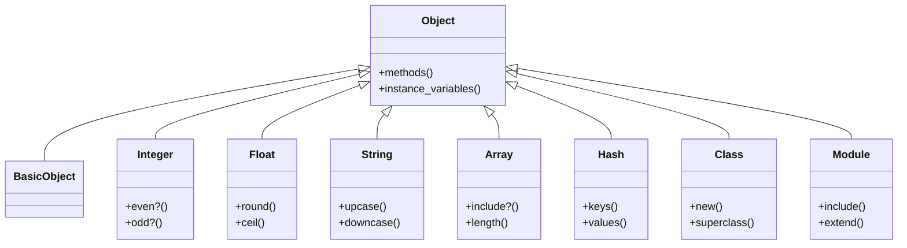

## 2.1 Everything Is an Object

Ruby is renowned for its pure object-oriented nature, a characteristic that sets it apart from many other programming languages. In Ruby, everything is an object. This fundamental principle not only simplifies the language but also enhances its flexibility and power. Let's delve into what this means and explore its implications for Ruby developers.

### Understanding Ruby's Object-Oriented Nature

In Ruby, every entity is an object, whether it's a number, a string, a class, a module, or even a literal. This uniformity means that all entities share a common interface and can be manipulated using the same set of operations. This section will explore how Ruby treats various data types as objects and the benefits of this approach.

#### Numbers as Objects

In many programming languages, numbers are primitive types, distinct from objects. However, in Ruby, numbers are objects, and they come with a rich set of methods.

```ruby
# Integer as an object
num = 42
puts num.class # Output: Integer
puts num.even? # Output: true

# Float as an object
float_num = 3.14
puts float_num.class # Output: Float
puts float_num.round # Output: 3
```

In these examples, `42` and `3.14` are not just raw data; they are instances of the `Integer` and `Float` classes, respectively. This allows us to call methods like `even?` and `round` directly on them.

#### Strings as Objects

Strings in Ruby are also objects, which means they come with a plethora of methods for manipulation.

```ruby
# String as an object
greeting = "Hello, World!"
puts greeting.class # Output: String
puts greeting.upcase # Output: HELLO, WORLD!
puts greeting.length # Output: 13
```

Here, the string `"Hello, World!"` is an instance of the `String` class, allowing us to call methods like `upcase` and `length`.

#### Classes and Modules as Objects

Even classes and modules themselves are objects in Ruby. This allows for dynamic behavior and metaprogramming.

```ruby
# Class as an object
class MyClass
end

puts MyClass.class # Output: Class

# Module as an object
module MyModule
end

puts MyModule.class # Output: Module
```

In Ruby, `MyClass` is an instance of the `Class` class, and `MyModule` is an instance of the `Module` class. This object-oriented approach enables powerful metaprogramming techniques.

#### Literals as Objects

Even literals, such as arrays and hashes, are objects in Ruby.

```ruby
# Array as an object
arr = [1, 2, 3]
puts arr.class # Output: Array
puts arr.include?(2) # Output: true

# Hash as an object
hash = { key: 'value' }
puts hash.class # Output: Hash
puts hash.keys # Output: [:key]
```

Arrays and hashes are instances of the `Array` and `Hash` classes, respectively, providing a consistent interface for interaction.

### Benefits of Ruby's Object-Oriented Design

The fact that everything is an object in Ruby brings several benefits:

1. **Uniformity**: Since all entities are objects, they share a common interface. This uniformity simplifies the language and makes it easier to learn and use.

2. **Flexibility**: Objects can be extended and modified at runtime, allowing for dynamic behavior and customization.

3. **Metaprogramming**: Ruby's object-oriented nature facilitates metaprogramming, enabling developers to write code that writes code.

4. **Dynamic Typing**: Ruby's dynamic typing allows for more flexible and expressive code, as types are checked at runtime.

5. **Consistency**: The object-oriented approach provides a consistent way to interact with all data types, reducing the cognitive load on developers.

### Metaprogramming and Dynamic Behavior

Ruby's object-oriented nature is a cornerstone of its metaprogramming capabilities. Metaprogramming allows developers to write code that can modify itself or other code at runtime. This is possible because classes and modules are objects, and their behavior can be altered dynamically.

#### Dynamic Method Definition

Ruby allows for the dynamic definition of methods, which can be used to create flexible and reusable code.

```ruby
# Define a method dynamically
class DynamicClass
  define_method(:dynamic_method) do
    puts "This is a dynamically defined method!"
  end
end

obj = DynamicClass.new
obj.dynamic_method # Output: This is a dynamically defined method!
```

In this example, `define_method` is used to create a method at runtime, showcasing Ruby's dynamic capabilities.

#### Method Missing

Ruby's `method_missing` is a powerful feature that allows developers to handle calls to undefined methods, providing a way to implement dynamic behavior.

```ruby
class DynamicResponder
  def method_missing(method_name, *args)
    puts "You called: #{method_name} with arguments: #{args.join(', ')}"
  end
end

responder = DynamicResponder.new
responder.any_method(1, 2, 3) # Output: You called: any_method with arguments: 1, 2, 3
```

Here, `method_missing` captures calls to undefined methods, allowing for custom handling and dynamic responses.

### Encouraging Holistic Thinking About Objects

Understanding that everything is an object in Ruby encourages developers to think about objects in a holistic way. This mindset promotes a deeper understanding of the language and its capabilities, leading to more effective and efficient code.

#### Try It Yourself

To deepen your understanding, try modifying the code examples provided. Experiment with different data types and methods to see how Ruby's object-oriented nature influences behavior. For instance, try defining your own classes and methods dynamically, or explore how `method_missing` can be used to create flexible interfaces.

### Visualizing Ruby's Object Model

To better understand how Ruby treats everything as an object, let's visualize the object model using a class diagram.



This diagram illustrates the hierarchy of Ruby's object model, showing how various classes inherit from `Object` and share common methods.

### References and Further Reading

For more information on Ruby's object-oriented nature and metaprogramming capabilities, consider exploring the following resources:

- [Ruby Documentation](https://ruby-doc.org/)
- [Metaprogramming Ruby 2: Program Like the Ruby Pros](https://pragprog.com/titles/ppmetr2/metaprogramming-ruby-2/)
- [Why's (Poignant) Guide to Ruby](http://poignant.guide/)

### Knowledge Check

Before moving on, consider these questions to test your understanding:

- How does Ruby's treatment of numbers as objects differ from other languages?
- What are the benefits of having classes and modules as objects?
- How does Ruby's object-oriented nature facilitate metaprogramming?

### Embrace the Journey

Remember, this is just the beginning. As you progress, you'll discover more about Ruby's powerful features and how they can be leveraged to build scalable and maintainable applications. Keep experimenting, stay curious, and enjoy the journey!

## Quiz: Everything Is an Object



### In Ruby, what is the class of the number 42?

- [x] Integer
- [ ] Fixnum
- [ ] Numeric
- [ ] Object

> **Explanation:** In Ruby, 42 is an instance of the `Integer` class.

### Which method can be used to define a method dynamically in Ruby?

- [x] define_method
- [ ] method_missing
- [ ] attr_accessor
- [ ] include

> **Explanation:** `define_method` is used to define methods dynamically in Ruby.

### What is the output of `puts "Hello".class` in Ruby?

- [x] String
- [ ] Object
- [ ] Class
- [ ] Module

> **Explanation:** In Ruby, `"Hello"` is an instance of the `String` class.

### What does the `method_missing` method allow you to do in Ruby?

- [x] Handle calls to undefined methods
- [ ] Define methods at runtime
- [ ] Access private methods
- [ ] Override existing methods

> **Explanation:** `method_missing` allows you to handle calls to methods that are not defined.

### Which of the following is NOT an object in Ruby?

- [ ] Integer
- [ ] String
- [ ] Array
- [x] None of the above

> **Explanation:** In Ruby, everything is an object, including integers, strings, and arrays.

### What is the superclass of all classes in Ruby?

- [x] Object
- [ ] BasicObject
- [ ] Class
- [ ] Module

> **Explanation:** `Object` is the superclass of all classes in Ruby.

### How does Ruby's object-oriented nature benefit metaprogramming?

- [x] By allowing dynamic method definition and modification
- [ ] By enforcing strict typing
- [ ] By limiting dynamic behavior
- [ ] By preventing runtime changes

> **Explanation:** Ruby's object-oriented nature allows for dynamic method definition and modification, which is essential for metaprogramming.

### What is the result of calling `42.even?` in Ruby?

- [x] true
- [ ] false
- [ ] nil
- [ ] Error

> **Explanation:** The method `even?` checks if the number is even, and for 42, it returns `true`.

### Which class does the `Array` class inherit from in Ruby?

- [x] Object
- [ ] BasicObject
- [ ] Enumerable
- [ ] Hash

> **Explanation:** The `Array` class inherits from `Object` in Ruby.

### True or False: In Ruby, classes themselves are objects.

- [x] True
- [ ] False

> **Explanation:** In Ruby, classes are instances of the `Class` class, making them objects.


