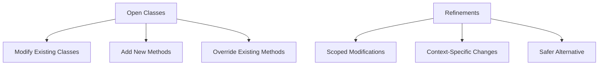

## 2.10 Open Classes and Refinements

In the world of Ruby programming, flexibility and dynamism are key characteristics that set the language apart. One of the most powerful features that embody this flexibility is the concept of open classes. Open classes allow developers to modify existing classes, including built-in ones, at runtime. However, with great power comes great responsibility, and this is where refinements come into play, offering a safer alternative for scoping modifications.

### Understanding Open Classes

**Open Classes** in Ruby refer to the ability to reopen and modify existing classes. This feature allows developers to add new methods or override existing ones, even in classes defined in the Ruby standard library or third-party gems.

#### Modifying Open Classes

To modify an open class, you simply reopen the class definition and add or change methods as needed. Here's a simple example:

```ruby
# Original String class
class String
  def shout
    self.upcase + "!"
  end
end

# Usage
puts "hello".shout  # Outputs: HELLO!
```

In this example, we added a `shout` method to the `String` class, which converts the string to uppercase and appends an exclamation mark.

#### Benefits of Open Classes

1. **Flexibility**: Open classes allow you to extend or modify behavior without altering the original source code.
2. **Rapid Prototyping**: Quickly add features or fix bugs in third-party libraries.
3. **Domain-Specific Enhancements**: Tailor classes to better fit the specific needs of your application domain.

#### Risks of Open Classes

1. **Unintended Consequences**: Modifying a class can lead to unexpected behavior, especially if other parts of the code rely on the original implementation.
2. **Maintenance Challenges**: Changes to core classes can make the codebase harder to understand and maintain.
3. **Compatibility Issues**: Updates to the Ruby language or third-party libraries may conflict with your modifications.

### Introducing Refinements

Refinements provide a way to scope modifications to classes more safely. They allow you to define changes that only apply within a specific context, reducing the risk of unintended side effects.

#### Defining and Using Refinements

To define a refinement, you create a module and use the `refine` method to specify the changes. Here's how you can define a refinement for the `String` class:

```ruby
module StringExtensions
  refine String do
    def shout
      self.upcase + "!"
    end
  end
end

# Using the refinement
using StringExtensions

puts "hello".shout  # Outputs: HELLO!
```

In this example, the `shout` method is only available within the context where the `StringExtensions` module is used.

#### Benefits of Refinements

1. **Scoped Changes**: Refinements limit the scope of modifications, reducing the risk of affecting unrelated code.
2. **Improved Maintainability**: By keeping changes localized, refinements make the codebase easier to understand and maintain.
3. **Safer Modifications**: Refinements provide a safer alternative to open classes, especially when working with shared libraries or large codebases.

### Best Practices for Using Open Classes and Refinements

1. **Use Open Classes Sparingly**: Reserve open class modifications for cases where they are truly necessary and beneficial.
2. **Prefer Refinements for Scoped Changes**: When possible, use refinements to limit the scope of your modifications and avoid unintended side effects.
3. **Document Changes Clearly**: Always document any modifications to existing classes, whether through open classes or refinements, to aid future maintenance and understanding.
4. **Test Thoroughly**: Ensure that any changes to existing classes are thoroughly tested to catch potential issues early.

### Visualizing Open Classes and Refinements

To better understand the relationship between open classes and refinements, consider the following diagram:



This diagram illustrates how open classes allow for broad modifications, while refinements offer a more controlled and context-specific approach.

### Try It Yourself

Experiment with the examples provided by modifying the `String` class or creating your own refinements. Try adding new methods or altering existing ones, and observe how these changes affect your code. Consider the implications of using open classes versus refinements in different scenarios.

### External Resources

For further reading on refinements, refer to the [Ruby Refinements Documentation](https://ruby-doc.org/core-3.0.0/doc/syntax/refinements_rdoc.html).

### Knowledge Check

- What are the key differences between open classes and refinements?
- How can refinements help mitigate the risks associated with open classes?
- In what scenarios would you prefer using refinements over open classes?

### Summary

Open classes and refinements are powerful tools in Ruby that allow developers to modify existing classes and scope changes safely. While open classes offer flexibility, they come with risks that refinements can help mitigate. By understanding and applying these concepts responsibly, you can enhance your Ruby applications while maintaining scalability and maintainability.

## Quiz: Open Classes and Refinements



### What is an open class in Ruby?

- [x] A class that can be modified after its initial definition.
- [ ] A class that cannot be instantiated.
- [ ] A class that is defined in a module.
- [ ] A class that is only available in the Ruby standard library.

> **Explanation:** An open class in Ruby refers to the ability to modify a class after it has been defined, allowing for the addition or alteration of methods.

### What is a potential risk of using open classes?

- [x] Unintended consequences in other parts of the code.
- [ ] Improved performance.
- [ ] Increased security.
- [ ] Better readability.

> **Explanation:** Modifying open classes can lead to unintended consequences, as changes may affect other parts of the code that rely on the original implementation.

### How do refinements help mitigate the risks of open classes?

- [x] By scoping modifications to a specific context.
- [ ] By making classes immutable.
- [ ] By increasing the performance of the code.
- [ ] By automatically documenting changes.

> **Explanation:** Refinements allow modifications to be scoped to a specific context, reducing the risk of unintended side effects in other parts of the code.

### How do you define a refinement in Ruby?

- [x] By creating a module and using the `refine` method.
- [ ] By creating a class and using the `extend` method.
- [ ] By using the `include` method in a module.
- [ ] By defining a method with the `private` keyword.

> **Explanation:** Refinements are defined by creating a module and using the `refine` method to specify changes to a class.

### What is the purpose of the `using` keyword in Ruby?

- [x] To activate a refinement in a specific context.
- [ ] To include a module in a class.
- [ ] To define a new class.
- [ ] To create a new instance of a class.

> **Explanation:** The `using` keyword is used to activate a refinement in a specific context, making the refined methods available.

### When should you prefer using refinements over open classes?

- [x] When you want to limit the scope of modifications.
- [ ] When you need to improve performance.
- [ ] When you want to make a class immutable.
- [ ] When you need to increase security.

> **Explanation:** Refinements should be preferred when you want to limit the scope of modifications to avoid unintended side effects.

### What is a benefit of using open classes?

- [x] Flexibility to modify behavior without altering source code.
- [ ] Increased security.
- [ ] Improved performance.
- [ ] Automatic documentation of changes.

> **Explanation:** Open classes provide the flexibility to modify behavior without altering the original source code, allowing for rapid prototyping and domain-specific enhancements.

### How can you ensure that changes to open classes are safe?

- [x] By thoroughly testing the modifications.
- [ ] By avoiding any documentation.
- [ ] By using the `private` keyword.
- [ ] By making all methods public.

> **Explanation:** Thorough testing of modifications to open classes is essential to ensure that changes do not introduce unintended consequences.

### What is a key characteristic of refinements?

- [x] They provide scoped modifications.
- [ ] They make classes immutable.
- [ ] They automatically improve performance.
- [ ] They are only available in Ruby 1.9.

> **Explanation:** Refinements provide scoped modifications, allowing changes to be limited to specific contexts.

### True or False: Refinements can be used to modify built-in Ruby classes.

- [x] True
- [ ] False

> **Explanation:** Refinements can be used to modify built-in Ruby classes, providing a safer alternative to open classes by scoping changes.



Remember, this is just the beginning. As you progress, you'll build more complex and interactive Ruby applications. Keep experimenting, stay curious, and enjoy the journey!
