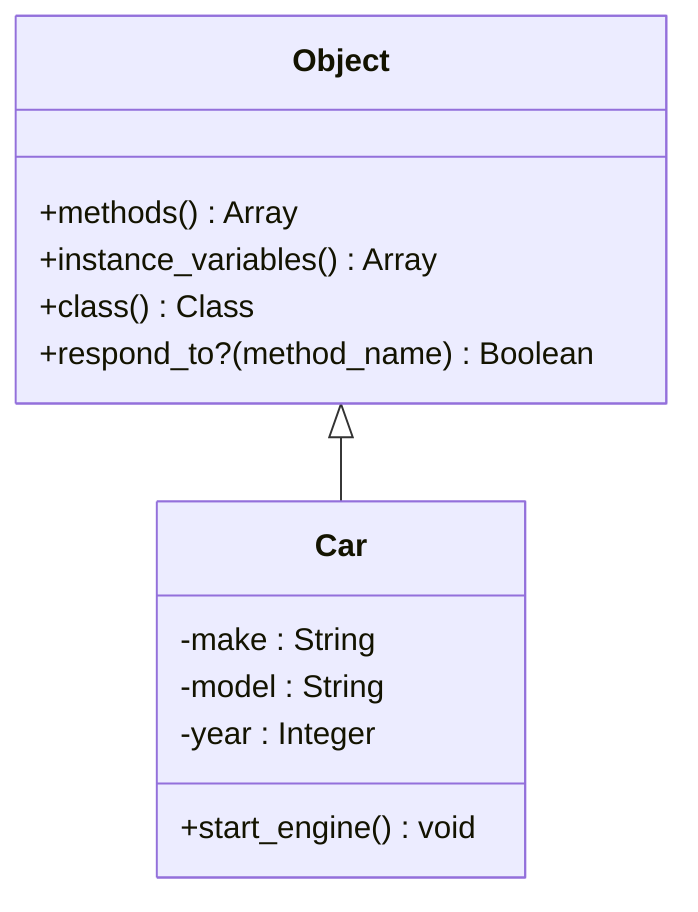

## 2.11 Reflection and Introspection

In the world of Ruby programming, reflection and introspection are powerful tools that allow developers to examine and manipulate the structure and behavior of their code dynamically. These capabilities are essential for building flexible, scalable, and maintainable applications. In this section, we'll delve into the concepts of reflection and introspection, explore their practical applications, and discuss best practices and potential pitfalls.

### Understanding Reflection and Introspection

**Reflection** is the ability of a program to examine and modify its own structure and behavior at runtime. It allows you to inspect classes, methods, and objects to understand their properties and capabilities. **Introspection**, on the other hand, is a subset of reflection that focuses on examining the structure of code without modifying it.

In Ruby, reflection and introspection are facilitated by a rich set of methods and features that allow developers to query objects about their properties, such as methods, instance variables, and class hierarchies.

### Key Reflection and Introspection Methods

Let's explore some of the key methods that enable reflection and introspection in Ruby:

- **`methods`**: Returns an array of the names of public and protected methods of an object.
- **`instance_variables`**: Returns an array of the names of instance variables of an object.
- **`class`**: Returns the class of an object.
- **`ancestors`**: Returns an array of modules included in the class (including the class itself).
- **`respond_to?`**: Checks if an object responds to a given method.
- **`method`**: Returns a `Method` object representing a method of an object.

#### Example: Using Reflection to Inspect an Object

```ruby
class Car
  attr_accessor :make, :model, :year

  def initialize(make, model, year)
    @make = make
    @model = model
    @year = year
  end

  def start_engine
    puts "Engine started!"
  end
end

car = Car.new("Toyota", "Camry", 2020)

# Inspecting the car object
puts "Class: #{car.class}"
puts "Instance Variables: #{car.instance_variables}"
puts "Methods: #{car.methods.sort}"
puts "Responds to start_engine?: #{car.respond_to?(:start_engine)}"
```

In this example, we create a `Car` class and use reflection to inspect an instance of the class. We retrieve the class name, instance variables, methods, and check if the object responds to a specific method.

### Practical Applications of Reflection and Introspection

Reflection and introspection have several practical applications in Ruby programming:

1. **Testing Frameworks**: Reflection is widely used in testing frameworks like RSpec and Minitest to dynamically discover and execute test cases.

2. **Serialization**: Reflection can be used to serialize and deserialize objects by examining their instance variables and methods.

3. **Dynamic Method Invocation**: Reflection allows you to invoke methods dynamically, which is useful for building flexible APIs and plugins.

4. **Code Analysis and Debugging**: Reflection can be used to analyze code structure and behavior, making it easier to debug and optimize applications.

#### Example: Dynamic Method Invocation

```ruby
class Calculator
  def add(a, b)
    a + b
  end

  def subtract(a, b)
    a - b
  end
end

calculator = Calculator.new
method_name = :add

# Dynamically invoking a method
result = calculator.send(method_name, 5, 3)
puts "Result: #{result}"  # Output: Result: 8
```

In this example, we use the `send` method to dynamically invoke the `add` method on a `Calculator` object. This approach allows for flexible method invocation based on runtime conditions.

### Importance of Reflection in Dynamic Programming

Reflection is a cornerstone of dynamic programming languages like Ruby. It enables developers to write code that can adapt to changing requirements and environments. By leveraging reflection, you can build applications that are more flexible and easier to maintain.

However, it's important to use reflection judiciously. Overuse of reflection can lead to code that is difficult to understand and maintain. It's crucial to strike a balance between flexibility and readability.

### Potential Performance Impacts and Security Considerations

While reflection is a powerful tool, it comes with potential performance impacts and security considerations:

- **Performance**: Reflection can be slower than direct method calls because it involves additional processing to inspect and invoke methods dynamically. It's important to profile and optimize code that heavily relies on reflection.

- **Security**: Reflection can expose internal details of your code, which may lead to security vulnerabilities if not handled carefully. Always validate and sanitize inputs when using reflection to prevent unauthorized access or code execution.

### Best Practices for Using Reflection and Introspection

To effectively use reflection and introspection in Ruby, consider the following best practices:

- **Use Reflection Sparingly**: Only use reflection when necessary. Avoid overusing it in performance-critical sections of your code.

- **Document Reflective Code**: Clearly document any code that uses reflection to help other developers understand its purpose and behavior.

- **Profile and Optimize**: Profile your code to identify performance bottlenecks related to reflection and optimize them as needed.

- **Validate Inputs**: Always validate and sanitize inputs when using reflection to prevent security vulnerabilities.

- **Test Thoroughly**: Ensure that code using reflection is thoroughly tested to catch any unexpected behavior or edge cases.

### Visualizing Reflection and Introspection

To better understand how reflection and introspection work in Ruby, let's visualize the process using a class diagram:



This diagram illustrates the relationship between the `Object` class and the `Car` class. The `Car` class inherits from `Object`, gaining access to reflection methods like `methods`, `instance_variables`, and `class`.

### Try It Yourself

To deepen your understanding of reflection and introspection in Ruby, try modifying the code examples provided in this section. Experiment with different classes and methods to see how reflection can be used to inspect and manipulate objects dynamically.

### Knowledge Check

Before we conclude, let's reinforce what we've learned with a few questions:

- What is the difference between reflection and introspection?
- How can reflection be used in testing frameworks?
- What are some potential performance impacts of using reflection?
- Why is it important to validate inputs when using reflection?

### Embrace the Journey

Remember, mastering reflection and introspection is just one step in your journey to becoming a proficient Ruby developer. As you continue to explore Ruby's dynamic capabilities, you'll gain the skills needed to build more flexible and maintainable applications. Keep experimenting, stay curious, and enjoy the journey!

## Quiz: Reflection and Introspection



### What is reflection in programming?

- [x] The ability of a program to examine and modify its own structure and behavior at runtime.
- [ ] A method to improve code performance.
- [ ] A technique for debugging code.
- [ ] A way to manage dependencies in a program.

> **Explanation:** Reflection allows a program to examine and modify its own structure and behavior at runtime, making it a powerful tool in dynamic programming.

### Which method is used to check if an object responds to a specific method in Ruby?

- [x] `respond_to?`
- [ ] `methods`
- [ ] `instance_variables`
- [ ] `class`

> **Explanation:** The `respond_to?` method checks if an object responds to a specific method, making it useful for dynamic method invocation.

### What is a potential drawback of using reflection in Ruby?

- [x] It can lead to performance issues.
- [ ] It makes code easier to read.
- [ ] It simplifies debugging.
- [ ] It improves security.

> **Explanation:** Reflection can lead to performance issues because it involves additional processing to inspect and invoke methods dynamically.

### How can reflection be used in testing frameworks?

- [x] To dynamically discover and execute test cases.
- [ ] To improve test performance.
- [ ] To simplify test setup.
- [ ] To enhance test security.

> **Explanation:** Reflection is used in testing frameworks to dynamically discover and execute test cases, allowing for more flexible and comprehensive testing.

### What is introspection in programming?

- [x] Examining the structure of code without modifying it.
- [ ] Modifying the behavior of code at runtime.
- [ ] Improving code performance.
- [ ] Debugging code.

> **Explanation:** Introspection involves examining the structure of code without modifying it, making it a subset of reflection.

### Which method returns an array of the names of instance variables of an object?

- [x] `instance_variables`
- [ ] `methods`
- [ ] `class`
- [ ] `respond_to?`

> **Explanation:** The `instance_variables` method returns an array of the names of instance variables of an object, allowing for introspection of object state.

### Why is it important to validate inputs when using reflection?

- [x] To prevent security vulnerabilities.
- [ ] To improve performance.
- [ ] To simplify code.
- [ ] To enhance readability.

> **Explanation:** Validating inputs when using reflection is crucial to prevent security vulnerabilities, as reflection can expose internal details of your code.

### What is a practical application of reflection in Ruby?

- [x] Serialization and deserialization of objects.
- [ ] Improving code readability.
- [ ] Simplifying debugging.
- [ ] Enhancing security.

> **Explanation:** Reflection can be used for serialization and deserialization of objects by examining their instance variables and methods.

### What is the `send` method used for in Ruby?

- [x] Dynamically invoking a method on an object.
- [ ] Sending data over a network.
- [ ] Improving code performance.
- [ ] Debugging code.

> **Explanation:** The `send` method is used to dynamically invoke a method on an object, allowing for flexible method invocation based on runtime conditions.

### True or False: Reflection is always the best choice for dynamic programming in Ruby.

- [ ] True
- [x] False

> **Explanation:** False. While reflection is a powerful tool for dynamic programming, it should be used judiciously due to potential performance impacts and security considerations.




