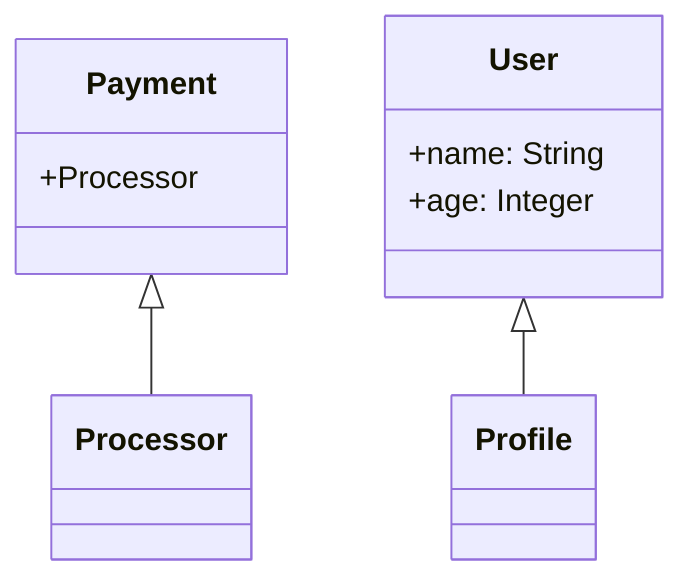

## 2.12 Best Practices in Ruby Programming

Writing clean, efficient, and maintainable code is crucial for any Ruby developer aiming to build scalable applications. In this section, we will explore the best practices that can help you achieve this goal. From leveraging Ruby's unique features to adhering to community standards, we'll cover everything you need to know to write idiomatic Ruby code.

### Principle of Least Surprise

One of the core philosophies of Ruby is the Principle of Least Surprise. This principle suggests that the behavior of the code should be intuitive and predictable for other developers. Let's explore how you can implement this principle in your Ruby code.

#### Code Readability

- **Use Descriptive Names**: Choose variable and method names that clearly describe their purpose. Avoid abbreviations and single-letter names unless they are universally understood (e.g., `i` for an index).
  
  ```ruby
  # Bad
  def calc(x, y)
    x + y
  end

  # Good
  def calculate_sum(first_number, second_number)
    first_number + second_number
  end
  ```

- **Consistent Naming Conventions**: Follow Ruby's naming conventions. Use snake_case for variable and method names, CamelCase for classes and modules, and SCREAMING_SNAKE_CASE for constants.

- **Indentation and Spacing**: Use two spaces per indentation level. Avoid tabs and ensure consistent spacing throughout your code.

  ```ruby
  class Example
    def initialize
      @value = 0
    end

    def increment
      @value += 1
    end
  end
  ```

#### Code Organization

- **Modular Design**: Break down your code into smaller, reusable modules. This makes your codebase easier to manage and understand.

- **Single Responsibility Principle**: Ensure that each class and method has a single responsibility. This makes your code more maintainable and easier to test.

- **Use Modules for Namespacing**: Organize related classes and modules under a common namespace to avoid name collisions and improve code clarity.

  ```ruby
  module Payment
    class Processor
      # Payment processing logic
    end
  end
  ```

### Leveraging Ruby's Features

Ruby offers a wealth of features that can help you write more expressive and concise code. Let's explore some of these features and how to use them effectively.

#### Idiomatic Ruby Code

- **Use Enumerable Methods**: Leverage Ruby's powerful Enumerable module to work with collections. Methods like `map`, `select`, `reduce`, and `each_with_index` can make your code more expressive.

  ```ruby
  numbers = [1, 2, 3, 4, 5]

  # Bad
  doubled_numbers = []
  numbers.each do |number|
    doubled_numbers << number * 2
  end

  # Good
  doubled_numbers = numbers.map { |number| number * 2 }
  ```

- **Blocks and Procs**: Use blocks to encapsulate code that can be passed to methods. This is a powerful feature of Ruby that allows for flexible and reusable code.

  ```ruby
  def perform_task
    yield if block_given?
  end

  perform_task { puts "Task performed!" }
  ```

- **Symbols for Hash Keys**: Use symbols instead of strings for hash keys to improve performance and readability.

  ```ruby
  # Bad
  user = { "name" => "Alice", "age" => 30 }

  # Good
  user = { name: "Alice", age: 30 }
  ```

### Testing and Documentation

Testing and documentation are critical components of any software development process. They ensure that your code is reliable and easy to understand.

#### Testing

- **Test-Driven Development (TDD)**: Adopt TDD practices to write tests before implementing functionality. This helps you think through the design and ensures that your code meets the requirements.

- **Use RSpec for Testing**: RSpec is a popular testing framework in the Ruby community. It provides a readable syntax and powerful features for writing tests.

  ```ruby
  # spec/calculator_spec.rb
  require 'calculator'

  RSpec.describe Calculator do
    it "adds two numbers" do
      calculator = Calculator.new
      expect(calculator.add(2, 3)).to eq(5)
    end
  end
  ```

#### Documentation

- **Inline Comments**: Use comments to explain complex logic or important decisions in your code. Avoid obvious comments that do not add value.

  ```ruby
  # Calculate the factorial of a number using recursion
  def factorial(n)
    return 1 if n <= 1
    n * factorial(n - 1)
  end
  ```

- **RDoc for Documentation**: Use RDoc to generate documentation for your Ruby code. This tool extracts comments and code to create comprehensive documentation.

  ```ruby
  # Calculate the sum of two numbers
  #
  # @param [Integer] a The first number
  # @param [Integer] b The second number
  # @return [Integer] The sum of the two numbers
  def add(a, b)
    a + b
  end
  ```

### Adhering to Community Standards

Following community standards ensures that your code is consistent with other Ruby projects and easier for other developers to understand.

#### Ruby Style Guide

- **Follow the Ruby Style Guide**: The Ruby Style Guide provides a comprehensive set of guidelines for writing Ruby code. Adhering to these guidelines helps maintain consistency across projects.

- **Use RuboCop for Linting**: RuboCop is a static code analyzer that enforces the Ruby Style Guide. It can automatically correct many style violations.

  ```bash
  # Run RuboCop to check for style violations
  rubocop
  ```

### Avoiding Common Pitfalls

Even experienced developers can fall into common pitfalls when writing Ruby code. Let's explore some of these pitfalls and how to avoid them.

#### Mutable Default Arguments

- **Avoid Mutable Default Arguments**: Using mutable objects as default arguments can lead to unexpected behavior. Use `nil` and set the default value inside the method.

  ```ruby
  # Bad
  def add_to_list(item, list = [])
    list << item
  end

  # Good
  def add_to_list(item, list = nil)
    list ||= []
    list << item
  end
  ```

#### Method Overloading

- **Avoid Method Overloading**: Ruby does not support method overloading. Instead, use default arguments or variable-length arguments to achieve similar functionality.

  ```ruby
  def greet(name, greeting = "Hello")
    "#{greeting}, #{name}!"
  end
  ```

### Encouraging Experimentation

Remember, this is just the beginning. As you progress, you'll build more complex and interactive Ruby applications. Keep experimenting, stay curious, and enjoy the journey!

#### Try It Yourself

- **Experiment with Enumerable Methods**: Modify the code examples to use different Enumerable methods. Try using `select` to filter elements or `reduce` to calculate a sum.

- **Create Your Own Module**: Practice creating a module with a few related classes. Use this module to namespace your classes and avoid name collisions.

### Visualizing Ruby Concepts

To further enhance your understanding, let's visualize some of the concepts we've discussed using Mermaid.js diagrams.

#### Visualizing Code Organization



*Diagram: This class diagram represents the organization of classes within a Payment module and a User class.*

### Knowledge Check

To reinforce your understanding, let's pose some questions and challenges.

- **Question**: What is the Principle of Least Surprise, and how can it be applied in Ruby programming?
- **Challenge**: Refactor a piece of code to improve readability and adhere to Ruby's naming conventions.

### Summary

In this section, we've explored best practices for writing clean, efficient, and maintainable Ruby code. By following the Principle of Least Surprise, leveraging Ruby's features, and adhering to community standards, you can write idiomatic Ruby code that is easy to read and maintain. Remember to test and document your code, and avoid common pitfalls to ensure reliability and clarity.

## Quiz: Best Practices in Ruby Programming



### What is the Principle of Least Surprise in Ruby programming?

- [x] Code should behave in a way that is intuitive and predictable for other developers.
- [ ] Code should be as complex as possible to demonstrate advanced skills.
- [ ] Code should surprise developers to keep them engaged.
- [ ] Code should always use the latest features, regardless of readability.

> **Explanation:** The Principle of Least Surprise suggests that code should behave in a way that is intuitive and predictable for other developers.

### Which naming convention is used for Ruby classes and modules?

- [ ] snake_case
- [x] CamelCase
- [ ] SCREAMING_SNAKE_CASE
- [ ] kebab-case

> **Explanation:** Ruby classes and modules use CamelCase naming convention.

### What is the recommended indentation level for Ruby code?

- [ ] Four spaces
- [x] Two spaces
- [ ] One tab
- [ ] Eight spaces

> **Explanation:** Ruby code should use two spaces per indentation level.

### How can you avoid mutable default arguments in Ruby methods?

- [x] Use `nil` and set the default value inside the method.
- [ ] Use a mutable object as the default argument.
- [ ] Always use strings as default arguments.
- [ ] Avoid using default arguments altogether.

> **Explanation:** To avoid mutable default arguments, use `nil` and set the default value inside the method.

### Which tool can be used to enforce Ruby style guidelines?

- [ ] RSpec
- [ ] RDoc
- [x] RuboCop
- [ ] Bundler

> **Explanation:** RuboCop is a static code analyzer that enforces Ruby style guidelines.

### What is the benefit of using symbols for hash keys in Ruby?

- [x] Improved performance and readability.
- [ ] Symbols are more colorful than strings.
- [ ] Symbols can be changed easily.
- [ ] Symbols are longer than strings.

> **Explanation:** Using symbols for hash keys improves performance and readability.

### Which method is used to encapsulate code that can be passed to other methods in Ruby?

- [ ] `lambda`
- [ ] `proc`
- [x] `block`
- [ ] `method`

> **Explanation:** Blocks are used to encapsulate code that can be passed to other methods in Ruby.

### What is the purpose of using modules for namespacing in Ruby?

- [x] To organize related classes and avoid name collisions.
- [ ] To make the code more complex.
- [ ] To increase the file size.
- [ ] To slow down the execution.

> **Explanation:** Modules are used for namespacing to organize related classes and avoid name collisions.

### Which testing framework is popular in the Ruby community for writing tests?

- [ ] Minitest
- [x] RSpec
- [ ] JUnit
- [ ] TestNG

> **Explanation:** RSpec is a popular testing framework in the Ruby community.

### True or False: Ruby supports method overloading.

- [ ] True
- [x] False

> **Explanation:** Ruby does not support method overloading. Instead, use default arguments or variable-length arguments.



By following these best practices, you'll be well on your way to writing clean, efficient, and maintainable Ruby code. Keep experimenting, stay curious, and enjoy the journey of mastering Ruby programming!
