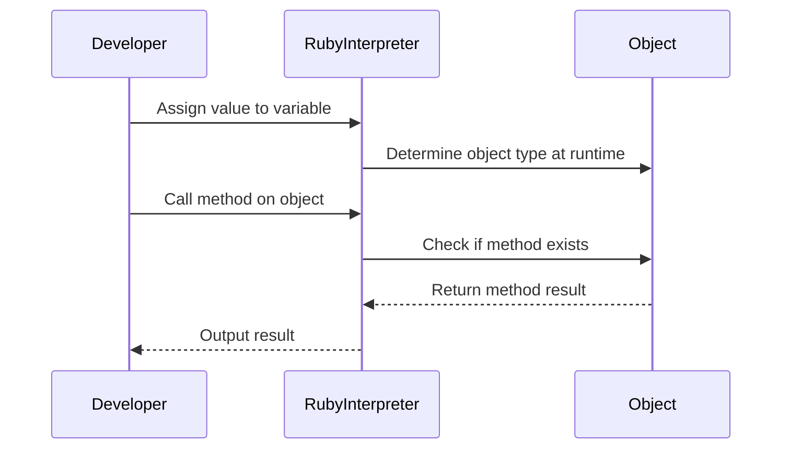

## 2.2 Dynamic Typing and Duck Typing

In the realm of programming languages, Ruby stands out for its elegant syntax and powerful features. Among these features, dynamic typing and duck typing are pivotal in shaping how Ruby developers write and think about code. In this section, we will delve into these concepts, exploring their implications, benefits, and potential pitfalls.

### Understanding Dynamic Typing

**Dynamic Typing** refers to the ability of a programming language to determine the type of a variable at runtime rather than at compile time. In Ruby, this means that you don't need to declare the type of a variable when you create it. Instead, the type is inferred based on the value assigned to it.

#### How Dynamic Typing Works in Ruby

In Ruby, variables are simply references to objects. The language does not enforce type constraints on variables, allowing them to point to objects of any type. This flexibility is a hallmark of Ruby's design philosophy, enabling developers to write more concise and adaptable code.

```ruby
# Dynamic Typing Example in Ruby
x = 10       # x is an Integer
x = "Hello"  # Now x is a String
x = [1, 2, 3] # Now x is an Array

# Ruby allows x to change its type dynamically
puts x.class # Output: Array
```

In the example above, the variable `x` changes its type from `Integer` to `String` to `Array` seamlessly. Ruby's interpreter handles these changes at runtime, providing a high degree of flexibility.

#### Advantages of Dynamic Typing

1. **Flexibility**: Dynamic typing allows for more flexible code, as variables can change types as needed.
2. **Reduced Boilerplate**: Without the need for explicit type declarations, code becomes cleaner and easier to read.
3. **Rapid Prototyping**: Developers can quickly test and iterate on ideas without being constrained by type declarations.

#### Potential Pitfalls of Dynamic Typing

While dynamic typing offers numerous benefits, it also introduces certain challenges:

1. **Runtime Errors**: Type-related errors may only surface at runtime, potentially leading to unexpected behavior.
2. **Debugging Complexity**: Tracing type-related issues can be more challenging without compile-time checks.
3. **Performance Overhead**: Dynamic typing can introduce a slight performance overhead due to runtime type checks.

### Embracing Duck Typing

**Duck Typing** is a concept closely related to dynamic typing, emphasizing an object's behavior over its class. The term comes from the saying, "If it looks like a duck, swims like a duck, and quacks like a duck, then it probably is a duck." In Ruby, this means that an object's suitability for a task is determined by the presence of certain methods and properties, rather than its class.

#### Practical Examples of Duck Typing

Duck typing allows Ruby developers to write more generic and reusable code. Let's explore this with an example:

```ruby
# Duck Typing Example in Ruby
class Duck
  def quack
    "Quack!"
  end

  def swim
    "Swimming!"
  end
end

class Dog
  def quack
    "Woof!"
  end

  def swim
    "Dog paddling!"
  end
end

def make_it_quack(animal)
  puts animal.quack
end

duck = Duck.new
dog = Dog.new

make_it_quack(duck) # Output: Quack!
make_it_quack(dog)  # Output: Woof!
```

In this example, both `Duck` and `Dog` classes have a `quack` method. The `make_it_quack` function doesn't care about the class of the object passed to it, as long as it responds to the `quack` method. This is the essence of duck typing.

#### Advantages of Duck Typing

1. **Code Reusability**: Duck typing promotes code reuse by focusing on behavior rather than class hierarchies.
2. **Simplified Interfaces**: Developers can create simpler interfaces that rely on method presence rather than specific types.
3. **Enhanced Flexibility**: Code can work with a wider range of objects, as long as they implement the required methods.

#### Potential Pitfalls of Duck Typing

1. **Lack of Explicit Contracts**: Without explicit type contracts, it can be harder to understand what methods an object is expected to implement.
2. **Increased Testing Needs**: More comprehensive testing is often required to ensure that objects behave as expected.
3. **Runtime Errors**: Similar to dynamic typing, duck typing can lead to runtime errors if an object does not implement the expected methods.

### Writing Clear and Intention-Revealing Code

Despite the flexibility offered by dynamic and duck typing, it's crucial to write code that is clear and intention-revealing. Here are some best practices to achieve this:

- **Use Descriptive Method Names**: Ensure that method names clearly convey their purpose.
- **Document Expected Interfaces**: Use comments or documentation to specify the methods an object is expected to implement.
- **Leverage Unit Tests**: Write unit tests to verify that objects behave as expected, especially when using duck typing.
- **Adopt Code Conventions**: Follow established Ruby conventions and style guides to maintain readability.

### Visualizing Dynamic and Duck Typing

To better understand the flow of dynamic and duck typing in Ruby, let's visualize the process using a sequence diagram.



**Figure 1**: This diagram illustrates how Ruby handles dynamic typing and method calls using duck typing. The interpreter determines the type of an object at runtime and checks for method existence before executing it.

### Try It Yourself

To fully grasp dynamic and duck typing, try modifying the code examples provided. Experiment with adding new classes and methods, and observe how Ruby handles these changes. Consider the following exercises:

1. **Create a New Class**: Implement a new class that responds to the `quack` method and test it with the `make_it_quack` function.
2. **Add a New Method**: Add a new method to the `Duck` and `Dog` classes, and modify the function to call this method.
3. **Handle Missing Methods**: Implement error handling for cases where an object does not implement the expected method.

### References and Further Reading

- [Ruby Programming Language](https://www.ruby-lang.org/en/)
- [Dynamic Typing on Wikipedia](https://en.wikipedia.org/wiki/Dynamic_typing)
- [Duck Typing on Wikipedia](https://en.wikipedia.org/wiki/Duck_typing)
- [Ruby Style Guide](https://rubystyle.guide/)

### Knowledge Check

To reinforce your understanding of dynamic and duck typing, consider the following questions:

1. What is the primary difference between dynamic typing and static typing?
2. How does duck typing differ from traditional inheritance-based polymorphism?
3. What are some potential pitfalls of using dynamic typing in Ruby?
4. How can you ensure that your code remains clear and intention-revealing despite using dynamic typing?

### Embrace the Journey

Remember, mastering dynamic and duck typing is a journey. As you continue to explore Ruby, you'll discover new ways to leverage these concepts to write more flexible and powerful code. Keep experimenting, stay curious, and enjoy the process!

## Quiz: Dynamic Typing and Duck Typing



### What is dynamic typing in Ruby?

- [x] The type of a variable is determined at runtime.
- [ ] The type of a variable is determined at compile time.
- [ ] Variables must have a fixed type.
- [ ] Ruby does not support dynamic typing.

> **Explanation:** Dynamic typing means that the type of a variable is determined at runtime, allowing for more flexibility.

### What does duck typing emphasize in Ruby?

- [x] An object's behavior over its class.
- [ ] An object's class over its behavior.
- [ ] The explicit type of an object.
- [ ] The inheritance hierarchy of an object.

> **Explanation:** Duck typing focuses on what an object can do (its behavior) rather than what it is (its class).

### Which of the following is a benefit of dynamic typing?

- [x] Flexibility in changing variable types.
- [ ] Compile-time type checking.
- [ ] Reduced runtime errors.
- [ ] Increased performance.

> **Explanation:** Dynamic typing allows variables to change types, providing flexibility in programming.

### What is a potential pitfall of duck typing?

- [x] Lack of explicit contracts.
- [ ] Increased compile-time checks.
- [ ] Reduced code flexibility.
- [ ] Increased boilerplate code.

> **Explanation:** Duck typing can lead to a lack of explicit contracts, making it harder to understand expected behaviors.

### How can you make code intention-revealing in Ruby?

- [x] Use descriptive method names.
- [x] Document expected interfaces.
- [ ] Avoid using comments.
- [ ] Rely solely on dynamic typing.

> **Explanation:** Descriptive method names and documentation help make code intention-revealing.

### What happens if a method is called on an object that doesn't implement it?

- [x] A runtime error occurs.
- [ ] The method is automatically created.
- [ ] The program compiles successfully.
- [ ] The method is ignored.

> **Explanation:** If a method is called on an object that doesn't implement it, a runtime error occurs.

### Which of the following is true about Ruby's dynamic typing?

- [x] Variables can change types at runtime.
- [ ] Variables have fixed types.
- [x] Type is inferred based on the value assigned.
- [ ] Type must be declared explicitly.

> **Explanation:** Ruby's dynamic typing allows variables to change types at runtime, with type inference based on assigned values.

### What is the main focus of duck typing?

- [x] Method presence and behavior.
- [ ] Class inheritance.
- [ ] Explicit type declarations.
- [ ] Compile-time checks.

> **Explanation:** Duck typing focuses on the presence of methods and behavior rather than class inheritance.

### How can you handle missing methods in Ruby?

- [x] Implement error handling.
- [ ] Ignore the missing method.
- [ ] Use compile-time checks.
- [ ] Avoid using duck typing.

> **Explanation:** Implementing error handling can help manage situations where methods are missing.

### True or False: Duck typing requires explicit type declarations.

- [ ] True
- [x] False

> **Explanation:** Duck typing does not require explicit type declarations; it relies on method presence and behavior.




