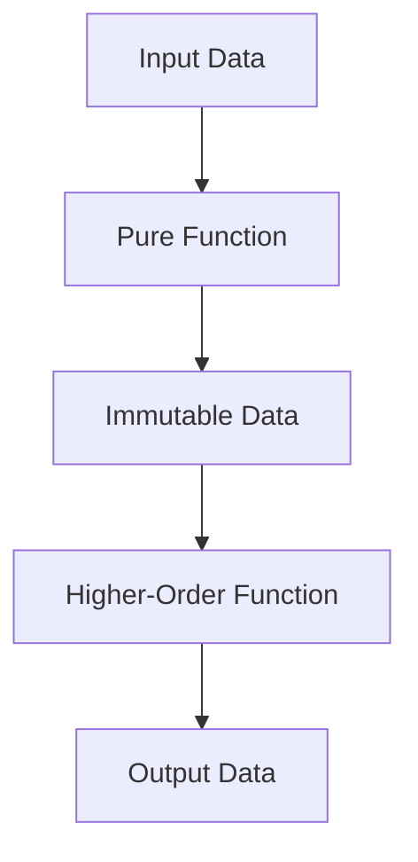

## 2.3 Functional Programming Concepts in Ruby

Functional programming (FP) is a paradigm that treats computation as the evaluation of mathematical functions and avoids changing state or mutable data. Ruby, while primarily an object-oriented language, provides robust support for functional programming techniques. This section explores how Ruby incorporates functional programming paradigms and how developers can leverage these concepts to build scalable and maintainable applications.

### Introduction to Functional Programming Principles

Functional programming is built on several core principles that distinguish it from other paradigms:

- **Pure Functions**: Functions that have no side effects and return the same output for the same input.
- **Immutability**: Data that cannot be changed once created.
- **First-Class Functions**: Functions that can be passed as arguments, returned from other functions, and assigned to variables.
- **Higher-Order Functions**: Functions that take other functions as arguments or return them as results.
- **Recursion**: A technique where a function calls itself to solve a problem.

Let's delve into each of these principles and see how Ruby supports them.

### Pure Functions and Immutability

**Pure Functions** are a cornerstone of functional programming. They ensure that a function's output depends only on its input parameters, without side effects like modifying global variables or I/O operations.

```ruby
# Pure function example
def add(a, b)
  a + b
end

puts add(2, 3) # Always returns 5
```

**Immutability** is the concept of creating data structures that cannot be altered after their creation. Ruby supports immutability through the `freeze` method, which prevents further modifications to an object.

```ruby
# Immutability example
array = [1, 2, 3].freeze
begin
  array << 4
rescue => e
  puts e.message # => "can't modify frozen Array"
end
```

### Blocks, Procs, and Lambdas

Ruby's blocks, procs, and lambdas are powerful tools for implementing functional programming techniques.

#### Blocks

Blocks are anonymous pieces of code that can be passed to methods. They are enclosed in `do...end` or curly braces `{}`.

```ruby
# Using a block with the each method
[1, 2, 3].each do |number|
  puts number * 2
end
```

#### Procs

Procs are objects that encapsulate blocks of code, allowing them to be stored in variables and passed around.

```ruby
# Proc example
double = Proc.new { |x| x * 2 }
puts double.call(5) # => 10
```

#### Lambdas

Lambdas are similar to procs but with stricter argument checking and return behavior.

```ruby
# Lambda example
triple = ->(x) { x * 3 }
puts triple.call(3) # => 9
```

### Higher-Order Functions

Higher-order functions are functions that take other functions as arguments or return them as results. Ruby's Enumerable module provides several higher-order functions like `map`, `select`, and `reduce`.

```ruby
# Using map as a higher-order function
numbers = [1, 2, 3, 4]
squared_numbers = numbers.map { |n| n ** 2 }
puts squared_numbers.inspect # => [1, 4, 9, 16]
```

### Recursion

Recursion is a technique where a function calls itself to solve a problem. Ruby supports recursion, but be mindful of the potential for stack overflow with deep recursion.

```ruby
# Recursive factorial function
def factorial(n)
  return 1 if n <= 1
  n * factorial(n - 1)
end

puts factorial(5) # => 120
```

### Benefits of Functional Programming in Ruby

Functional programming offers several benefits:

- **Code Clarity**: Pure functions and immutability make code easier to understand and reason about.
- **Concurrency**: Immutability reduces the risk of race conditions in concurrent applications.
- **Modularity**: Higher-order functions and first-class functions promote code reuse and modularity.

### Blending Functional and Object-Oriented Approaches

Ruby's flexibility allows developers to blend functional and object-oriented programming styles. This hybrid approach can lead to more expressive and maintainable code.

```ruby
# Blending functional and object-oriented styles
class Calculator
  def initialize
    @operations = []
  end

  def add_operation(&block)
    @operations << block
  end

  def execute_operations(value)
    @operations.reduce(value) { |acc, op| op.call(acc) }
  end
end

calculator = Calculator.new
calculator.add_operation { |x| x + 2 }
calculator.add_operation { |x| x * 3 }
puts calculator.execute_operations(5) # => 21
```

### Try It Yourself

Experiment with the code examples provided. Try modifying the `Calculator` class to include subtraction or division operations. Explore how changing the order of operations affects the result.

### Visualizing Functional Programming Concepts

To better understand how functional programming concepts work in Ruby, let's visualize the flow of data and function calls using a diagram.



This diagram illustrates the flow of data through a series of functional transformations, highlighting the role of pure functions and immutability.

### Further Reading

For more information on functional programming in Ruby, consider exploring the following resources:

- [Ruby's Enumerable Module](https://ruby-doc.org/core-3.0.0/Enumerable.html)
- [Functional Programming in Ruby: A PragPub Anthology](https://pragprog.com/titles/elixir/functional-programming-in-ruby/)
- [Why Functional Programming Matters](https://www.cs.kent.ac.uk/people/staff/dat/miranda/whyfp90.pdf)

### Knowledge Check

- What are the key principles of functional programming?
- How do blocks, procs, and lambdas differ in Ruby?
- What are the benefits of using higher-order functions?
- How can recursion be used effectively in Ruby?
- What are the advantages of blending functional and object-oriented programming?

### Embrace the Journey

Remember, this is just the beginning. As you progress, you'll discover more ways to leverage functional programming in Ruby to build scalable and maintainable applications. Keep experimenting, stay curious, and enjoy the journey!

## Quiz: Functional Programming Concepts in Ruby



### What is a pure function in functional programming?

- [x] A function that has no side effects and returns the same output for the same input
- [ ] A function that modifies global variables
- [ ] A function that performs I/O operations
- [ ] A function that depends on external state

> **Explanation:** A pure function is one that has no side effects and always produces the same output for the same input, making it predictable and easy to test.


### How does Ruby support immutability?

- [x] By using the `freeze` method to prevent modifications
- [ ] By using the `lock` method to prevent changes
- [ ] By using the `immutable` keyword
- [ ] By using the `constant` keyword

> **Explanation:** Ruby supports immutability through the `freeze` method, which prevents further modifications to an object.


### What is the difference between a proc and a lambda in Ruby?

- [x] Lambdas check the number of arguments, while procs do not
- [ ] Procs check the number of arguments, while lambdas do not
- [ ] Both procs and lambdas check the number of arguments
- [ ] Neither procs nor lambdas check the number of arguments

> **Explanation:** Lambdas in Ruby check the number of arguments passed to them, while procs do not, which can lead to different behaviors.


### What is a higher-order function?

- [x] A function that takes other functions as arguments or returns them as results
- [ ] A function that performs arithmetic operations
- [ ] A function that modifies global state
- [ ] A function that is defined within another function

> **Explanation:** A higher-order function is one that can take other functions as arguments or return them as results, enabling functional programming techniques.


### What is recursion?

- [x] A technique where a function calls itself to solve a problem
- [ ] A technique where a function modifies global variables
- [ ] A technique where a function performs I/O operations
- [ ] A technique where a function is defined within another function

> **Explanation:** Recursion is a technique where a function calls itself to solve a problem, often used in functional programming.


### What is the benefit of using pure functions?

- [x] They make code easier to understand and test
- [ ] They allow for faster execution
- [ ] They reduce memory usage
- [ ] They enable parallel processing

> **Explanation:** Pure functions make code easier to understand and test because they have no side effects and always produce the same output for the same input.


### How can functional programming improve concurrency?

- [x] By reducing the risk of race conditions through immutability
- [ ] By increasing the speed of execution
- [ ] By allowing functions to modify global state
- [ ] By enabling functions to perform I/O operations

> **Explanation:** Functional programming improves concurrency by reducing the risk of race conditions through immutability, as immutable data cannot be changed by concurrent processes.


### What is the role of blocks in Ruby?

- [x] They allow passing anonymous pieces of code to methods
- [ ] They define classes
- [ ] They create variables
- [ ] They perform I/O operations

> **Explanation:** Blocks in Ruby are anonymous pieces of code that can be passed to methods, enabling functional programming techniques.


### What is the purpose of the `map` method in Ruby?

- [x] To transform each element of a collection using a block
- [ ] To filter elements of a collection
- [ ] To sort elements of a collection
- [ ] To find the maximum element in a collection

> **Explanation:** The `map` method in Ruby is used to transform each element of a collection using a block, returning a new array with the transformed elements.


### True or False: Ruby is a purely functional programming language.

- [ ] True
- [x] False

> **Explanation:** False. Ruby is not a purely functional programming language; it is primarily object-oriented but supports functional programming techniques.




