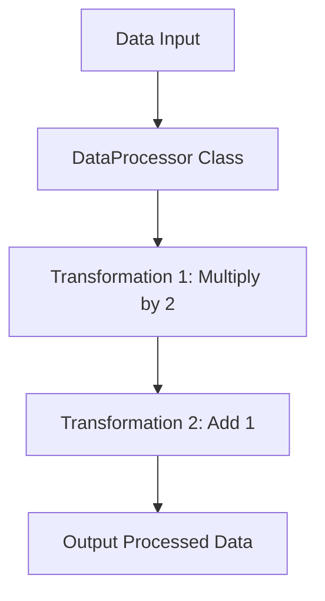

## 2.4 Integrating Functional and Object-Oriented Concepts

Ruby is a dynamic, open-source programming language with a focus on simplicity and productivity. It has an elegant syntax that is natural to read and easy to write. One of Ruby's most powerful features is its ability to seamlessly integrate functional and object-oriented programming paradigms. This integration allows developers to leverage the strengths of both styles, creating flexible and maintainable code.

### Understanding the Coexistence of Paradigms

Ruby is primarily known as an object-oriented language, where everything is an object. However, it also supports functional programming concepts, such as first-class functions, higher-order functions, and immutability. This dual nature allows developers to choose the most appropriate paradigm for a given problem, or even combine them within a single application.

#### Object-Oriented Programming (OOP) in Ruby

In Ruby, OOP is centered around the concept of classes and objects. Classes define the blueprint for objects, encapsulating data and behavior. Ruby's OOP features include:

- **Encapsulation**: Bundling data and methods that operate on the data within a single unit, or class.
- **Inheritance**: Creating new classes based on existing ones, promoting code reuse.
- **Polymorphism**: Allowing objects to be treated as instances of their parent class, enabling flexibility in code.

Here's a simple example of OOP in Ruby:

```ruby
class Animal
  def speak
    "Hello!"
  end
end

class Dog < Animal
  def speak
    "Woof!"
  end
end

dog = Dog.new
puts dog.speak  # Output: Woof!
```

#### Functional Programming (FP) in Ruby

Functional programming in Ruby emphasizes the use of functions as first-class citizens, immutability, and the avoidance of side effects. Key FP concepts in Ruby include:

- **First-Class Functions**: Functions can be assigned to variables, passed as arguments, and returned from other functions.
- **Higher-Order Functions**: Functions that take other functions as arguments or return them as results.
- **Immutability**: Data structures that cannot be modified after creation.

Here's an example of FP in Ruby using blocks and higher-order functions:

```ruby
def apply_twice(func, value)
  func.call(func.call(value))
end

double = ->(x) { x * 2 }
puts apply_twice(double, 5)  # Output: 20
```

### Combining Functional and Object-Oriented Approaches

Ruby's flexibility allows developers to combine OOP and FP in various ways. This integration can lead to more expressive and concise code, leveraging the strengths of both paradigms.

#### Example: Using Functional Constructs in OOP

Consider a scenario where we want to filter and transform a collection of objects. We can use Ruby's enumerable methods, which are inspired by functional programming, to achieve this:

```ruby
class Product
  attr_reader :name, :price

  def initialize(name, price)
    @name = name
    @price = price
  end
end

products = [
  Product.new("Laptop", 1000),
  Product.new("Phone", 500),
  Product.new("Tablet", 300)
]

# Using functional constructs to filter and map
expensive_products = products.select { |product| product.price > 400 }
                             .map { |product| product.name }

puts expensive_products  # Output: ["Laptop", "Phone"]
```

In this example, we use `select` and `map`, which are higher-order functions, to filter and transform the collection of `Product` objects.

#### Example: Encapsulating Functional Logic in Classes

We can also encapsulate functional logic within classes, combining the organizational benefits of OOP with the expressive power of FP:

```ruby
class Calculator
  def initialize
    @operations = []
  end

  def add_operation(&block)
    @operations << block
  end

  def execute(value)
    @operations.reduce(value) { |acc, operation| operation.call(acc) }
  end
end

calculator = Calculator.new
calculator.add_operation { |x| x + 2 }
calculator.add_operation { |x| x * 3 }

puts calculator.execute(5)  # Output: 21
```

In this example, we define a `Calculator` class that stores a series of operations as blocks. The `execute` method applies these operations in sequence, demonstrating how functional logic can be encapsulated within an object-oriented structure.

### Scenarios for Choosing Paradigms

While Ruby allows for the integration of both paradigms, certain scenarios may favor one approach over the other. Understanding these scenarios can help developers make informed decisions about which paradigm to use.

#### When to Use Object-Oriented Programming

- **Complex Data Models**: OOP is well-suited for applications with complex data models, where encapsulation and inheritance can help manage complexity.
- **Stateful Applications**: Applications that require managing state over time can benefit from OOP's ability to encapsulate state within objects.
- **Code Reuse**: OOP's inheritance and polymorphism features promote code reuse, making it a good choice for applications with shared behavior across different components.

#### When to Use Functional Programming

- **Stateless Operations**: FP is ideal for stateless operations, where functions can be composed and reused without side effects.
- **Concurrency**: FP's emphasis on immutability and pure functions can simplify concurrent programming by reducing the risk of shared state.
- **Data Transformation**: FP's higher-order functions and expressive syntax make it well-suited for data transformation tasks, such as filtering and mapping collections.

### Flexibility in Problem-Solving

The ability to integrate functional and object-oriented concepts in Ruby provides developers with a powerful toolkit for problem-solving. By leveraging the strengths of both paradigms, developers can create solutions that are both flexible and maintainable.

#### Example: A Hybrid Approach

Consider a scenario where we need to process a stream of data, applying various transformations and aggregations. We can use a hybrid approach, combining OOP for organizing the data processing pipeline and FP for defining the transformations:

```ruby
class DataProcessor
  def initialize(data)
    @data = data
    @transformations = []
  end

  def add_transformation(&block)
    @transformations << block
  end

  def process
    @transformations.reduce(@data) do |data, transformation|
      data.map(&transformation)
    end
  end
end

data = [1, 2, 3, 4, 5]

processor = DataProcessor.new(data)
processor.add_transformation { |x| x * 2 }
processor.add_transformation { |x| x + 1 }

puts processor.process  # Output: [3, 5, 7, 9, 11]
```

In this example, the `DataProcessor` class organizes the data processing pipeline, while the transformations are defined as functional blocks. This approach combines the organizational benefits of OOP with the expressive power of FP.

### Encouraging Experimentation

As you explore the integration of functional and object-oriented concepts in Ruby, remember that there is no one-size-fits-all solution. The flexibility of Ruby allows you to experiment with different styles and approaches, finding the optimal solution for your specific problem.

#### Try It Yourself

Experiment with the examples provided in this section. Try modifying the code to add new transformations, change the data, or introduce new classes. By experimenting with different styles, you'll gain a deeper understanding of how to effectively integrate functional and object-oriented concepts in Ruby.

### Visualizing the Integration

To better understand how functional and object-oriented concepts can be integrated in Ruby, let's visualize the flow of data and operations in a hybrid approach using a Mermaid.js diagram.



**Diagram Description**: This flowchart illustrates the data processing pipeline in the hybrid approach example. Data flows through the `DataProcessor` class, where it undergoes a series of transformations, resulting in the processed output.

### References and Further Reading

- [Ruby Programming Language](https://www.ruby-lang.org/en/)
- [Functional Programming in Ruby](https://www.rubyguides.com/2018/10/functional-programming/)
- [Object-Oriented Programming in Ruby](https://www.rubyguides.com/2019/02/ruby-object-oriented-programming/)

### Knowledge Check

- What are the key differences between functional and object-oriented programming?
- How can you use higher-order functions in Ruby?
- When might you choose to use a functional approach over an object-oriented one?

### Summary

In this section, we've explored how Ruby allows for the integration of functional and object-oriented programming concepts. By understanding the strengths and weaknesses of each paradigm, you can make informed decisions about which approach to use in your applications. Remember, the flexibility of Ruby is a powerful tool—experiment with different styles to find the best solution for your needs.

## Quiz: Integrating Functional and Object-Oriented Concepts



### Which of the following is a key feature of object-oriented programming in Ruby?

- [x] Encapsulation
- [ ] Immutability
- [ ] First-class functions
- [ ] Higher-order functions

> **Explanation:** Encapsulation is a core concept of object-oriented programming, allowing data and methods to be bundled together within a class.


### What is a higher-order function?

- [x] A function that takes other functions as arguments or returns them as results
- [ ] A function that is defined within a class
- [ ] A function that modifies global state
- [ ] A function that is executed asynchronously

> **Explanation:** Higher-order functions are functions that can take other functions as arguments or return them as results, a key concept in functional programming.


### In which scenario might you prefer a functional programming approach?

- [x] When performing stateless operations
- [ ] When managing complex data models
- [ ] When implementing inheritance
- [ ] When encapsulating state

> **Explanation:** Functional programming is well-suited for stateless operations, where functions can be composed and reused without side effects.


### What is the purpose of the `reduce` method in Ruby?

- [x] To accumulate a single result from a collection
- [ ] To filter elements from a collection
- [ ] To transform each element in a collection
- [ ] To sort elements in a collection

> **Explanation:** The `reduce` method is used to accumulate a single result from a collection by applying a binary operation, often used in functional programming.


### How can functional logic be encapsulated within a class in Ruby?

- [x] By storing functions as blocks and applying them within methods
- [ ] By using inheritance to define functional behavior
- [ ] By modifying global variables within the class
- [ ] By using instance variables to store state

> **Explanation:** Functional logic can be encapsulated within a class by storing functions as blocks and applying them within methods, combining OOP and FP.


### What is the benefit of using immutability in functional programming?

- [x] It reduces the risk of side effects in concurrent programming
- [ ] It allows for dynamic method definition
- [ ] It enables inheritance and polymorphism
- [ ] It simplifies state management in OOP

> **Explanation:** Immutability reduces the risk of side effects in concurrent programming by ensuring that data structures cannot be modified after creation.


### Which Ruby feature allows functions to be treated as first-class citizens?

- [x] Blocks, Procs, and Lambdas
- [ ] Classes and Objects
- [ ] Modules and Mixins
- [ ] Singleton Methods

> **Explanation:** Blocks, Procs, and Lambdas allow functions to be treated as first-class citizens in Ruby, enabling functional programming techniques.


### What is the primary advantage of integrating functional and object-oriented concepts in Ruby?

- [x] It provides flexibility in problem-solving
- [ ] It enforces strict type checking
- [ ] It simplifies memory management
- [ ] It guarantees performance optimization

> **Explanation:** Integrating functional and object-oriented concepts in Ruby provides flexibility in problem-solving, allowing developers to leverage the strengths of both paradigms.


### True or False: Ruby supports both functional and object-oriented programming paradigms.

- [x] True
- [ ] False

> **Explanation:** True. Ruby supports both functional and object-oriented programming paradigms, allowing developers to choose the most appropriate approach for their needs.


### Which method is commonly used in Ruby to transform each element in a collection?

- [x] `map`
- [ ] `reduce`
- [ ] `select`
- [ ] `sort`

> **Explanation:** The `map` method is commonly used in Ruby to transform each element in a collection, applying a given block to each element and returning a new array.



Remember, this is just the beginning. As you progress, you'll build more complex and interactive applications. Keep experimenting, stay curious, and enjoy the journey!
