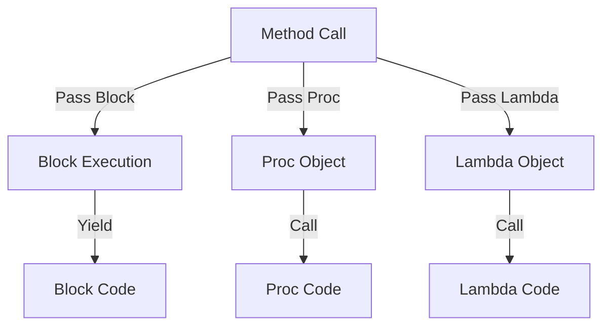

## 2.5 Blocks, Procs, and Lambdas

In Ruby, blocks, procs, and lambdas are essential constructs that allow for flexible and powerful code execution. Understanding these concepts is crucial for any Ruby developer aiming to write clean, efficient, and maintainable code. In this section, we will explore each of these constructs, their syntax, characteristics, and practical applications.

### Understanding Blocks

**Blocks** are anonymous pieces of code that can be passed to methods. They are not objects, but they can be converted into objects using `Proc`. Blocks are enclosed in either `{}` or `do...end` and can take parameters.

#### Syntax and Characteristics

- **Single-line blocks**: Use curly braces `{}`.
- **Multi-line blocks**: Use `do...end`.

```ruby
# Single-line block
[1, 2, 3].each { |number| puts number }

# Multi-line block
[1, 2, 3].each do |number|
  puts number
end
```

- **Implicit passing**: Blocks are passed implicitly to methods.
- **Yielding**: Methods can execute a block using the `yield` keyword.

```ruby
def greet
  yield "Hello"
end

greet { |greeting| puts "#{greeting}, World!" }
```

#### Practical Applications

Blocks are commonly used in iterators, callbacks, and event handling. They allow for concise and expressive code, especially when working with collections.

### Introducing Procs

**Procs** are objects that encapsulate blocks. They can be stored in variables, passed to methods, and called explicitly.

#### Creating and Using Procs

- **Creating a Proc**: Use `Proc.new` or the `proc` method.

```ruby
# Using Proc.new
my_proc = Proc.new { |name| puts "Hello, #{name}!" }

# Using proc
my_proc = proc { |name| puts "Hello, #{name}!" }
```

- **Calling a Proc**: Use the `call` method.

```ruby
my_proc.call("Alice")
```

#### Characteristics of Procs

- **Flexible argument handling**: Procs do not enforce the number of arguments strictly.
- **Return behavior**: A `return` inside a proc returns from the enclosing method.

```ruby
def test_proc
  my_proc = Proc.new { return "Returning from proc" }
  my_proc.call
  "This will not be printed"
end

puts test_proc
```

### Exploring Lambdas

**Lambdas** are similar to procs but with stricter argument handling and different return behavior. They are often used when you need a more function-like behavior.

#### Creating and Using Lambdas

- **Creating a Lambda**: Use `lambda` or the `->` syntax.

```ruby
# Using lambda
my_lambda = lambda { |name| puts "Hello, #{name}!" }

# Using ->
my_lambda = ->(name) { puts "Hello, #{name}!" }
```

- **Calling a Lambda**: Use the `call` method.

```ruby
my_lambda.call("Bob")
```

#### Characteristics of Lambdas

- **Strict argument handling**: Lambdas check the number of arguments passed.
- **Return behavior**: A `return` inside a lambda returns from the lambda itself, not the enclosing method.

```ruby
def test_lambda
  my_lambda = lambda { return "Returning from lambda" }
  my_lambda.call
  "This will be printed"
end

puts test_lambda
```

### Differences Between Procs and Lambdas

Understanding the nuances between procs and lambdas is essential for choosing the right tool for your task.

- **Argument Handling**: Lambdas enforce the number of arguments, while procs do not.
- **Return Behavior**: A `return` in a proc exits the enclosing method, whereas in a lambda, it exits the lambda itself.

### Practical Applications

#### Callbacks and Event Handling

Procs and lambdas are often used for callbacks and event handling, providing a way to pass executable code to methods.

```ruby
def perform_task(callback)
  puts "Performing task..."
  callback.call
end

task_completed = -> { puts "Task completed!" }
perform_task(task_completed)
```

#### Iterators and Enumerables

Blocks, procs, and lambdas are integral to Ruby's iterators and enumerable methods, allowing for elegant and expressive code.

```ruby
# Using a block with map
squared_numbers = [1, 2, 3].map { |number| number**2 }

# Using a lambda with select
even_numbers = [1, 2, 3, 4].select(&->(number) { number.even? })
```

### Visualizing Blocks, Procs, and Lambdas

To better understand the flow and interaction of blocks, procs, and lambdas, let's visualize their relationships and execution paths.



**Diagram Description**: This diagram illustrates how methods can interact with blocks, procs, and lambdas. Blocks are executed with `yield`, while procs and lambdas are called explicitly.

### Try It Yourself

Experiment with the following code examples to deepen your understanding:

1. Modify the `greet` method to accept a block that takes two parameters.
2. Create a proc that accepts a variable number of arguments and prints them.
3. Write a lambda that checks if a number is prime and use it with the `select` method on an array of numbers.

### Key Takeaways

- **Blocks** are anonymous and passed implicitly to methods.
- **Procs** are objects that encapsulate blocks, allowing for flexible argument handling.
- **Lambdas** are similar to procs but with stricter argument handling and return behavior.

### References and Further Reading

- [Ruby Documentation on Blocks and Procs](https://ruby-doc.org/core-3.0.0/Proc.html)
- [Understanding Ruby Lambdas](https://www.rubyguides.com/2016/02/ruby-procs-and-lambdas/)

### Embrace the Journey

Remember, mastering blocks, procs, and lambdas is a journey. As you explore these concepts, you'll unlock new possibilities in your Ruby programming. Keep experimenting, stay curious, and enjoy the process!

## Quiz: Blocks, Procs, and Lambdas



### What is a block in Ruby?

- [x] An anonymous piece of code that can be passed to methods
- [ ] A named method that can be called multiple times
- [ ] A type of class in Ruby
- [ ] A data structure for storing multiple values

> **Explanation:** A block is an anonymous piece of code that can be passed to methods in Ruby.

### How do you create a proc in Ruby?

- [x] Using `Proc.new` or `proc`
- [ ] Using `lambda`
- [ ] Using `def`
- [ ] Using `class`

> **Explanation:** A proc is created using `Proc.new` or the `proc` method.

### What is the main difference between a proc and a lambda in Ruby?

- [x] Argument handling and return behavior
- [ ] Syntax for creation
- [ ] Ability to be passed to methods
- [ ] Execution speed

> **Explanation:** The main difference between a proc and a lambda is in argument handling and return behavior.

### How do you call a lambda in Ruby?

- [x] Using the `call` method
- [ ] Using the `yield` keyword
- [ ] Using the `execute` method
- [ ] Using the `run` method

> **Explanation:** A lambda is called using the `call` method.

### What happens if you use `return` inside a proc?

- [x] It returns from the enclosing method
- [ ] It returns from the proc itself
- [ ] It raises an error
- [ ] It returns `nil`

> **Explanation:** A `return` inside a proc returns from the enclosing method.

### Which of the following is a characteristic of a lambda?

- [x] Strict argument handling
- [ ] Flexible argument handling
- [ ] Cannot be stored in a variable
- [ ] Cannot be passed to methods

> **Explanation:** Lambdas have strict argument handling.

### How do you pass a block to a method in Ruby?

- [x] Implicitly, without specifying it in the method parameters
- [ ] By using the `block` keyword
- [ ] By using the `proc` keyword
- [ ] By using the `lambda` keyword

> **Explanation:** Blocks are passed implicitly to methods in Ruby.

### What is the syntax for creating a lambda using the `->` operator?

- [x] `->(params) { code }`
- [ ] `lambda(params) { code }`
- [ ] `proc(params) { code }`
- [ ] `def(params) { code }`

> **Explanation:** The syntax for creating a lambda using the `->` operator is `->(params) { code }`.

### Can a proc be converted into a block?

- [x] True
- [ ] False

> **Explanation:** A proc can be converted into a block using the `&` operator.

### What is the purpose of the `yield` keyword in Ruby?

- [x] To execute a block passed to a method
- [ ] To create a new proc
- [ ] To define a lambda
- [ ] To handle exceptions

> **Explanation:** The `yield` keyword is used to execute a block passed to a method.




