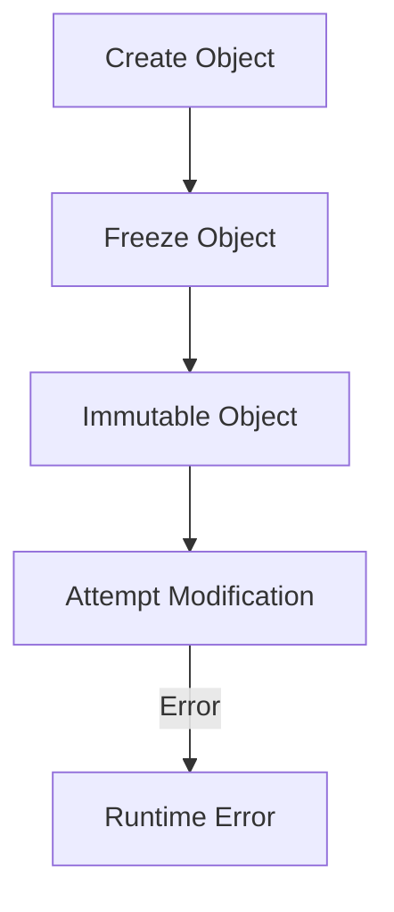

## 2.6 Immutability and Frozen Objects

In this section, we delve into the concept of immutability in Ruby, a powerful feature that can significantly enhance the safety and reliability of your code. We will explore how to use frozen objects to prevent modifications, discuss the significance of immutability in programming, and highlight best practices for leveraging this feature effectively.

### Understanding Immutability

**Immutability** refers to the state of an object that cannot be changed after it has been created. In programming, immutability is a crucial concept that helps maintain the integrity of data and prevents unintended side effects. Immutable objects are particularly valuable in concurrent programming, where multiple threads may access shared data simultaneously.

#### Significance of Immutability

1. **Predictability**: Immutable objects ensure that once an object is created, its state remains consistent throughout its lifetime. This predictability simplifies reasoning about code behavior.

2. **Thread Safety**: Since immutable objects cannot be modified, they are inherently thread-safe. This eliminates the need for complex synchronization mechanisms when accessing shared data across threads.

3. **Functional Programming**: Immutability is a core principle of functional programming, promoting the use of pure functions that do not have side effects.

4. **Error Prevention**: By preventing modifications, immutability reduces the risk of bugs caused by unintended changes to object state.

### Using the `freeze` Method in Ruby

Ruby provides the `freeze` method to make objects immutable. When an object is frozen, any attempt to modify it will result in a runtime error. This is particularly useful for ensuring that certain objects, such as constants, remain unchanged.

#### Example: Freezing an Object

```ruby
# Create a mutable string
greeting = "Hello, world!"

# Freeze the string to make it immutable
greeting.freeze

# Attempting to modify the frozen string will raise an error
begin
  greeting << " How are you?"
rescue => e
  puts "Error: #{e.message}"
end
```

**Output:**

```
Error: can't modify frozen String: "Hello, world!"
```

In this example, we create a string and then freeze it using the `freeze` method. Any subsequent attempt to modify the string results in a `RuntimeError`.

### Immutability Enhancing Code Safety

Immutability can enhance code safety by ensuring that certain objects remain constant throughout the execution of a program. This is particularly useful for defining constants that should not change.

#### Example: Using Frozen Objects for Constants

```ruby
# Define a constant array
COLORS = ["red", "green", "blue"].freeze

# Attempting to modify the constant array will raise an error
begin
  COLORS << "yellow"
rescue => e
  puts "Error: #{e.message}"
end
```

**Output:**

```
Error: can't modify frozen Array: ["red", "green", "blue"]
```

By freezing the `COLORS` array, we ensure that its contents cannot be altered, preserving its integrity as a constant.

### Immutability and Thread Safety

In concurrent programming, immutability plays a vital role in ensuring thread safety. Since immutable objects cannot be modified, they can be safely shared across multiple threads without the risk of data races or inconsistencies.

#### Example: Thread-Safe Immutable Objects

```ruby
require 'thread'

# Define a frozen hash
CONFIG = { max_threads: 5, timeout: 10 }.freeze

# Create multiple threads that access the frozen hash
threads = 10.times.map do
  Thread.new do
    puts "Max threads: #{CONFIG[:max_threads]}"
  end
end

# Wait for all threads to complete
threads.each(&:join)
```

In this example, we define a frozen hash `CONFIG` and create multiple threads that access its values. Since the hash is immutable, we can safely share it across threads without synchronization.

### Best Practices for Using Frozen Objects

1. **Use for Constants**: Freeze objects that represent constants to ensure they remain unchanged throughout the program.

2. **Immutable Data Structures**: Consider using immutable data structures for shared data in concurrent applications to enhance thread safety.

3. **Avoid Overuse**: While immutability is beneficial, avoid freezing objects unnecessarily, as it can lead to performance overhead and reduced flexibility.

4. **Combine with Functional Programming**: Leverage immutability in conjunction with functional programming techniques to create robust and maintainable code.

### Visualizing Immutability and Frozen Objects

To better understand the concept of immutability and frozen objects, let's visualize the process using a diagram.



**Diagram Description**: This flowchart illustrates the process of creating an object, freezing it to make it immutable, and the resulting error when attempting to modify the frozen object.

### Try It Yourself

Experiment with the following code examples to deepen your understanding of immutability and frozen objects in Ruby. Try modifying the objects before and after freezing them, and observe the behavior.

```ruby
# Create a mutable array
numbers = [1, 2, 3]

# Modify the array
numbers << 4
puts "Mutable array: #{numbers}"

# Freeze the array
numbers.freeze

# Attempt to modify the frozen array
begin
  numbers << 5
rescue => e
  puts "Error: #{e.message}"
end
```

### Further Reading

For more information on immutability and frozen objects in Ruby, consider exploring the following resources:

- [Ruby Documentation on `freeze`](https://ruby-doc.org/core/Object.html#method-i-freeze)
- [Understanding Immutability in Programming](https://en.wikipedia.org/wiki/Immutable_object)
- [Thread Safety and Immutability](https://www.geeksforgeeks.org/thread-safety-and-immutability-in-java/)

### Knowledge Check

- What is immutability, and why is it important in programming?
- How does the `freeze` method work in Ruby?
- What are the benefits of using frozen objects for constants?
- How does immutability enhance thread safety?
- What are some best practices for using frozen objects in Ruby?

### Embrace the Journey

Remember, immutability is a powerful tool in your Ruby programming arsenal. As you continue to explore and experiment with frozen objects, you'll gain a deeper understanding of how to write safer, more reliable code. Keep experimenting, stay curious, and enjoy the journey!

## Quiz: Immutability and Frozen Objects



### What is immutability in programming?

- [x] The state of an object that cannot be changed after creation
- [ ] The ability to modify an object at any time
- [ ] The process of freezing an object
- [ ] A method to enhance performance

> **Explanation:** Immutability refers to the state of an object that cannot be changed after it has been created, ensuring data integrity and predictability.

### How does the `freeze` method affect an object in Ruby?

- [x] It makes the object immutable
- [ ] It deletes the object
- [ ] It duplicates the object
- [ ] It changes the object's type

> **Explanation:** The `freeze` method in Ruby makes an object immutable, preventing any modifications to its state.

### What happens if you try to modify a frozen object in Ruby?

- [x] A runtime error is raised
- [ ] The modification is silently ignored
- [ ] The object is duplicated and modified
- [ ] The program crashes

> **Explanation:** Attempting to modify a frozen object in Ruby raises a `RuntimeError`, indicating that the object is immutable.

### Why is immutability beneficial in concurrent programming?

- [x] It ensures thread safety by preventing data races
- [ ] It allows for faster execution
- [ ] It reduces memory usage
- [ ] It simplifies code syntax

> **Explanation:** Immutability ensures thread safety by preventing data races, as immutable objects cannot be modified by multiple threads simultaneously.

### Which of the following is a best practice for using frozen objects?

- [x] Use frozen objects for constants
- [ ] Freeze all objects by default
- [ ] Avoid using frozen objects
- [ ] Use frozen objects only in single-threaded applications

> **Explanation:** A best practice is to use frozen objects for constants to ensure they remain unchanged throughout the program.

### What is a potential downside of overusing frozen objects?

- [x] Performance overhead and reduced flexibility
- [ ] Increased memory usage
- [ ] Decreased code readability
- [ ] More complex syntax

> **Explanation:** Overusing frozen objects can lead to performance overhead and reduced flexibility, as it limits the ability to modify objects when necessary.

### How can immutability be combined with functional programming?

- [x] By using pure functions and avoiding side effects
- [ ] By freezing all objects in the program
- [ ] By using mutable data structures
- [ ] By avoiding the use of functions

> **Explanation:** Immutability can be combined with functional programming by using pure functions that avoid side effects, promoting robust and maintainable code.

### What is the output of the following code?

```ruby
numbers = [1, 2, 3].freeze
begin
  numbers << 4
rescue => e
  puts "Error: #{e.message}"
end
```

- [x] Error: can't modify frozen Array: [1, 2, 3]
- [ ] [1, 2, 3, 4]
- [ ] Error: can't modify frozen Array: [1, 2, 3, 4]
- [ ] No output

> **Explanation:** The code attempts to modify a frozen array, resulting in a `RuntimeError` with the message "can't modify frozen Array: [1, 2, 3]".

### True or False: Immutability is only useful in multi-threaded applications.

- [ ] True
- [x] False

> **Explanation:** False. Immutability is beneficial in both single-threaded and multi-threaded applications, enhancing code safety and predictability.

### Which Ruby method is used to make an object immutable?

- [x] `freeze`
- [ ] `dup`
- [ ] `clone`
- [ ] `immutable`

> **Explanation:** The `freeze` method is used in Ruby to make an object immutable, preventing any modifications to its state.




